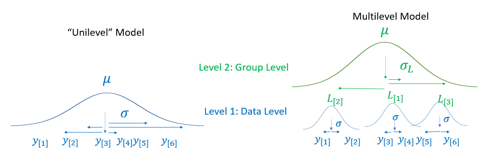

\newpage
```{r, include = FALSE}
knitr::opts_chunk$set(
  dpi = 300, dev = "jpeg", collapse=TRUE
)
```

# Inspecting a 'single group' of observations using a Bayesian multilevel model {#c4}

In the last chapter we built a Bayesian regression model suitable for inspecting the average of a single group of observations. However, as we noted multiple times this model was 'wrong' for the structure of our data. The reason for this is that this model did not properly account for the *repeated measures* structure in our data. To properly handle repeated measures data, we need a *multilevel model*. In this chapter we will explain what we mean by 'repeated measures' and 'multilevel', in addition to fitting our first proper multilevel Bayesian model using `brms`.

## Chapter pre-cap

In this chapter repeated measures data, data where multiple observations come from individual sources, is introduced. The unique characteristics and modeling requirements of this sort of data is discussed. After this, multilevel statistical models are presented, including a discussion of why these models are well-suited for repeated-measures data. Factors are introduced as batches of thematically-related predictors, and no pooling, complete pooling, and partial pooling approaches to the estimation of factors are discussed. After this, a multilevel model is fit and interpreted, including an explanation of what exactly 'random effects' are in the context of Bayesian models, and an explanation of how to inspect and retrieve these parameters. After this, repeated-measures data is simulated to highlight how the individual variance components of this data contribute to its 'look'. Finally, a model with a second random effect is fit to the experimental data, and the effect of shrinkage on the resulting model parameters is discussed. 

## Repeated measures data {#c4-multilevel}

[@@ SB - noah check out this and following section, its been moved and edited]

Depending on the field of study, experiments often produce **repeated measures data**, data where multiple observations come from the same experimental unit (e.g., person, as in the data used in this book). As a practical matter, setting up experiments is often time consuming such that it often makes more sense to collect, for example, 100 observations from each of 50 different people, rather than 1 observation from each of 5000 different people. In addition, collecting more than one measurement from each source can go a long way towards reducing uncertainty in a model. However, the statistical analysis of repeated measures data requires models that take the repeated nature of the measurements into account. Treating repeated measures data as if it were *not* repeated measures data can cause problems for the inferences we make using statistical models. 

For example, in our experiment we are interested in the average apparent height of different speakers, or categories of speakers. Imagine we had an experiment with 10,000 total observations. Would it matter how these were distributed? What if we had 5,000 observations for each of two different speakers? In this case we would have a lot of information about the apparent height of these speakers but not much information about speakers in general. What if we had 10 observations for each of 1000 different speakers? In this case we would have much more information about the apparent height of speakers in general, given the same number of overall observations. However, in this case we have a lot less information about any individual speaker in the sample. So, we see two situations with the same amount of observations but a substantially different internal structure. 

In general, the reason repeated-measures data can cause problems when not modeled appropriately is because the observations within each experimental unit are not independent: Multiple measurements from the same person are probably going to be similar to each other. This can give us a warped perspective regarding the degree and nature of the variability in a set of observations of apparent size judgments when repeated measures data is not modeled appropriately. For example, the final model we used to analyze our data in the last chapter looked like this:

$$
\begin{equation}
\begin{split}
\\
height_{[i]} \sim N(\mu_{[i]},\sigma) \\ 
\mu_{[i]} = \mathrm{Intercept} \\
\\
\textrm{Priors:} \\
\mathrm{Intercept} \sim N(176, 15) \\
\sigma \sim N(0, 15) \\ 
\end{split}
(\#eq:4-1)
\end{equation}
$$

We're going to consider the same data we discussed in Chapter 2 and 3, the apparent height judgments made for the adult male speakers in our experiment in the actual, unmodified resonance condition (see section \@ref(c1-exp)). Below we load the data that includes only these trials (`exp_data`) and subset to include only veridical male speakers:

```{r}
library (bmmb)
data (exp_data)
men = exp_data[exp_data$C_v=='m',]

# create vector of height judgments
mens_height = men$height
```

Figure \@ref(fig:F4-1) presents the height judgments collected for adult male speakers in our experiment, organized in two different ways. In the left plot we see the marginal distribution of the data with no differentiation made for the data collected from different listeners. This boxplot shows the individual observations of our vector $height_{[i]}$ around the overall mean $\mu$ with a standard distribution equal to $\sigma$. In other words, the left boxplot represents the model presented in \@ref(eq:4-1). From the perspective of this model, an observation of 181 cm is +7 above the mean, regardless of who provided it, because 174 cm is the assumed mean for all listeners. As a consequence, all variation about the mean is noise. There is no systematic structure 'inside' that single giant box of data. 

```{r F4-1, fig.height=2.5, fig.width=8, fig.cap = "(left) Boxplot of distribution of average height judgments made by each listener in the experiment for adult male speakers. (middle) Individual boxplots of height judgments for adult male speakers, for each listener. (right) The marginal distribution of the height judgments shown in the middle plot.", echo = FALSE}

################################################################################
### Figure 4.1
################################################################################

library (bmmb)
data (exp_data)
men = exp_data[exp_data$C_v=='m',]

# create vector of height judgments
mens_height = men$height

#par (mar = c(.1,.1,.5,.1), mfrow = c(1,1), oma = c(4.2,.20,0,.2))
#layout (m=matrix(c(1,2,3,4),2,2), heights = c(.25,.75))

par (mar = c(4,.5,.5,.5), mfrow = c(1,2))

#plot (0,type='n',xlab='',ylab='',xaxt='n',yaxt='n',bty='n')

boxplot (men$height,col = 'grey', ylim = c(140,195), 
         width = 2, ylab="", horizontal = TRUE)
mtext (side=2,outer=TRUE, text="Height (cm)", cex=1, line=2.9,adj=.55)


#boxplot (tapply(men$height,men$L,mean), xlab = "",xaxt='n',
#         col = cols, ylim = c(140,195), width = 2,cex.axis=1.3, 
#         horizontal = TRUE)
#abline (h=)
#text (1,190,expression(sigma["[within]"]), cex=2)

boxplot (height ~ L, data = men, xlab = "", ylab="",xaxt='s',
         col = cols[-1], ylim = c(140,195), cex.lab=1.1,cex.axis=1.1,
         horizontal = TRUE, yaxt='n')
grid()
abline (h = mean(mens_height), lwd=2, lty=3)
boxplot (height ~ L, data = men, col = cols[-c(1,8)],add=TRUE,yaxt='n',xaxt='n')

mtext (side=1,outer=TRUE, "Apparent speaker height (cm)",line=-0.9)
```

In the right plot we see each listener's height judgments in a different boxplot. Clearly, each listener has a general tendency so that certain values are more or less surprising for individual listeners. For example, a height response of 181 cm is perfectly average for listener 6 (blue box, 6th from the bottom). Thus, if you know listener 6 provided a response, an apparent height of 181 cm should not be surprising. In fact, this would represent an error of 0 cm when provided by this listener, considered relative to their expected apparent height judgment. In contrast, a response of 174 cm, the overall average response, would be a relatively atypical response for this listener.

The failure to acknowledge the fact that listeners provided non-independent responses might not seem like a big deal but it is really is. Remember from section X that the calculation of joint probabilities (and densities) is 'easy' only if the model residuals are assumed to be independent. Well, in the right side of figure \@ref(fig:F4-1) we see that all of our errors are definitely *not* independent, which means that ignoring this fact is going to leads to inaccuracies throughout our models. It's also a fact that we actually *do* have different listeners providing our data, and they do appear to vary from each other, and maybe we want to represent this in our model.

### Multilevel models and 'levels' of variation {#c4-levels}

We can think of the repeated measures data presented in figure \@ref(fig:F4-1) as having multiple 'levels' of variation. These levels are often referred to as *upper* and *lower* but this is entirely metaphorical/conceptual. Another way to think of them is as within-group variation (lower) and between-group variation (upper). We will describe these 'levels' of variation with respect to our repeated-measures data involving the apparent heights of adult males presented in figure \@ref(fig:F4-1).

* The 'lower' level: The distribution of individual observations given a certain listener. This is the distribution of data points inside of each of the little boxes in the right plot in figure \@ref(fig:F4-1). If not for this variation, the boxes in the plot would all be clustered at the listener mean. So, the lower level of variation gives the listener boxes their widths, and causes the responses provided by each listener differ randomly from each other. For the sake of simplicity, our models usually assume that the standard deviation is equal to $\sigma$ for all of the listener-dependent distributions, though our models can relax this assumption (see chapter 8). 

* The 'upper' level: The distribution of *parameters* between your sources of data. The upper level of variation causes the boxes in the right plot of figure \@ref(fig:F4-1) to not all be aligned at the grand mean. Although the listener mean is the parameter of the distribution of apparent height responses given a listener, it can also be thought of as a random variable. When we run an experiment we randomly 'sample' a small number of values of this variable by selecting a small number of humans to participate in our experiment. We might expect the average reported height for a single listener to be a relatively stable property such that a replication with the same listener should result in about the same listener mean. However, it's impossible to know any given listener's average apparent height judgment a priori. As a result, our listener means are as unpredictable to us as the individual responses provided by those listeners. 

A **multilevel model** is a special kind of regression model that's able to simultaneously model random variation at multiple levels. A multilevel model fit to our height judgments would be able to estimate the average reported by each listener, the variation in listener means, and the random within-listener variation, all at the same time. Model parameters describe some tendency in the data. For now we're just talking about average values. So, our model describes listeners in terms of their average response, which it encodes using parameters related to the listener means. As a result, when we say "the distribution of parameters" to refer to the distribution of $L_{[\bullet]}$, we are really saying "the distribution of listener characteristics". So, when we say "multilevel models model variation at the data level and the parameter level", we're basically saying "multilevel models allow us to model the variation of data within listeners, and of parameters/characteristics between listeners".

Figure \@ref(fig:F4-2) compares visual representations of the same data, the points $y_{[1]} \dots y_{[6]}$, represented as unilevel or multilevel models. In the unilevel model there is only one distribution, the data distribution, and a single random source of variation, $\sigma$. There is no listener-level variation since this is not included in the model, and there is no mechanism to explain, for example, why $y_{[1]}$ and $y_{[1]}$ have such low values. There is no 'upper' level describing between-listener variation because our model doesn't even know our data contains repeated observations from a small number of listeners. As a result, this model treats all deviations from the mean as random and therefore acts as if systematic between-listener variation did not exist. It also treats all variation around the mean as totally independent, which we know it is not. 

[@@ SB - fix figure]

```{r F4-2, echo = FALSE, out.width = "50%", fig.cap = "A comparison of a statistical model with only a single level of variation to the structure of a multilevel model."}

################################################################################
### Figure 4.2
################################################################################


```

In contrast, the multilevel model in the same figure introduces an intervening second level between the observations and the grand mean $\mu$. This level features some new symbols, these are: listener-specific effects representing the difference between the listener mean and the grand mean, $L_{[j]}$ for listener j, and $\sigma_L$, the standard deviation of the listener effects. Notice that we are now estimating two variance components, the data-level error ($\sigma$) and the random between-listener variation $\sigma_L$. This seemingly small difference in structure results in important changes in our model. Since the total amount of variation in the data is fixed, as variation in the second level ($\sigma_L$) grows larger, variation at the first level ($\sigma$) *necessarily* gets smaller.  

We can see this happening in figure \@ref(fig:F4-2). Before, $y_{[1]}$ and $y_{[1]}$ where low values 'for no reason', resulting in large deviations from our expectations and a large $\sigma$ (the blue distribution). Now, we know that $y_{[1]}$ and $y_{[1]}$ are low because listener 2 ($L_{[2]}$) tends to provide low values. As a result, the large deviations between $y_{[1]}$, $y_{[1]}$, and the overall mean ($\mu$) are mainly attributed to $\sigma_L$ (the green distribution) rather than $\sigma$. It is only the relatively small amount of within-listener variation that is directly attributed to $\sigma$, resulting in a substantial reduction in the data-level error.     

One thing to note is that if there is no between-listener variation, i.e. if $\sigma_L=0$, the the multilevel model above converges *structurally* on the unilevel model. For example, if $\sigma_L$ is near zero all the listener effects would need to have very small values. If this occurred, all the densities at the lower level in figure \@ref(fig:F4-2) would overlap, and look a lot like the single density in the left side of the figure. In addition, the second level distribution would effectively be meaningless/useless since it would represent no systematic variation between listeners. This potential equivalence is a very important feature of multilevel models. Since the multilevel *estimates* values of $L$ and $\sigma_L$, the outcome $\sigma_L \approx 0$ is within the realm of possibility. So, fitting a multilevel model allows one to investigate the very existence of systematic variation in parameters across research units (e.g. listeners) but not does not necessarily *impose* this on data if such systematic variation is not present.

## Representing predictors with many levels {#c4-many-levels}

Before moving on to a discussion of multilevel models and parameter estimation strategies, we want to take a moment to discuss some practical and notational issues that arise when your models include factors with large numbers of levels. First, we will discuss a way to efficiently represent models including factors with many levels as predictors. After that, we will discuss some 'quirks' in the way that R names model parameters and the way that we've chosen to represent this in our model notation. 

R treats nominal, categorical predictors (such as listener) as *factors* and assumes that each different label represents a different group. Each value of a factor is called a *level*. Although we can indicate listeners using numbers, we're not treating this predictor as numerical or otherwise quantitative. Instead, we treat listener (`L`) as a factor, and the individual listeners in the experiments are its levels. As far as our models are concerned, participant/speaker/subject/listener has no special status as a predictor and it is just a factor with (usually) many levels. 

In order to estimate a separate effect for each listener, we need to add 15 parameters to our model, $L_{[1]},...,L_{[15]}$, one for each listener. In order to represent these predictors, our model descriptions could include a predictor for each listener coefficient that would equal one or zero based on whether the row was contributed by that listener (1) or not (0). For example, in \@ref(eq:4-2) we see a line consisting of a set of 15 predictors associated with the $L$ coefficients, all multiplied by zero save for the second one. The effect of this, seen in the second line in \@ref(eq:4-2), is to only have the second listener coefficient contribute to the value of the predicted value for observation $i$. In other words, observation $i$ was contributed by listener 2 for this data.  

$$
\begin{equation}
\begin{split}
\mu_{[i]} = Intercept + L_{[1]} \times 0 + L_{[2]} \times 1 + L_{[3]} \times 0 +\ldots + L_{[15]} \times 0 \\
\mu_{[i]} = Intercept + L_{[2]}  \\
\end{split}
(\#eq:4-2)
\end{equation}
$$

If every single factor level were to get an independent parameter represented in our regression equation, these would become very long and difficult to interpret. For example, we have 139 different speakers, meaning our prediction equation would be extremely long if we included each of these predictors. Instead, we can treat the effects associated with the levels of a factor as a vector, and just pick the correct element of this vector for each observation in our data. In order to know which listener contributed to each trial, we also need an index variable, a variable that equals a number from one to 15 that indicates which listener parameter to use on that trial. This is the `L` column in our `exp_data` data, your listener predictor. 

For example, below we see that our listener predictor has a value of 1 for observation 1 and a value of 8 for observation 1000. This tells us that the first listener provided the first observation and the 8th listener provided the 1000th observation. It tells our model to use $L_{[1]}$ for observation 1 and $L_{[8]}$ for observation 1000. In general, we should use $L_{[j]}$ for observation $i$ when the listener prediction is equal to $j$ for that observation (i.e., `exp_data$L[i]=j`).

```{r}
exp_data$L[1]
exp_data$L[1000]
```

Unfortunately, this leads to some notational strangeness. R names the vector of coefficients in your model using the same name as your predictor. So, the vector of listener effects in your model won't have an interpretable name like `listener_effects`. Instead, we have a predictor called `L` which represents listeners, *and*, we have a set of coefficients called $L$ in our model that represent the effects for each of our listeners. As a result, our regression equations will include terms that look like this, $L_{[\mathsf{L}_{[i]}]}$, which means: "Coefficient $L$, and the level is the one indicated by the `L` predictor ($\mathsf{L}$) for trial $i$". This term is now included in our prediction equation in \@ref(eq:4-3), which says: The expected value for any given trial is equal to the intercept, plus the listener effect ($L$) specific to the listener that contributed that trial as indicated by the `L` vector ($\mathsf{L}$ in our model). 

$$
\begin{equation}
\begin{split}
\mu_{[i]} = \mathrm{Intercept} + L_{[\mathsf{L}_{[i]}]}
\end{split}
(\#eq:4-3)
\end{equation}
$$

We think the $L_{[\mathsf{L}_{[i]}]}$ notation is potentially confusing, and not ideal. However, the only way we can have formal model descriptions that actually match the name of our model coefficients *and* the names of the predictors they are associated with is by giving these the same names. One thing we'll do to try to make things clearer is use different font for the predictors ($\mathsf{L}$) and the corresponding coefficients ($L$). So, when you see terms like these $L_{[\mathsf{L}_{[i]}]}$ in your models, this is nothing more than a more compact way of representing the same model structure shown in \@ref(eq:4-2). 

For example, if your data contains a predictor called `L` whose first three values are 2, 4, and 1, then we need parameters $L_{[2]}$, $L_{[4]}$, and $L_{[1]}$ for the first three trials and the values of our predictor help us represent this information. We can see how this would work in the example in \@ref(eq:4-3a), showing the combination of intercepts and listener effects for the first three observations in our hypothetical example. In each case, we find the value of the predictor $\mathsf{L}$ for observation $i$ and use this to fetch the correct listener effect ($L$) for our regression equation for that observation. 

$$
\begin{equation}
\begin{split}
\mathsf{L}_{[1]} = 2, \mathsf{L}_{[2]}=4,\mathsf{L}_{[3]}=1 \dots \\ \\
\mu_{[i=1]} = \mathrm{Intercept} + L_{[\mathsf{L}_{[i=1]}]} = \mathrm{Intercept} + L_{[2]} \\
\mu_{[i=2]} = \mathrm{Intercept} + L_{[\mathsf{L}_{[i=2]}]} = \mathrm{Intercept} + L_{[4]} \\
\mu_{[i=3]} = \mathrm{Intercept} + L_{[\mathsf{L}_{[i=3]}]} = \mathrm{Intercept} + L_{[1]} \\
\dots
\end{split}
(\#eq:4-3a)
\end{equation}
$$

## Strategies for estimating factors with many levels {#c4-strategies}

We know that the 15 values of $L$ are related by being different listeners in our experiment. The way you tell your model that these coefficients are related is by treating them as levels of the same factor rather than as unrelated coefficients. One way to think of factors is that they represent 'batches' of coefficients in your model that are thematically or conceptually related (more on this in chapter 11). Once you encode the fact that there are 'batches' of parameters in your model, you have several options with respect to how these batches are estimated.

Gelman and colleagues (Gelman and Hill 2006; Gelman et al. 1995) distinguish three general ways that parameters related to levels of a factor can be estimated: 1) *Complete pooling*, 2) *No pooling*, and 3) *Partial pooling*. The distinction between complete, no, and partial pooling is made for each factor in a model. So, one factor may be estimated using partial pooling while another may be fit using no pooling. This makes understanding the distinction between these approaches very important.  

### Complete pooling {#c4-complete-pooling}

Last chapter we carried out a **complete pooling** analysis of our data (presented in \@ref(eq:4-1)). That is, we threw everything into one big pile and analyzed it as if it came from one undifferentiated group (as in the unilevel model in figure \@ref(fig:F4-2)). There are several problems with this approach when applied to our experimental data. First, the complete pooling approach does not allow us to make any statements about variation between listeners since it does not estimate values of $L$. In fact, this model assumes that $\sigma_L$ is equal to zero (or does not exist). As noted earlier, if listeners do not differ from each other in any way, then $\sigma_L$ will be equal to zero and the two models in figure \@ref(fig:F4-2) will converge on each other. However, if $\sigma_L$ is *not* zero, then this approach will miss out on important information. 

There is perhaps a more serious problem with the complete pooling approach. The complete pooling model assumes that all deviations from the mean are due to random error. Recall that regression models assume that all random variation around expected values (i.e. the residuals) are independent. Since independence is assumed, likelihoods are calculated the 'easy' way by multiplying individual marginal probabilities (see sections \@ref(c2-joint) and \@ref(c2-chars-of-likelihoods)). However, as we can see in figure \@ref(fig:F4-1), each listener had a slightly different average judged height. This means that the residuals associated with each individual listener are not independent and may be related. For example, we expect almost all of listener 12's residuals to be positive (i.e. larger than average) since nearly all of this listener's responses were above the overall average. 

The violation of the assumption of independent residuals means that if we're using a complete-pooling approach for our repeated-measures data we are calculating likelihoods the 'wrong' way. Basically, our data has 675 rows but not 675 totally-independent observations, but our model doesn't know this. As a result, the information provided by our model may not be reliable.

We've previously mentioned that our models are not exactly 'right' or 'true', so why does it matter all of the sudden that the complete pooling model is 'wrong'? Recall that in section \@ref(c2-chars-of-likelihoods) we mentioned that the likelihood function gets narrower as a function of the sample size n. This applies only to n *independent* observations, but not necessarily to *dependent* observations. As a result, when we treat dependent observations as independent our likelihood may end up being narrower than is warranted. This gives us a false sense of security about how precise our parameter estimates are. So, it matters that this is wrong because it can end up being very wrong, and it can easily be improved. Basically, spherical models of billiards balls are wrong but useful, while cubic models of the balls are wrong and much less useful. Treating residuals both within and across listeners as independent is kind of like using a cubic model of a billiard ball.

### No pooling {#c4-no-pooling}

To account for systematic variation between listeners in the data we can include listener predictors ($L$) in our model, as in as in \@ref(eq:4-4). When we estimate the levels of this factor with **no pooling**, we estimate every level of the factor totally independently. One way to model this mathematically is to think of the these coefficients as coming from a uniform distribution that extends from negative to positive infinity. The uniform distribution is just a flat line, meaning any value in the interval is equally likely. So, a uniform distribution extending from positive to negative infinity places absolutely no restrictions on the possible values of a parameter and says absolutely any value is equally likely. This is equivalent to setting $\sigma_L=\infty$. As a result, we can see complete and no pooling as two extremes, in one case we assume there is no between-listener variation at all and in the other we assume that between-listener variation can potentially be infinitely large. 

In \@ref(eq:4-4) we see that in our no pooling model, the expected value ($\mu$) for each trial is the sum of our intercept and the listener predictor, and that each of the $L$ terms is drawn from the same uniform distribution. 

$$
\begin{equation}
\begin{split}
height_{[i]} \sim \mathrm{N}(\mu_{[i]},\sigma) \\ 
\mu_{[i]} = \mathrm{Intercept} + L_{[\mathsf{L}_{[i]}]}  \\
\\
\textrm{Priors:} \\
L_{[\bullet]} \sim \mathrm{uniform}(-\infty, \infty) \\\\
\mathrm{Intercept} \sim \mathrm{N}(176, 15) \\
\end{split}
(\#eq:4-4)
\end{equation}
$$

There is one main weaknesses to this approach: Assuming that $\sigma_L=\infty$ does not allow *shrinkage* (also known as **regularization**) to occur. We know that shrinkage occurs when an estimate is pulled towards its prior. Well, a perfectly uniform prior does not exert any influence on posterior distributions, so that these are completely reflective of the likelihood function. As a result, a factor estimated with no pooling is one in which shrinkage cannot occur. The absence of shrinkage is a *bad* thing, as this is considered to be a strength of Bayesian modeling. Shrinkage represents the pooling of information across the levels of your factor. For example, below we see some quantiles for the average apparent height reported for adult male speakers by the listeners in our experiment: 

```{r}
listener_means = tapply (men$height, men$L, mean)
quantile(listener_means)
```

These listeners each carried out this experiment independently and did not know each other. Despite this, we see below that half of listeners' average height judgments are between 171 and 176 cm, and that all listener averages fell between 168 and 181 cm. The consistency of these judgments suggest a common behavior between listeners, and an underlying similarity in listener characteristics and parameters. Given this, it might be surprising if a new listener carried out the experiment and provided a height judgment of 130 cm for an adult male. In the absence of strong evidence to suggest that this is a good representation of their true opinion, perhaps we should be skeptical of this value (e.g. perhaps they clicked somewhere by mistake). Unfortunately, our no pooling model has no mechanism by which this can occur. 

In the absence of shrinkage the characteristics of each listener are estimated as if only a single listener had taken part in our experiment. But we don't have one listener, we have 15, and they all performed the experiment in quite similar ways. Clearly, it may be useful if our model could consider what it knows about the values of $L$ in general when it estimates the value of any given $L_{[\bullet]}$ in particular.

### (Adaptive) Partial pooling {#c4-partial-pooling}

Complete pooling and no pooling offer extremes: We either assume $\sigma_L$ is zero or we assume it is infinite. Partial pooling offers a sort of middle ground between complete pooling and no pooling, a potential 'just right' compromise solution. **Partial pooling** estimates the values of $L_{[\bullet]}$ using non-zero values of $\sigma_L$, meaning that the parameters representing the levels of a factor are neither completely independent nor totally merged. 

We know that our prior probability can help to pull parameters towards the prior (as discussed in section \@ref(c3-posterior)), resulting in *shrinkage*. In order for this to work effectively, the variance of the prior needs to be set at a reasonable value given the amount of variation in the data. Below, we see that the standard deviation of listener means is 3.6 cm. It would be nice to be able to use a value close to this, since we know this to be a good fit to our data. Unfortunately, if we did this it would not really be a *prior* probability anymore, since we would be analyzing the data, finding the most likely parameter values, and then using that to set what is supposed to be the *prior* probability. 

```{r}
sd(listener_means)
```

Instead of doing this, a partial pooling model allows us to estimate $\sigma_L$ using our data. This allows us to have a prior distribution for our parameters that is tailored to the data, without us having to actually specify it a priori. When standard deviation parameters like $\sigma_L$ are estimated from the data rather than a priori, this is called **adaptive partial pooling**. However, by convention the 'adaptive' part is usually dropped when partial pooling is discussed. So, when you read that a factor was estimated using 'partial pooling', most often that means that the standard deviation parameters of the model coefficients for that factor (e.g. $\sigma_L$ for $L$) are estimated from the data.

The (adaptive) partial pooling version of our model is presented in \@ref(eq:4-5). There are two important differences with respect to the model in \@ref(eq:4-4). First, the $L_{[\bullet]}$ terms are drawn from a normal distribution with a mean of zero and a standard deviation equal to $\sigma_L$. The reason the mean of the distribution is equal to zero is that our listener coefficients only encode deviations relative to the intercept, and not the listener average. So, a listener that is perfectly average will have a coefficient equal to 0. Second, since the $\sigma_L$ term is estimated from the data a prior distribution for $\sigma_L$ is specified. This is because prior probabilities must be specified for all estimated parameters in our model.

$$
\begin{equation}
\begin{split}
height_{[i]} \sim \mathrm{N}(\mu_{[i]},\sigma) \\ 
\mu_{[i]} = \mathrm{Intercept} + L_{[\mathsf{L}_{[i]}]} \\ 
\\ 
\mathrm{Priors:} \\ 
L_{[\bullet]} \sim N(0,\sigma_L) \\ 
\\
\mathrm{Intercept} \sim N(176,15) \\
\sigma \sim N(0,15) \\
\sigma_L \sim N(0,15)
\end{split}
(\#eq:4-5)
\end{equation}
$$

This approach is called partial pooling because the estimate of each level of $L$ is *partially* influenced by every other level of $L$  by virtue of being drawn from the same distribution $N(0,\sigma_L)$. For example, we saw that half of listener mean height judgments were between 170 and 176 cm, and our model will now take that into account when estimating the individual coefficients that make up $L$. So, unlike the complete pooling case we do not ignore variation between listeners, and unlike in the no pooling case we do not ignore the similarities between them. 

### Hyperpriors

You may have noticed that in \@ref(eq:4-5) we assign a prior distribution to $\sigma_L$ in the model above. However, $\sigma_L$ is a parameter in the prior distribution of our listener parameters $L_{[\bullet]}$. So actually, the prior for $\sigma_L$ is the prior of a prior. We might call this a 'grand prior' (like grandparent) but the actual term for it is **hyperprior**. One way to think of it is that in a multilevel model, each level effectively acts as the prior for the level below it. This leads to a nested or hierarchical model structure (sometimes multilevel models are called **hierarchical models** for this reason). 

We're going to update the equation defining our posterior distributions (originally presented in \@ref(eq:3-12)) to take into account the structure of our partial pooling models. Our model will now reflect not only our prior beliefs but also the information encoded in our hyperpriors, and it will estimate the distribution of $\sigma_L$ from the data. 

We can begin with the posterior probability of observing a given value of $L_{[\bullet]}$ for a single listener in isolation. Equation \@ref(eq:4-6) says that the posterior probability of some listener effect ($L_{[\bullet]}$) given the data $y$ is equal to the product of the likelihood of $L_{[\bullet]}$ given the data ($P(y|L_{[\bullet]})$) and the prior of $L_{[\bullet]}$, divided by the marginal probability of the data ($P(y)$). 

$$
\begin{equation}
\begin{split}
P(L_{[\bullet]}|y) = \frac{P(y|L_{[\bullet]}) \times P(L_{[\bullet]})}{P(y)}
(\#eq:4-6)
\end{split}
\end{equation}
$$

If we want to consider the posterior probability of $\sigma_L$ given the data, we can add $\sigma_L$ to every term that previously included $L_{[\bullet]}$ in \@ref(eq:4-6). Basically, we're saying $\sigma_L$ *and* $L_{[\bullet]}$, instead of just $L_{[\bullet]}$. Equation \@ref(eq:4-7) can be read aloud as "the posterior probability of observing a certain listener effect *and* a certain amount of between-listener variation given some data ($P(L_{[\bullet]},\sigma_L|y)$) is equal to the likelihood of the data given the listener effect and the amount of variation between listeners ($P(y|L_{[\bullet]} , \sigma_L)$), times the joint prior probability of the listener effect and the amount of variation between listeners ($P(L_{[\bullet]},\sigma_L)$), divided by the marginal probability of the data ($P(y)$)". 

$$
\begin{equation}
\begin{split}
P(L_{[\bullet]},\sigma_L|y) = \frac{P(y|L_{[\bullet]} , \sigma_L) \times P(L_{[\bullet]},\sigma_L)}{P(y)}
(\#eq:4-7)
\end{split}
\end{equation}
$$

We know that we can represent the joint probability of a listener effect and the listener standard deviation, $P(L_{[\bullet]},\sigma_L)$, using normalized conditional probabilities as in $P(L_{[\bullet]}|\sigma_L) \times P(\sigma_L)$. We can also remove the listener standard deviation $\sigma_L$ from the likelihood $L_{[\bullet]}$ given the data ($P(y|L_{[\bullet]})$) because we know that the probability of any given data point in a normal distribution depends only on the mean of the distribution and not the standard deviation of means *between* distributions. 

The two changes above are reflected in \@ref(eq:4-8). The first term in the numerator on the right hand side is the likelihood, this was in our original equation in \@ref(eq:4-6). The second term is the prior distribution of listener effects. This also appeared in \@ref(eq:4-6), however, this distribution now allows for variation in the value of $\sigma_L$. Finally, the third term represents the hyperprior, the prior distribution of one of the parameters of another prior distribution. 

$$
\begin{equation}
\begin{split}
P(L_{[\bullet]},\sigma_L|y) = \frac{P(y|L_{[\bullet]})  \times P(L_{[\bullet]}|\sigma_L)  \times P(\sigma_L)}{P(y)}
(\#eq:4-8)
\end{split}
\end{equation}
$$

Our posterior estimates of $L_{[\bullet]}$ may differ from our no pooling estimates of the listener effects. This is because in addition to the individual parameter likelihoods, the posterior probability of $L_{[\bullet]}$ in \@ref(eq:4-8) takes into account the distribution of values of $L_{[\bullet]}$ with respect to estimates of $\sigma_L$. When our posterior estimates of the listener (or any other) effects are more similar to the population average than the no pooling estimate, *regularization* has occurred. Importantly, the amount of pooling/shrinkage that will occur will be determined by $\sigma_L$, which is estimated from the data itself. 

## Estimating a multilevel model with `brms` {#c4-estimating1}

We're going to fit a model to the same data we investigated in Chapter 3, however, we're going to use a multilevel model that reflects the repeated-measures nature of the data. 

### Data and Research questions {#c4-data-and-qs-1}

Below we load and subset our full data to only include those trials involving adult male speakers, and only when the actual resonance size was presented. This is the same data we considered in chapters 2 and 3. 

```{r}
data (exp_data, package= "bmmb")
men = exp_data[exp_data$C_v=='m',]
```

Once again, we're going to try to address the following basic research questions: 

  Q1) How tall does the average adult male from the US sound?

  Q2) Can we set limits on credible average apparent heights based on the data we collected?

To analyze our data using `brms` in R we need it to be in a data frame with each row containing a different observation. We need one column containing our dependent variable (the variable we want to analyze) and one column that indicates the 'source' of the data. The relevant columns in our data are:  

  * `L`: An integer from 1-15 indicating which *listener* responded to the trial.
  * `height`: A floating-point number representing the *height* (in centimeters) reported for the speaker on each trial. 

  We can see that our data satisfies these conditions below, where the relevant columns (for this model) are `L` for listeners, and `height` for our dependent variable.
  
```{r}
head (men)
```
  
Often, experiments (or data more generally) will feature a single source of information. However, in this experiment we have both speakers producing our data and listeners providing judgments about our data. This leads to non-independent observations based on both speaker and listener. For example, a speaker who sounded tall to one person may have sounded tall to other listeners, and listeners who identified all speakers as generally tall/short would have done so in a similar way across all speakers. We'll begin by building a model that only incorporates information about listeners before discussing a model that includes information regarding both speakers and listeners later in the chapter.

### Description of the model

We're going to keep working on developing an intuitive understanding for model notation, and using it to describe models. Just keep in mind that this is nothing more than an efficient way to denote the concepts being discussed in the text. To specify a multilevel model, you need to write a slightly more complicated model formula. This explanation assumes that you have a data frame where one column contains the variable you are interested in predicting (in this case `height`), and another column contains a vector containing unique labels for each grouping factor (e.g., speaker/listener/participant, in this case a unique listener label `L`). Before, the model formula looked like this:

`height ~ 1`

Which meant 'predict height using only an overall intercept'. To indicate that your model contains an 'upper' level where you have repeated-measures clusters of data coming from different sources, you have to put another model formula *inside* your main model formula. The model formula corresponding to the model shown in \@ref(eq:4-5) looks like this:

`height ~ 1 + ( 1 | L)`

Which means 'predict height using an overall intercept and separate intercepts for each level of the L (listener) factor'. In mathematical notation, this symbol `|` (called 'pipe') means "given that" or "conditional on". It can effectively be interpreted in the same way in our models: "estimate an intercept *given* each level of the `L` predictor". So, when you place a predictor in parenthesis on the right-hand-side of a pipe `|`, like this `( | predictor )`, you tell `brm` that you would like to estimate separate parameters for each level of the factor. Whatever you put in the left-hand-side of the parentheses `( in here | predictor )` specifies the parameters you wish to estimate for each level of the factor. In addition, any parameters specified on the left-hand side of the pipes in brackets, `( in here | predictor )`, will be estimated using (adaptive) partial pooling. By convention, effects estimated using partial pooling are modeled as coming from a normal distribution with a mean of zero, so that aspect of the model does not need to be directly specified. 

So, the model formula `height ~ 1 + ( 1 | L)` tells `brms` to build an intercept only model with a separate intercept for each listener, and that the listener intercept terms should be estimated with partial pooling. Effectively, this model formula specifies a subset of the information provided in our full model specification shown in \@ref(eq:4-9) (originally \@ref(eq:4-5)).

$$
\begin{equation}
\begin{split}
height_{[i]} \sim \mathrm{N}(\mu_{[i]},\sigma) \\ 
\mu_{[i]} = \mathrm{Intercept} + L_{[\mathsf{L}_{[i]}]} \\ 
\\ 
\mathrm{Priors:} \\ 
L_{[\bullet]} \sim N(0,\sigma_L) \\ 
\\
\mathrm{Intercept} \sim N(176,15) \\
\sigma \sim N(0,15) \\
\sigma_L \sim N(0,15)
\end{split}
(\#eq:4-9)
\end{equation}
$$

We use the notation $L_{[\bullet]}$ to indicate that this prior distribution applies individually to every member of the set. In our case, each of our 15 listener effects is drawn from the same normal distribution, one at a time (i.e. $L_{[1]} \sim N(0,\sigma_L), \dots , L_{[15]} \sim N(0,\sigma_L)$). In plain English, the model above says:

> We expect height judgments to be normally distributed around the expected value for any given trial, $\mu_{[i]}$, with some unknown standard deviation $\sigma$. The expected value for a trial is equal to a fixed overall average (Intercept) and some value associated with the individual listener who made a perceptual judgment on the trial ($L_{[\mathsf{L}_{[i]}]}$). The listener coefficients ($L_{[\bullet]}$) were modeled as coming from a normal distribution with a mean of zero and a standard deviation ($\sigma_L$) that was estimated from the data. 

There is a very important difference in how the 'unilevel' (complete pooling) model from Chapter 3, and this model partition the variance in apparent talker heights. The initial complete pooling model broke down the total variation in the data ($\sigma_{total}$) like this:

$$
\begin{equation}
\sigma^2_{total} = \sigma^2
(\#eq:4-10)
\end{equation}
$$

In other words, all variation was error. We don't know why values vary from the mean, so all variation is just random noise. Our multilevel model views the variation in our data like this:

$$
\begin{equation}
\sigma^2_{total} = \sigma^2_{L} + \sigma^2
(\#eq:4-11)
\end{equation}
$$

The total variance is equal to the within listener variance ($\sigma^2$) plus the between-listener variance ($\sigma_L^2$). From the perspective of this model, the variation *within* a speaker's individual boxplot is (data-level) error. The differences from listener to listener represent random between-listener variation in apparent height judgments (i.e., listener-level error). To some extent, investigating the *effects* for the different listeners in our sample involves asking how much the listener averages tended to differ from the overall response. As noted earlier, if listeners do not differ from each other in any way, then $\sigma_L$ is equal to zero and the two models in figure \@ref(fig:F4-2) will converge on each other. So, a crucial part of investigating the overall effect of different listeners on our results is understanding the magnitude of $\sigma_L$. 

### Fitting the model {#c4-fitting-1}

We can use `brms` to fit a model that more closely resembles our model specification in \@ref(eq:4-9). To do this we need to use the formula given above, and we also need to specify priors for four estimated parameters: $Intercept$, $\sigma_L$, and $\sigma$. We can confirm our expectations using the `get_prior` function as seen below. 

```{r}
brms::get_prior (height ~ 1 + (1|L), data = men)
```

We see a new `class` of prior, `sd`. Our classes of priors are now: 

-   `Intercept`: this is a unique class, only for intercepts.
-   `sd`: this is for our standard deviation parameters that relate to 'batches' of parameters, e.g. `sd(Intercept)` for `L` ($\sigma_{L}$).
-   `sigma`: the error term.

[@@ SB - repetitive with bullet points?]

The information presented by `get_prior` does not just list the priors that must be specified, but also different ways that priors can be set, so there are some redundancies. This is not so necessary for our very simple models now but it will become very useful later so it is worth understanding now while it is still relatively simple. Top to bottom, here is the information presented in the output above. First, you can specify a prior for the `Intercept`, which is its own unique class. Second, you can specify a prior for *all* `sd` parameters in your model. Third, you can specify a prior for all the `sd` parameters, specifically for your `L` group. The fourth line indicates that you can also specify a prior *only* for the `Intercept` for your `L` group (i.e. $L_{[L]}$) and not to any other listener-related predictors in your model (there are none for now). The fifth line lets you specify the prior for the error in the model (i.e. $\sigma$). Right now, we only have one `sd` parameter and so all this flexibility is not so useful, but later on we might want to specify different priors for different `sd` parameters and so this will come in handy.

Below we fit a model and specify prior distributions for our intercept, for *all* variables in the `sd` class, and for the error term (basically the first, second, and fifth lines above). 

```{r,eval = FALSE}
# Fit the model yourself
model_multilevel =  brms::brm (
  height ~ 1 + (1|L), data = men, chains = 4, cores = 4, 
  warmup = 1000, iter = 3500, thin = 2,
  prior = c(brms::set_prior("normal(176, 15)", class = "Intercept"),
            brms::set_prior("normal(0, 15)", class = "sd"),
            brms::set_prior("normal(0, 15)", class = "sigma")))
```
```{r, include = TRUE, eval = FALSE}

# Or download it from the GitHub page:
model_multilevel = bmmb::get_model ('4_model_multilevel.RDS')
```
```{r, include = FALSE}
# saveRDS (model_multilevel, '../models/4_model_multilevel.RDS')
model_multilevel = readRDS ('../models/4_model_multilevel.RDS')
```

### Interpreting the model

We can inspect the model print statement:

```{r, collapse = TRUE, eval=TRUE}
# inspect model
bmmb::short_summary (model_multilevel)
```

This model contains one new chunk its print statement, the `Group-Level Effects`, which tells us about the standard deviation for the Intercept (`sd(Intercept)`) for the `~L` factor. The term `sd(Intercept)` in this section corresponds to $\sigma_L$, the standard deviation of listener effects ($L$) in the sample. Below, we calculate the listener mean heights values, the standard deviation of these, and the amount of within-listener variation in apparent height judgments. We can see that these resemble the value of the analogous parameters in our model.

```{r, collapse = TRUE}
# find mean height for each listener
listener_means = aggregate (height ~ L, data = men, FUN = mean) 
# find the within listener standard deviation This is the within-talker 'error'.
listener_sigmas = aggregate (height ~ L, data = men, FUN = sd) 

# the mean of the listener means corresponds to our Intercept
mean (listener_means$height)

# the standard deviation of the listener means corresponds to 'sd(Intercept)', 
# the estimate of the standard deviation of listener intercepts
sd (listener_means$height)

# the average within-listener standard deviation corresponds to 'sigma', 
# the estimated error
mean (listener_sigmas$height)
```

We're going to discuss the calculations we made above in terms of what they represent in the boxplots in figure \@ref(fig:F4-3), our model coefficients in the print statement above, and in our model definition in \@ref(eq:4-9). The overall mean height in our data (173.8) corresponds quite well to our model intercept of 173.8, seen in the horizontal line in the figure. The standard deviation of the listener means is 3.6 cm. This is very similar to our model estimate of 3.8 cm. The standard deviation of the listener effects reflects the average distance from each speaker's average to the overall average, and reflects $\sigma_L$ in our model. Finally, the average of the within-speaker standard deviations in our data (6.8 cm) corresponds closely to our model's error estimate (`sigma` = 7.0), represented by $\sigma$ in our model. This reflects the average spread of each speaker's data relative to their own mean, within their own little box in the figure. We can see that the information provided by `brms` is quite similar to what we can estimate directly using our data. However, *brms* does this all for us, in addition to giving us information regarding credible intervals for different parameters.

```{r F4-3, fig.height = 3, fig.width = 8, fig.cap = "Listener-specific boxplots for apparent height judgments made for adult male speakers. The horizontal line indicates the model intercept.", echo = FALSE}

################################################################################
### Figure 4.3
################################################################################

par (mfrow = c(1,1), mar = c(4,4,2,1))
boxplot (height ~ L, data = men, main = "Listener Boxplots",
         col=bmmb::cols, ylim = c(150,195), outline=FALSE) 
abline (h = mean(men$height), lwd=3,lty=3)
boxplot (height ~ L, data = men, main = "",col=bmmb::cols,add=TRUE, outline=FALSE) 
```

## 'Random' Effects {#c4-random-effects}

If you have some familiarity with statistical modeling or the analysis of experimental or repeated-measures data, you may have heard of **random-effects models** or **mixed-effects models**. People often distinguish the predictors in their models between those that are 'fixed' and those that are 'random'. So, a researcher might describe their model as including 'random effects' for so and so and 'fixed effects' for some other predictor. In fact, a very common way of describing our model above would be that we used a 'mixed-effect model with random intercepts by listener'. What makes a predictor fixed or random and what is the practical effect of this in our models? It turns out that although they are commonly used, the terms 'fixed' and 'random' effects do not have a single agreed-upon definition. Gelman (2005) highlights at least five different definitions of the distinction given in the literature:

(1) Fixed effects are constant across individuals/groups, while random effects can vary across them. 

(2) Effects are fixed when you are interested in them specifically, but random if you are actually interested in the population.

(3) “When a sample exhausts the population, the corresponding variable is fixed; when the sample is a small (i.e., negligible) part of the population the corresponding variable is random” Green and Tukey (1960).

(4) “If an effect is assumed to be a realized value of a random variable, it is called a random effect” LaMotte (1983).

(5) Fixed effects are estimated using maximum likelihood (no pooling) estimates least squares, while random effects are estimated using partial pooling (and shrinkage).

You will note that some of these definitions (2 and 4 in particular) would have an effect change from random to fixed based on the researcher's conception of it. This is the **mind projection fallacy**, the mistaken assumption that the way we choose to represent the world in our model reflects the true nature of the thing itself (McElreath 2020, p. 81). Rather than focus on our conception of effects as fixed or random in *theory*, we may ask: What is the difference between these sorts of effects in *practice*? What special treatment are we referring to when we say that a certain predictor in our model is a 'random effect'? 

The answer is that when researchers discuss the inclusion of **random effects** in their models, what they are usually (if not always) referring to is that the effects were estimated using (adaptive) partial-pooling. When researchers indicate that their effects were **fixed effects**, they are usually saying that they were fit with no, or at least minimal, pooling (i.e., using flat or very weak priors). This applies to both Bayesian models, and to models fit using more 'traditional' approaches such as the popular `lmer` function in the `lme4` package in R (Bates et al. 2015). 

As a result, although researchers may define 'random' effects using any of the definitions shown above, in practice terms labelled 'random' are usually those estimated using adaptive partial pooling. In light of this, Gelman and Hill (2006) recommend avoiding the terms 'fixed' and 'random', since these are vaguely defined and overly-broad. Although we agree with this position, the fact is that in many research areas it is still most common to refer to effects as being either fixed or random. For that reason we will follow this convention, although we will continuously highlight the relevant underlying distinction: That so-called 'random' effects are simply those that are estimated using (adaptive) partial pooling. 

In general, when you have many levels of a factor, it may be a good idea to include these as 'random' effects, regardless of how 'random' they might actually be. There is not much downside to it: You get more information from the model (e.g., information about $\sigma_{predictor}$), there are several modeling advantages associated with estimating large batches of coefficients with partial pooling (see chapter 11), and you can always fit multiple models to see what, if any differences, result form the different approaches.

Rather than considering the more 'philosophical' position outlined in 1-5 above, some useful things to consider when deciding between fixed and random effects are: Do you believe that treating a predictor as a 'random' effect offers a modeling advantage? Does it better reflect the process/relationships you are trying to understand? Does it provide you with information you find useful? Is it realistic to fit this kind of model given the amount of data you have, and the nature of the relationships in the data? Right now the last point is not something we've talked about very much, but it is something we will need to worry about more as our models become more complicated.

### Inspecting the random effects {#c4-inspecting-random-effects}

You may have noted that the estimates of our coefficients fit with partial pooling ($L$) do not appear in the model print statement. Instead, only the standard deviation of the effects is presented ($\sigma_L$, or `sd(Intercept)`). The reason for this is that there may sometimes be a very large number of random effects coefficients, which would result in models that are difficult to read if they were all shown. A second reason for this is that researchers are often not directly interested in the individual values of their random effects, but rather they are usually focused on the overall effects common to all listeners such as the model intercept. For example, to this point we have been talking about "what is the average apparent height of male speakers" and never "what did listener 04 think the average height of speaker 101 is?". However, there are situations in which we may be interested in investigating the random effects, and the `brms` package has several functions to facilitate this process.

We will present two ways to consider the random listener effects using the `ranef` function, which gets information about your random effects from your `brms` model. In the first of these you set `summary=FALSE` in the call to `ranef` as shown below. This function returns a list of three-dimensional matrices, where each list element is named after the grouping factor it represents. Below, we collect the random effects and take the element named `L`, corresponding to a matrix representing our listener factor. The matrix representing each factor has three dimensions, with individual posterior samples varying across the first dimension (rows), factor levels varying along the second dimension (columns), and parameters varying across the third dimension. Effectively, `listener_effects` is a set of two-dimensional matrices stuck together, one for each random parameter. 

```{r}
# get random effects, without summarizing
random_effects = brms::ranef (model_multilevel, summary = FALSE)

# get only the listener random effects
listener_effects = random_effects$L
```

You can select the matrix corresponding to the intercept by putting the name of the parameter in the third dimension of the matrix, as in  `listener_effects[,,"Intercept"]`,reducing our three-dimensional matrix to a two-dimensional one representing the random listener intercepts in our model. 

```{r}
# along the third (coefficient) dimension, take only the intercept dimension
listener_intercepts = listener_effects[,,"Intercept"]
```

The above process results in a two-dimensional matrix representing the individual samples of our listener effects. We can see below that this matrix has 5000 rows, corresponding to the individual samples, and 15 columns, representing the individual listeners. We use the `head` function to see the first six samples of the listener effects.

```{r}
# Our matrix of posterior samples showing 5000 samples for each of 15 parameters
dim (listener_intercepts)

# we can see the first six samples for each of the 15 listener parameters
head ( round (listener_intercepts, 1))
```

If we were to find the average of the samples within each column, the result would be the posterior mean estimate for each of our individual listener effects. 

```{r}
round (colMeans (listener_intercepts),1)
```

We can repeat the process above but without specifying `summary=FALSE`. When you do this, rather than the individual samples you get summaries of the posterior distribution. We will still get a list of three-dimensional matrices. However, this time factor levels vary across the first dimension (rows), information about each factor level varies across columns, and parameters vary across the third dimension. We again take the list element corresponding to our list element `L` and take only the third dimension corresponding to our Intercept. 

```{r, collapse = TRUE}
# get random effects, *with* summarizing (by default)
random_effects = brms::ranef (model_multilevel)

# get only the listener random effects
listener_effects = random_effects$L

# along the third (coefficient) dimension, take only the intercept dimension
listener_intercepts = listener_effects[,,"Intercept"]
```

This time, the process results in a two-dimensional matrix representing a summary of the posterior, as seen below. The leftmost column of the output below represents the posterior mean effect estimated for each listener, the second column represents the standard deviation of posterior samples, and the third and fourth columns provide he 2.5% and 97.5% credible intervals for each parameter, respectively. We can see that the information in the first column below exactly matches the posterior means we calculated for each listener effect above. This is because they are the same thing. In the un-summarized representation above we were seeing the individual samples varying across columns, and we 'summarized' them by averaging across the columns. In the summarized representation we are seeing the same samples, varying across rows. 

```{r}
listener_intercepts
```

Notice that the listener averages vary around 0, and some are even negative. That is because the listener effects (and all random effects) are represented as deviations from the intercept, as noted above. We can verify this by calculating the average reported height for each listener and centering these values. We can then compare these centered means to our model random effects and see that they are very similar. 

```{r}
# find listener means
listener_means = tapply (men$height, men$L, mean)

# center them
listener_means_centered = listener_means - mean(listener_means)

# compare centered means (top row) to model random effects (bottom row)
round (rbind (listener_means_centered, 
              listener_random_effects = listener_intercepts[,1]))
```

We can use a simple plotting function included in the `bmmb` package (`brmplot`) to inspect the posterior distributions of our model coefficients. The function takes in the summary matrices made by `brms` and plots a point for each parameter mean/median, and lines indicating the credible intervals calculated by `brm` (usually 95% credible intervals). These matrices all have a standard form where parameters vary across rows, the first column is the posterior mean, the second is the posterior standard deviation (the estimated error), and the third and fourth columns are the 2.5% and 97.5% credible intervals. If you have a matrix like this you can easily plot it with `brmplot` as shown below.

```{r eval=FALSE}
bmmb::brmplot(listener_intercepts, col = bmmb::cols)
```

We can compare the estimates of our by-listener effects to the distribution of centered height responses arranged by subject. In figure \@ref(fig:F4-4) we plot centered listener responses using boxplots and then use `brmplot` to overlay the colored points and lines, representing the listener 'random effects', on top. We can see that the arrangement of the means and raw data shows a close correspondence. 

```{r F4-4, fig.height = 3, fig.width = 8, fig.cap="Boxplots presenting apparent height judgments made by each listener, centered across all listeners. Colored points and lines indicate posterior mean estimates and 95% credible intervals for the listener-specific intercept effects.", echo=FALSE}

################################################################################
### Figure 4.4
################################################################################

par (mfrow = c(1,1), mar = c(4,4,1,1))

height_centered = (men$height-mean(men$height))
boxplot (height_centered ~ L, data=men, col = 0, ylim = c(-23,21), xlab="Listener",
         ylab="Centered Apparent Height (cm)", outline = FALSE)
abline (h=0)
bmmb::brmplot(listener_intercepts, col = bmmb::cols, ylim = c(-30,20), 
              add = TRUE, outline = FALSE)
```

## Simulating data using our model parameters {#c4-simulating}

Regression models break up variation in the dependent variables into component parts. One way to think about what all the numbers in our model mean is to simulate the dependent variable by building it from the individual component parts indicated by the model. Our model (`model_multilevel`) has just four components we need to include, one for every estimated parameter: The intercept, the listener-dependent intercepts ($L$), the between-listener variation ($\sigma_L$), and the within-listener variation, the error ($\sigma$).

We do this in the code below. First we set the intercept to 174 cm. Then, we sample 15 random listener effects from a normal distribution, representing simulated listeners. The listener population has a mean of 0 and a standard deviation ($\sigma_L$) equal to 3.8 as indicated by our model. These effects are stored in a vector called `L_`, and they represent the values of $L$ for our different listeners. After this we create an index vector `L` that tells us which value of `L_` to apply for any given trial. This vector contains the values from 1 to 15, representing each listener, repeated 45 times each in order to simulate 45 observations from each listener. Finally, we draw our error (i.e. $\varepsilon \sim N(0,\sigma)$) based on the magnitude of `sigma` in our model. Note that the error is just 15x45 random draws from this population. Since the model contains the same value of $\sigma$ for all trials, there is no distinction between one listener and another when it comes to the magnitude of the error.

```{r, collapse = TRUE}
## don't run this line if you want a new simulated dataset. 
set.seed(1)
## this is the value of our intercept
Intercept = 174
## this is a vector of 15 listener effects
L_ = rnorm (15, 0, 3.8 )
## this is a vector indicating which listener produced which utterance
L = rep (1:15, each = 45)
## this vector contains the error
error = rnorm (45 * 15, 0, 7)
```

After creating our components, we add the Intercept, listener effects and random error to make our fake 'replicated' data. Since this data has the same statistical properties as our real data, it should look a lot like it.

```{r, collapse = TRUE}
# the sum of an intercept, listener effects and random error makes our fake data
height_rep = Intercept + L_[L] + error
```

Figure \@ref(fig:F4-5) we compare the results of our simulation to our real data. The are reasonably similar, which tells us that our model is a good reflection of the data.

```{r F4-5, echo = FALSE, fig.width = 8, fig.height = 2.5, fig.cap = "Comparison of real and simulated apparent height data. Each box represents data from one listener, the horizontal line represents the mean of the listener means. Which is the real data?"}

################################################################################
### Figure 4.5
################################################################################

par (mfrow = c(1,2), mar = c(0.5,0.5,1,0.5), oma = c(0,3.5,0,0))
boxplot (height_rep ~ L, ylim = c(140,200), xaxt='n',xlab='',
         col=bmmb::cols)
abline (h = 173.8, lwd=3,lty=3)
boxplot (height ~ L, data = men, ylim = c(140,200), xaxt='n',xlab='',
         col=bmmb::cols,yaxt="n")
abline (h = 173.8, lwd=3,lty=3)
mtext (text = "Apparent height (cm)", side=2, outer=TRUE, line = 2.5)
```

Below we make two data sets that are 'incomplete' with respect to the variation in our data. The first contains the intercept and noise only, the second contains the intercept and listener effects only.

```{r, collapse = TRUE}
# this fake data is missing between listener variation
height_rep_1 = Intercept + error
# this fake data is missing within listener variation
height_rep_2 = Intercept +  L_[L]
```

In figure \@ref(fig:F4-6) we compare these 'incomplete' data sets to the full simulated data. The top row contains only error ($\sigma$). As a result, height judgments vary around the intercept, but there is no listener to listener variation. This is what that data would look like if there is no variation in means across listeners, as is assumed by the 'unilevel' (complete pooling) model in figure \@ref(fig:F4-2). However, notice that each little box is not centered at zero. Although we have not added any variation in listener means, a small amount of this appears to be present in our data. This is because although the error distribution has a mean of zero, each of our listener boxes contains only a small sample of errors. This tiny sample of errors is **extremely** unlikely to add up to exactly zero. Whatever the errors *do* add up to, this value will contribute some unknown amount to each listener's sample mean estimate. This makes estimations of the *real* listener effects impossible in practice. 

```{r F4-6, fig.width = 8, fig.height = 5, fig.cap="(top) Simulated data containing within-listener variation but no between-listener variation. (middle) Simulated data containing between-listener variation but no within-listener variation. (bottom) Simulated data containing both within and between-listener variation in apparent height.", echo = FALSE}

################################################################################
### Figure 4.6
################################################################################

par (mfrow = c(3,1), mar = c(.1,3,.1,1), oma = c(1,2,1,0))
boxplot (height_rep_1 ~ L, ylim = c(140,198),xaxt='n',
         col=bmmb::cols)
text (1, 145, label = "Intercept + error", cex = 1.5, pos=4)
abline (h=174.8,lty=2)

boxplot (height_rep_2 ~ L, ylim = c(140,198),xaxt='n',
         col=bmmb::cols)
abline (h=174.8,lty=2)
text (1, 145, label = "Intercept + L", cex = 1.5, pos=4)

boxplot (height_rep ~ L, ylim = c(140,198),xaxt='n',
         col=bmmb::cols)
abline (h=174.8,lty=2)
text (1, 145, label = "Intercept + L + error", cex = 1.5, pos=4)

mtext (side=2,text="Apparent height (cm)", outer = TRUE, line=0)
```

In the middle plot, the figure shows only between-listener variation ($\sigma_{L}$) but no within-listener variation (i.e., no $\sigma$). Now listeners vary from the intercept, but they do not vary within themselves. We can see the effect of this, the boxes have no 'width', they are basically lines. That is because in this situation listener would *always* respond at their mean, showing no variation in their responses. The final plot is the combination of the variation in the top two plots and shows the final simulated data: The sum of the intercept, the within-listener variation and the between-listener variation.

As seen in the top row of figure \@ref(fig:F4-6), the model without listener variation is unlikely to generate the substantially-different listener boxplots we see in our data through noise alone. However, they do show a tiny bit of variation in the listener means due to error alone (as noted above). We can investigate how likely this error is to generate listener means as diverse as those we have observed, *by accident*.  

To do this, we make one more simulation, identical in all respects except for two things: 1) We set the between-listener variance to zero, and 2) we set the noise variance to 7.8 (as in our complete pooling model). Below we generate 10,000 simulated data sets and record the standard deviation of the listener means for each one. These values will be stored in a vector called `sigma_L_rep` since we are simulating values of $\sigma_L$ for our complete pooling model.

```{r, cache = TRUE}
set.seed(1)

# do 10,000 replications
reps = 10000
# hold the replicated values of sigma_L
sigma_L_rep = rep(0,reps)
for ( i in 1:reps){
  Intercept = 173.8 # set the intercept
  L_L = rnorm (15, 0, 0)  # zero between-listener variance
  L = rep (1:15, each = 45) # 45 responses from each of 15 listeners
  epsilon = rnorm (45 * 15, 0, 7.78) # generate random noise
  height_rep = Intercept + L_L[L] + epsilon # add up to create replicated data
  L_rep_means = tapply(height_rep, L, mean) # get replicated listener means
  sigma_L_rep[i] = sd (L_rep_means) # find standard deviation of listener means
}
```

Below, we see that even in 10,000 simulation we do not see a standard deviation greater than 2.1, and that 75% are smaller than 1.3. The standard deviation of the listener means in our data was 3.6 and our model estimate of $\sigma_L$ was 3.8. This reinforces the idea that between-listener variation ($\sigma_L$) is a 'real' aspect of our data, that is is *extremely* unlikely to arise by chance alone, and that our models benefit from taking it into account.

```{r}
quantile(sigma_L_rep)
```

## Adding a second random effect {#c4-second-random-effect}

Our model is looking better, but is still not 'right'. This is because in addition to repeatedly sampling from only 15 listeners, our model also features repeated sampling from only 45 different speakers. In figure \@ref(fig:F4-7) we see that we can recreate figure \@ref(fig:F4-1), this time illustrating systematic variation between speakers instead of listeners. So, we are interested in the average male from the US but have only sampled 45 of them, and we need to build this information into our model.

```{r F4-7, fig.height=3, fig.width=8, fig.cap = "(left) Boxplot of distribution of average height judgments made for each adult male speaker in the experiment. (middle) Individual boxplots of height judgments for each adult male speaker. (right) The marginal distribution of the height judgments shown in the middle plot.", echo = FALSE}

################################################################################
### Figure 4.7
################################################################################

par (mar = c(4,.1,.5,.1), mfrow = c(1,1), oma = c(0,4.2,0,0))
layout (m=matrix(1:3,1,3), widths = c(.15,.7,.15))
boxplot (tapply(men$height,men$S,mean), xlab = "", ylab="Height (cm)",
         col = bmmb::cols, ylim = c(140,195), width = 2,cex.axis=1.3)
abline (h=)
boxplot (height ~ S, data = men, xlab = "Speaker", ylab="",yaxt='n',
         col = bmmb::cols, ylim = c(140,195), cex.lab=1.3,cex.axis=1.3)
grid()
abline (h = mean(mens_height), lwd=2, lty=3)
boxplot (height ~ S, data = men, col = bmmb::cols,add=TRUE,yaxt='n',xaxt='n')
boxplot (men$height, ylab="",yaxt='n', col = bmmb::cols[8], ylim = c(140,195), width = 2)
mtext (side=2,outer=TRUE, text="Height (cm)", cex=1, line=2.9,adj=.55)
```

In order to investigate this, our model will now include the following additional variable from our `exp_data` data frame:

  * `S`: An integer from 1-139 indicating which *speaker* produced the trial stimulus. 

### Updating the model {#c4-updating-model}

In order to model the effects of the different speakers in our data, our model formula must be updated to include our `S` (speaker) predictor in parentheses, like this:

`height ~ 1 + ( 1 | L) + ( 1 | S)`

The new term in parenthesis indicates a second predictor whose levels we want to estimate using partial pooling. Again, we include only a one on the left hand side of the pipe indicating that we are only estimating speaker-specific intercepts. So, this formula says 'predict height using only an overall intercept, but also estimate a different intercept for each level of listener and speaker'. This regression model corresponding to the formula above now looks like this:

$$
\begin{equation}
\begin{split}
height_{[i]} \sim \mathcal{N}(\mu_{[i]},\sigma) \\ 
\mu_{[i]} = \mathrm{Intercept} + L_{[\mathsf{L}_{[i]}]} + S_{[\mathsf{S}_{[i]}]} \\ \\ 
\mathrm{Priors:} \\ 
L_{[\bullet]} \sim N(0,\sigma_L) \\
S_{[\bullet]} \sim N(0,\sigma_S) \\
\\
\mathrm{Intercept} \sim N(176,15) \\
\sigma \sim N(0,15) \\
\sigma_L \sim N(0,15) \\
\sigma_S \sim N(0,15)
\end{split}
(\#eq:4-12)
\end{equation}
$$

Just as with the listener coefficients ($L$), the speaker coefficients ($S$) represent deviations in values from the intercept and so the speaker average is set to zero. In plain English, the model description above says:

> We expect height judgments to be normally distributed around the expected value for any given trial, $\mu_{[i]}$, with some unknown standard deviation $\sigma$. The expected value for a trial is equal to the sum of a fixed overall average (Intercept), some value associated with the individual listener ($L_{[\mathsf{L}_{[i]}]}$) who judged the trial, and some value associated with the individual speaker ($S_{[\mathsf{S}_{[i]}]}$) who produced the trial. The listener and speaker coefficients ($L$ and $S$) were both modeled as coming from normal distributions whose standard deviations, $\sigma_L$ and $\sigma_S$, were estimated from the data. Prior distributions for $\sigma$, $\sigma_L$, $\sigma_S$, and the intercept were all specified a priori. 

The model we fit last chapter only included variation due to error. The first model we fit in this chapter divided variation into random between-listener variation and random within-listener error. Now, our model attempts to break up the total variance in our data into three components: Between-listener variation, between-speaker variation, and random error, as seen below. 

$$
\begin{equation}
\sigma^2_{total} = \sigma^2_{L} + \sigma^2_{S} + \sigma^2
(\#eq:4-13)
\end{equation}
$$

If the error was the within-listener variation before, what does it represent now? Our error is now the difference between the value we expect, given the speaker *and* listener, and the value we observe. So, it is the variation *adjusting for* the listener and listener. In other words, if you know who the speaker is and who the listener is, and you adjust for this, how much random variability do you still have left over in your model? The answer is $\sigma$.   

### Fitting and interpreting the model

Below, we fit the new model using exactly the same code as for `model_multilevel`, save for the modification to the model formula. We don't need to specify a hyperprior for $\sigma_S$ because this falls under the `sd` category (see section \@ref(c4-fitting-1)). As long as we can use the same hyperprior for each factor-specific standard deviation, i.e. $\sigma_{F}$ for factor $F$, we don't need to specify a prior for each parameter. We think a prior expectation of 15 cm is reasonable for the speaker standard deviation given that the standard deviation of adult male heights in the US is around 7.5 cm. 

```{r,eval = FALSE}
# Fit the model yourself
model_multilevel_L_S =  brms::brm (
  height ~ 1 + (1|L) + (1|S), data = men, chains = 4, cores = 4,
  warmup = 1000, iter = 3500, thin = 2,
  prior = c(brms::set_prior("normal(176, 15)", class = "Intercept"),
            brms::set_prior("normal(0, 15)", class = "sd"),
            brms::set_prior("normal(0, 15)", class = "sigma")))
```

```{r, include = TRUE, eval = FALSE}

# Or download it from the GitHub page:
model_multilevel_L_S = bmmb::get_model ('4_model_multilevel_L_S.RDS')
```
```{r, include = FALSE}
# saveRDS (model_multilevel_L_S, '../models/4_model_multilevel_L_S.RDS')
model_multilevel_L_S = readRDS ('../models/4_model_multilevel_L_S.RDS')
```

After fitting the model we inspect the output:

```{r, eval=FALSE}
bmmb::short_summary (model_multilevel_L_S)
```

The model print statement should look familiar except it contains one new chunk representing information about the speaker predictor in our model. This chunk reminds us that our `S` predictor had 45 levels, and provides us information about the estimate of the $\sigma_S$ parameter (`sd(Intercept)`), which is 2.83 according to our model.

## Investigating 'shrinkage' {#c4-investigating-shrinkage}

We've mentioned that multilevel models can result in *shrinkage*, that is, estimates that are smaller in magnitude (i.e. closer to the mean) than their no pooling counterparts. In the code below we extract the posterior mean estimates of our listener and speaker random effects (i.e., $L$ and $S$). These estimates have been 'shrunk' by combining their estimates with the prior. We also calculate the no pooling estimates for the listener and speaker averages, and center these so that they will resemble their corresponding effects. 

```{r, cache = TRUE}
# these are the Bayesian 'shrinkage' estimates of
# the listener effects
L_shrunk = brms::ranef(model_multilevel_L_S)$L[,1,'Intercept']
# and the speaker effects
S_shrunk = brms::ranef(model_multilevel_L_S)$S[,1,'Intercept']

# these are the no pooling estimates
L_nopooling = tapply (men$height, men$L, mean)
S_nopooling = tapply (men$height, men$S, mean)
# and now they are centered
L_nopooling = L_nopooling - mean (L_nopooling)
S_nopooling = S_nopooling - mean (S_nopooling)
```

Figure \@ref(fig:F4-8) shows the effect of shrinkage for the listener and speaker effects: Individual effects are 'pulled' towards the overall mean at zero. We can see that in all cases, the effects estimated with partial pooling lie closer to the mean than those estimation with no pooling. This particularly evident for the speaker effects, and in particular those of speaker 87, highlighted in that figure. This is because, as we can see, the prior distribution of the speaker effects is such that the 'unshrunk' effect is very unlikely to arise from the distribution.

```{r F4-8, fig.height = 4, fig.width = 8, fig.cap="Empty points indicate the no pooling estimates for listener and speaker effects, and the broken line represents the densities corresponding to the standard deviations of these effects. The filled points and solid lines indicate the Bayesian estimates and corresponding densities.", echo=FALSE}

################################################################################
### Figure 4.8
################################################################################

par (mfrow = c(1,2), mar = c(2,.51,.5,.51))

layout (mat = matrix(c(1,3,2,3), 2,2))

plot (L_nopooling,rep(0,15), ylim = c(0,4.3), cex=1.5,pch=1,col=rev(bmmb::cols), xlim = c(-13,13), 
      yaxt = 'n',xlab = 'Listener Effects',lwd=3)
points (L_shrunk,rep(1,15), cex=1.5,pch=16,col=rev(bmmb::cols),lwd=2)
arrows (L_nopooling,0.1,L_shrunk,0.9, length=0.1)
abline (v=0, lty=3,col='grey')
x = seq(-12,12,0.01)
den = dnorm (x, 0, 3.79)
den = den / max (den)
den2 = dnorm (x, 0, sd(S_nopooling))
den2 = den2 / max (den2)
text (0,2.5,label = expression(paste(sigma["L"]," = 3.79")), cex = 1.25)
text (0,3,label = expression(paste("P(L)")), cex = 1.25)
lines (x, (den*2)+2, lwd = 3, col = 4)
#lines (x, (den2*2)+2, lwd = 2, col = 4,lty=3)

text (-13.5,0,"No pooling", pos = 4)
text (-13.5,1,"Shrunk", pos = 4)

text (5,4,"Listener Effects", pos = 4)


plot (S_nopooling,rep(0,45), ylim = c(0,4.3), cex=1.5,pch=1,col=rev(bmmb::cols), xlim = c(-13,13), 
      yaxt = 'n', ylab = '',xlab = 'Speaker Effects',lwd=3)
points (S_shrunk,rep(1,45), cex=1.5,pch=16,col=rev(bmmb::cols),lwd=2)
arrows (S_nopooling,0.1,S_shrunk,0.9, length=0.1)
abline (v=0, lty=3,col='grey')
x = seq(-12,12,0.01)
den = dnorm (x, 0, 2.84)
den = den / max (den)
den2 = dnorm (x, 0, sd(L_nopooling))
den2 = den2 / max (den2)
text (0,2.5,label = expression(paste(sigma["S"]," = 2.84")), cex = 1.25)
text (0,3,label = expression(paste("P(S)")), cex = 1.25)

lines (x, (den*2)+2, lwd = 3, col = 4)
#lines (x, (den2*2)+2, lwd = 2, col = 4,lty=3)

text (5,4,"Speaker Effects", pos = 4)


text (-12, 0.5, "S=87")
plot (S_nopooling[41],0.05, ylim = c(0,1.5), cex=2.5,pch=1,
      col=bmmb::cols[5], xlim = c(-17,9), yaxt = 'n', ylab = '',
      xlab = 'Speaker Effects',lwd=3, yaxs = 'i')
points (S_shrunk[41],0.05, cex=2.5,pch=16,col=bmmb::cols[5],lwd=2)
arrows (S_nopooling[41],0.05,S_shrunk[41]-.5,0.05, length=0.1)
x = seq(-20,15,0.01)
den = dnorm (x, 0, 2.84)
den = den / max (den)

tmp = exp_data$height[exp_data$S==87] - 173.8
den2 = dnorm (x, mean (tmp), 6.47/sqrt(14))
den2 = den2 / max (den2)

den3 = den2 * den
den3 = den3 / max (den3)

use2 = (x > -17) & (x < -5)
lines (x[use2], (den2)[use2], lwd = 3, col = bmmb::cols[5], lty = 2)
use3 = (x > -13) & (x < -2)
lines (x[use3], (den3[use3]), lwd = 3, col = bmmb::cols[5])
use = (x > -10) & (x < 10)
lines (x[use], (den[use]), lwd = 3, col = 4)

points (S_nopooling[41],0.05, cex=2.5,pch=1,col=bmmb::cols[5])
points (S_shrunk[41],0.05, cex=2.5,pch=16,col=bmmb::cols[5],lwd=2)

text (S_nopooling[41],1.25,label = expression(paste("P(y|",S["[87]"],")")), cex = 1.25)
text (S_shrunk[41],1.25,label = expression(paste("P(",S["[87]"],"|y)")), cex = 1.25)
text (0,1.25,label = expression(paste("P(",S,")")), cex = 1.25)

text (S_nopooling[41],.5,label = "Likelihood", cex = 1.25)
text (S_shrunk[41],.5,label = "Posterior", cex = 1.25)
text (0,.5,label = "Prior", cex = 1.25)


abline (v=0,lty=3,col="grey")

```

In the bottom row of figure \@ref(fig:F4-8), we focus on the process by which the effect for speaker 87 gets shrunk from a no pooling value of -11.6 to a shrunk (adaptive pooling) value of -8.6. The figure is very similar to \@ref(fig:F3-1) which presented the blending of priors and likelihoods to find the posterior. 'Shrinkage' arises from the same behavior. Our 'no pooling' estimate is roughly equivalent to the likelihood of the parameter. This likelihood function is multiplied by the density of the prior, resulting in a posterior estimate that is 'shrunk' towards the prior. The posterior estimate is what you get in our model output and what you report in your work. In figure \@ref(fig:F4-8), the posterior was found by multiplying the curves representing the likelihood and the prior. 

In figure \@ref(fig:F4-9) we plot the no pooling estimates (x axis) against the difference between the no pooling and shrunk estimates (y axis). The difference between the no pooling and shrunk estimate is basically the magnitude of the horizontal arrow shown in the bottom row of figure \@ref(fig:F4-8). It is the amount of tilt in the arrows in the top row of the same figure; in the absence of shrinkage they would all be vertical. We can see that the 'amount' of shrinkage, the difference between the no pooling and shrunk estimates varies as a function of the magnitude of the estimate. More deviant estimates are shrunk more and less deviant estimates are shrunk less. 

```{r F4-9, fig.height = 2.5, fig.width = 8, fig.cap="(top row) Maximum likelihood (ml) estimates of listener and speaker effects plotted against the Bayesian estimates of the same effects (hat). (bottom row) The y-axis now represents the difference between the Bayesian and maximum likelihood estimates. Positive values indicate that the Bayesian estimate was greater than the maximum likelihood one, and vice versa.", echo=FALSE}

################################################################################
### Figure 4.9
################################################################################

par (mfrow = c(1,2), mar = c(.25,4,.25,1), oma=c(4,.1,.1,.1))
# 
# plot (L_nopooling, L_shrunk, xlim = c(-10,10), ylim = c(-10,10),
#       pch=4, lwd=3, col=bmmb::cols,cex=2.25,xaxt="n",xlab="")
# grid()
# abline (0,1,col=2,lwd=2)
# abline(h=0,v=0,lty=3,lwd=2)
# points (L_nopooling, L_shrunk, pch=4,lwd=3, col=bmmb::cols,cex=2.25)
# 
# plot (S_nopooling, S_shrunk, xlim = c(-12,12), ylim = c(-12,12),
#       pch=4, col=4,cex=2.25,xaxt="n",xlab="")
# grid()
# abline (0,1,col=2, lwd=2)
# abline(h=0,v=0,lty=3,lwd=2)
# points (S_nopooling, S_shrunk, pch=4,lwd=3, col=bmmb::cols,cex=2.25)

plot (L_nopooling, L_nopooling-L_shrunk, xlim = c(-10,10), ylim = c(-5,5),
      pch=3, lwd=3, col=bmmb::cols,cex=2.25)
grid()
abline(h=0,v=0,lty=3,lwd=2)
points (L_nopooling, L_nopooling-L_shrunk, pch=3,lwd=3, col=bmmb::cols,cex=2.25)

mtext (side = 1, text = "L_nopooling", line=2.5)

plot (S_nopooling, S_nopooling-S_shrunk, xlim = c(-12,12), ylim = c(-5,5),
      pch=3, col=4,cex=2.25)
grid()
abline(h=0,v=0,lty=3,lwd=2)
points (S_nopooling, S_nopooling-S_shrunk, pch=3,lwd=3, col=bmmb::cols,cex=2.25)

mtext (side = 1, text = "S_nopooling", line=2.5)
```

You may have noted that the listener effects exhibiting less shrinkage than the speaker effects. There are two reasons for this. First, we have 45 observations for each listener but only 15 for each speaker. As a result, the likelihood functions for our listener effects will be much narrower than those of our speaker effects. This makes the likelihoods for our listener parameters more resistant to the effects of the prior, and therefore more resistant to shrinkage (see sections \@ref(c3-posterior) and \@ref(c2-chars-of-likelihoods-2) for more information). Second, a large proportion of the speaker effects are close to zero, with only a relatively small number exhibiting large deviations from this. In contrast, the listener effects are less concentrated near the average. As a result of this $\sigma_L > \sigma_S$, which causes speaker effects to be shrunk more than listener effects. 

## Answering our research questions {#c4-answering-question}

Let's return to the research questions we posed in section \@ref(c4-data-and-qs-1):

  Q1) How tall does the average adult male from the US sound?

  Q2) Can we set limits on credible average apparent heights based on the data we collected?

We can consider the answers provided to this question by the complete pooling model we fit at the end of last chapter:

```{r, include = FALSE, eval = FALSE}
model_priors = bmmb::get_model ('3_model_priors.RDS')
```
```{r, include = FALSE}
model_priors = readRDS ('../models/3_model_priors.RDS')
```

```{r, collapse = TRUE}
bmmb::short_summary (model_priors)
```

And compare this to the final model we considered above, which contained information about speakers and appropriate priors:

```{r, collapse = TRUE}
bmmb::short_summary (model_multilevel_L_S)
```

Our complete pooling model from the previous chapter, `model_priors`, and our partial pooling model from this chapter, `model_multilevel_L_S`, agree on the average apparent height as reflected by their respective intercept terms. However, they disagree on a credible interval for the parameter, with the complete pooling model having a 95% credible interval that is nearly four times narrower (1.2 cm vs 4.4 cm). This is because the complete pooling model did not specify information about repeated measures, which caused our model to think that it had more independent observations than it did. This led the initial model to return an overly-precise estimate. 

Another difference is that the final model has a smaller `sigma` parameter (7.8 vs 6.5), which indicates that the error is smaller in the final model than in the initial model. Keep in mind that 'error' is just what your model can't explain at the data level. Our final model explains more (at the listener and speaker levels) and so there is less error (at the data level). The reduced error is a direct consequence of the fact that the final model splits variation in the data into several components (i.e., $\sigma^2_{total}=\sigma^2_{L}+\sigma^2_{S}+\sigma^2$). Since $\sigma_{total}$ is a fixed value (given the data), obviously, the larger your between-speaker and between-listener variation is, the smaller your random error ($\sigma$) *must* be.

Usually, parameters should be reported with *at least* the mean/median and standard deviations of the posterior distribution, in addition to some useful credible interval (i.e., 50%, 95%) around that parameter. Based on the result of our final model, a thorough answer to our research questions might go something like: 

> "Based on our model the average apparent height of adult males is likely to be 174.8 cm (s.d. = 1.1, 95% CI = 171.6, 176.1). The estimated magnitude of the random error was 6.5 cm (s.d. = 0.2, 95% CI = 6.1, 6.9). Consistent between-listeners variation averages about 3.8 cm (s.d. = 0.9, 95% CI = 2.5, 5.8), while consistent between-speaker variation averages about 2.8 cm (s.d. = 0.4, 95% CI = 2.1, 3.8).

## 'Traditionalists' corner {#c4-frequentist}

In traditionalists corner, we're going to compare the output of `brms` to some more 'traditional' approaches. We're not going to talk about the traditional models in any detail, the focus of this section is simply to highlight the similarities between different approaches, and to point out where to find equivalent information in the different models. If you are already familiar with these approaches, these sections may be helpful. If not, some of the information provided here may not make much sense, although it may still be helpful. If you want to know more about the statistical methods being discussed here, please see section \@ref(c0-a-village) for a list of suggested background reading in statistics.  

### Bayesian multilevel models vs. lmer {#c4-vs-lmer}

Here we compare the output of `brms` to the output of the `lmer` ("linear mixed-effects regression") function, a very popular function for fitting multilevel models in the `lme4` R package. The `lmer` function uses partial pooling to estimate its 'random effects' and no pooling to estimate its 'fixed effects'. We're not going to talk about `lmer` in very much detail. The focus of this section is simply to highlight the similarities between different approaches, and to point out where to find equivalent information in both kinds of models. Below we use `lmer` to fit a model that is analogous to our `model_multilevel_L_S` model. Notice that the formulas are identical in both cases, except we do not specify priors for this model.

```{r, warning=FALSE, message = FALSE, collapse = TRUE, cache = TRUE}
lmer_model = lme4::lmer (height ~ 1 + (1|L) + (1|S), data = men)
```

We can consider the short print statement for our Bayesian model, which we have annotated with numbers indicating where certain information can be found. 

```{r, eval = FALSE}
bmmb::short_summary(model_multilevel_L_S)

## (1) Formula:  height ~ 1 + (1 | L) + (1 | S)
## 
## (2) Group-Level Effects:
##     ~L (Number of levels: 15)
##                   Estimate Est.Error l-95% CI u-95% CI
## (3) sd(Intercept)     3.81      0.86     2.51     5.87
## 
##     ~S (Number of levels: 45)
##                   Estimate Est.Error l-95% CI u-95% CI
## (4) sd(Intercept)     2.83      0.42      2.1     3.72
## 
##     Population-Level Effects:
##               Estimate Est.Error l-95% CI u-95% CI
## (5) Intercept    173.8      1.12    171.6   176.05
## 
##     Family Specific Parameters:
##           Estimate Est.Error l-95% CI u-95% CI
## (6) sigma     6.47      0.19     6.11     6.85
```

And compare this to the print statement of our `lmer` model, annotated with the same numbers highlighting equivalent information. We see that our models provide very similar information, although it is organized (and named) in somewhat different ways. We also see that the two approaches provide us with very similar parameter estimates for our models. 

```{r, eval = FALSE}
summary (lmer_model)

##     Linear mixed model fit by REML ['lmerMod']
## (1) Formula: height ~ 1 + (1 | L) + (1 | S)
##        Data: men
## 
##     REML criterion at convergence: 4527.4
## 
##     Scaled residuals: 
##         Min      1Q  Median      3Q     Max 
##     -4.6205 -0.4868  0.0722  0.5700  2.7179 
## 
## (2) Random effects:
##      Groups   Name        Variance Std.Dev.
## (3)  S        (Intercept)  7.593   2.756   
## (4)  L        (Intercept) 11.990   3.463   
## (6)  Residual             41.630   6.452   
##     Number of obs: 675, groups:  S, 45; L, 15
## 
##     Fixed effects:
##                 Estimate Std. Error t value
## (5) (Intercept)  173.788      1.015   171.3
```

We can get the random effects out of our `brm` model and compare them to the random effects we get from `lmer`. As seen below, the random effects estimates we get from `brm` also include credible intervals. As a result, we have some idea regarding the uncertainty in these estimates.

```{r, collapse = TRUE, cache = TRUE, eval = TRUE}
brms_ranefs = brms::ranef (model_multilevel_L_S)$L[,,"Intercept"]
head (brms_ranefs)
```

In contrast, `lmer` gives you what are called **point estimates**. These are single estimates of parameter values with no intervals indicating uncertainty. Because of this, it is difficult to compare estimates for different speakers/participants in the data. 

```{r, collapse = TRUE, eval = TRUE}
lmer_ranefs = lme4::ranef (lmer_model)[["L"]]
head (lmer_ranefs)
```

Importantly, the values we get from both approaches are nearly identical, as seen below, the *largest* difference between the two sets of coefficients is 0.05 cm for the listener effects and 0.06 cm for the speaker effects, with the average absolute difference for both being around 0.03 cm. So, as a practical matter analyzing this data using a Bayesian multilevel model provides some advantages (e.g. intervals around random effects), while still providing effectively the same 'answers' as a 'traditional' approach to the data. 

```{r F4-10, fig.width=8, fig.height=3, fig.cap="(left) In green, the random speaker intercept estimates provided by brm. The red arrows indicate the estimates of the same provided by lmer. .", echo = FALSE, eval = FALSE}

################################################################################
### Figure 4.10
################################################################################

brms_ranefs_S = brms::ranef (model_multilevel_L_S)$S[,,"Intercept"]
lmer_ranefs_S = lme4::ranef (lmer_model)[["S"]]


par(mfrow = c(1,2), mar = c(4,4.5,1,1))

brmplot (brms_ranefs, xlab="Speaker", ylab="Speaker Effect (cm)", col=deepgreen, line = FALSE)
abline (h = 0)

points (lmer_ranefs[,1],pch=4,cex=1.5,lwd=2,col=coral, xaxt='n',xlab='',
      ylab="Speaker Effect (cm)")

brmplot (brms_ranefs_S, xlab="Speaker", ylab="Speaker Effect (cm)", col=deepgreen, line = FALSE)
abline (h = 0)

points (lmer_ranefs_S[,1],pch=4,cex=1.5,lwd=2,col=coral, xaxt='n',xlab='',
      ylab="Speaker Effect (cm)")

#plot (brms_ranefs[,1], lmer_ranefs[,1], lwd=2, cex=1.5, col=deeppurple,
#      xlab = 'brms Random Effects (cm)', ylab = 'lmer Random Effects (cm)', pch=16)
#abline (0,1,col=2)
#abline (h = 0, v = 0, lty=3)
```


## References

Bates D, Mächler M, Bolker B, Walker S (2015). “Fitting Linear Mixed-Effects Models Using lme4.” Journal of Statistical Software, 67(1), 1–48. doi:10.18637/jss.v067.i01.

Gelman, A., & Hill, J. (2006). Data analysis using regression and multilevel/hierarchical models. Cambridge university press.

Gelman, A., Carlin, J. B., Stern, H. S., & Rubin, D. B. (1995). Bayesian data analysis. Chapman and Hall/CRC.

McElreath, R. (2020). Statistical rethinking: A Bayesian course with examples in R and Stan. Chapman and Hall/CRC.


## Exercises

The analyses in the main body of the text all involve only the unmodified 'actual' resonance level (in `exp_data`). Responses for the stimuli with the simulate 'big' resonance are reserved for exercises throughout. You can get the 'big' resonance in the `exp_ex` data frame, or all data in the `exp_data_all` data frame. 

Fit and interpret one or more of the suggested models:

1) Easy: Analyze the (pre-fit) model that's exactly like the one in this chapter, except using the data in `exp_ex` (`model_multilevel_L_S_ex`).

2) Medium: Fit a model just like the one in this chapter, but for the data from some other group, for either the original or big resonance levels. 

2) Hard: Fit two models like the one in this chapter, for two arbitrary groups. Compare results across models to think about group differences.

In any case, describe the model, present and explain the results, and include some figures.


## erase?

For example, below we convert our listener vector to a factor and check out the order of the levels. 

```{r}
L = as.factor (men$L)
levels(L)
```

When you give `brms` a factor as a predictor, it uses the property of factors as numbers (discussed in section \@ref(c1-categorical)) to index the predictor vector. So, when you see the order of the levels provided by R, that's the order of the coefficients in the model that represent the levels of that factor. When we then use this listener vector to estimate the average height reported by each listener, the ordering of the levels is maintained in the listener averages. 

```{r}
# find average reported height for each listener
listener_means = round (tapply (men$height, L, mean))
listener_means
```

If we center the listener_means vector above, this is basically equivalent to our vector of listener effects $L$. 

```{r}
listener_effects = round (listener_means - mean (listener_means),1)
listener_effects
```

Imagine that we knew some data was provided by the second, third and first listeners. We could represent these effects in the proper order as below:

```{r}
listener_effects[c(2,3,1)]
```

The `L` column in our data tells us which listener provided each data point we have. So, if we index our effects vector with the `L` vector, we end up with a vector that shows you which listener effect applies for each observation in our data. Below, we see that the first six elements of `L` indicate listener 01, and as a result the first six elements of `listener_effects[L]` would represent the coefficient for listener 01. 

```{r, eval=FALSE}
head (L)
head (listener_effects[L])
```


