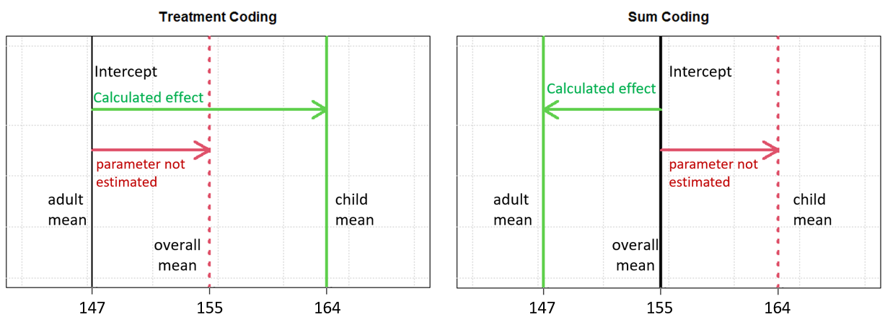

\newpage
```{r, include = FALSE}
knitr::opts_chunk$set(
  dpi = 300, dev = "jpeg", collapse=TRUE
)
```

# Comparing two groups of observations: Factors and contrasts {#c5}

In the previous chapter we focused on investigating a single average, which is basically the simplest kind of data you can deal with. The models discussed in this chapter can be used for data that compares observations across two groups. In this chapter we will ask: Are two averages different or are they the same? Comparing two groups basically means estimating a single *effect*, a single difference between groups. We do not discuss the comparison of multiple groups, i.e. the estimation of multiple fixed effects, until chapter 7.

Research questions comparing two groups come up often in scientific research. For example, a psycholinguist may ask: Does visual information speed up speech perception or not (are two sets of reaction times the same)? A phonetician may ask: Do men and women produce vowels that are about the same duration (are two sets of speech durations the same)? A doctor may ask: Is the blood pressure of people who take some medicine the same as that of those who don't (are two sets of blood pressure measurements the same)?

## Chapter pre-cap

Between and within-subjects factors are presented, and a model comparing two groups is discussed. The concept of factor coding is introduced and treatment and sum coding and compared. The decomposition of variation in the dependent variable into effects associated with independent variables is discussed, as is the difficulty of establishing causal relationships. A sum coded model comparing two groups is fit and compared to the treatment coded model. There is a discussion on retrieving and manipulating the model posterior samples, including the importance of combining parameters before summarizing them. The `hypothesis` function is introduced, and the retrieval and combination of 'random effect' parameters is explained. Finally, there is a discussion of outliers and robustness and the t distribution is presented. A model with t distributed errors is fit and compared to the model assuming normal errors.  

## Comparing two groups

[@@ Noah check subsection]

We introduce the comparison of two groups in terms of our hypothetical experiment regarding coffee and reading times (discussed in chapter 1) where we investigate whether coffee makes people read faster. Subjects are asked to drink either a cup of decaf or a cup of regular coffee. After a 30-minute wait they are asked to read a passage aloud and the duration of the reading time is measured. In this case, we might call the factor "drink" and have two levels "decaf", and "coffee". However, we might have named them "A1" and "A2": The factor and factor levels are named arbitrarily by the researcher and have no real effect on the outcome of an analysis. 

Every observation in our data can be assigned to a 'group' based on the value of the coffee group predictor for that observation (i.e., whether it indicates that the observation is associated with decaf, or regular coffee). The values associated with each group can be thought of as realizations of two random variables: “the amount of time it takes people to read this passage of text after drinking decaf”, and “the amount of time it takes people to read this passage of text after drinking regular coffee”. These variables have some unknown mean parameters we can call $\mu_{decaf}$ and $\mu_{coffee}$ respectively.

Usually, researchers don’t ask if the distribution of observations are identical in absolutely all respects across the two groups, and instead mostly focus on whether $\mu_{decaf}=\mu_{coffee}$ or not. So, when we design an experiment to test for differences between groups, what we are often really asking is: Is the mean of the distribution of these two variables the same? In other words, is “the mean of the distribution of amount of time it takes people to read this passage of text after drinking decaf” the same as “the mean of the distribution of the amount of time it takes people to read this passage of text after drinking coffee”?

## Distribution of repeated measures across factors

[@@ Noah check subsection]

Since we are discussing repeated measures data, we necessarily have repeated observations of measurements for different sources of data (e.g. listener). The way that these repeated measurements are distributed across levels of a grouping factor affects the structure of your regression model and the efficiency of your analysis, so it is useful to be familiar with these characteristics. We will consider a situation where you have several subjects ($S$) distributed among levels of a predictor factor ($A$) with two levels. Figure \@ref(fig:F5-1) is a visual representation of three ways that the comparison of two groups can be structured: Between-subjects, within-subjects, and an unnamed but possible configuration. 


```{r F5-1, echo = FALSE, out.width = "60%", fig.cap = "Three ways that two groups of subjects (S) can vary across levels of the factor A."}


```

We can consider the organizations in figure \@ref(fig:F5-1) in terms of our hypothetical experiment regarding coffee and reading times described above. In the first example factor $A$ is a *within-subjects* factor. This is because each subject appears at both levels of $A$ so that the grouping factor ($A$) varies *within* subjects. This would occur if we measured all subjects at both levels, i.e., we first ask people to read the passage after drinking decaf, then, we ask them to do the same after drinking regular coffee. Within-subject factors can usually be estimated more reliably because their effect can be measured for each person, letting you 'average out' random differences between people. For example, what if you put an extremely fast talker in the coffee group. You may think the caffeine had a huge effect but they actually just naturally read fast. If you had also observed them in the decaf group you would know that. 

Although having factors vary within-subjects has many benefits, this is not always possible or practical. For example, speakers cannot usually exist at multiple levels of first language since most have only one first language. Sometimes, practical considerations cause problems. For example, for our hypothetical experiment we can't give people coffee first and then decaf in the same session because the caffeine would still have an effect on their performance. To solve this problem a researcher may always ask subjects to perform the decaf round first. However, this may make the second reading faster due to rehearsal effects, making the second (caffeinated) reading seem artificially faster. Sometimes, there is no perfect solution to a problem and a researcher will need to select the best experimental structure given the limitations of the situation. 

In the second example $A$ is a *between-subjects* factor. This is because the factor varies *between* subjects since each subject appears at only one level of $A$. This would occur if we only measured subjects in either the decaf condition or the coffee condition, but not both. A design like this avoids the possible problems with within-subjects designs mentioned above. However, since different random people are in each group, finding stable differences between groups is a bit harder. As a result, the estimation of between-subjects factors will tend to be noisier than for within-subjects factors, all other things being equal.

Finally, we have a design that doesn't really have a name (labelled ?). This would arise if you tested some people in both conditions, and other people in only one condition. This is not really a 'proper' design, to the extent that it cannot be analyzed with some more 'traditional' approaches to statistical inference. Although there is no particular reason that you should design an experiment like this, this sort of data can arise incidentally out of experiments. 

For example in our experiment we asked people to judge the height, age, and gender of all speakers. Imagine we're interested in the effect of apparent age on apparent height, we wonder, "do people sound shorter when listeners think they are children?". To investigate this question we would make two groups, one containing all rows where listeners indicated hearing a child, and another with all rows where listeners indicated hearing an adult. If *all* listeners identify at least some speakers as adults and others as children, then apparent age is a *within-subject* factor. This is because in this case, all listeners would exist in both the "I think the speaker is an adult" and "I think the speaker is a child" groups. If all listeners identified *all* speakers as *either* children *or* adults, then apparent age would be a *between-subjects* factor. This is because there would be no speakers in *both* the "I think the speaker is an adult" and the "I think the speaker is a child group". 

However, it may occur that *some* speakers report both adult and child speakers, others report only adult speakers and others report only child speakers. If this were to occur, we could end up with the unnamed organization unintentionally due to the behavior of the listeners in the experiment. Note that in all of these cases, drawing inferences is additionally complicated by the fact that we can't randomly allocate listeners to either the "I think the speaker is an adult" or the "I think the speaker is a child" group, though we can (probably) shift the probability that a listener perceives particular speech stimuli as adult or childlike. Hence, these groups are more like groups defined by listeners' first languages than they are like decaf and coffee groups.

## Data and research questions {#c5-data-and-qs}

In the last chapter we focused on the apparent height of adult male speakers. The reason for this is that, because of the very low voice pitch of many adult male speakers, adult males represent the least confusable category of speakers from among women, men, boys and girls. For example we can compare veridical (i.e. actual) to perceived speaker category in what is called a **confusion matrix** below. A confusion matrix organizes responses to a classification problem in a way that makes correct classifications and confusions (i.e., errors) comparable across categories. In the matrix below, rows indicate actual speaker category and columns indicate apparent speaker category. We see that boys were identified as boys 234 times in total, and as girls and adult females 133 and 32 times respectively. So, boys were misidentified at a relatively high rate. In contrast, men were correctly identified in 626 cases and only misidentified in 49 cases, meaning their category was correctly identified in 93% of cases ($626/(626+49)$). 

```{r}
xtabs ( ~ bmmb::exp_data$C_v + bmmb::exp_data$C)
```

In this chapter we're going to focus on *confusable* voices, so we're going to exclude adult males from our data. Below we load our packages and experimental data, and create a new data frame called `notmen` that excludes all data associated with adult male speakers. This excludes both speech produced by adult males, and stimuli identified as being produced by adult males. We also exclude the 'big' resonance level by using the `exp_data` data frame, focusing only on the unmodified speech.

```{r, warning=FALSE,message=FALSE}
library (bmmb)
library (brms)
data (exp_data)

# exclude actual men and apparent men
notmen = exp_data[exp_data$C_v!='m' & exp_data$C!='m',]
```

We create a new confusion matrix that compares `A_v` (veridical age group, with levels `a` adults, and `c` children) and `C` (apparent speaker category) to see to what extent listeners confused the adult women in our sample with younger speakers (since all adults were women). We can see that although a majority of stimuli were classified correctly, there are plenty of misidentifications in the data. 

```{r}
xtabs (~ notmen$A_v + notmen$C)
```

Our height responses could potentially be modeled on the basis of either apparent age group or veridical age group. Neither of these approaches would be *wrong* or *right* in any general, absolute sense. Rather, each can provide different information regarding our response variable, and so answer different research questions. The boxplot in figure \@ref(fig:F5-2) presents a comparison of height judgments for our confusable speakers, organized according to perceived and veridical age. Based on this plot we see that the apparent age of a speaker dominates their apparent height. 

```{r F5-2, fig.height = 2.5, fig.width=8, fig.cap = "Distribution of apparent height judgments organized by apparent and veridical age.", echo = FALSE}

################################################################################
### Figure 5.2
################################################################################

par (mfrow = c(1,1), mar = c(4,4,1,1))

boxplot (height ~ A_v + A, data = notmen, col = bmmb::cols[c(9,4,9,4)], 
        ylab = "Perceived Age", xlab = "Height (cm)", horizontal = TRUE,
        names=c("","","",""),yaxt='n')
axis (side=2,at =c(1.5,3.5),c("Adult","Child"))

legend (108,2,legend=c("Veridical adults",
                           "Veridical children"),
         pch=15,col = bmmb::cols[c(9,4)], bty='n',pt.cex=1.5)

# aa = notmen$height[notmen$A_v=="a" & notmen$A=="a"]
# ac = notmen$height[notmen$A_v=="a" & notmen$A=="c"]
# ca = notmen$height[notmen$A_v=="c" & notmen$A=="a"]
# cc = notmen$height[notmen$A_v=="c" & notmen$A=="c"]
 
# plot (density (aa), xlim = c(110,185), lwd=4, col= bmmb::cols[9],
#       main="",xlab = "Apparent height (cm)", ylim = c(0,0.15),yaxs='i')
# lines (density (ac), lwd=4, col= bmmb::cols[4])
# lines (density (ca), lwd=4, col= bmmb::cols[9],lty=2)
# lines (density (cc), lwd=4, col= bmmb::cols[4],lty=2)
# 
# legend (108,0.13,legend=c("Veridical adults, identified as adults",
#                           "Veridical children, identified as adults",
#                           "Veridical adults, identified as children",
#                           "Veridical children, identified as children"),
#         lwd=6,col = bmmb::cols[c(9,9,4,4)], bty='n',lty=c(1,3,1,3))
```

For example, the first two boxes from the top indicate that speakers 'sounded' shorter when they were identified as children, regardless of whether they were adults or not. Conversely, the bottom two boxes indicate that speakers 'sounded' taller when they were identified as adults, even if they were children. So, we see that what seems to determine apparent height is apparent speaker age, rather than veridical speaker age. This makes sense to some extent, since listeners don't *know* how old speakers are, they just know how old they *think* speakers are. For this reason, the analysis in this chapter will focus on understanding the role of *apparent age* on the perception of speaker height. 

By focusing on apparent age, we are effectively asking how apparent height is affected by whether the listener *thinks* the speaker is an adult or not. As a result, this experiment focuses on how our expectations and 'real world knowledge' can influence how we perceive the world. This may seem unusual but it is actually a very common thing. For example think of an image of a box of an unknown size. Your estimate of how heavy this is, or how hard it is to move, will depend on how large you think the box is and on what you think is inside of it. Historically, research on the perception of speaker size from speech has taken a very mathematical approach, assuming humans are using acoustic information in an optimal and dispassionate manner. More recent work, highlights the role of 'real world knowledge', and stereotypes about different kinds of speakers, in the determination (or reporting) of apparent speaker height (see chapter 13 for more information on this topic). 

One potential problem with using apparent age as a predictor is that this is not necessarily balanced across listeners. To investigate the distribution of levels of $A$ across listeners, we can cross-tabulate age classifications by listener as seen below. Since each listener has observations at both levels of the `A` factor (i.e. across each column), we know that apparent age is a within-subjects factor. If *all* of the columns contained one zero and one non-zero value, this would be a *between-subjects* factor. Finally, if *some* of the columns featured one zero and others featured no zeros apparent age would vary across listeners in a manner resembling the nameless (?) design.

```{r}
xtabs (~ notmen$A + notmen$L)
```

To analyze data from two groups, we need to have it in a data frame with one row for each observation. One column should contain the dependent variable, the variable whose variation you're trying to predict. Another column should contain information about which group each observation belongs to. Finally, since we have repeated measures data, we also need a column that indicates which source (speaker/listener/participant) provided the data point. The variables from our `exp_data` data frame that we will be using are:

  * `L`: An integer from 1-15 indicating which *listener* responded to the trial.
  * `height`: A floating-point number representing the *height* (in centimeters) reported for the speaker on each trial. 
  * `S`: An integer from 1-139 indicating which *speaker* produced the trial stimulus. 
  * `A`: The *apparent age* of the speaker indicated by the listener, `a` (adult) or `c` (child). 
 
In this chapter we will build models that help us answer the following questions, among others: 

  (Q1) How tall do speakers perceived as adult females sound? 
  
  (Q2) How tall do speakers perceived as children sound?
  
  (Q3) What is the difference in apparent height associated with the perception of adultness? 
  
Figure \@ref(fig:F5-3) presents between-speaker and within-speaker variation according to apparent age. The answer to (Q1) above will depend on the distribution illustrated by the left boxplot of the left panel of the figure. The answer to (Q2)  will depend on the distribution illustrated by the right boxplot of the left panel of the figure. The answer to (Q3) will depend on the difference between these distributions. Of course, we see that this is not the full story since there is substantial between-listener variation in the locations of these distributions, and in the differences between them, as illustrated by the pairs of boxes in the right plot. However, we will leave discussion of between-listener variation in effects for the next chapter. 

```{r F5-3, fig.height = 3, fig.width=8, fig.cap = "(left) Distribution of apparent heights according to apparent age group. (right) Same as left panel but presented individually for each listener. In each case, the first box of each color (the higher box) represents responses for speakers judged to be adults.", echo = FALSE}

################################################################################
### Figure 5.3
################################################################################

par (mfrow = c(1,2), mar = c(4.1,.1,.5,.1),oma = c(0,4,0,.50)); layout (mat = t(c(1,2)), widths = c(.2,.8))

boxplot (height ~ A, data=notmen, col = c(beige,lightpink),ylim = c(103,185), xlab="")
mtext (side=1, "Apparent Age Group", line=3)

mtext (side = 2, outer = FALSE, "Height (cm)", line = 2.75)
boxplot (height ~ A+L, data=notmen, col = rep(cols,each=2),ylim = c(103,185),
         ylab="",yaxt="n", xaxt="n",xlab="Listener")
axis (side=1, at = seq(1.5,30.5,2), 1:15)

```

## Estimating the difference between two means with 'brms' {#c5-two-means}

In Chapter 4 we fit a model with the simplest possible fixed-effect structure, basically an 'intercept only' random effects model. To estimate a difference between two group means, we need to include a 'real' predictor in our model, a variable indicating apparent age for each observation. Remember that formulas look like `y ~ predictor(s)`. Previously, our formula had no (fixed effect) predictors and so it looked like `height ~ 1 + (1|L) + (1|S)`, where the `1` indicates that this is an intercept-only model. To predict apparent height based on whether the talker was perceived as an adult or not, our model formula would now look like this:

`height ~ 1 + A + (1|L) + (1|S)`

This assumes that we have a column in our data frame (`A`) that indicates whether the listener thought a data point was produced by an adult or not. This model formula basically says "we expect height to vary around the intercept based on whether the speaker was judged to be an adult, in addition to listener and speaker-specific adjustments to the intercept'. When you have at least one non-intercept predictor in your model then you don't need to include a `1` in your formula, since the intercept is included in the model by default. So, your model formula can look like:

`height ~ A + (1|L) + (1|S)`. 

Since the intercept is included by default, if you want to *suppress* (omit) an intercept from your model you need to specifically indicate this in your formula. You can do this by placing a `0` in front of your model formula like this `height ~ 0 + A + (1|L) + (1|S)`.

To fit our model comparing two groups, we need to specify prior probabilities for our age predictor. We should also rethink our priors since our data has changed substantially (from *only* men to *no* men). We can do this using the information provided in `height_data`, which tells us that adult females are about 162 cm tall on average, and 11 year old children are around 150 cm tall (our boys and girls were 10-12 years old). Based on this we can set the intercept to 156 cm, halfway between each average. We set the standard deviations for all priors to the difference between group means, 12 cm. This means that we expect that variation in the data, whether it be between groups (the $A$ predictor) or within-listener error (`sigma`, $\sigma$), will be roughly on the order of the empirical group differences. 

Usually, we would discuss the structure of this model now, *before* fitting. However, this time we're going to put this off for a little bit because an explanation involves some of the less intuitive concepts relating to regression. So, this time we're going to to fit the model first and then get to the details of the model later in the chapter.

### Fitting the model

Our model now includes a non-intercept term, apparent age ($A$), and so we need to specify a prior for class `b` in addition to the priors we set in chapter 4. This is the class for all fixed-effect predictors (those fit without adaptive partial pooling) other than the intercept. Below we see a summary of the classes of predictors we have set priors for so far. 

-   `Intercept`: this is a unique class, only for intercepts.
-   `b`: This class includes all fixed-effect predictors *apart* from the intercept.
-   `sd`: this is for our standard deviation parameters that relate to 'batches' of parameters. In our example this is `sd(Intercept)` for `L` ($\sigma_{L}$).
-   `sigma`: the error term.

Below we fit the model, using the formula discussed above. 

```{r, eval = FALSE}
# Fit the model yourself
model = brms::brm (
  height ~ A + (1|L) + (1|S), data = notmen, chains = 4, cores = 4,
  warmup = 1000, iter = 3500, thin = 2,
  prior = c(brms::set_prior("normal(156, 12)", class = "Intercept"),
            brms::set_prior("normal(0, 12)", class = "b"),
            brms::set_prior("normal(0, 12)", class = "sd"),
            brms::set_prior("normal(0, 12)", class = "sigma")))
```
```{r, include = TRUE, eval = FALSE}
# Or download it from the GitHub page:
model = bmmb::get_model ('5_model.RDS')
```
```{r, include = FALSE}
# saveRDS (model, '../models/5_model.RDS')
model = readRDS ('../models/5_model.RDS')
```

### Interpreting the model

We can inspect the model print statement, which is mostly familiar by now. 

```{r, collapse = TRUE}
# inspect model
bmmb::short_summary (model)
```

There's a new predictor in the section on `Population-Level Effects` (i.e. the 'fixed' effects). In addition to the `Intercept` term, we now get estimates for a term called `Ac`. Admittedly, this is a strange name, but it's how R handles predictors that are words (called *factors* in R). R names predictors like this `factornameFactorlevel`. For example, a factor called `colors` with levels `red`, `green` and `blue` would have the levels `colorsred`, `colorsgreen`, and `colorsblue`. So, the `Ac` name tells us this is the estimate for the `c` (child) level of the `A` (apparent age) factor. The `Ac` term in our model reflects something about the average apparent height of speakers identified as children. But what about this value does it reflect? Note that the 'Intercept' term in the model above corresponds to the mean apparent height for speakers perceived as adult females: 

```{r, collapse = TRUE}
# calculate means apparent height based on apparent adultness
tapply (notmen$height, notmen$A, mean)
```

What does the value of `Ac` reflect about the apparent height of speakers identified as children? It tells us the difference between the group means, which is 20.1 cm when calculating simple groups means, and 17.4 cm as estimated in the model. Well, our model coefficient is actually -17.4 but since it reflects a differences we can express it as an absolute value. Ideally, it seems like our model would have three `population level` predictors, the intercept, a predictor with adult response mean (i.e. `Aa`), and a predictor associated with child response mean (`Ac`). To understand why this can't happen we need to talk about contrasts.

## Contrasts {#c5-contrasts}

Factors are variables like 'adult' vs. 'child' that are not inherently numerical. **Contrasts** are the numerical implementation of factors in your model. The general problem is, in many cases, that coefficients for every level of a factor cannot all be estimated. For example, if you have two groups then you can't *independently* calculate all of the following:

1) The group 1 mean.
2) The group 2 mean.
3) The overall mean.

Why not? Because once you know any 2 of these quantities, you also know the 3rd. In section \@ref(c2-sample-mean) we mentioned that the sum of the differences between observations and the sample mean calculated from those observations will always equal zero. When we estimate the overall mean based on the group 1 and group 2 means, the overall mean represents the sample mean and each group mean is an observation. This means that the deviation of the group means around the overall mean (i.e. the effects) are constrained to sum to zero. Since the sum of the effect of group 1 and the effect of group 2 must equal zero, that means that the group 1 effect *must* equal the opposite of the group 2 effect. For example, if the group 1 mean is 5 and the overall mean is 6, obviously the group 2 mean *must* be 7. This is because if the group 1 mean is 1 below the overall mean (an effect of -1), then the other group *must* be 1 above the mean (an effect of +1) in order to balance out. 

The situation described above means that when we estimate the mean of the means (i.e. the intercept) based on two group means, one of the three values is always perfectly predictable based on the other two. When things are entirely predictable in this way we say they are **linearly dependent**, and regression models don't like this (for more information on linear dependence, see section \@ref(c8-identifiability)). For example, imagine you were trying to predict a person's weight from their height. You want to include height in centimeters *and* height in meters in your model, and you want to *independently* estimate effects for both predictors. Since height in centimeters = height in meters $\times$ 100, that is not going to be possible. The effect of one *must* be 100 times the effect of the other. Obviously however, one value is not independent of another if it also exactly 100 times the other. This means that we can't independently estimate these two values. Even though it may be less transparent, this is the same reason why we can't estimate all the group means *and* the overall mean. 

There are many different contrast coding schemes, and these reflect different ways of representing group differences, and decisions regarding which effects to estimate (and which to ignore). Here we will discuss two approaches: Treatment coding and sum coding. 

### Treatment coding {#c5-treatment-coding}

The coding scheme you use determines how your model represents the differences it encodes. In the model above we used **treatment coding** (the default in R). In treatment coding, a 'reference' level is chosen to be the intercept, and all group effects reflect the difference between the mean for that group, and the value of the Intercept (i.e., the mean for the reference level). By default, R chooses the alphabetically-lowest level to be the reference level. In our model above, the `a` (adult) level was chosen as the reference level, and so the intercept represents the mean for this group. The effect for 'child' (`Ac`) represents the *difference* between the child mean and the adult mean. This means that our credible intervals also represent the difference in the means and not the means themselves. So, based on our treatment coded model we expect the *difference* in the apparent heights of adults and children to be about 17.4 cm, and we think there is a 95% chance that the *difference* between the means is between 15.9 and 18.8 cm in magnitude.

To interpret treatment coded coefficients in a regression model:

* The reference category mean is the 'Intercept' in the model. 

* The value of the coefficients of any non-intercept group are equal to `group mean - Intercept (reference group mean)`.

* To recover the mean estimate for any non-intercept group, we add `group effect + Intercept (reference group mean)`.

Notice that under treatment coding you estimate a group mean and the differences between the group means, but you do not estimate an overall **grand mean**. Although there is potentially some variation in terminology, we will use *grand mean* to refer to the mean of the group means. Keep in mind that this may have a different value from the overall mean of all of the observations with no group structure included in the calculations. 

### Sum coding {#c5-sum-coding}

There are multiple options for coding schemes, and the best one for you depends on what you want to get out of your model. Changing the coding scheme may substantially change the value of your coefficients and the way they should be interpreted. However, this will not change the fundamental relationships encoded in your model. Think of it this way, you can tell someone that the library is five miles west of your house or that your house is five miles east of the library. This sounds different because you are changing the reference point (the 'intercept'), but it represents the same relationship. As a result, the selection of a coding scheme best suited for a model depends on which one results in the simplest interpretation of the model given the purpose of the research. 

That being said, going forward we will focus exclusively on what is known as **sum coding**. The focus on a single coding scheme is meant to save space and minimize confusion. The reason for selecting sum coding specifically is because it has some desirable mathematical properties and it allows models to be interpreted in a style reminiscent of a traditional analysis of variance (to be discussed in chapter 11), which many researchers may find useful. 

In sum coding, there is no reference level. Instead, the intercept represents the mean of the group means. The effect for each individual group is then represented as a deviation from the intercept, and all of these effects are constrained to sum to zero. Just like for treatment coding, you can't estimate all of your group effects *and* the overall grand mean. Since we are estimating the grand mean, that means we will not be able to estimate *one* of our group effects. When using sum coding, R selects the *alphabetically last* level of your factor, and does not estimate it. The value of the missing effect is easy to recover algebraically. Since the sum of the coefficients must equal zero, the missing factor level will always be equal to the *negative sum* of the other factors. This means that if you add up the values of the levels that *are* present and flip the sign, the outcome is the value of your missing level. If you think about it, it must be this way. This is because the final missing value must cancel out the sum of the others if the sum of all the values is to equal zero.

As discussed earlier, with only two groups if you know the grand mean and the distance between one group to the grand mean, you also know the distance of the other group to the grand mean. This can be seen quite clearly below where the difference between each group to the overall mean has a magnitude of 10.1. So, if our sum-coded model tells us that the intercept is 155.4 cm and the adult mean is 10.1 cm above this, then the child mean *must* be 10.1 cm below it. 

```{r, collapse = TRUE}
# calculate group means
means = tapply (notmen$height, notmen$A, mean)
mean (means)

# find the distances to the mean of the means
means - mean (means)
```

To interpret sum coded coefficients in regression models:

* The mean of all your group means is the 'Intercept' in the model. 

* The value of the coefficients of any other group mean will be equal to `group mean - Intercept (overall mean)`.

* To recover the mean estimate for any other group, we add `group effect + Intercept (overall mean)`.

Before continuing, we want to mention two things with respect to sum coding. First, in chapter 4 we noted that random effects are coded as deviations from the mean. Now we can be more specific and say that `brms` will use sum coding to specify all of your random effects (i.e. all terms estimated with partial pooling). Second, you may have noted that last chapter we did, in fact, estimate all of the levels of the listener random effects. We have 15 listeners in our data and we clearly saw 15 'random effects' for listeners at several points in the chapter. The reason for this is that unlike for fixed effects, random effects are not constrained to sum to zero, and the the value of the $J^{th}$ factor level is not necessarily predictable given knowledge of the value of the other $J-1$ levels. As a result, in many cases all levels of a random effect *can* be estimated. 

### Comparison of sum and treatment coding {#c5-comparison-sum-treatment}

Figure \@ref(fig:F5-4) presents a comparison of the way the two coding schemes represent the group means in a two-group model. In each case they estimate one intercept and one effect, letting you recreate one other effect (i.e., they each omit one parameter). In treatment coding the omitted value is the overall mean, which in the two-group case will always be `Intercept + estimatedEffect/2`. In the case of sum coding the omitted value is the effect for the second group, which will always be the same magnitude but have the opposite sign as the effect for the first group (i.e., `-estimatedEffect` in a two-group model). 

[@@ SB - update figure]

```{r F5-4, echo = FALSE, out.width = "100%", fig.cap = "Artists rendition of contrast and treatment coding differences for our data."}

################################################################################
### Figure 5.4
################################################################################


```

## Sum coding and the decomposition of variation {#c5-refittin-sum}

Regression models try to break up the value of the dependent variable into different components. This is why effects are expressed in terms of differences to some reference value. For example, imagine we say that a speaker's apparent height is 160 cm, and under some other condition their apparent height is also 160 cm. If this were the case, we might be inclined to say that the change in these conditions has no *effect* on their apparent height. On the other hand something that *is* associated with a difference in apparent height *can* be said to have an effect on that variable. As a result, we can express the *effect* of something in terms of the difference it is associated with. For example, we can say that under so and so condition a person will tend to sound 17.5 cm shorter, relative to some reference value. More generally, we can think of any variable as the sum of a bunch of independent *effects*. 

As discussed in section \@ref(c1-exp-and-effects), the term *effect* is meant to indicate that variation in the independent variable is associated with variation in the dependent variable. This term is not meant to imply that any causal relationship exists, and certainly not that such a relationship is *proven* by the model. 

For example, since age and height are so strongly related between the ages of 2 and 18 (see figure \@ref(fig:F1-1)), you can predict the veridical height of a person between the ages of 2 and 18 from their age with a high degree of accuracy. If you build a model that predicts the height of a child based on their age you might say that in your model "age has an effect on height". A statement like this does not mean that age variation *causes* height variation in real life. Age (i.e. *time*) is a useful way to measure the progress of biological processes during childhood that themselves cause growth in body length, but age does not itself *cause* growth. Instead, a statement regarding the effect of one variable on another means that within the context of the universe you have constructed using your model, variation in body length is predictable (to some extent) based on variation in age. 

The above is not to say that effects in your model will *never* reflect causal relationships, just that establishing this requires substantially more than simply finding statistical associations between variables. The decomposition of variables into a sum of effects, and the view of effects as representing predictable (maybe not causal) variation is just a way to *think* about variables, to break up observed values into their component parts. It should not be confused with the *reality* of these values and the process that underlies them (whatever that is!). 

So far we've covered the fact that after picking a value to use as a reference point (the model intercept), our models:
  
  * Represent group means as deviations from the intercept.
  
  * Represent the listener and speaker-specific deviations from the intercept ($L_{[\bullet]}, S_{[\bullet]}$) as being centered at 0, with standard deviations of $\sigma_{L}$ and $\sigma_{S}$.
  
  * Represent the random error ($\varepsilon$) as having a mean of 0 and a standard deviation of $\sigma$. 
  
In each case, these model coefficients reflect *deviations* from some reference point. As a result, when the parameters associated with these predictors equal 0, this means that no effect is present.

  * When a group coefficient is 0 the group lies exactly at the intercept. In sum coding this is the grand mean (the mean of the means) indicating that the group is basically average.
  
  * When a listener or speaker-effect is 0 this listener/speaker is exactly average with respect to their group. This means there is nothing about this speaker's average that is unpredictable given knowledge of their group. 
  
  * When an error is 0 this production is exactly as expected for a given listener/speaker in a given group. This means that an observation contains no error since it was *exactly* predictable.  
  
If we think of our predictors as representing deviations from some reference value, we can 'break up' any observed value into its component parts. For example, suppose that:

  * The overall mean is 157 cm.
  * The adult female mean is 165 cm (+8 over the intercept).
  * A particular speaker has a mean apparent height of 170 cm (+5 over the adult female mean). 
  
If we observe an apparent height judgment of 173 cm for this speaker, that suggests the following decomposition:

173 = 157 (Intercept) + 8 (adult female effect) + 5 (speaker effect) + 3 (error)

This reflects the following considerations:

  * The average apparent height across the groups is 157 cm.
  * The average for adult females is 8 cm above the overall mean (157 + 8 = 165).
  * This speaker's average apparent height is 5 cm above the average for adult females (157 + 8 + 5 = 170).
  * This particular production is 3 cm higher than expected for this particular speaker (157 + 8 + 5 + 3 = 173). 

Another observation from this same talker might be: 

164 = 157 (Intercept) + 8 (adult female effect) + 5 (speaker effect) - 6 (error)

In this case, the error is -6 since the production is now 6 cm *below* the speaker average. However, no other part of the equation has changed since this is the same speaker in the same group. Regression models basically carry out these decompositions for us, and reflect information regarding the average of these in their model parameters. 

### Description of the model {#c5-description-1}

We're going to re-fit our treatment coded model sum coding, and see what effect this has on the estimated coefficients. The full model specification, including prior probabilities, is presented in \@ref(eq:5-1) below. Our model includes a new coefficient called $A$ reflecting the effect for apparent age, but is otherwise very similar to the model described in section \@ref(c4-updating-model). 

$$
\begin{equation}
\begin{split}
height_{[i]} \sim \mathrm{N}(\mu_{[i]},\sigma) \\ 
\mu_{[i]} = \mathrm{Intercept} + A  + L_{[\mathsf{L}_{[i]}]} + S_{[\mathsf{S}_{[i]}]} \\ \\ 
\mathrm{Priors:} \\ 
L_{[\bullet]} \sim N(0,\sigma_L) \\
S_{[\bullet]} \sim N(0,\sigma_S) \\
\\
\mathrm{Intercept} \sim N(156,12) \\
A \sim N(0,12) \\
\sigma \sim N(0,12) \\
\sigma_L \sim N(0,12) \\
\sigma_S \sim N(0,12)
\end{split}
(\#eq:5-1)
\end{equation}
$$

We need to talk about why there is only a single $A$ coefficient despite there being two different age groups, and why this parameter does not get a subscript. Recall that regression models work by multiplying predictor variables with model parameters/coefficients, and adding these products together to arrive at an expected value (e.g. $\mu = x_1 \times \alpha_2+x_2 \times \alpha_2+...$). This means that every parameter needs to be multiplied by some value in our prediction equation. When we introduced the intercept in section \@ref(c3-description-1), we noted that the intercept is 'secretly' multiplied by a predictor equal to 1 for each observation. In order to meet this requirement, R adds a column of ones to your data to represent the intercept in your predictors. 

In the case of factors with two levels (under sum coding), R adds a predictor to our data that equals 1 when $A$ equals its first value (adult) and -1 when it has its second value (child). In this way, the single $A$ coefficient can represent the effects for both groups, i.e. the distance between each group and the inttercept. These 'hidden' predictors are how contrasts are handled mathematically. Coding schemes differ in the ways they use combinations of 1, -1, 0, and in some cases fractions, in order to mathematically represent the relations between groups.  

Here is how you would read this model description in \@ref(eq:5-1) aloud in plain English:

> "Apparent speaker height is expected to vary according to a normal distribution with some unknown mean ($\mu$) and standard deviation ($\sigma$). Means are expected to vary based on whether the listener identified the speaker as an adult or a child ($A$), and listener and speaker-dependent deviations from the mean ($L, S$). The listener and speaker effects were modeled as coming from a normal distribution with a mean of 0 and unknown standard deviations ($\sigma_L, \sigma_S$). The intercept was given a normal prior with a mean of 156 and a standard deviation of 12, and the remaining parameters were given normal priors centered at 0 with standard deviations of 12."

### Fitting the model

To fit a model with sum coding, we need to change the global contrast options in R. These options will be in effect until we restart R or change the contrasts to something else. If you fit a model with this coding, be sure to set this option every time you start R and want to work with this model. If there is a mismatch between your contrast settings and what the `brms` helper functions expect for your model, you may encounter problems and inscrutable error messages.  

```{r}
# to change to sum coding
options (contrasts = c('contr.sum','contr.sum'))

# to change back to treatment coding
# options (contrasts = c('contr.treatment','contr.treatment'))
```

We can fit the same model with sum coding using the exact same code since the options (and our coding) have changed, but nothing else has. 

```{r, eval = FALSE}
# Fit the model yourself
model_sum_coding =  brms::brm (
  height ~ A + (1|L) + (1|S), data = notmen, chains = 4, cores = 4,
  warmup = 1000, iter = 3500, thin = 2,
  prior = c(brms::set_prior("normal(156, 12)", class = "Intercept"),
            brms::set_prior("normal(0, 12)", class = "b"),
            brms::set_prior("normal(0, 12)", class = "sd"),
            brms::set_prior("normal(0, 12)", class = "sigma")))
```
```{r, include = TRUE, eval = FALSE}
# Or download it from the GitHub page:
model_sum_coding = bmmb::get_model ('5_model_sum_coding.RDS')
```
```{r, include = FALSE}
# saveRDS (model_sum_coding, '../models/5_model_sum_coding.RDS')
model_sum_coding = readRDS ('../models/5_model_sum_coding.RDS')
```

We're going to use the `fixef` (i.e. 'fixed effects') function in `brms` to inspect only the `Population-Level Effects` in our model. This is just to save space because the rest of the model will look the same, but you should check out the print statement to see the whole model. The `Population-Level Effects` are also sometimes called *fixed* effects in part because they are 'fixed' across the population. For example, the effect for 'child' doesn't apply only to little Susie or little Johnny in particular, but to speakers perceived as *children* more generally. 

```{r, collapse = TRUE}
# inspect model fixed effects
brms::fixef (model_sum_coding)
```

An inspection of the fixed effects shows that, as expected, the `Intercept` now reflects the mean of the group means (i.e. the grand mean) and the single estimated parameter (`A1`) reflects the distance between the adult mean and the grand mean. The name of our `A1` parameter is based on how `brm` handles factors with sum coding. Predictors representing factors will be named `factornameN`, where `factorname` is the predictor name and `N` is the level number. Levels are ordered, and numbered, alphabetically starting at one, and the alphabetically-last level will not be estimated. You can predict how your factor levels will be ordered by doing something like this:

```{r, collapse = TRUE}
sort (unique (notmen$A))
```

So, `A1` in our model corresponds to the "adult" level of our predictor, and `A2` *would* be the coefficient reflecting the effect for "child". However, this is not separately estimated by our sum-coded model since $A2 = -A1$.

### Comparison of sum and treatment coding 

If you compare the output of the treatment and sum coding models:

```{r, eval = FALSE}
bmmb::short_summary (model)
bmmb::short_summary (model_sum_coding)
```

The main differences are in the population-level effects, seen below:

```{r, collapse = TRUE}
# treatment coding
brms::fixef (model)

# sum coding
brms::fixef (model_sum_coding)
```

In the treatment-coded model the intercept represents the adult mean and the `Ac` effect reflects the difference between the intercept and the child mean. In the sum-coded model the intercept is the overall grand mean and the `A1` effect represents the difference between the adult mean and the intercept. We can see that the information contained in the models is equivalent, just represented differently. First, we can divide the `Ac` effect by two to find half the distance between the groups, which we know must be the distance between the grand mean and the child group. This is the same magnitude as the `A1` effect in the sum-coded model (since it represents the same distance). If we subtract this value from the adult mean, we recover the intercept of the sum coded model.

```{r}
17.4/2
163.9 - (17.4/2)
```

We can take the opposite approach and add the `A1` effect to the intercept of the sum-coded model. This allows us to recreate the intercept of the treatment-coded model. Just as half the `Ac` effect equaled the magnitude of the `A1` effect, we can take the opposite approach below. Since `A1` reflects the difference between groups and the grand mean, twice this value must equal the distance between the group means themselves. 

```{r}
155.2 + 8.7
8.7*2
```

## Inspecting and manipulating the posterior samples {#c5-working-with-posteriors}

[@@ SB - go over this whole section]

In the examples above, we added the posterior means of our model coefficients together. What we mean by this is that we took the `Estimate` in the model print statement, and used that to recreate our parameters (e.g., `156.7 + 8.77`). This approach is fine if we intend to quickly estimate simple combinations of our parameters as we did in the section above. However, this does not allow us to estimate the intervals around parameters in a reliable way. The main issue is that this approach does not adequately reflect the shared variation in the parameters we are combining, and this is a problem when estimating their credible intervals. 

It's important to remember that our models are actually a series of samples from the posterior distributions of our model parameters. Each of these posterior distributions reflects a different random variable, each with its own mean and variance. When one adds or subtracts two random variables, the variance of the outcome is defined as in \@ref(eq:5-1a). The top line in \@ref(eq:5-1a) says: "The variance of the sum of the random variables $x$ and $y$ is equal to the sum of their individual variances ($\sigma^2_x,\sigma^2_y$), plus two times the product of the correlation between the variables ($\rho$), and their individual standard deviations ($\sigma_x, \sigma_y$).

$$
\begin{equation}
\begin{split}
\sigma^2_{x + y} = \sigma^2_x + \sigma^2_y + 2 \rho \sigma_x \sigma_y \\
\sigma^2_{x - y} = \sigma^2_x - \sigma^2_y - 2 \rho \sigma_x \sigma_y
\end{split}
(\#eq:5-1a)
\end{equation}
$$

We haven't talked about *correlation* yet, but we do in section \@ref(c6-correlations). Basically, the correlation is the strength of the relationship between variables, and it can greatly affect the outcome of the equations above. Consider a situation where $x$ is very positive when $y$ is very negative, and vice versa. This would be a *negative* correlation, a negative association between the variables. If $x$ and $y$ tend to have opposite values, then the sum of $x$ and $y$ will be near zero, meaning the variance of this sum will be near zero. This shows how even if two variables have large underlying individual variances, their *sum* can have a very small variance when they are negatively related. The same reasoning can also explain a much larger than expected variance for the sum of positively related variables. 

Why do we care about this? Well, clearly the credible intervals describing our posterior distributions reflect the variance of these distributions; wider intervals correspond to larger variances. So, as a practical matter the only way to ensure that we get the correct variance, and credible interval, for the combination of the intercept and the apparent age predictors (i.e., $\sigma^2_{Intercept+A}$) is to take the correlation of the predictors into account. When we summarize parameters, and then combine them, we lose all information about the correlations between parameters, making an accurate estimation of $\sigma^2_{Intercept+A}$ impossible. On the other hand, if we add our parameters together, or find the differences between them *before* summarizing, we don't need to worry about the correlations between them. This is because this information is directly present in the posterior samples and is preserved when we work with these directly. This is why when combining parameters, you should *always* do so with the original samples, and *then* summarize the combined samples. 

We can see the individual samples for our population-level (i.e. fixed effects) parameters by calling the `fixef` function and setting `summary` to `FALSE`. Below, we see the first 6 posterior samples for each parameter. 

```{r, collapse = TRUE}
samples = brms::fixef (model_sum_coding, summary = FALSE)

head (samples)
```

If we find the mean of the samples across both columns, these exactly correspond to the estimates of these parameters provided by the `fixef` function above. In fact the `fixef` function is only doing some convenient summarizing of the samples for us, and presents this to us in a nice, interpretable way. 

```{r}
colMeans (samples)
```

When we fit the models above, we made certain choices regarding what information was directly represented in the model, and what was not. In other words, we made a decision regarding how to **parameterize** our model, including the selection of a coding scheme. However, the information that is not directly represented in the model can still often be recovered by combining parameter estimates in appropriate ways. For example, we know that our adult mean is equal to the sum of the intercept and the `A1` parameter. If we want to know what the value of `Intercept+A1` is according to our model, all we need to do is add the values of `A1` and `Intercept`, individually for each sample, and then consider the distribution of the sum. This means we add the elements of each row together, resulting in a single vector as long as the two original columns. Combining the intercept and `A1` parameters in our model is as easy as seen below, we simply add the two vectors together:

```{r}
adult_mean = samples[,"Intercept"] + samples[,"A1"]
```

In figure \@ref(fig:F5-5) we plot histograms and the individual posterior samples for the `Intercept` (the overall mean) and the `A1` parameter (the effect for adults). We also show how combinations of the intercept and the `A1` parameter can be combined to find the posterior estimates of our child and adult means. 

```{r F5-5, fig.height = 4, fig.width = 8, fig.cap = "Comparison of histogram and trace plots of posterior samples of selected parameters and combinations.", echo = FALSE}

################################################################################
### Figure 5.5
################################################################################
par (mfrow = c(2,4), mar = c(4,4,3,1))
hist (samples[,'Intercept'],freq=FALSE, col = skyblue,main='Intercept',
      xlab="Apparent Height (cm)")  
hist (samples[,'A1'], freq=FALSE, col = deeppurple,main='A1',
      xlab="Apparent Height (cm)")
hist (samples[,'Intercept']-samples[,'A1'], freq=FALSE, col = teal,main='Intercept-A1',
      xlab="Apparent Height (cm)")
hist (samples[,'Intercept']+samples[,'A1'], freq=FALSE, 
      col = yellow,main='Intercept+A1',xlab="Apparent Height (cm)")
plot (samples[,'Intercept'], col = skyblue,pch=16,ylab="Apparent Height (cm)")  
plot (samples[,'A1'], col = deeppurple, pch=16,ylab="Apparent Height (cm)")  
plot (samples[,'Intercept']-samples[,'A1'], col = teal, pch=16,ylab="Apparent Height (cm)")
plot (samples[,'Intercept']+samples[,'A1'], col = yellow,
      pch=16,ylab="Apparent Height (cm)")  
```

We can summarize our combinations of parameters using the `posterior_summary` function from the `brms` package. This function takes in a matrix or vector and calculates the mean, standard deviation, and 95% credible interval (by default) for each column in the data. Below, we use this strategy to get information about posterior means and credible intervals for our adult and child means. Whereas the credible interval for the `A1` effect reflected uncertainty in the *difference* between the adult female mean and the Intercept, the values below provide information about the adult and child group means directly.

```{r, collapse = TRUE}
new_parameters = cbind(adult_mean = samples[,'Intercept'] + samples[,'A1'],
                       child_mean = samples[,'Intercept'] - samples[,'A1'])

# report mean and spread of samples
brms::posterior_summary (new_parameters)
```

We can compare the intervals above to those of our intercept and effect for apparent age:

```{r}
brms::fixef (model_sum_coding)
```

We see that the 95% credible interval for our intercept spans about 5.5 cm and our 95% credible interval for apparent age spans about 1.4 cm. However, the 95% credible intervals for the adult and child means span only about 5.7 cm each, indicating that $\sigma^2_{Intercept+A} < \; \sigma^2_{Intercept+Intercept} + \sigma^2_{Intercept+A}$. We know that this likely reflects a negative correlation between the posterior samples of the intercept and `A1` parameter, however, this is unpredictable if one only looks at the summaries immediately above.

### Using the *hypothesis* function {#c5-using-hypothesis}

Working directly with the posterior samples is simple, but often not strictly necessary. The `brms` package contains a very useful function called `hypothesis` that helps us combine and manipulate parameters very easily without having to do any of the steps outlined in the previous section. The `hypothesis` function provides a lot of extra information and formatting which may be useful in 'real life' but is cumbersome for this book. As a result, we will be relying on the `short_hypothesis` function provided in the book R package (`bmmb`). This function is simply a wrapper for the `hypothesis` function that provides a more compact output while still maintaining most of the information we need. To be clear, any functionality we credit to `short_hypothesis` is actually a property of `hypothesis` and all the credit goes to the `brms` package.

You can ask `short_hypothesis` to add terms in your model (spelled just as they are in the print statement), and to compare the result to some number. If you compare the result to 0, it just tells you about the result of the terms you added. However, you can compare your parameters to any value, or to each other. For example, the line below says "test my hypothesis that the Intercept plus the A1 parameter is equal to zero". This is a slightly convoluted way of saying "tell me what the value of the adult mean is so I can see if it is different from zero". We want to be clear, however, that we're not suggesting that the command above test a binary true/false hypothesis with respect to the 'real' value of the parameter in question. Instead, we are simply using the `short_hypothesis` function as a useful way to calculate combinations of parameter values. 

```{r, collapse = TRUE}
bmmb::short_hypothesis(model_sum_coding, "Intercept + A1 = 0")
```

You will notice that the mean, error and credible intervals *exactly* correspond to the values obtained by calculating our `new_parameters` above. We can also check several parameter combinations simultaneously. Below we use the information provided in section \@ref(c5-contrasts) to recreate all our mean estimates of interest, first for the sum coding model: 

```{r, collapse = TRUE}
short_hypothesis(model_sum_coding, 
                 c("Intercept = 0",   # overall mean
                   "Intercept + A1 = 0",  # adult mean
                   "Intercept - A1 = 0")) # child mean
```

And then for the treatment coding model:

```{r, collapse = TRUE}
short_hypothesis(model, 
                 c("Intercept + Ac/2 = 0",   # overall mean
                   "Intercept = 0",  # adult mean
                   "Intercept + Ac = 0"))## child mean
```

As noted earlier, these models clearly contain the same information, just represented in different ways.  

### Working with the random effects {#c5-manipulating-random-effects}

Both ways of adding fixed effects presented above will also work for combining and manipulating our random effects. For example, we can get our listener random intercept using the `ranef` function (as discussed in section \@ref(c4-inspecting-random-effects)) using the code below:

```{r}
listener_effects_hat = 
  ranef(model_sum_coding, summary = FALSE)$L[,,"Intercept"]

str (listener_effects_hat)
```

The `_hat` suffix represents the 'hat' ($\hat{x}$) diacritic (i.e. little symbol) in mathematical notation, which goes above variables to indicate that they represent modeled quantities rather than (unknown) population quantities. We can get the intercept from the model using the `fixef` function and asking for the column called "Intercept" from the output. 

```{r}
Intercept_hat = 
  fixef(model_sum_coding, summary = FALSE)[,"Intercept"]

str (Intercept_hat)
```

We can combine the above samples and summarize these to get the conditional means and the listener effects, according to our model. 

```{r}
# add the intercept and listener random effects, and summarize
listener_means_hat = 
  brms::posterior_summary (Intercept_hat + listener_effects_hat)

# summarize listener effects
listener_effects_hat = brms::posterior_summary (listener_effects_hat)
```

We can calculate analogous values directly from the data, as seen below. First we find the average for each listener across each adult and child groups, and then we find the average of that. The reason for this is to control for the fact that adult and child responses may not be balanced within listeners, and we want the listener average to be half-way between the adult and child *category means* rather than simply reflecting the distribution of responses overall. For example if a listener identified 90% of speakers as children their overall mean would obviously be closer to their adult responses than their child responses. 

```{r}
# find average apparent height for each listener and apparent age
listener_means = tapply (notmen$height, notmen[,c('A','L')], mean)

# find average apparent height for each listener 
listener_means = colMeans (listener_means)
```

After finding the listener means we calculate the mean of the means (the `Intercept`), and subtract this from the listener means to get the listener effects (i.e., the listener dependent deviations from the intercept).

```{r}
Intercept = mean (listener_means)
listener_effects = listener_means - Intercept
```

The above values represent the no pooling estimates of the listener means and effects, since these values were each estimated entirely independently for each listener. In figure \@ref(fig:F5-6) we plot the listener effects and means estimated using partial pooling with `brms` (`listener_effects_hat`, `listener_means_hat`) and compare these to the equivalent values we calculated directly from the data (`listener_effects`, `listener_means`). Clearly, these are a good match. A benefit of using the modeled parameters is that these come with credible intervals, so that we can make statements about likely bounds for values in addition to providing point estimates.

```{r F5-6, fig.height = 2.5, fig.width=8, fig.cap = "(left) Estimated listener means and 95% credible intervals. Crosses indicate no pooling estimes. (right) Estimated listener effects and 95% credible intervals. Crosses indicate centered no pooling estimes.", echo = FALSE}

################################################################################
### Figure 5.6
################################################################################

par (mfrow = c(1,2), mar = c(2.5,4,.1,.1))
bmmb::brmplot (listener_means_hat, col = cols,ylim=c(143,168))
points (listener_means, cex=2, col = cols, pch = 4,lwd=2)
abline (h = Intercept)
bmmb::brmplot (listener_effects_hat, col = cols,ylim=c(-12,13))
points (listener_effects, cex=2, col = cols, pch = 4,lwd=2)
#bmmb::brmplot (qq, col = cols,ylim=c(-12,13))
#points (listener_effects, cex=2, col = cols, pch = 4,lwd=2)
```

Random effects can be investigated using the `hypothesis` (or `short_hypothesis`) function by setting appropriate values for the `scope` and `group` parameters. For example, below we repeat the code to test the hypothesis that the overall, fixed-effect intercept is equal to zero. 

```{r}
short_hypothesis(model_sum_coding, "Intercept = 0")
```

However, if we set `scope=ranef` we tell the function to check for intercepts in the random effects, rather than our `population level` intercept. In addition, by setting `group=L` we tell the function to check for the random intercepts of the `L` factor specifically. Below we compare the first five lines of the listener effects calculated above: 

```{r}
short_hypothesis(model_sum_coding, "Intercept = 0",
                 scope = "ranef",group="L")[1:5,]
```

With those obtained using the hypothesis function, to show that these are identical.

```{r}
listener_effects_hat[1:5,]
```

Setting `scope=ranef` returns the random effects themselves. By changing the `scope` parameter to `coef` rather than `ranef`, we tell `hypothesis` to consider the value of the intercept coefficient (i.e., Intercept + random effect) rather than the random effect itself. Since `group=L`, this is done for the grouping factor `L` (i.e. across listeners). Below, we see that this approach:

```{r}
short_hypothesis(model_sum_coding, "Intercept = 0",
                 scope = "coef",group="L")[1:5,]
```


Also yields identical results to obtaining the individual samples, and adding and summarizing those.

```{r}
listener_means_hat[1:5,]
```

Finally, in section \@ref(c5-working-with-posteriors) we combined fixed-effect parameters, adding and subtracting these to answer specific questions. In our Bayesian models, we can do this same thing using our random effects, and in fact we just did so to recover our listener means above. However, we can also do this to compare levels of our random effects among themselves. For example, in figure \@ref(fig:F5-6) we see that listeners two and three appear to have reported different average apparent heights. Is this conclusion supported by our model? To answer this question we can subtract the samples corresponding to the two parameters, and then summarize the distribution of the difference, as seen below.  

```{r}
# get listener effects
listener_effects_hat = 
  ranef(model_sum_coding, summary = FALSE)$L[,,"Intercept"]

# find the difference between the second and third listener effect
difference_2_3 = listener_effects_hat[,2] - listener_effects_hat[,3]

# summarize the difference
posterior_summary (difference_2_3)
```

We see that the average difference is 5.6 cm and the 95% credible interval is between 3.2 and 8.0 cm. Based on this, it seems likely that listener 2 *really does* rate speakers as taller overall relative to listener 3. A minimum difference of 3.2 cm may seem odd if we look at the intervals of the effects for listeners two and three in the right plot in figure \@ref(fig:F5-6), which seem to overlap. The mismatch is related to the difference between summarizing and then comparing and comparing and then summarizing.

Imagine listeners 2 and 3 have average apparent height judgments of 162 and 164 cm, and that the intercept is 156 cm. If for some sample the intercept is 157, then the listener effects for that sample would need to be +5 (157+5=162) and +7 (157+7=164). If, for the next sample the intercept were 153, now the listener effects would need to be +9 (153+9=162) and +11 (153+11=164). In this way, model parameters (including random effects) can rise and fall together across posterior samples. This 'rising and falling together' can result in a *correlation* between parameters which, as noted above, can affect the credible intervals around combinations of parameters. 

Note that in our example above, the range for the first listener spanned from +5 to +9 across samples, and the second range spanned from +7 to +11. This gives the impression that these parameters overlap, but we know that this is somewhat artificial. The listeners in our hypothetical example above had varying effect estimates across samples, however, the difference *between* the parameters was 2 across both samples. In the right plot of figure above we are showing the marginal distribution of the listener effects. This provides information about the individual credible range of these parameters but makes it difficult to consider possible intervals around combinations of these parameters. For example, in this case it obsecures the fact that the difference between the effects for listeners 2 and 3 are more similar than they appear.

On the other hand, we can consider the distribution of the differences directly as we did in `difference_2_3` above. This gives us information about the difference between these parameters and correctly calculates the credible interval around this difference, however, information about the ranges of the individual parameters is obviously lost. So, we effectively represent different information when we plot (or summarize) marginal parameter distributions as opposed to combinations (including differences) of these. 

## Making our models more robust: The (non-standardized) t distribution {#c5-robustness}


By almost any objective measure, a Ferrari is a 'good' car. A Ferrari will be fast, beautiful, and precisely made. And yet a Ferrari will not do well on a bumpy dirt road or even over speed bumps. You could say that the design of the Ferrari assumes that it will be used on flat, clean(ish) roads. Someone who damaged their Ferrari driving fast on a bumpy dirt road would be foolish to blame the car, they used it 'incorrectly' by violating the assumptions implicit in the design of a Ferrari. You don't buy a Ferrari to drive it down dirt roads, because that's not what it was designed for.

However, not everything breaks just because you use it for something it wasn't designed for. One way to think of this is that a Ferrari is not very *robust*, it only works well if you stick to its design assumptions. A more robust car, like a reasonably-priced mid-sized sedan, may not be as 'good' a car as the Ferrari, however, it can be used successfully in a very wide range of circumstances. Similarly, a statistical model is **robust** when it provides useful, reliable results in a wide range of situations. If we think of robustness as a continuous (rather than discrete) property, more-robust statistical models are more reliable in a wider range of situations than less-robust statistical models. Since all statistical models rely on certain assumptions implicit in their structure, more robust statistical models are those which are either more tolerant to violations of their assumptions, or those that make assumptions that are violated in a smaller number of cases.

One of the simplest ways for us to increase the robustness of our models is to think about their **distributional robustness**, that is robustness related to the distributional assumptions made by the model. For example, using **t distributions** in place of normal distributions can lead to more robust models in many situations. This is because the t distribution is substantially more tolerant to outliers than the normal distribution, and thus can be substantially more robust in the presence of outliers. 

Rather than focusing on the mathematical properties of priors in the abstract, it's more useful to focus on whether or not the *shapes* of their densities reflect the distributions of interest. This is because, ultimately, any distribution you chose is at best an approximation and will not exactly correspond to the *true* underlying distribution (which we can never know anyway), and the characteristics of the shape of the distribution can have a *direct* and practical effect on your outcomes.  

The shape of the **t distribution** is broadly similar to the standard normal distribution. It is symmetrical about its mean and has a similar 'bell' shape to it. However, the t distribution has a *degrees of freedom* parameter ($\nu$, pronounced "noo") that affects the shape of the distribution. Lower values of $\nu$ result in 'pointier' distributions that also have more mass in the 'tails', far away from the mean of the distribution. We can see the effect of $\nu$ on the shape of the t distribution in figure \@ref(fig:F5-7). When $\nu=\infty$, the t distribution converges on the normal distribution. As $\nu$ decreases in value, the t distribution becomes less like the normal distribution and more distinctively 't like'. 

```{r F5-7, fig.height = 3, fig.width = 8, fig.cap='(left) A comparison of the density of a standard normal distribution (red curve) with the densities of t distributions with different degrees of freedom. (middle) The log-densities of the distributions in the left plot. (right) The same as the middle plot, except across a wider domain.', echo = FALSE}

################################################################
### Figure 5.7
################################################################

par (mfrow = c(1,3), mar = c(4,4,1,1))
curve (dnorm (x, 0, 1), from = -7, to = 7, col = 2,lwd=3, 
       yaxs='i',ylim = c(0,0.45), xlim = c(-6,6),ylab="Density")
curve (dt (x, 1), from = -7, to = 7, add = TRUE, lwd=3, col=deeppurple)
curve (dt (x, 5), from = -7, to = 7, add = TRUE, lwd=3, col=skyblue)
curve (dt (x, 15), from = -7, to = 7, add = TRUE, lwd=3, col=deepgreen)
curve (dt (x, 50), from = -7, to = 7, add = TRUE, lwd=3, col=darkorange)
#abline (h = 1/10^seq(1,5,1),lty=3,col='grey')

legend (2,.4,legend=c("1","5","15","50","\u221E"),bty='n',title='d.f.',lwd=3,
        col=c(deeppurple,skyblue,deepgreen,darkorange,"red"),cex=1.2)

curve (dnorm (x, 0, 1), from = -7, to = 7, col = 2,lwd=3, 
       yaxs='i',log='y', ylim = c(0.001,.6), xlim = c(-3,3),
       yaxt='n',ylab="Log Density")
curve (dt (x, 1), from = -7, to = 7, add = TRUE, lwd=3, col=deeppurple)
curve (dt (x, 5), from = -7, to = 7, add = TRUE, lwd=3, col=skyblue)
curve (dt (x, 15), from = -7, to = 7, add = TRUE, lwd=3,col=deepgreen)
curve (dt (x, 50), from = -7, to = 7, add = TRUE, lwd=3, col=darkorange)
abline (h = 1/10^seq(1,9,1),lty=3,col='grey')
abline (v = seq(-7,7,1),lty=3,col='grey')

lab = expression(10^-1)

for (i in seq(-1,-8,-1)){
  lab[[1]][[3]] = i
  axis (side=2, at = 1/(10^-i), labels = lab, las=2)
}

curve (dnorm (x, 0, 1), from = -7, to = 7, col = 2,lwd=3, 
       yaxs='i',log='y', ylim = c(0.000000001,.6), 
       xlim = c(-6,6), yaxt='n',ylab="Log Density")
curve (dt (x, 1), from = -7, to = 7, add = TRUE, lwd=3, col=deeppurple)
curve (dt (x, 5), from = -7, to = 7, add = TRUE, lwd=3, col=skyblue)
curve (dt (x, 15), from = -7, to = 7, add = TRUE, lwd=3,col=deepgreen)
curve (dt (x, 50), from = -7, to = 7, add = TRUE, lwd=3, col=darkorange)
abline (h = 1/10^seq(1,9,1),lty=3,col='grey')
abline (v = seq(-7,7,1),lty=3,col='grey')

lab = expression(10^-1)

for (i in seq(-2,-8,-2)){
  lab[[1]][[3]] = i
  axis (side=2, at = 1/(10^-i), labels = lab, las=2)
}
```

In the middle panel of figure \@ref(fig:F5-7) we see that, apart from when $\nu=1$, the shape of the distributions are all pretty similar within about two standard deviations of the mean. Since we expect the large majority of our observations to fall inside this area, this means that $\nu$ is not expected to have a large effect on inference in many cases where data falls within 'typical' ranges (when $\nu>1$). In contrast, in the right panel we see that the differences can be quite large in the 'tails' of the distributions, the areas outside of three standard deviations or so.

The most common implementation of the t distribution has only one parameter, $\nu$. This *standardized* t distribution always has a mean equal to zero and a variance equal to exactly $\nu / (\nu-2)$. In this way, that standard t distribution is similar to the standard normal distribution, discussed in section \@ref(c2-standard-normal). In order to use the t distribution for variables with other means and variances, we need to refer to the **non-standardized t distribution**, a three-parameter distribution consisting of mean ($\mu$), scale ($s$), and degrees of freedom ($\nu$). The non-standardized t distributions consist of a (standard) t distributed variable ($t$) that has been scaled up by some value $s$ and then has had some value $\mu$ added to it, as in \@ref(eq:5-2). Compare the equation below to the way that we turn the standard normal into a wide range of normal distributions, presented in equation \@ref(eq:2-8). 

$$
\begin{equation}
\begin{split}
x = \mu + s \times t
\end{split}
(\#eq:5-2)
\end{equation}
$$

The $\mu$ parameter allows for the probability distribution to be centered at different locations along the number line, and represents the population mean. The $s$ parameter allows the distribution to have wider/narrower distributions than those seen in figure \@ref(fig:F5-7), but does *not* represent the standard deviation. Since we know that the variance of the (standardized) t distribution is $\nu / (\nu-2)$, the standard deviation must be $\sqrt{\nu / (\nu-2)}$. Since the $s$ parameter simply scales the standard deviation up or down, the relation of $s$ to the standard deviation and variance of the non-standardized t are presented in \@ref(eq:5-3).

$$
\begin{equation}
\begin{split}
\mu = m \\\\
\sigma = s \times \sqrt{\nu / (\nu-2)} \\
\sigma^2 = s^2 \times \nu / (\nu-2)
\end{split}
(\#eq:5-3)
\end{equation}
$$

## Re-fitting with t-distributed errors {#re-fitting-with-t-distributed-errors.}

Eagle-eyed readers may have noticed the presence of many outliers in some of our boxplots, which are not in line with a normal distribution. Below we get the residuals from our sum-coded model and take only the first column (the posterior estimates).

```{r, cache = TRUE}
resids = residuals (model_sum_coding)[,1]
```

We scale our data, which means we subtract the mean and divide by the standard deviation. This makes the distribution of our residuals resemble a standard normal distribution, and expresses all deviations from the mean in units of standard deviations. We do this because we know that the standard normal distribution has very little of its mass beyond three standard deviations from the mean. This means scaled residuals with magnitudes greater than three should be relatively rare. When we check the range of our scaled residuals we see that our smallest value is 4.1 standard deviations from the mean, while our largest value is 3.4 standard deviations from the mean.

```{r}
range (scale(resids))
```

Below, we see that this is not just two very deviant outliers, since there are several between -4 and -3.5 standard deviations from the mean. 

```{r}
head (sort(scale(resids)))
```

We can use the `pnorm` function to consider how likely these observations are given our model. The `pnorm` function takes in an $x$ value, values of $\mu$ and $\sigma$, and tells you how much of the mass of the probability density is to the *left* of the value $x$ (see figure \@ref(fig:F2-5)). So, the code below tells us that the probability of finding a value smaller than our furthest outlier is only 0.000017. 

```{r, collapse = TRUE}
mu = mean(resids)
sigma = sd(resids)

# probability of value smaller than smallest outlier
pnorm (min (resids),mu,sigma)
```

We can use this probability to estimate the sample size we would expect before seeing an outlier this far out by inverting it. For example, imagine the probability were 1/10, meaning about one tenth of the population is as extreme as our observation. If we invert that we get 10, meaning that a sample of 10 can reasonably be expected to contain an observation as extreme as this, on average. When we do this for our probability above (0.000017), we see that the furthest outlier is extremely improbable, and would be expected in a sample of about 58,680 observations (we have 1401).  

```{r, collapse = TRUE}
# sample size before outlier this big expected
1/pnorm (min (resids),mu,sigma)
```

If this were the only outlier this extreme we might adopt an "outliers happen" attitude and leave it at that. However, the fact that we have several such improbable outliers suggests three possibilities: 1) Our data is from a distribution with more of its density in its tails, 2) the real standard deviation of the data is much larger than we think it is, 3) something else is wrong with our model or data. We can use the `fitdistr` function from the `MASS` package to get maximum-likelihood estimates for $\nu$, $s$, and $\mu$ given our data, and assuming a non-standardized t distribution. We can see that the estimate for $\nu$ is a relatively small number, suggesting substantial deviations from a normal distribution in the tails of the data. 

```{r, collapse = TRUE}
# get maximum likelihood estimates of t parameters
# the 'lower' bounds are for the sd and df respectively
tparams = MASS::fitdistr (resids, 't', lower = c(0,1))
# check out mean, scale and nu. bottom row is standard errors
tparams
```

Just to show that this is not always the case, below we generate 1401 samples from a standard normal distribution, and then estimate its t parameters. We can see that the $\nu$ (`df`) estimate is a very large number (3607), indicating that the shape of the distribution is very much like a normal distribution.  

```{r, collapse = TRUE}
set.seed(1)
# generate standard normal data
x_norm = rnorm (1401)
norm_params = MASS::fitdistr (x_norm, 't', lower = c(0,1))
# nu is very large
norm_params
```

We can use the t parameters estimated for our residual distribution to find the probability of observing outliers as extreme as those seen above from a t distribution. We do this with the `ptns` function which works very much like the `pnorm` function, except for non-standardized t distributions. This function takes in an $x$ value, and values of `m` ($\mu$), `s`, and `df` (i.e., $\nu$), and tells you how much of the mass of the probability density is to the *left* of the value $x$. So, the function below tells us what the probability is of finding a value smaller than our furthest outlier from a t distribution. As we can see, the outliers in our height judgments are unlikely but not *too* unlikely given a t distribution with $\nu=7.58$. For example, our sample size is 1401 and we would expect to see an observation as unusual as our furthest outlier about one in every 1354 samples.

```{r, collapse = TRUE}
m = tparams[[1]][1]
s = tparams[[1]][2]
df = tparams[[1]][3]

# probability of value smaller than smallest outlier
bmmb::ptns (min (resids),m, s, df)

# sample size before outlier thie big expected
1/bmmb::ptns (min (resids),m, s, df)
```

Below, we see that our largest outlier is about 43 times more likely in the t distribution than the normal distribution. 
 
```{r}
ptns (min (resids),m, s, df) / 
  pnorm (min (resids),mu,sigma)
```

The benefit of using t distributions is that they allow for outliers, that is observations that are very unlike the 'typical' observation in a normal model, without such a strong effect on your analysis. Basically, the normal distribution doesn't like extreme events. When an extreme event *does* occur, this will result in an increase in your standard deviation estimate so that the extreme event seems less extreme. Since the t distribution encompasses more extreme events, these do not have such a strong effect on estimates of the distribution scale parameter.

### Description of the model

We update the first line of our model description to show that we are now modeling our height responses using a t-distribution. We also add the prior for the $\nu$ (degrees of freedom) parameter in the last line of the model. In addition, we are going to begin using t distributions for our priors instead of normal distributions. This is the default in brms (as noted in section \@ref(c3-specifying-priors)), and serves to allow possible 'outliers' that are well-supported by data, while still having a majority of their mass within 2-3 standard deviations from the mean. We're going to keep using $\sigma$ to represent the model error parameter, even though this represents the *scale* and not the standard deviation of the distribution. We do this for consistency, and because `brms` keeps referring to it as `sigma`, but it's important to keep in mind the different roles this parameter plays in the normal and t distributions. 

$$
\begin{equation}
\begin{split}
height_{[i]} \sim \mathrm{t}(\nu, \mu_{[i]},\sigma) \\ 
\mu_{[i]} = \mathrm{Intercept} + A  + L_{[\mathsf{L}_{[i]}]} + S_{[\mathsf{S}_{[i]}]} \\ \\ 
\mathrm{Priors:} \\ 
L_{[\bullet]} \sim \mathrm{t}(0,\sigma_L) \\
S_{[\bullet]} \sim \mathrm{t}(0,\sigma_S) \\
\\
\mathrm{Intercept} \sim \mathrm{t}(3, 156,12) \\
A1 \sim \mathrm{t}(3,0,12) \\
\sigma \sim \mathrm{t}(3,0,12) \\
\sigma_L \sim \mathrm{t}(3,0,12) \\
\sigma_S \sim \mathrm{t}(3,0,12) \\ 
\nu \sim \mathrm{gamma}(2, 0.1) \\ 
\end{split}
(\#eq:5-4)
\end{equation}
$$

We are using the default prior for $\nu$ set by `brms` but we are explicitly stating it just to be transparent. We can see what this prior looks like using the `dgamma` and `curve` functions to draw the density of a gamma distribution with those parameters. For example, the code below will draw the density of the default prior for $\nu$:

```{r, eval = FALSE}
curve (dgamma(x,2,0.1), xlim = c(1,250), xaxs='i', ylab="Density",xlab="",
       lwd=4, yaxs='i', ylim = c(0,0.045))
```
       
This approach can also be used to investigate the consequences of tweaking the distributional parameters. In the first two panels of figure \@ref(fig:F5-8) we show the density and log density of the curve generated by `dgamma(x,2,0.1)` (the default), and in the second two panels we see the same for `dgamma(x,2,0.02)`. For most people, this approach will be more convenient for understanding the relations between parameter setting and density shapes than reading equations. Remember that it is not so important if the prior of $\nu$ *really* has the shape of a gamma distribution with those parameters. Instead we need to worry about whether the density distributed credibility in the right places, and the default one basically does.  

```{r F5-8, fig.height = 3, fig.width = 8, fig.cap='(left) The density of a gamma distribution with the parameters specified in our model (1dgamma(x,2,0.1)1). (left middle) The log-density of the distribution in the left panel. (right middle) The density of a gamma distribution with alternate parameters (`dgamma(x,2,0.02)`). (right) The log-density of the distribution in the right-middle panel.', echo = FALSE}

################################################################################
### Figure 5.8
################################################################################

par (mfrow = c(1,4), mar = c(4,4,1,1))
curve (dgamma(x,2,0.1), xlim = c(1,250), xaxs='i', ylab="Density",xlab="",
       lwd=4, col = maroon, yaxs='i', ylim = c(0,0.045))
curve (dgamma(x,2,0.1), xlim = c(1,250), log='y', xaxs='i', ylab="Log Density",
       xlab="", lwd=4, col = lavender, yaxs='i', ylim = c(10^-7,0.05))
curve (dgamma(x,2,0.02), xlim = c(1,250), xaxs='i', ylab="Density",xlab="",
       lwd=4, col = maroon, yaxs='i', ylim = c(0,0.015))
curve (dgamma(x,2,0.02), xlim = c(1,250), log='y', xaxs='i', ylab="Log Density",
       xlab="", lwd=4, col = lavender, yaxs='i', ylim = c(10^-7,0.05))
```

### Fitting and interpreting the model

Below we fit the new model described in \@ref(eq:5-4). This model is exactly like our `model_sum_coding` model save for three differences. First, we specify that our error distribution is a t-distribution rather than Gaussian by setting `family="student"`. Second, we set the prior probability for a new special class of parameter (`nu`) that is specific to the t distribution. We use the default prior for `nu` used by `brm`, but we explicitly state it in the model for clarity. Third, we are now using `student_t` for our priors for all of our other classes of parameters where we previously used `sigma`. 

```{r, eval = FALSE}
# Fit the model yourself
options (contrasts = c('contr.sum','contr.sum'))
model_sum_coding_t =  brms::brm (
  height ~ A + (1|L) + (1|S), data = notmen, chains = 4, 
  cores = 4, warmup = 1000, iter = 3500, thin = 2, family="student",
  prior = c(brms::set_prior("student_t(3, 156, 12)", class = "Intercept"),
            brms::set_prior("student_t(3, 0, 12)", class = "b"),
            brms::set_prior("student_t(3, 0, 12)", class = "sd"),
            brms::set_prior("gamma(2, 0.1)", class = "nu"),
            brms::set_prior("student_t(3, 0, 12)", class = "sigma")))
```
```{r, include = TRUE, eval = FALSE}
# Or download it from the GitHub page:
model_sum_coding_t = bmmb::get_model ('5_model_sum_coding_t.RDS')
```
```{r, include = FALSE}
# saveRDS (model_sum_coding_t, '../models/5_model_sum_coding_t.RDS')
model_sum_coding_t = readRDS ('../models/5_model_sum_coding_t.RDS')
```

We inspect the short summary:

```{r, collapse = TRUE}
# inspect model
bmmb::short_summary (model_sum_coding_t)
```

And see that there is a new line in the family-specific parameters corresponding to our estimate of $\nu$, and we get a mean and credible intervals for this parameter. As noted above, the `sigma` parameter reported by this model corresponds to the scale parameter of the non-standardized t distribution, and not the a standard deviation. To recover the standard deviation we can carry out the operation given in \@ref(eq:5-3). The result of this is that our model is actually estimating a very similar standard deviation to what we find using a normal error (8.58 in `model_sum_coding`).

```{r}
nu = 6.90
sigma = 7.23
sigma * sqrt (nu / (nu-2))
```

If we compare the means and intervals around our fixed effects, we see that the two models provide very similar conclusions. 

```{r}
fixef (model_sum_coding)

fixef (model_sum_coding_t)
```

We may wonder, is it worth using t-distributed errors? On the one hand, we know that our error residuals don't seem to be normally distributed, which suggests that an important assumption of the model we used in `model_sum_coding` is being violated. On the other hand, we know that no model is perfect and that we should never expect that our model will exactly match an underlying process. As a result we may often have to accept slight misalignments between our model and 'reality'. So, when do we care that a model is 'wrong' and when do we not care that it's wrong? We need a principled way to think about whether an addition to a model is "worth it", and our approach will have to be more sophisticated than glancing at model output and seeing if things have changed. We will return to this topic in the next chapter. 

## Simulating the two-group model {#c5-simulating}

As in the last chapter, we're going to make fake data that has the same properties as our real data by adding up its component parts. We're going to based this on the parameters of `model_sum_coding` because t-distributed errors can sometimes be quite large. 

First, there is an intercept equal to 155 cm. The next step is to create a vector of length two that contains the effects for the adult and child groups (`A1` and `-A1`). Notice that we are *not* drawing these values from a probability distribution. Instead we are treating these effects as fixed for all speakers, for future experiments, etc. (hence the 'fixed effects' nomenclature). For the purposes of our simulated data, this means that these effects will be consistent across any number of simulations you run. In contrast, the `L_` and `S_` values (representing $L_{[\bullet]}$ ans $S_{[\bullet]}$) *are* drawn from probability distributions. This is because every time we simulate our data (or re-run our experiment), we may encounter different speakers and listeners, and these may vary in unpredictable ways. 

```{r}
n_listeners = 15
n_speakers = 94 # must be even!

## don't run this line if you want a new simulated dataset. 
set.seed(1)
## this is the value of our intercept
Intercept = 155
## this is a vector of adultness fixed effects
A_ = c(8.7, -8.7)
## this is a vector indicating which speaker provided which observation
A = rep(1:2, (n_listeners*n_speakers/2))
## this is a vector of 15 listener effects
L_ = rnorm (n_listeners, 0, 5.2)
## this is a vector indicating which listener provided which observation
L = rep (1:n_listeners, each = n_speakers)
## this is a vector of 94 speaker effects
S_ = rnorm (n_speakers, 0, 3.6)
## this is a vector indicating which speaker produced which utterance
S = rep (1:n_speakers, each = n_listeners)
## this vector contains the error
epsilon = rnorm (n_speakers*n_listeners, 0, 8.6)
## the sum of the above components equals our observations
height_rep = Intercept + A_[A] + L_[L] + S_[S] + epsilon
```

We need to highlight something that's very important about the way we are simulating our speaker and listener effects. When we simulated data last chapter, we saw that $\varepsilon$ does not distinguish between listeners. Instead our error variable is 'the same' across groups and is divided arbitrarily among them. In the same way, our draws of $S_{[\bullet]}$ do not distinguish between our child and adult groups. Notice that all 94 speaker effects are drawn from the same distribution of speakers below. We can see this same behavior reflected in the print statement of our `model_sum_coding` model, which contains this text:

```{r, eval = FALSE}
## ~S (Number of levels: 94) 
##               Estimate Est.Error l-95% CI u-95% CI Rhat Bulk_ESS Tail_ESS
## sd(Intercept)     3.58      0.42     2.82     4.45 1.00     2878     4054
```

We know that these speakers are divided into two groups, adults and children. However, our model is treating these as 94 observations from a single group with a standard deviation of 3.58 and a mean of zero. Rather than reflect differences between adult and child speakers in the characteristics of the random effects, our model does so with its fixed effect structure. What we mean by this is that our model represents differences between children and adults using the `A1` parameter, and so does not need to do so using the random effects. This is analogous to the way in which we draw our random error around 0, and then move these errors around the number line by adding them to (for instance) our listener effects.   

Below we make five data sets that are 'incomplete': The first contains the intercept and noise only, the second contains the intercept and adultness effects only, the third contains the intercept and speaker effects, and the fourth contains the intercept, adultness effect and the error. The fifth 'incomplete' data set is *almost* complete, it contains everything in our full model save for the speaker effects.   

```{r}
# only intercept and error
height_rep_1 = Intercept + epsilon
# only intercept and adultness
height_rep_2 = Intercept + A_[A]
# only intercept and speaker
height_rep_3 = Intercept + L_[L]
# intercept, adultness and error
height_rep_4 = Intercept + A_[A] + epsilon
# intercept, adutlness and speaker
height_rep_5 = Intercept + A_[A] + L_[L] + epsilon
```

In figure \@ref(fig:F5-9) we compare our incomplete, simulated data to our real data. In each of the figures, we can see what each source of variance contributes to the data by seeing how the figures change when the source is omitted from the replicated data.

```{r F5-9, fig.width = 8, fig.height = 5, fig.cap="Boxplots comparing diffierent simulated datasets to the real data. Each color represents a different simulated listener.", echo = FALSE}

################################################################################
### Figure 5.9
################################################################################

par (mfrow = c(3,2), mar = c(1,1,.5,.1), oma = c(0,3,1,1))
boxplot (height_rep_1 ~ L, ylim = c(100,200),xaxt='n',
         col=bmmb::cols,ylab="")
text (1, 105, label = "Intercept + error", cex = 1.25,pos=4)
abline (h=229,lty=2)

boxplot (height_rep_2 ~ A + L, ylim = c(100,200),xaxt='n',
         col=bmmb::cols,ylab="",yaxt="n")
abline (h=229,lty=2)
text (1, 105, label = "Intercept + A", cex = 1.25,pos=4)

boxplot (height_rep_3 ~ L, ylim = c(100,200),xaxt='n',
         col=bmmb::cols,ylab="")
abline (h=229,lty=2)
text (1, 105, label = "Intercept + L", cex = 1.25,pos=4)

boxplot (height_rep_4 ~ A + L, ylim = c(100,200),xaxt='n',
         col=rep(bmmb::cols,each=2),ylab="",yaxt="n")
text (1, 105, label = "Intercept + A + error", cex = 1.25,pos=4)
abline (h=229,lty=2)

boxplot (height_rep_5 ~ A + L, ylim = c(100,200),xaxt='n',
         col=rep(bmmb::cols,each=2),ylab="")
abline (h=229,lty=2)
text (1, 105, label = "Intercept + A + L + error", cex = 1.25,pos=4)

boxplot (height ~ A + L, ylim = c(100,200),xaxt='n',data = notmen,
         col=rep(bmmb::cols,each=2),ylab="",yaxt="n")
abline (h=229,lty=2)
text (1, 105, label = "Real Data", cex = 1.25,pos=4)

mtext (side=2,text="Height (cm)", outer = TRUE, line=2)
```

## Answering our research questions {#c5-answering-qs}

We've fit and interpreted a model, discussed the details of the results, and seen several representations of the data. At this point we need to think about what it all 'means' in terms of our research questions:

  (Q1) How tall do speakers perceived as adult females sound? 
  
  (Q2) How tall do speakers perceived as children sound?
  
  (Q3) What is the difference in apparent height associated with the perception of adultness? 
 
Although these questions are framed in terms of differences between means, a full accounting of the patterns in our data will also discuss the random and systematic variation found therein. in figure \@ref(fig:F5-10), we consider the distribution of height judgments across listeners and age groups, as in figure \@ref(fig:F5-1). However, this time information about the grand mean and the expected adult and child average apparent heights is presented on the figure.  

```{r F5-10, fig.height = 3, fig.width=8, fig.cap = "(left) Distribution of apparent heights according to apparent age group. (rght) Same as left panel but presented individually for each listener. In each case, the first box of each color (the upper box) indicates responses for speakers judged to be adults. The horizontal lines running through the figures represent the grand mean (black), the adult mean (blue), and the child mean (green).", echo = FALSE}

################################################################################
### Figure 5.9
################################################################################

par (mfrow = c(1,2), mar = c(4.1,.1,.5,.1),oma = c(0,4,0,.50)); layout (mat = t(c(1,2)), widths = c(.2,.8))

boxplot (height ~ A, data=notmen, col = c(beige,lightpink),ylim = c(103,185), xlab="")
mtext (side=1, "Apparent Age Group", line=3)
abline (h = c(155.3,155.3+8.8,155.3-8.8), lwd = c(3,2,2), col = c(1,4,4))
boxplot (height ~ A, data=notmen, col = c(beige,lightpink),ylim = c(103,185), xlab="",add=TRUE)

mtext (side = 2, outer = FALSE, "Height (cm)", line = 2.75)
boxplot (height ~ A+L, data=notmen, col = rep(cols,each=2),ylim = c(103,185),
         ylab="",yaxt="n", xaxt="n",xlab="Listener")
axis (side=1, at = seq(1.5,30.5,2), 1:15)
abline (h = c(155.3,155.3+8.8,155.3-8.8), lwd = c(3,2,2), col = c(1,4,3))
boxplot (height ~ A+L, data=notmen, col = rep(cols,each=2),ylim = c(103,185),
         ylab="",yaxt="n", xaxt="n",xlab="Listener", add = TRUE)
```

An look at `model_sum_coding_t` (and figure \@ref(fig:F5-9)) so far suggests that: 

* The magnitude of between-listener and speaker variation is much smaller than the difference between the adult mean and the child mean (5.1 and 3.4 cm, vs 17 cm). This means that the group differences are not overwhelmed by random variation due to differences between the characteristics of speakers and the tendencies of listeners.  

* The magnitude of the random error, i.e. the variation given a certain listener, speaker *and* apparent age judgment, is 8.6 cm (`sqrt(6.90/(6.90-2))*7.23`). This is larger that the between-listener and between-speaker variation in our data. This means that for any two adults or children selected at random, the expected difference between them will be smaller than the variability in repeated height estimation for any given voice. So, we see that our height judgments are noisy and that this noisiness can potentially overwhelm at least some of the systematic variation in our data. 

* However, the difference in apparent height due to apparent age (17 cm in total) is twice as large as the random error and larger than the between speaker and between listener variation. This means that the systematic variation in apparent height due to apparent age is expected to be quite salient even in the face of the noisiness of our data. 

If we were reporting this in a paper, based on the sum coded model we might say something like:

> "The overall mean apparent height across all speakers was 156 cm (s.d. = 1.38, 95% C.I = [152.85, 158.31]). We found a difference of 17 cm (s.d. = 0.68, 95% C.I = [15.56, 18.24]) in apparent height associated with the the perception of adultness in speakers. The standard deviation of the listener and speaker effects were 5.1 cm (s.d = 1.1, 95% CI = [3.5, 7.8]) and 3.4 cm (s.d = 0.4, 95% CI = [2.6, 4.2]) respectively. Overall, results indicate a reliable difference in apparent speaker height due to apparent age which is larger than the expected random variation in apparent height judgments due to variation between speakers and listeners".  

Notice that to report the difference between groups, we just double the value of the estimated effect for `A1`. This is because the `A1` coefficient reflects the distance between each group mean and the intercept, and therefore *half* of the distance between the two groups.

## 'Traditionalists' corner {#c5-frequentist}

In traditionalists corner, we're going to compare the output of `brms` to some more 'traditional' approaches. We're not going to talk about the traditional models in any detail, the focus of this section is simply to highlight the similarities between different approaches, and to point out where to find equivalent information in the different models. If you are already familiar with these approaches, these sections may be helpful. If not, some of the information provided here may not make much sense, although it may still be helpful. If you want to know more about the statistical methods being discussed here, please see the preface for a list of suggested background reading in statistics.  

### Bayesian multilevel models vs. lmer

Here we compare the output of `brms` to the output of the `lmer` ("linear mixed-effects regression") function, a very popular function for fitting multilevel models in the `lme4` package in R. Below we fit a model that is analogous to `model_sum_coding`. Since we set contrasts to sum coding using the options above, this will still be in effect for this model. If you have not done so, run the line:

```{r, eval = FALSE}
options (contrasts = c("contr.sum","contr.sum"))
```

Before fitting the model below so that its output looks as expected.

```{r, warning=FALSE, message = FALSE, collapse = TRUE, cache = TRUE}
library (lme4)
lmer_model = lmer (height ~ A + (1|L) + (1|S), data = notmen)

summary (lmer_model)
```

We can see that this contains estimates that are very similar to those of our model. The 'fixed' effects above correspond closely to their 'Population-Level' counterparts, and the rest of the information provided by the models (see section \@ref(c4-vs-lmer)) is also a reasonable match.

```{r}
## Population-Level Effects: 
##           Estimate Est.Error l-95% CI u-95% CI Rhat Bulk_ESS Tail_ESS
## Intercept   155.22      1.41   152.43   157.96 1.00     1687     2492
## A1            8.71      0.36     8.00     9.42 1.00     3883     4065
```


## Exercises

The analyses in the main body of the text all involve only the unmodified 'actual' resonance level (in `exp_data`). Responses for the stimuli with the simulate 'big' resonance are reserved for exercises throughout. You can get the 'big' resonance in the `exp_ex` data frame, or all data in the `exp_data_all` data frame. 

Fit and interpret one or more of the suggested models:


1) Easy: 

2) Medium:

2) Hard: 

In any case, describe the model, present and explain the results, and include some figures.
