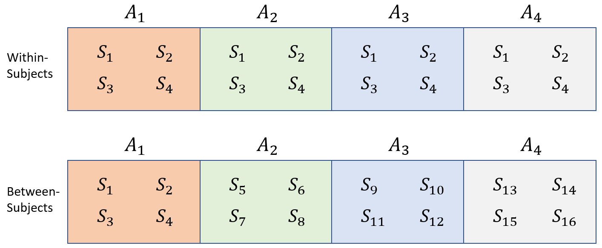
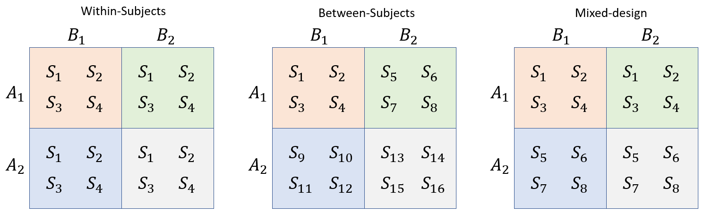
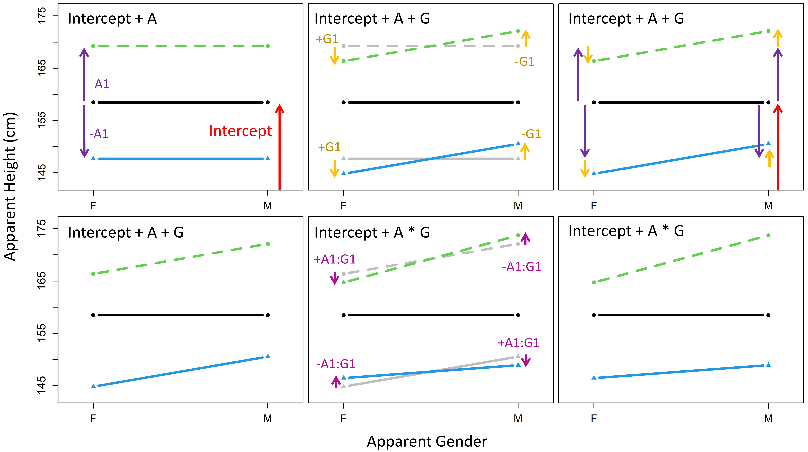

\newpage
```{r, include = FALSE}
knitr::opts_chunk$set(
  dpi = 300, dev = "jpeg", collapse=TRUE
)
```

# Comparing many groups, interactions, and posterior predictive checks 

We've been making our models more and more complicated, but we've still only fit models with extremely simple fixed effects structures. In the last two chapters we talked about comparing two groups. Although the comparison of two groups is very simple, it also comes up often. In addition, more complicated problems are often broken down into several two-group questions in the course of understanding a data set. However, most real-world experiments don't usually *begin* as two-group questions. In this chapter, we're going to talk about the comparison of observations across multiple groups. In terms of model building concepts, in this chapter we're going to discuss how to build models with multiple fixed effect predictors and how to allow these factors to *interact* in our models. 

## Comparing four (or any number of) groups

First, we're going to discuss models that compare observations across any number of groups (i.e., levels of a single factor). A model that can be used to compare multiple groups might have just one predictor factor, but that factor can have any number of levels. Although it's not very common to have a study design or model that *only* consists of a single multi-group comparison, the inclusion of multi-group comparisons is ubiquitous in many disciplines (including linguistics). Examples of predictors with multiple levels are language (e.g., participants' first languages), word category (e.g., part of speech, or usage frequency bins), and age groups. 

In figure \@ref(fig:F7-1) we see two ways that subjects (or listeners, or the levels of any grouping factor) can be arranged into groups. In the *within-subjects* version of this design, each subject is tested at each level of $A$. In the *between-subjects* version of the design, different subjects are tested at every level of $A$. Here we omit the more complicated design discussed in chapter 5, in which some subjects appear at all levels of $A$ and others don't. Such designs are definitely analyzable with `brms`, and sometimes they may be unavoidable. However, they are not included in figure \@ref(fig:F7-1) because there are a large number of possible configurations of this, and because the additional complexity of such designs can make them extremely challenging to use effectively, so we are typically better off not using such designs if at all possible. 

```{r F7-1, echo = FALSE, out.width = "80%", fig.cap = "Data from a single group of subjects (S) divided according to a single grouping factor A."}

################################################################################
### Figure 7.1
################################################################################


```

### Data and research questions 

Below we load the data for our experiment investigating apparent speaker height, in addition to the `brms` and `bmmb` packages. 

```{r}
library (brms)
library (bmmb)
options (contrasts = c('contr.sum','contr.sum'))
data (exp_data)
```

In figure \@ref(fig:F7-2) we see that the distribution of apparent height with respect to apparent speaker category is very similar to its distribution with respect to veridical speaker category. This is not terribly surprising since as we can see below, listeners identified speaker category in 75% of cases. In addition, errors were most common for boys and girls, speakers that are expected to be approximately the same size. 

```{r}
# overall average correct category identification
mean(exp_data$C == exp_data$C_v)

# average correct category identification by category
tapply(exp_data$C == exp_data$C_v, exp_data$C_v, mean)
```

In this chapter we're going to focus on the effect of *apparent* speaker category on apparent height. This is because we want to understand how the listener's assumptions about the speaker affect their height judgments, and listeners did not know the veridical speaker category. We're first going to treat the four groups as if they had no internal relationships between the groups (e.g., ignoring the fact that we might expect some degree of similarity in the relationships between between women and girls, on the one hand, and men and boys, on the other). In this case it may not be the best approach for this data since we know there are logical ways to subdivide boys, girls, men, and women. However, this is a good starting point since in many cases you will have levels of a factor with no logical internal divisions. 

```{r F7-2, fig.height = 3, fig.width=8, fig.cap = "Apparent height organized by apparent age (left) and veridical age (right) for boys (b), girls (g), men (m), and women (w).", echo = FALSE}

################################################################################
### Figure 7.2
################################################################################

par (mfrow = c(1,2), mar = c(4,4,1,1))
boxplot (height ~ C, data = exp_data, col = cols[2:5],ylim=c(100,200), 
         xlab = "Apparent Category", ylab = "Height (cm)")
boxplot (height ~ C_v, data = exp_data, col = cols[2:5],ylim=c(100,200),  
         xlab = "Veridical Category", ylab = "Height (cm)")
```

Even with only four different groups our potential research questions are substantially more complicated than in the two-group case. First, there are four groups now, meaning we could potentially make 6 2-group comparisons. Second, the groups differ along multiple dimensions, making it more difficult to make two-group comparisons that answer a single question. For example, the 'man' and 'girl' groups differ according to apparent adultness *and* apparent gender. In the presence of a difference between groups, this makes it difficult to isolate the contribution of each characteristic to the difference in apparent height. For now, we're going to keep things simple and just build a model that can tell us about our average group values.

To analyze data like this it should be in a data frame with one row for each observation. Then, one column should contain the dependent variable, the variable whose values and variation you're trying to predict. Another column should contain information about which group each observation belongs to for the fixed-effects predictor you will be considering. Finally, you need one or more columns indicating the sources of data in your experiment. The model in this section will use the following variables from our data frame: 

  * `L`: A number from 1-15 indicating which *listener* responded to the trial, being treated as a character. 
  * `C`: A letter representing the speaker *category* (`b`=boy, `g`=girl, `m`=man, `w`=woman) reported by the listener for each trial.
  * `height`: A number representing the *height* (in centimeters) reported for the speaker on each trial. 
  * `S`: A number from 1-139 indicating which *speaker* produced the trial stimulus. 
  
And we are going to ask the following basic question:

Q1) Does apparent speaker height vary systematically across apparent speaker categories?

[@@ SB - check update. Also, I went back over the earlier chapters to remove causal stuff like this]

### Description of our model

In the last two chapters we discussed the inclusion of a single factor with two levels in our models. Our model formula does not change in structure to include predictors with many levels. The formula to fit our model will be:

`height ~ C + (C|L) + (1|S)`

Where `C` is the apparent speaker category indicated by the listener for each trial, a factor with four levels (see above). Since we include `C` on the left-hand-side of the pipe of `L`, we know that we are estimating the category by listener interaction using adaptive partial pooling (see section X). At this point we have to make a decision regarding how we represent our models in more formal notation, and striking a balance between readability and models that are directly analogous to the output in R. 

Each level of the category predictor that we are estimating needs to be represented by a model parameter. Since we are using sum coding for all our factors (see section X), our model will estimate three of the four group effects, omitting the alphabetically last level (in this case woman). As a result, the formula above is analogous to:
 
`height ~ C1 + C2 + C3 + (C1 + C2 + C3|L) + (1|S)`

In section 4.X we noted that each parameter in our model needs to be associated with a predictor. If we call the predictors `x1`, `x2`, and `x3` our model formula could sort of be thought of like this:

`height ~ x1*C1 + x2*C2 + x3*C3 + (x1*C1 + x2*C2 + x3*C3|L) + (1|S)`

Of course this is no longer a real or working model formula, we are just trying to show how the $C$ might actually be included in our model. 

When a factor has only two levels, the effect for one level must equal the negative of the effect for the other level. As a result, group membership for observations can be represented using a single predictor equal to either -1 or 1 (for sum coding). When the observation is associated with one level of the factor the predictor is 1, and when the observation is associated with the other level the predictor is -1. In that way, a single predictor and coefficient can reflect two different levels of the factor. When there are more than two levels, each level that is being estimated is associated with a predictor variable, meaning that we expect $J-1$ estimated coefficients for a factor with $J levels in the absence of additional constraints. An example of this is seen below, where we generate three 'fake' predictors to represent four groups. Each row is represented by a single 1 save for the final row which is represented by -1 in *all other predictors* for that factor. 

```{r}
contr.sum(1:4)
```

Imagine the tiny matrix above represented the numerical predictors for our `C` parameters so that the first, second, and third columns represent $x1, x2$ and $x3$ respectively. Our tiny data matrix above suggests that the first observation (row) belongs to the first group (boy). This is because our data results in the $C1$ parameter being multiplied by one and $C2$ and $C3$ being zeroed out. The same logic suggests the second row is an observation from the second group and the third from the third. Since $C4$ is equal to $-(C1+C2+C3)$ (under sum coding), adding the negative of $C1$, $C2$, and $C3$ to the prediction is equivalent to adding the value of $C4$ even though it is not directly estimated. So, the fourth row of our tiny matrix represents an observation from the fourth group and encodes the effect for $C4$ even without directly estimating this value. As a result, even though our model only directly estimates three parameters for our $C$ predictor, we could think of our model as tacitly representing four parameters for $C$: $C1$, $C2$, $C3$, and $-(C1+C2+C3)$. 

Even though the inclusion of $C$ in our model requires the addition of three separate parameters, we're going to represent these with a single term like $C_{[C_{[i]}]}$ in our formal model descriptions. This term selects the value of $C$ for trial $i$ based on the value of the `C` (apparent category) predictor. This is consistent with the way we have been representing our listener and speaker-dependent intercepts (as discussed in section 4.X). However, a possible confusion arises from the fact that the subscript of the term references a predictor which has four levels (`C`), however, our $C$ parameter does not actually contain four separate parameters. In other words, in situations where `C = w` (i.e. $C_{[C_{[i]=4}]}$) this would seem to reference the fourth $C$ parameter, one that doesn't actually *exist* in our model. However, in such a situation the model can be thought of as using the negative sum of the other three parameters, effectively using the value of $C_{[C_{[i]=4}]}$ even without directly estimating the parameter. 

Since we are including adult male speakers in our data we should also reconsider our priors. Based on CDC (cite) we expect that average heights of 176, 162, 150 and 150 cm respectively for men, women, girls, and boys. These four groups have an average of 159 cm and a standard deviation of 12 cm. Based on this, and especially given that we are investigating *apparent* and not *veridical* height, the priors we used in the last chapter still seem appropriate. The formal description of our model is given below:

$$
\begin{equation}
\begin{split}
height_{[i]} \sim \mathrm{t}(\mu_{[i]},\sigma, \nu) \\ 
\mu_{[i]} = \mathrm{Intercept} + C_{[C_{[i]}]}  + L_{[L_{[i]}]} + C_{[C_{[i]}]} \colon L_{[L_{[i]}]} + S_{[S_{[i]}]} \\ \\ 
\mathrm{Priors:} \\ 
S_{[\bullet]} \sim N(0,\sigma_S) \\
\begin{bmatrix} L_{[\bullet]} \\ C_{[1]} \colon L_{[\bullet]} 
\\ C_{[2]} \colon L_{[\bullet]} \\ C_{[3]} \colon L_{[\bullet]} \end{bmatrix} \sim \mathrm{MVNormal} \left(\begin{bmatrix} 0 \\ 0 \\ 0 \\ 0 \\ \end{bmatrix}, \Sigma \right) \\ \\
\mathrm{Intercept} \sim N(156,12) \\
C_{[\bullet]} \sim N(0,12) \\
\sigma, \sigma_L, \sigma_{C \colon L}, \sigma_S \sim N(0,12) \\
\nu \sim gamma(2, 0.1) \\ 
R \sim \mathrm{LKJCorr} (2)
\end{split}
(\#eq:71)
\end{equation}
$$

Structurally, this model is extremely similar to the model described in \@ref(eq:6-7) last chapter with $C_{[C_{[i]}]}$ replacing $A_{[A_{[i]}]}$ and $C_{[C_{[i]}]} \colon L_{[L_{[i]}]}$ replacing $A \colon L_{[L_{[i]}]}$. Note that since we are estimating three parameters for `C`, our listener-dependent 'random effects' are actually coming from a four-dimensional normal distribution which considers the relationships between the intercepts and category effects for individual listeners. 

### Fitting and interpreting the model

We fit the four-group model below:

```{r, eval = FALSE}
# Fit the model yourself
# set the random seed and contrasts
set.seed (1); options (contrasts = c('contr.sum','contr.sum'))

# set the priors
priors = c(brms::set_prior("student_t(3,156, 12)", class = "Intercept"),
           brms::set_prior("student_t(3,0, 12)", class = "b"),
           brms::set_prior("student_t(3,0, 12)", class = "sd"),
           brms::set_prior("lkj_corr_cholesky (2)", class = "cor"), 
           brms::set_prior("gamma(2, 0.1)", class = "nu"),
           brms::set_prior("student_t(3,0, 12)", class = "sigma"))
model_four_groups =  
  brms::brm (height ~ C + (C|L) + (1|S), data = exp_data, chains = 4, cores = 4,
       warmup = 1000, iter = 5000, thin = 4, prior = priors, family = "student")
```
```{r, include = TRUE, eval = FALSE}

# or download it from the GitHub page:
model_four_groups = bmmb::get_model ('7_model_four_groups.RDS')
```
```{r, include = FALSE}
# saveRDS (model_four_groups, '../models/7_model_four_groups.RDS')
model_four_groups = readRDS ('../models/7_model_four_groups.RDS')
```

We'll focus on the fixed effects, seen below:

```{r}
brms::fixef(model_four_groups)
```

It's always a good idea to make sure your model coefficients make sense given your data. Doing things like this will help minimize mistakes and make sure that you really understand your model. We can see that the intercept corresponds to the average of the group means, and our `C` coefficients correspond reasonably, but don't exactly match, the centered group means. There are many possible reasons for this including the fact that the group means don't account for repeated measures, a lack of balance in the data, or for the way that outliers can unduly influence sample mean estimates. That being said, it is useful to see that our model coefficients seem to reflect the data and we should be concerned if these diverged wildly. 

```{r, collapse = TRUE}
# group means
means = tapply (exp_data$height, exp_data$C, mean)

# Intercept = mean of means
mean (means)

# Group effects = centered group means
means - mean (means)
```

Note that, as discussed above, we're missing the `C4` coefficient. We can use the `short_hypothesis` function to easily recover the final group coefficient by finding the negative sum of the coefficients that *were* estimated. An example of this is shown below. 

```{r, collapse = TRUE}
# parameters = centered means
all_groups = 
  bmmb::short_hypothesis (
    model_four_groups, 
    c("Intercept = 0", "C1 = 0", "C2 = 0", "C3 = 0", "-(C1+C2+C3) = 0"))
```

We can also use `short_hypothesis` to compare different combinations of our fixed effects. Using the code below we test for a difference in group means between the first and second groups (boys and girls), and between the third and four groups (men and women).  

```{r, collapse = TRUE}
# parameters = centered means
comparisons = bmmb::short_hypothesis (model_four_groups, 
                                      c("C1 = C2", "C3 = -(C1+C2+C3)"))
```

We can use `brmplot` from the `bmmb` package to easily make plots showing means and credible intervals for our fixed effects, including the recovered coefficient. We also plot the two comparisons we made using the `hypothesis` function above, presented in figure \@ref(fig:F7-3).

The distributions on the left tell us about probable values for our category parameters: Given our data and model structure, there is a 95% probability that the parameter value falls within this interval. Our category effects reflect the expected difference between our model intercept, the overall grand mean, and each category mean. So, the intervals on the left of figure \@ref(fig:F7-3) tell us that there is a 95% probability (given our data and model structure) that the actual difference between the grand mean and each group mean falls within that range. What do the distributions in the right plot in figure \@ref(fig:F7-2) tell us? They represent the posterior distribution of the difference between category means directly, without involving the intercept. 

Conceptually, finding the difference between the intercept and a group mean is no different than finding the difference between individual group means. Consider the example of providing directions with respect to your house. If the library is 5 miles west and the park is 3 miles west, you could refer to these as -5 and -3 miles from your house, west to east. However, you could also express the difference between one and the other directly as 2 (or -2). The left plot in figure \@ref(fig:F7-2) expresses all distances with respect to the intercept (your house) while the right plot expresses differences with respect to individual category means directly (the library and park). 

```{r F7-3, fig.height = 3, fig.width=8, fig.cap = "(left) Means and 95% credible intervals for boy (H1), girl (H2), man (H3), and woman (H4) effects for our four group model. (right) Means and 95% credible intervals for differences between boys and girls (H1) and men and women (H2).", echo = FALSE}

################################################################################
### Figure 7.3
################################################################################

par (mfrow = c(1,2), mar = c(4,4,1,1))

brmplot (all_groups, omit=1, col=cols[1:4],ylim=c(-16,19))
points (means - mean(means), pch=4,lwd=2, col=cols[1:4],cex=3)
brmplot (comparisons, col=cols[5:6])
```

## Investigating multiple factors simultaneously

Our model above had a single factor with four groups/levels. Another way to look at it is that the model predicted variation along a single **dimension**, that is a single piece of information that can be used to distinguish our groups. However, we can usually categorize people (or observations) along multiple dimensions simultaneously - there is more structure in the data than a single, simple dimension captures. So, a speaker may be an adult *and* female or adult *and* male, child *and* female or child *and* male, and not just adult or child, male or female. This is because adultness and gender are independent characteristics (dimensions) and the value of one does not determine the value of the other. In our height experiment we effectively asked listeners to make two binary classifications: Is the listener an adult or a child? Is the listener female or male? This means we can think of our four groups as varying along two dimensions, each represented by a different factor. However, although we know this our previous model didn't, it thinks we just have four groups that have no logical internal distinctions. 

To include multiple predictors in our model and inspect the effect of all combinations of factor levels on our dependent variable, we must *cross* our predictors. This means that we observe each level of one factor at every level of the other factor (and vice versa). For our data this means that we observe both male and female children, and male and female adults. Crossing factors results in $n_A \times n_B$ individual groups for two factors ($A$ and $B$) with $n_A$ and $n_B$ number of levels each. Since we have two factors with two levels each, crossing age and gender results in four unique groups: Boys (male child), girls (female child), men (male adult), and women (female adult). Designs where all the factors are crossed are sometimes called **factorial** or **orthogonal** designs. 
  
When you have orthogonal designs, that means that the effect of your 'dimensions' (i.e., factors) can be estimated separately. For example, if you want to know the difference in apparent height across levels of apparent gender, it helps to have observed both adults and children for each gender. A comparison of boys and women will conflate gender and age differences, thereby making it difficult to understand the independent effect of apparent gender. By balancing factors across each other, orthogonal designs allow us to *decompose* the variation in our data using different factors more effectively. This allows us to attribute the variation in our observations to the different factors in our design (we will return to this idea in chapter 11). 

Figure \@ref(fig:F7-4) presents a few ways that subjects be combined with two two-level factors, $A$ and $B$, whose combination can represent four groups. First, we can see that factors $A$ and $B$ are crossed with each other since there are subjects, and presumably observations, in each little **cell** (i.e. combination of factor levels). What would it look like for these factors to not be crossed? Well, one of the 'cells' (boxes) would be completely missing observations. If this were to happen, we would obviously lose the ability to make comparisons across groups involving the values in that cell. If your subjects factor is fully crossed with your fixed effects factors (in this case $A$ and $B$) then you have a fully *within-subjects* design. If you only observe certain subjects for specific combinations of fixed effects, you have a fully *between-subjects* design. 

Finally, we see a new possibility, a **mixed design**. In a mixed design, one or more factors are between-subjects, and the others are within-subjects. In the example below, $A$ is between-subjects but $B$ is within-subjects. An example of a mixed design would arise if, for example, we wanted to run our coffee and reading time experiment (discussed in section) on multiple first languages. Each subject could be tested at both coffee and decaf, making that factor within subjects, however, each subject would only be observed within a single first language group, making that factor between subjects. 

```{r F7-4, echo = FALSE, out.width = "100%", fig.cap = "Data from four groups of subjects (S) divided according to a two grouping factors A and B."}

################################################################################
### Figure 7.4
################################################################################


```

Our model contains two predictors with two levels each, leading to four groups. Height judgments for these four groups are presented in figure \@ref(fig:F7-5). These four boxes correspond to the four cells in figure \@ref(fig:F7-4). The middle plot in \@ref(fig:F7-5) compares height judgments across levels of gender (male vs. female). Since we have both adults and children within each gender group, each box in the plot is really the average of two of the boxes from the left plot in \@ref(fig:F7-5) (boxes 1 and 3 vs. 2 and 4). This is equivalent to finding the average of one row in \@ref(fig:F7-4), and comparing it to the average of the other row. 

Similarly, the right plot in \@ref(fig:F7-4) compares height judgments across levels of age (adult vs. child). Since we have both males and females within each gender group, each box in the plot is really the average of two of the boxes from the left plot in \@ref(fig:F7-5) (boxes 1 and 2 vs. 3 and 4). This is equivalent to finding the average of one column in \@ref(fig:F7-4), and comparing it to the average of the other column. In this way, our model including two fixed effect predictors can use four groups to answer two questions simultaneously: What is the effect of apparent age on apparent height? What is the effect of apparent gender on apparent height? 

```{r F7-5, echo=FALSE,fig.height = 3, fig.width = 8, fig.cap = "(left) Comparison of the four groups (middle) Comparison of productions based on whether the speaker is an adult (right) Comparison of all productions based on whether the speaker is male."}

################################################################################
### Figure 7.5
################################################################################

par (mfrow = c(1,3), mar = c(3,4,3,1))
boxplot (height ~ G+A, data=exp_data, main = "Overall", ylim = c(90,200),col=cols[c(5,4,3,2)],
         names  = c("w","m","g","b"),xlab="")
boxplot (height ~ G, data=exp_data, main="Gender", ylim =c(90,200), col=cols[7:8],
         names  = c("female","male"),xlab="")
boxplot (height ~ A, data=exp_data, main="Adultness", ylim = c(90,200), col=cols[1:2],
         names  = c("adult","child"),xlab="")
```


### Data and research questions

We are going to a use slightly different set of columns from our data this time, this time using `A` and `G` rather than `C`. The model in this section will use the following variables from our data frame: 

  * `L`: A number from 1-15 indicating which *listener* responded to the trial, being treated as a character. 
  * `height`: A number representing the *height* (in centimeters) reported for the speaker on each trial. 
  * `S`: A number from 1-139 indicating which *speaker* produced the trial stimulus. 
  * `G`: The *apparent gender* of the speaker indicated by the listener, `f` (female) or `m` (male). 
  * `A`: The *apparent age* of the speaker indicated by the listener, `a` (adult) or `c` (child). 
  

And we are going to split the question we posed above into two:

Q1) Does average apparent height differ across levels of apparent age?

Q1) Does average apparent height differ across levels of apparent gender?


### Description of the model

In our previous model, we acted like we just had four different groups with no internal structure. Of course, we know that our groups differ systematically from each other in meaningful ways. For example, we might have chosen to fit two separate models investigating age and gender like this:

`brm (height ~ A + (A|L) + (1|S)` 

`brm (height ~ G + (G|L) + (1|S)` 

For several reasons (some of which we'll see very soon), it's preferable to fit a single model with both predictors at once, rather than fitting separate models for each one. Our R model formula will now look like this, reflecting the influence of both predictors simultaneously:

`height ~ A + G + (A + G|L) + (1|S)`

This can be read like "apparent height is distributed according to effects for apparent adultness and gender, with random intercepts, age, and gender effects for each listener, and random intercepts for each speaker". You may have noticed that our model no longer includes the `C` predictor. This is because the `C` label is perfectly predictable on the basis of `A` and `G` (i.e., as a female child, a member of the `g` group must have values of `f` and `c` for their `G` and `A` predictors). Basically, we have *decomposed* the four categories into two components to help us understand the effect of each. For example, the fixed effect predictors in our model were previously: 

$$
\begin{equation}
\begin{split}
\mu_{[i]} = Intercept + (C_{[\mathrm{C}_{[i]}]})
\end{split}
(\#eq:72)
\end{equation}
$$

We can expand the term in parentheses as seen below. Since group can be exactly represented by combinations of gender and adult, our model sort of 'secretly' contained this more-complicated model inside of it. However, this information was not directly built into the model.

$$
\begin{equation}
\begin{split}
\mu_{[i]} = Intercept + (A_{[\mathrm{A}_{[i]}]} + G_{[\mathrm{G}_{[i]}]}) 
\end{split}
(\#eq:73)
\end{equation}
$$

The above can be thought of as a 'decomposition' of the variance in your model by breaking it up into parts and assigning them to different sources. We have actually been doing this from the start by making more and more complicated models. Recall that our very first approach (in chapter 3) to understanding variation in apparent height treated all variation as error, and so did not 'decompose' anything. In chapter 4 we added between-listener and speaker variation to the model, and in chapter 5 we added apparent age. Now we include apparent age and gender, listener specific effects and intercepts, and speaker specific intercepts. There is a fixed amount of variation in our dependent variable. Every tiny bit of variance that these added components explain takes away from the error variance, and potentially also from the other components that had previously been in the model. Our updated model description is provided in \@ref(eq:74). We omit the deterministic equation 'building' up $\Sigma$ from the correlation matrix ($R$) and the individual standard deviations (shown in \@ref(eq:6-7)) since this does not involve the user, and it makes the model description even bigger. 

$$
\begin{equation}
\begin{split}
height_{[i]} \sim \mathrm{t}(\mu_{[i]},\sigma, \nu) \\ 
\mu_{[i]} = \mathrm{Intercept} + A + G + L_{[L_{[i]}]} + A \colon L_{[L_{[i]}]} + G \colon L_{[L_{[i]}]} + S_{[S_{[i]}]} \\ \\ 
\mathrm{Priors:} \\ 
S_{[\bullet]} \sim N(0,\sigma_S) \\
\begin{bmatrix} L_{[\bullet]} \\ A \colon L_{[\bullet]} \\ G \colon L_{[\bullet]}  \end{bmatrix} \sim \mathrm{MVNormal} \left( \begin{bmatrix} 0 \\ 0 \\ 0 \\ \end{bmatrix}, \Sigma \right) \\ \\
\mathrm{Intercept} \sim N(156,12) \\
A, G \sim N(0,12) \\
\sigma_L, \sigma_{A \colon L}, \sigma_{G \colon L}, \sigma_S \sim N(0,12) \\
\sigma \sim N(0,12) \\
\nu \sim gamma(2, 0.1) \\ 
R \sim \mathrm{LKJCorr} (2)
\end{split}
(\#eq:74)
\end{equation}
$$

Our models have increasingly large numbers of priors, and many of these are the same. As a result, going forward we will place these on the same line when they have the same prior and represent the same sorts of parameters (in much the same way they are specified by `class` by the `set_prior` function). For example, the line $\sigma_L, \sigma_{A \colon L}, \sigma_{G \colon L}, \sigma_S  \sim N(0,12)$ specifies the prior probability of all standard deviation terms individually, but at the same time. In plain English (ignoring the priors) this says:

> "We expect apparent height to vary according to a t distribution with a trial-specific mean parameter. That mean varies based on the apparent age and gender of the speaker, listener dependent intercepts, age, and gender effects, and speaker dependent intercepts. Speaker random intercepts were drawn from a univariate normal distribution, and the listener random effects were drawn from a three-dimensional normal distribution." 

### Fitting and interpreting the model

Below we fit a model with the structure outlined above. We don't need to change our priors because our new predictors are all covered by the classes of priors we have specified so far, and we think the priors we have been using thus far are still a good fit for our data. 

```{r, eval = FALSE}
# Fit the model yourself
# set the random seed and contrasts
set.seed (1); options (contrasts = c('contr.sum','contr.sum'))

priors = c(brms::set_prior("student_t(3,156, 12)", class = "Intercept"),
           brms::set_prior("student_t(3,0, 12)", class = "b"),
           brms::set_prior("student_t(3,0, 12)", class = "sd"),
           brms::set_prior("lkj_corr_cholesky (2)", class = "cor"), 
           brms::set_prior("gamma(2, 0.1)", class = "nu"),
           brms::set_prior("student_t(3,0, 12)", class = "sigma"))
model_both =  
  brms::brm (height ~ A + G + (A + G|L) + (1|S), data = exp_data, chains = 4, cores = 4,
       warmup = 1000, iter = 5000, thin = 4, prior = priors, family = "student")
```
```{r, include = TRUE, eval = FALSE}
# Or download it from the GitHub page:
model_both = bmmb::get_model ('7_model_both.RDS')
```
```{r, include = FALSE}
# saveRDS (model_both, '../models/7_model_both.RDS')
model_both = readRDS ('../models/7_model_both.RDS')
```

We can inspect the model fixed effects:

```{r, collapse = TRUE}
# inspect the fixed effects
brms::fixef (model_both)
```

We now have two non-Intercept 'Population-Level' effects: `A1` and `G1`, representing the categories 'adult' and 'female' respectively. Remember that since we used sum coding and have only two levels, the effects for the groups that are not represented ('child', 'male') are just the opposite sign of the groups that are represented. 

Below, we calculate the mean apparent height of the four groups and find the grand mean of the four groups. We can see that this is very similar to our intercept. Next we find the average apparent height at the different levels of adultness, find the difference between these, and divide it by negative two (just to flip the sign to match our effects). We also do the same for the levels of age. We can see that these values are reasonably similar to the estimated `A1` and `G1` predictors, which represent the same information.  

```{r, collapse = TRUE}
# Intercept
mean (tapply (exp_data$height, exp_data$C, mean)) 
# Age effect
diff (tapply (exp_data$height, exp_data$A, mean) ) / -2
# Gender effect
diff (tapply (exp_data$height, exp_data$G, mean) ) / -2
```

We can recover the four individual group means by adding up individual fixed effect coefficients. This can sometimes be tedious and requires you to be careful and methodical, but isn't actually difficult. Remember that each of the four groups is uniquely identified by a combination of gender and adultness. This means that to recover the expected group means we need to add the right combination of coefficients to the intercept. For example, the first hypothesis we test below (`Intercept + -A1 + -G1 = 0`) takes the intercept and adds the effect for 'child' (`-A1`). We use `-A1` and not `A2` because our model does not contain a parameter called `A2`. This parameter is not estimated in our model because `-A1=A2`. So, if we want the value of `A2` we use `-A1`. Similarly, we add the effect for 'male' using `-G1`. Since we started with the overall mean apparent height (the intercept) and add the effects for a 'male' and a 'child', the hypothesis `Intercept + -A1 + -G1 = 0` estimates the group mean for 'boys'.

```{r here, collapse = TRUE}
means_pred = bmmb::short_hypothesis (model_both, 
                        c("Intercept + -A1 + -G1 = 0",  # boys
                          "Intercept + -A1 +  G1 = 0",  # girls 
                          "Intercept +  A1 + -G1 = 0",  # men
                          "Intercept +  A1 +  G1 = 0")) # women

means_pred
```

Below we compare our recreated group means with our average height judgment for each group. There is a reasonably close match, however there also appear to be some important mismatches. For example, we see that adult women and men differ in height by 9 cm in our data, while boys and girls by only 2 cm. So, it seems like in our data the difference between males and females is different for children and adults. However, according to our model men and women and boys and girls both differ from each other by about 4-5 cm each, a value in between the 9 and 1 cm differences between the groups in our data. This discrepancy suggests that our model is potentially missing important information about our data.

```{R }
tapply (exp_data$height, exp_data$C, mean)
```

## Using our models to predict

So far we've been working with very simple models and so we haven't worried very much about how well they *fit*, or represent our data. Our reconstruction of the group means above suggests our current model may have some issues, and that we should be concerned about its ability to accurately capture the patterns in the data. So far we've only been discussing modeling in one direction, going from data to abstract, reduced representations (i.e. regression models). However, it's also worth considering going in the other direction, from the abstraction representation back towards data. 

One way to consider how well our model represents our data is to consider what data would be *generated* by the relationships represented in our model. Using your model in this way is called **prediction**, and you can use prediction to evaluate the fit of your model. The reasoning is basically, if your model is a good representations of the data, the 'fake' data it generates should look very much like your real data. If the fake data it generates doesn't look like your real data, something about your model is slightly 'off'. The discussion of prediction presented here will involve dependent variables that do not require a link function (discussed in chapter 10). Some of the details discussed here, in particular those involving expected values, do not exactly apply to models that require a link function.

All our models so far have contained lines like those seen in \@ref(eq:75). These lines tell our models that: 1) We expect our data to be normally distributed given some mean and standard deviation, and 2) The mean for a given trial can be predicted using some combination of the independent variables. 

$$
\begin{equation}
\begin{split}
y_{[i]} \sim N (\mu_{[i]}, \sigma) \\
\mu_{[i]} = Intercept + A_{[\mathrm{A}_{[i]}]} + B_{[\mathrm{B}_{[i]}]} + C_{[\mathrm{C}_{[i]}]}
\end{split}
(\#eq:75)
\end{equation}
$$

The value of $\mu$ above is the expected value for a given trial. This is also sometimes called the **linear predictor**, or the **conditional expectation function** (in econometrics). Since the linear predictor is the value you expect for a trial, it's obvious that there should be a reasonable correspondence between the linear predictor and your dependent variable. If what your model tells you to expect is not like what you actually observe, then what good is the model? One shortcoming of the linear predictor is that this does not incorporate the random trial-to-trial error (i.e., $\sigma$) that you know is a part of your model. As a result, the linear predictor is constant for any single combination of dependent variables, and undersells the amount of variation that can be expected in a given data set. 

The **posterior predictive distribution** is the distribution of possible data given your parameter estimates and probability model. In other words, the posterior predictive distribution uses your linear predictor, but also includes the data-level noise implied by the structure of your model. For normally distributed data, our posterior predictive distribution is the distribution of generated values of $\tilde{y}$ given estimates of $\mu$ and $\sigma$ as in \@ref(eq:77).

$$
\begin{equation}
\begin{split}
\tilde{y}_{[i]} \sim N (\mu_{[i]}, \sigma) \\
\end{split}
(\#eq:77)
\end{equation}
$$

A *posterior predictive check* samples from the posterior predictive distribution with the intention of comparing these samples of $\tilde{y}$ to your original data $y$. Posterior prediction can be used to assess how well your model fits your data. If your model really 'gets' your data, the fake data it generates ($\tilde{y}$ ) will have similar characteristics to your real data ($y$). If the fake data your model generates looks substantially different from your real data, that suggests a fundamental misalignment between your model and your data. The generic functions `fitted` and `predict` will help you get you linear and posterior predictions from your `brm` model. 

```{r, cache = TRUE, collapse = TRUE}
# linear predictor
y_lin_pred = fitted (model_both)

# posterior prediction
y_post_pred = predict (model_both)
```

In both cases the functions return four-column data frames with as many rows as the number of observations in the data. These data frames contain columns representing the mean, standard deviation and the upper and lower 95% credible intervals for each one of our data points. The reason we get intervals for our posterior predictions is because our model has a different prediction for each set of posterior samples. This means that if we have 4000 samples we actually have 4000 slightly different sets of parameter estimates and so 4000 slightly different predictions. So, in addition to information about the average prediction for each data point, we get information about variation around these estimates.

Below we see the (summarized) data frame representing our linear predictors. You can also set `summary=FALSE` to get the individual (unsummarized) predictions. If you do this you get an individual predictions for every set of posterior samples for your parameters, for every data point. So, if you have 1500 data points and 4000 posterior samples, the unsummarized output of these functions would be a matrix with 4000 rows and 1500 columns.  

```{r, cache = TRUE, collapse = TRUE}
# linear predictions
head (y_lin_pred)
```

Below we see the data frame corresponding to our posterior predictions. Note that although the means of the linear and posterior predictions are very similar, the intervals around the posterior predictions are noticeably wider. This is because the posterior predictions incorporate the data-level error ($\sigma$) in their predictions. Another difference between the linear and posterior predictions is that the linear predictors are fixed for a given set of posterior samples. In contrast, every time you run the command `predict(model)` you will get slightly different results because these incorporate random error. 

```{r, cache = TRUE, collapse = TRUE}
# posterior predictions
head (y_post_pred)
```

There is a parameter for the `predict` function, `re_formula`, that determines which random effect terms are included in your prediction. By default this parameter is set to `NULL` meaning that your predictions will be made made using your complete model formula. For example for our last model this means our posterior predictions reflect this model formula:

`height ~ A + G + (A+G|S) + (1|L)`

We can instead set `re_formula=NA` to make predictions using only the fixed effects as seen below. 
```{r, cache = TRUE}
y_post_pred_no_re = predict (model_both, re_formula = NA)
```

This corresponds to the predictions made by this model:

`height ~ A + G`

We could also include a subset of random effects, for example including only the listener random intercepts as seen below: 

```{r, cache = TRUE}
y_post_pred_some_re = predict (model_both, re_formula = "~(1|L)")
```

`height ~ A + G + (1|L)`

Below we sample from the posterior distribution and keep individual, unsummarized samples. We do this for our full model and for a model that makes only fixed effects predictions. 

```{r, cache = TRUE}
y_hat = predict (model_both, summary = FALSE)
y_hat_no_re = predict (model_both, re_formula = NA, summary = FALSE)
```

In figure \@ref(fig:F7-6) we compare the distribution of our data to our posterior predictive distributions, without and with the inclusion of random effects. There are some differences in the 'widths' of the different boxes, but we will not discuss this for now. Instead, we would like to highlight differences in the relative positions of the boxes representing the four groups across the plots. Our data shows different average heights for men and women but no noticeable height difference between boys and girls. Despite this, both sets of our posterior predictions show a difference in height between boys and girls. This is particularly evident in or fixed effects predictions since the random effects can help represent many of the idiosyncrasies of any given data set. As we will discuss in the following section, the structure of our data suggests that there is an *interaction* between apparent gender and apparent age, meaning that we should include the interaction between these predictors in our model.

```{r F7-6, echo=FALSE,fig.height = 3, fig.width = 8, fig.cap = "(left) Boxplots showing apparent height according to apparent speaker category (boy, girl, man, woman) for our real data.  (middle) Posterior predictions made by `model_both` without random effects (RE). (right) Posterior predictions made by `model_both` with random effects (RE)."}

################################################################################
### Figure 7.6
################################################################################
par (mfrow = c(1,3), mar = c(2.5,4,3,1))
boxplot (exp_data$height ~ exp_data$C, ylim = c(100,205), col = cols[2:5],
         main = "Original data",xlab = "", ylab = "Apparent Height (cm)")
boxplot (y_hat_no_re[2,] ~ exp_data$C, ylim = c(100,205), col = cols[2:5],
         main = "Prediction: No RE",xlab = "", ylab="")
boxplot (y_hat[2,] ~ exp_data$C, ylim = c(100,205), col = cols[2:5],
         main = "Prediction: With RE",xlab = "", ylab="")
```

## Interactions and interaction plots

We can think of a single effect representing a difference between groups/conditions/levels as a slope. For example, in the left panel in figure \@ref(fig:F7-7) we plot mean apparent height for apparent females and males at arbitrary x-axis locations. The difference in the group means is 6 cm (females 157 cm, males 163 cm). We can use any arbitrary x axis distance to calculate slopes, as long as we are consistent. However, there are obvious practical advantages to choosing to calculate these slopes over the arbitrary 'distance' of 1. To do this, we can imagine that we plot the first level (female) at 0 and successive levels at sequential integer values along the x axis (i.e. 1, 2, 3, ...). When we do this, the line formed by joining the averages of these groups has a slope of 6 (i.e., it rises 6 cm from 0 to 1, from one group to another, for a slope of 5/1). 

```{r}
# main effect for apparent gender
tapply (exp_data$height, exp_data$G, mean)
```

The plot highlighting the effect of apparent gender on apparent height in figure \@ref(fig:F7-7) is a *main effects* plot. Main effects (discussed in chapter 6) are the effects of one predictor averaged across everything else. Saying 'averaged across everything else' basically means we are ignoring everything else in our model. A person looking only at the middle plot in figure \@ref(fig:F7-5) would have no idea our data also investigates the effect of apparent adultness. We have 'erased' the differences in apparent adultness from our data by averaging across all levels of that factor. Another way to think of main effects is that they are *marginal effects*, the overall, average, *unconditional* differences between the levels of the factor. So, if someone asks you "whats the average difference in apparent height between males and females?" you can respond "about 5 cm". However, as noted in the previous chapter, sometimes the answer is not so simple, and it starts more like: "well... it depends". Interactions represent situations like these, where the effect of one variable depends on, or is *conditional* on, the value of some other variable. 

To understand interactions we need to talk about **simple effects** or **simple main effects**, the effects of a factor at one specific level of another factor. Basically, main effects show you the overall effect for a factor and simple effects show you the effects of the factor *depending* on the value of other things. In considering simple effects, we split the single (main) effect into two simple (main) effects, presented in the second plot in figure \@ref(fig:F7-7). For example, below we calculate the effect for apparent gender independently for each level of apparent age. We see that the difference across levels of gender is about 9 cm for apparent adults (166 to 175), but only about 2 cm for apparent children (145 to 147). We can plot these simple effects independently at the same x axis positions, as shown in the second plot of figure \@ref(fig:F7-7). 
   
```{r}
# simple effect for apparent gender across apparent age
tapply (exp_data$height, exp_data[,c('A','G')], mean)
```

The second and fourth plots in figure \@ref(fig:F7-7) are sometimes called **interaction plots**. Knowing how to interpret interaction plots is extremely useful because they help you quickly understand the nature of any interactions in your data. Interaction plots show you the simple main effects of one predictor across the levels of the other. They do this by having one factor vary across the x-axis and using different lines for the levels of the other factor. For example in the second plot gender varies across the x axis and different lines are used for the levels of age, and in the fourth plot age varies across the x axis and different lines are used for gender. Note however that the same information is presented in the two interaction plots in figure \@ref(fig:F7-7), it is just presented differently in each case. In fact, we can see that the y-axis values of the four line endpoints is equal across the two plots. The slopes of the lines in the second plot correspond to the differences between line endpoints in the fourth plot; one is small and one is zero. The differences between the line endpoints in the second plot are the slopes of the fourth plot, both are large but one is larger. 

```{r F7-7, fig.height=3,fig.width=8,fig.cap="Plots showing different ways to consider our f0 data.", echo = FALSE}

################################################################################
### Figure 7.7
################################################################################

par (mfrow = c(1,4), mar = c(3,0.5,3,0.5), oma = c(0,4,0,0))
plot (0:1,tapply (exp_data$height,exp_data$G,mean), ylim = c(140,180),xaxt='n',
      lwd=10,type='b',pch=16,cex=3,main="Gender",xlim=c(-.2,1.2),
      ylab='',xlab='',col = bmmb::cols[1])
axis (at=0:1, labels = c('female','male'), side=1)
grid()
G = exp_data$G
A = exp_data$A
mtext ("Apparent Height (cm)", side = 2, outer = TRUE, line = 2.75, cex = 0.9)
bmmb::interactionplot (G, A, exp_data$height,lwd = 10, leg.y = 170, 
                  leg.x=1.8,type='b',pch=c(16,16),cex=3, ylim = c(140,180),lty=c(1,1),
                  main="Gender:Adult",ylab='', xlim = c(.8,2.2),legend =FALSE,yaxt="n",xlab="",
                  col = c(bmmb::cols[12],bmmb::cols[10]))
grid()

plot (0:1,tapply (exp_data$height,exp_data$A,mean), ylim=c(140,180),xaxt='n',lwd=10,
      type='b',pch=16,cex=3, main = "Adult",xlim=c(-.2,1.2),ylab='',xlab='',yaxt="n",
      col = bmmb::cols[8])
axis (at=0:1, labels = c('adult','child'),side=1)
grid()

bmmb::interactionplot (A, G, exp_data$height,lwd = 10, leg.y = 170, 
                  leg.x=1.8,type='b',pch=c(16,16),cex=3, ylim = c(140,180),lty=c(1,1),
                  main="Adult:Gender",ylab='', xlim = c(.8,2.2),legend=FALSE,yaxt="n",xlab="",
                  col = c(bmmb::cols[11],bmmb::cols[9]))
grid()
```

Imagine what would happen if we began with a main effect plot like the first plot in figure \@ref(fig:F7-7), and added/subtracted a single value to each end of the line segment. This single value could represent the main effect of some other factor, for example the main effect for apparent age. Since a single number would be added to both points on the line, the line representing the effect of apparent gender would *slide* up/down the y-axis, however, the line would not change its slope. We might imagine trying to slide the line in the first plot in figure \@ref(fig:F7-7) up and down the y axis to try to get it to match the simple effects presented in the second plot of the same figure. However, we will not be successful because these two lines do not share a slope. In order to make the lower and upper lines *not* be parallel, we need to add different values to each side of the blue line segment. In other words, we don't slide the lines up and down in a balanced manner but move one side up more than the other. 

The varying effect for apparent gender at different levels of apparent age indicates that these effects *interact* in our data. Interactions between our factors are detectable visually in the form of a lack of parallel lines in interaction plots (i.e. varying slopes in the simple effects). In the absence of an interaction, all lines in such a plot should be parallel, save for variation due to random error. We can see that the lines in the second and fourth plots in figure \@ref(fig:F7-7) are *not* parallel, suggesting an interaction between apparent age and gender in our data. In the absence of an interaction, we could just answer the question "whats the average difference between apparent height between males and females?" with a number like 6 cm. In the presence of an interaction we need to consider the *conditional effects* of each predictor at the levels of the other predictor (i.e., the simple effects). So, the most important thing to remember about interpreting main effects is:

  * If there are no interactions between factors, focus on main effects.
  
  * If there are interactions between factors, you must inspect the simple effects to understand the nature of the interaction. 

Let's now consider the main effect for perceived adultness presented in the third plot in figure \@ref(fig:F7-7)). We're going to rehash some of what we just said, but we are going to adopt the *other* perspective. We can calculate the difference in apparent age based on apparent adultness and see that there is a 24 cm decrease in average apparent height based on the perceived adultness of the speaker. 
  
```{r}
# main effect for apparent age
tapply (exp_data$height, exp_data$A, mean)
```

However, in the fourth plot in figure \@ref(fig:F7-7) we see that the simple effect for apparent adultness across levels of apparent gender are not parallel. This tells us there is an interaction between age and gender. We calculate the simple effects for apparent age at the different levels of apparent gender below:
  
```{r}
# simple effect for apparent age across apparent gender
tapply (exp_data$height, exp_data[,c('G','A')], mean)
```

And see a 21 cm in apparent height for apparent females and a 28 cm difference for apparent females. Note that the simple effects involve the same four values were present in these simple effects calculated above. The only difference is the row wise differences in the first are column wise differences in the second. For example, relative to the second plot in figure \@ref(fig:F7-7) we can say "the larger slope for adults reflects a stronger effect for apparent gender on apparent height". Relative to the fourth plot we can say "the larger difference between the line endpoints for adults compared to children reflects a stronger effect for apparent gender on apparent height for adults". 

So, we see that interactions represent conditional effects, situations when the effect of a variables varies across levels of another variable. The idea of conditional effects (interactions) *feels* complicated, but it is something we all understand intuitively. For example, how much progress will a person learning a second language make in a year? What if I told you that one group of speakers is 3 and the other is 65. You *know* that makes a difference, which is to say, that you *know* there is an interaction between the effect of time spent learning a language, and the age at which the learner begins. Anyone who understands these varying effects *understands* interactions, whether or not they know how to relate this concept to the mathematical formalisms used to implement these in regression models. 

## Investigating interactions with a model

In figure \@ref(fig:F7-6) we made posterior predictions of our data with and without the inclusion of the speaker random effects, and presented these as boxplots. We presented these same predictions as interaction plots in figure \@ref(fig:F7-8). We calculate these just as we did above save for the inclusion of our posterior predictions rather than our real data, as in:

```{r}
# simple effect for apparent age across apparent gender for posterior predictions
tapply (y_post_pred[,1], exp_data[,c('G','A')], mean)
```

We can see in figure \@ref(fig:F7-8) that the predictions made using only fixed effects (middle plot) are systematically wrong, and that the problem with our predictions is that our predicted lines are parallel, while those for our real data are not. As we've just discussed, in the absence of interactions, interaction plots contain only parallel lines. Since our model (`model_both`) does not include interaction terms it cannot represent interactions, and so is only capable of making predictions along parallel lines. This means our model is not capable of representing the pattern in our data using only fixed effects. However, we can see that when random effects are included, prediction is better. This is not surprising since the listener and speaker-specific intercept adjustments allow for deviations from the fixed effects predictions to still be captured by the model. However, if accurate prediction is only possible using random effects, that limits the generalizability of our model to new levels of the grouping variable, e.g. subject or listener. In other words, the absence of good fixed-effects prediction limits the generalizability of our model and may be a cause for concern. 

```{r F7-8, fig.height=3,fig.width=8,fig.cap="Interaction plots showing comparing our real data to posterior predictions, with and without RE (random effects). In each case the top line represents height judgments for apparent males.", echo = FALSE}

################################################################################
### Figure 7.8
################################################################################

par (mfrow = c(1,3), mar = c(3,0.5,3,0.5), oma = c(0,4,0,0))
bmmb::interactionplot (exp_data$A,exp_data$G, exp_data$height,lwd = 10, leg.y = 170, 
                  leg.x=1.8,type='b',pch=c(16,16),cex=3, ylim = c(140,180),lty=c(1,1),
                  main="Real Data",ylab='', xlim = c(.8,2.2),legend=FALSE,
                  xlab="", col = c(bmmb::cols[8],bmmb::cols[9]))
grid()

mtext ("Apparent Height (cm)", side = 2, outer = TRUE, line = 2.75, cex = 0.9)

bmmb::interactionplot (exp_data$A,exp_data$G, y_post_pred_no_re[,1],lwd = 10, leg.y = 170, 
                  leg.x=1.8,type='b',pch=c(16,16),cex=3, ylim = c(140,180),lty=c(1,1),
                  main="Post. Pred: No RE",ylab='', xlim = c(.8,2.2),legend =FALSE,yaxt="n",xlab="",
                  col = c(bmmb::cols[4],bmmb::cols[3]))
grid()

bmmb::interactionplot (exp_data$A,exp_data$G, y_post_pred[,1],lwd = 10, leg.y = 170, 
                  leg.x=1.8,type='b',pch=c(16,16),cex=3, ylim = c(140,180),lty=c(1,1),
                  main="Post. Pred: With RE",ylab='', xlim = c(.8,2.2),legend=FALSE,
                  yaxt="n",xlab="", col = c(bmmb::cols[15],bmmb::cols[14]))
grid()
```

Our model is a little universe we made up, and it only includes the information we included in it. This 'universe' only contains parallel lines because we only gave it that capability. So, the fact that our model generates parallel lines does not in any way 'prove' that the lines are parallel, because they were bound to be. In order to properly investigate whether the lines are parallel, the model must be built in a way that allows it to (at least potentially) represent the interactions in our data. 

Before fitting a model with an interaction term we want to remind you that you cannot estimate interactions between factors are not crossed: If you did not observe all combinations of factor levels, you are not in a position to talk about how effects vary for those combinations. So, it is extremely important to be sure to only include interactions in your model when these predictors are *crossed*, or your model may run into all sorts of problems. 

### Data and research questions

We're going to a use the very same variables from our data frame that we used in the previous model. These are: 

  * `L`: A number from 1-15 indicating which *listener* responded to the trial, being treated as a character. 
  * `height`: A number representing the *height* (in centimeters) reported for the speaker on each trial. 
  * `S`: A number from 1-139 indicating which *speaker* produced the trial stimulus. 
  * `G`: The *apparent gender* of the speaker indicated by the listener, `f` (female) or `m` (male). 
  * `A`: The *apparent age* of the speaker indicated by the listener, `a` (adult) or `c` (child). 

And we're going to add one more research question:

Q1) Does average apparent height differ across levels of apparent age?

Q2) Does average apparent height differ across levels of apparent gender?

Q3) Is there an interaction between the effects of apparent gender and age on apparent height? 

### Description of our model

The model presented above (`model_both`) requires only a slight tweak to include the interaction in our data. There are two ways to include interactions in R model formulas, either:

`height ~ A + G + A:G + (A + G + A:G|L) + (1|S)` 

Or:

`height ~ A * G + (A * G|L) + (1|S)` 

The first way includes an explicit interaction term, `A:G`. The syntax for these is `X:Z` for an interaction between effects `X` and `Z`, `W:X:Z` for a three-way interaction, and so on. The second way uses `*` between our two predictors. This tells R to include those predictors, and the interactions between them. This can be much faster than specifying all interactions, but you lose control over which ones you include. For example this formula:

`y ~ Z * X * W` 

Implies this one:

`y ~ Z + X + W + Z:X + Z:W + X:W + Z:X:W` 

But cannot represent this one (since it omits the `Z:W` interaction):
 
`y ~ Z + X + W + Z:X + X:W + Z:X:W`  

Our full model specification is presented in \@ref(eq:78), once again omitting the equation specifying $\Sigma$. The model now includes an *interaction* term ($A \colon G$) that can help explain variation that cannot be explained by the independent effects of adultness and gender. This interaction term helps us model the *conditional* effect of one predictor given the other. Our model also actually contains a three-way interaction as well ($A \colon G \colon L_{[L_{[i]}]}$), though it may not seem that way to us superficially. This is the 'random' effect of the interaction between $A$ and $G$ for each level of listener, `(A:G|L)` in our model. This is a three-way interaction because it represents the interaction between the two-way interaction of $A$ and $G$ with our listener factor: The listener dependent two-way interaction between $A$ and $G$. 

$$
\begin{equation}
\begin{split}
height_{[i]} \sim \mathrm{t} (\nu, \mu_{[i]},\sigma) \\ 
\mu_{[i]} = \mathrm{Intercept} + A_{[A_{[i]}]} + G_{[G_{[i]}]} + L_{[L_{[i]}]} + A \colon L_{[L_{[i]}]} + G \colon L_{[L_{[i]}]} + A \colon G \colon L_{[L_{[i]}]} + S_{[S_{[i]}]} \\ \\ 
\mathrm{Priors:} \\ 
S_{[\bullet]} \sim t(3,0,\sigma_S) \\
\begin{bmatrix} L_{[\bullet]} \\ A \colon L_{[\bullet]} \\ G \colon L_{[\bullet]} \\ A \colon G \colon L_{[\bullet]} \end{bmatrix} \sim \mathrm{MVNormal} \left( \begin{bmatrix} 0 \\ 0 \\ 0 \\ 0 \\ \end{bmatrix}, \Sigma \right) \\ \\
\\
\mathrm{Intercept} \sim t(3,156,12) \\
A, G, A \colon G \sim t(3,0,12) \\
\sigma_L, \sigma_{A \colon L}, \sigma_{G \colon L}, \sigma_{A \colon G \colon L}, \sigma_S \sim t(3,0,12) \\
\sigma \sim t(3,0,12) \\
\nu \sim gamma(2, 0.1) \\ 
R \sim \mathrm{LKJCorr} (2)
\end{split}
(\#eq:78)
\end{equation}
$$

Our updated plain English description (still ignoring much of the priors) now says:

> "We expect apparent height to vary according to a t distribution with a trial-specific mean parameter. That mean varies based on the apparent age and gender of speaker and the interaction between these predictors. The model includes listener dependent intercepts, age and gender effects, and their interaction, and listener dependent intercepts. Speaker random intercepts were drawn from a univariate normal distribution, and the listener random effects were drawn from a four-dimensional normal distribution." 

Before continuing, we want to address the fact that we've included the same structure in our 'fixed effects' as for our listener 'random effects'. We will do this for all the models we fit in this book whenever possible. There are a couple of reasons for this, and we will discuss these with respect to the 'random effect' of apparent age by listener (i.e. the $A \colon L$ interaction). Not including this predictor is equivalent to setting it to zero for all listeners (and setting $\sigma_{A \colon L}=0$), meaning we expect the effect for apparent age to be the same across all levels of listener. However, we saw in the previous chapter that this is not the case and that there is substantial variation in the effect for apparent age across listeners. So, omitting random effects relies on the assumption that the variation across listeners (or whatever variable defines the random effects) is to equal zero, which is an assumption that may not be well-founded a priori. 

Furthermore, in chapter 6 we fit models with and without random effects and saw that the model with random effects produced a substantially wider credible intervals for the apparent age 'fixed' effect, reflecting increased uncertainty in the parameter estimate. In that case, assuming listener-variation in the parameter was zero when it was not resulted in an overly precise estimate of the apparent age parameter. So, we see that omitting random effects means assuming they are equal to zero *and* can affect the amount of uncertainty we get in our resulting parameter estimates. 

The only way to know whether a listener-dependent parameter shows substantial variation or not is to include the possibility for listener-dependent variation in your model, at least initially. Of course, the inclusion of any 'random effect' in your model assumes that: 1) Your model is designed in a way that the 'random' effect can be estimated, and 2) You have enough data to estimate those parameters. These issues will be discussed further in chapter 11.   

### Fitting and interpreting the model

Below we fit the our model including an interaction term. Remember that the line `set_prior("student_t(3, 0, 12)", class = "b")` sets the prior for all non-intercept 'Population-Level' predictors (i.e. fixed effects). This includes all of our main effects predictors and our interaction terms. 

```{r, eval = FALSE}
# Fit the model yourself
# set the random seed and contrasts
set.seed (1); options (contrasts = c('contr.sum','contr.sum'))

priors = c(brms::set_prior("student_t(3,156, 12)", class = "Intercept"),
           brms::set_prior("student_t(3,0, 12)", class = "b"),
           brms::set_prior("student_t(3,0, 12)", class = "sd"),
           brms::set_prior("lkj_corr_cholesky (2)", class = "cor"), 
           brms::set_prior("gamma(2, 0.1)", class = "nu"),
           brms::set_prior("student_t(3,0, 12)", class = "sigma"))

model_interaction =  
  brms::brm (height ~ A + G + A:G + (A + G + A:G|L) + (1|S), data = exp_data, 
             chains = 4, cores = 4, warmup = 1000, iter = 5000, thin = 4, 
             prior = priors, family = "student")
```
```{r, include = TRUE, eval = FALSE}
# Or download it from the GitHub page:
model_interaction = bmmb::get_model ('7_model_interaction.RDS')
```
```{r, include = FALSE}
# saveRDS (model_interaction, '../models/7_model_interaction.RDS')
model_interaction = readRDS ('../models/7_model_interaction.RDS')
```

We are primarily interested in discussing interactions, but we want to spend a moment looking at the listener random effects in our model, since there are now several. 

```{r}
# inspect fixed effects
bmmb::short_summary (model_interaction)
```

We can see in the short model summary above that we've estimated four standard deviation terms for our listener-dependent predictors. These correspond to $\sigma_{L}$ (`sd(Intercept)`), $\sigma_{A \colon L}$ (`sd(A1)`), $\sigma_{G \colon L}$ (`sd(G1)`), and $\sigma_{A \colon G \colon L}$ (`sd(A1:G1)`). We've also estimated six correlation terms. Recall that our random effects are drawn from a multivariate normal distribution. We have four terms which means this four-dimensional distribution is associate with a 4x4 correlation matrix and 16 correlation terms. Of the correlations, four (on the main diagonal) equal one and can be ignored. This leaves 12 terms. Of these only half are unique because the correlation of $x$ and $y$ equals the correlation of $y$ and $x$. This is how we end up with six estimated correlations for our four listener-dependent predictors.

We can now focus on the fixed effects (`Population-Level Effects`), of which there are four: An intercept, two main effects terms and an interaction. The interaction term is just another element of your prediction equation intended to help explain variation that can't be predicted by the independent effects of the other predictors in the model. If there is no interaction in your data, then the value of the interaction terms will be close to zero and your model will look just as if you had not even included the interaction at all. A look at the model output above indicates that our interaction is much smaller than the age effect, but not much smaller than the gender effect. This suggests it has the potential to influence our conclusions about gender more than our conclusions about age.
  
Why is there only a single interaction? Basically for the same reason that we can only estimate a single effect for apparent age and gender (i.e., linear dependence, discussed in section X). The number of levels of a factor that you can estimate is generally one fewer than the number of levels in the factor. For interaction terms, the number of parameters you can estimate is equal to (number of levels of factor A - 1)x(number of levels of factor B - 1) for two factors. Since each of our factors have two levels, we can only estimate one parameter, $(2-1) \times (2-1)=1$. 
The `A1:G1` term can be read aloud as "the effect of `A1` given (conditional on) the level of `G1`". For individual factors, our models cannot estimate `A2` because `-A1 = A2`. For interactions between factors with two levels, the model cannot estimate `A2:G1` because `-A1:G1 = A2:G1`. For interactions between factors with two levels, every time you want to change `A1` or `G1` to `A2` or `G2` you flip the sign of the `A1:G1` term instead. As a result, going left to right and changing one level at a time we get `A1:G1 = -A2:G1 = A2:G2  = -A1:G2`, which is precisely why we can't estimate more than one interaction for this model. Why does this happen? Looking at how interaction plots are built up out of main effects and interactions may help illustrate the reason for this. 

Figure \@ref(fig:F7-9) presents an example of how our interaction plot can be built up from the components in our fixed effects above, and is very useful for understanding the geometry of main effects and interactions. In (a) we see that the intercept lifts up a line from 0 to the level of the overall mean apparent height of 158 cm. Then, the effect for `A1` (adult, +11 cm) and `-A1` (children, -11 cm) are added to this value, causing the separation between the lines indicating a 'main effect' for adultness. Notice that the lines are parallel with respect to each other, and also parallel to the x-axis. This is because we have not added an effect for gender, which will be indicated as a slope along the x axis. In (b) we see the addition of the gender effect: `G1` (female, -2.8 cm), and `-G1` (male, 2.8 cm). Notice that the effect is added to one end of each line segment and subtracted from the other end of the line segment. Panel (c) shows the addition of all of the effects shown in the top row, the result of a model that includes both main effects but the same non-zero slope for both lines (i.e. no interaction yet). In (e) we add the gender interaction `A1:G1`, which was -1.6 cm. 

```{r F7-9, echo = FALSE, out.width = "75%", fig.cap = "An interaction plot built up from its individual components. Need to add letters to plots."}

################################################################################
### Figure 7.9
###############################################################################


```

Notice that the interaction effect has different signs when added to the same line, and also for each end of each line segment. This means that the interaction terms *cancel out* at each end of the line segments across lines, but also for different endpoints of the same line. We can see that beginning with the parallel lines in (d), the interaction in (e) constitutes an equal 'pinch' of one end of the lines and a spreading of the other side of the lines. This equal pinch is necessary in order to maintain the same average slope across both lines (the gender main effect) and the same average spacing between both ends of the lines (the age main effect). This is effectively why we get only a single interaction term in a model with this fixed effects structure. 

Recovering the predicted group means using the model coefficients is straightforward, but can be tedious for larger models: We must now either add or subtract the value of the interaction term (`A1:G1`) from each group as determined by the combination of main effects. We can easily determine which to do for this model because the sign on the interaction term is the product of the signs on the relevant 'main effects' terms. So, two positive or negative main effects result in a positive interaction term, while mismatched positive and negative main effects result in a negative interaction. 

Below, we use our wrapper the `hypothesis` function provided in `brms`, `short_hypothesis`, to reconstruct expected group means given the model fixed effects. The fourth hypothesis we are testing below is the simplest to understand, so we will start there. This hypothesis asks whether the sum of the `Intercept`, `A1` (the effect for adultness), `G1` (the effect for femaleness), and `A1:G1` (the interaction of adult and female), is equal to zero. Because of the specific parameters we combined, this results in the comparison of the 'woman' mean height to zero. The first hypothesis we are testing below says `Intercept + -A1 + -G1 + A1:G1 = 0`. Since we have flipped the sign on `A1` and `G1`, these now correspond to the effects of 'child' and 'male' (i.e. boy). Since both `A1` and `G1` are negative, we flip the sign on the interaction term twice and it remains positive. Note that for all of our hypotheses below, the sign on the interaction terms always depends on the signs of the corresponding main effects terms. 

```{r, collapse = TRUE}
# intercept, boys, girls, men, women
means_pred_interaction = 
  bmmb::short_hypothesis (model_interaction, 
                          c("Intercept + -A1 + -G1 +  A1:G1 = 0",
                            "Intercept + -A1 +  G1 + -A1:G1 = 0",
                            "Intercept +  A1 + -G1 + -A1:G1 = 0",
                            "Intercept +  A1 +  G1 +  A1:G1 = 0"))

# actual data means
tapply (exp_data$height, exp_data$C, mean)

# predictions with no interaction term
means_pred[,1]

# predictions with interaction term
means_pred_interaction[,1]
```

By comparing our recovered group means to we can see that the inclusion of an interaction term allows our model to represent the differing effect for gender across levels of age (and age across levels of gender).

Below we print the estimates of the 'fixed' effects in the model so we can focus on those. If you fit a model like this and are having trouble interpreting it, we would encourage you to write the coefficient values down and try to recreate expected effects using pen and paper, focusing on the decomposition of values provided by the regression model. We've previously warned against averaging parameters first and combining them second, however, this approach can be useful for a quick investigation of our model parameters. An example of this process will be given below using rounded parameter estimates to make the discussion easier to follow.  

```{r, collapse = TRUE}
round (brms::fixef (model_interaction))
```

First, we will recover the simple effects for apparent age at the levels of apparent gender. The average apparent height across all groups is 158 cm. There is an age-based 11 cm deviation from the intercept, meaning the difference between apparent adults and children is 22 cm (11 * 2). This means that, overall, the averages for apparent adults and children are about 169 and 147 cm (158 ± 11). However, the `A1:G1` interaction is -2 cm. This means that when the speaker was female (`G1`), the affect for adultness decreased from 11 cm to 9 cm (11 - 2, `A1+A1:G1`), meaning the difference across women and girls was 18 cm (`2*9`). In contrast, when the speaker was a male (`-G1`), the affect for adultness increased from 11 cm to 13 cm (11+2, `A1-A1:G1`), meaning the difference between boys and men was about 26 cm. 

We could instead consider the simple effects for apparent gender given apparent age. There is a gender-based 3 cm deviation from the intercept, meaning the difference between apparent adults and children is -6 cm (-3 * 2). This means that, overall, the female and male averages are about 155 and 161 cm respectively (158 ± -3). However, the `A1:G1` interaction is -2 cm. This means that when the speaker was an adult (`A1`) the effect for gender increased in magnitude from -3 cm to -5 cm (-3 + -2, `G1+A1:G1`), resulting in a difference between groups of 10 cm. Finally, when the speaker was a child (`-A1`), the effect for gender decreased in magnitude from -3 cm to 1 cm (-3+2, `G1-A1:G1`), resulting in a difference in groups of 2 cm based on apparent gender. 
  
Below we carry out these same calculations outlined above using our hypothesis function, with slightly different results due to the lack of rounding. In each case, we take the main effect and add or subtract the interaction in order to estimate the simple effects.

```{r, collapse = TRUE}
# intercept, boys, girls, men, women
simple_effects = 
  bmmb::short_hypothesis (model_interaction, 
                          c("A1 + A1:G1 = 0",
                          "A1 - A1:G1 = 0",
                          "G1 + A1:G1 = 0",
                          "G1 - A1:G1 = 0"))

# predictions with interaction term
simple_effects
```

### Assessing model fit: Bayesian $R^2$

We can asses the fit for our model including interaction terms by making more posterior predictions with our new model. We will focus on the average predictions for each data point since our objective is to see to what extent the fixed effects can represent the patterns in the data. 

```{r, cache = TRUE, collapse = TRUE}
y_post_pred_int = predict (model_interaction)
y_post_pred_no_re_int = predict (model_interaction, re_formula = NA)
```

In figure \@ref(fig:F7-10) we compare our data, the predictions of our original model, and the predictions of our model that includes interactions (both models with and without random effects). Whereas the model with no interactions enforced parallelism on the simple effects, our new model is able to capture the interaction in our data by representing different effects for gender at different levels of age (and vice versa). Although both of our models are able to capture the pattern in the data when random effects are included, only one of these is able to do so with its fixed effect structure. 

```{r F7-10, fig.height=3,fig.width=8,fig.cap="Interaction plots comparing veridical apparent heights (red) to different posterior predictions (blue and red lines). Upper lines are apparent adults and lower lines are apparent children for apparent females (f) and males (m). Posterior predictions with no interaction come from `model_both` and predictions with interactions come from `model_interaction`. With and no RE (random effects) refer to whether the predictions were made using only fixed effects or fixed and random effects.", echo = FALSE}

###############################################################################
### Figure 7.10
###############################################################################

ps = aggregate (exp_data$height~ exp_data$G+ exp_data$A, FUN=mean)[,3]

par (mfrow = c(1,4), mar = c(2.5,0.2,2.5,0.2), oma = c(0,4,0,0))
#layout (mat = t(c(1,2,3,4)), widths = c(.28,.28,.28,.16))


interactionplot (exp_data$G, exp_data$A, y_post_pred_no_re[,1],col=3:4, lwd=10,
                 type = 'b', pch = c(16,16), cex = 2, ylim = c(140,180),xlab="",
                 main="No Interaction, no RE", legend = FALSE,lty=1, 
                 ylab = 'Apparent Height (cm)', xlim = c(.97,2.03),cex.main=1.1)
segments (1,ps[1],2,ps[2], col = coral,lty=1,lwd=4)
segments (1,ps[3],2,ps[4], col = coral,lty=1,lwd=4)
grid()
mtext ("Apparent Height (cm)", side = 2, outer = TRUE, line = 2.5, cex = 0.9)

interactionplot (exp_data$G, exp_data$A, y_post_pred[,1],col=3:4, lwd=10,lty=1,
                 type = 'b', pch = c(16,16), cex = 2, ylim = c(140,180),xlab="",
                 main="No Interaction, with RE", legend = FALSE,yaxt="n", 
                 ylab = '',   xlim = c(.97,2.03),cex.main=1.1)
segments (1,ps[1],2,ps[2], col = coral,lty=1,lwd=4)
segments (1,ps[3],2,ps[4], col = coral,lty=1,lwd=4)
grid()

interactionplot (exp_data$G, exp_data$A, y_post_pred_no_re_int[,1],col=3:4, lwd=10,
                 type = 'b', pch = c(16,16), cex = 2, ylim = c(140,180),xlab="",
                 main="Interaction, no RE", legend = FALSE,yaxt="n",lty=1, 
                 ylab = '',  xlim = c(.97,2.03),cex.main=1.1)
segments (1,ps[1],2,ps[2], col = coral,lty=1,lwd=4)
segments (1,ps[3],2,ps[4], col = coral,lty=1,lwd=4)
grid()

interactionplot (exp_data$G, exp_data$A, y_post_pred_int[,1],col=3:4, lwd=10,lty=1,
                 type = 'b', pch = c(16,16), cex = 2, ylim = c(140,180),xlab="",
                 main="Interaction, with RE", legend = FALSE, yaxt="n",
                 ylab = '', xlim = c(.97,2.03),cex.main=1.1)
segments (1,ps[1],2,ps[2], col = coral,lty=1,lwd=4)
segments (1,ps[3],2,ps[4], col = coral,lty=1,lwd=4)
grid()

```

We can compare the models with and without the intercept using leave one out cross-validation, discussed in section 6.X. 

```{r, cache = TRUE}
model_both = brms::add_criterion (model_both, criterion="loo")
model_interaction = brms::add_criterion (model_interaction, criterion="loo")
```

The comparison suggests a large difference between the models, but also substantial uncertainty regarding the difference. 

```{r, cache = TRUE}
brms::loo_compare (model_both, model_interaction)
```

To some extent the difference may appear to be smaller than it is because our random effects do a good job of explaining listener and speaker-dependent deviations from the expectations set out by the fixed effects. Explaining things with 'random' effects is less useful for understanding the general properties in your data. If we were to replicate this experiment with new speakers and listeners we would expect all the random effects to change. However, if the relations between apparent age and gender and apparent height expressed in our model are 'true', we would expect the 'fixed' effects in the replication to be about the same. For this reason it is extremely useful to consider fixed effects prediction in addition to the predictive power of a complete model including both fixed and random effects.

To quantify how well our models fit our data we can also use **Bayesian $R^2$**. There are potentially several ways to define $R^2$ in a Bayesian context. The account of Bayesian $R^2$ presented here is a summary of the proposal outlined in Gelman (cite). In addition, the discussion of $R^2$ to follow assumes that your model involves either Gaussian or t-distributed errors and a continuous dependent variable. 

$R^2$ is a measure of model fit that breaks down the total variance in your dependent variable into two parts: 1) The variance that your model can explain, and 2) the variance that your model *cannot* explain (the residual error). This is shown in \@ref(eq:79). 

$$
\begin{equation}
\sigma^2_{total} = \sigma^2_{explained} + \sigma^2_{error} 
(\#eq:79)
\end{equation}
$$

$R^2$ is the ratio of the explained variance to the total variance, as seen in \@ref(eq:710). Since the explained variance cannot be less than zero nor can it be greater than the total variance, values of $R^2$ range from zero to one. As a result, $R^2$ can be interpreted as the proportion of variance in the dependent variable that is explained by the model

$$
\begin{equation}
R^2 = \frac{ \sigma^2_{explained} }{ \sigma^2_{total} } = \frac{ \sigma^2_{explained} }{ \sigma^2_{explained} + \sigma^2_{error} }
(\#eq:710)
\end{equation}
$$

To make $R^2$ a *Bayesian* $R^2$, we need to incorporate the posterior distribution of parameter values into our estimation. This is done, in part, by calculating a value of $R^2$ for every individual set of posterior samples, as shown in \@ref(eq:711). For every posterior sample of parameter values $s$ (from $S$ total samples) we calculate: 1) The variance in the predicted values ($\hat{y}$) of the dependent variable for our $N$ data points ($V_{n=1}^N \; \hat{y}^s_n$), and 2) the variance of the residual error for our $N$ data points ($V_{n=1}^N \; \hat{e}^s_n$).

$$
\begin{equation}
R^2_s = \frac{V_{n=1}^N \; \hat{y}^s_n}{ V_{n=1}^N \; \hat{y}^s_n + V_{n=1}^N \; \hat{e}^s_n}
(\#eq:711)
\end{equation}
$$

The residual error is the difference between predicted ($\hat{y}$) and observed ($y$) values for each data point, shown in \@ref(eq:711).

$$
\begin{equation}
\hat{e}^s_n = \hat{y}^s_n - y_n
(\#eq:712)
\end{equation}
$$

This results in a *distribution* of $R^2$ values, unlike more 'traditional' estimates of $R^2$ that result in point estimates. The `brms` package includes a function called `bayes_R2` that helps you calculate Bayesian $R^2$ for `brm` models. However, we are going to use the `r2_bayes` function from the `bmmb` package instead because this function allows you to modify (or omit) the fixed effects included in the prediction. Below we calculate $R^2$ for the models we fit this chapter, including all random effects. 

```{r, cache = TRUE}
r2_both = r2_bayes(model_both)
r2_interaction = r2_bayes(model_interaction)
```

We can inspect the output and see that they have very similar values. This is not surprising given their similarities seen in figure \@ref(fig:F7-10). 

```{r}
r2_both

r2_interaction
```

Just as we can omit the random effects when we use `predict`, we can omit random effects from our calculations of $R^2$ by setting `re_formula = NA`.  

```{r, cache = TRUE}
r2_both_no_re = r2_bayes(model_both, re_formula = NA)
r2_interaction_no_re = r2_bayes(model_interaction, re_formula = NA)
```

Now a comparison reveals a more substantial difference in explanatory power between the models. 

```{r}
r2_both_no_re

r2_interaction_no_re
```

We would rather explain as much variation as possible using fixed as opposed to random effects. In addition, the interactions 'makes sense' given our domain knowledge. What we mean by the is that we know that the difference in veridical height between boys and girls 10-12 years old is inconsistent and may be about zero on average. So, we should not be too surprised if the effect for apparent gender on apparent height is smaller for children. However, there is a larger and more consistent difference in average veridical height between adult males and females. As a result, we do expect a meaningful effect for apparent gender on the apparent heights of adults. For these reasons, it would be surprising if there were *not* an interaction, and we prefer the model with the interaction despite the only middling support provided by our cross-validation model comparison. 

## Answering our research questions

The results (based on `model_interaction`) indicate that the average apparent height across all speaker groups (i.e. the intercept) was 158.5 (s.d. = 1.12, 95% C.I = [156.22, 160.62]). We also found an average effect of 10.8 cm for apparent speaker age (s.d. = 1.21, 95% C.I = [8.39, 13.15]) and -2.9 cm for apparent speaker gender (s.d. = 0.6, 95% C.I = [-4.07, -1.72]). In addition, we found an interaction between the effects of apparent age and apparent gender on apparent heights (mean = -1.64, s.d. = 0.41, 95% C.I = [-2.44, -0.81]). The result of these effects are that adults were perceived as taller than children and males were perceived as taller than females. However, the difference in apparent height due to gender was larger for adults than for children (and the effect for age was larger for males than for females). Figure \@ref(fig:F7-11) presents the model fixed effects other than the intercept (whose value is too large to plot in this range). 

The fixed effects all have 95% credible intervals that do not overlap with zero. Historically, this sort of result has been thought of as indicating that the effect is 'real', as in not equal to zero. In contrast, when the 95% (or some other) credible interval of an effect overlaps with zero, researchers will often conclude that this effect is not 'real', i.e. that it is exactly equal to zero. Gelman (cite) notes that effects are rarely exactly equal to zero, and that an inability to conclusively distinguish the value of an effect from zero is not the same thing as thinking that the most probable value of an effect is exactly zero. 

As a result, rather than focusing on whether any given interval crosses zero or not, Gelman (cite) recommends thinking about data analysis in terms of avoiding **type S** and **type M** errors. Type S (sign) errors occur when you think an effect is negative but its actually positive (or vice versa). A type M (magnitude) error is when you think an effect is large but its actually small (or vice versa). Focusing on type M and S errors rather than whether an interval crosses zero forces researchers to focus on the magnitude of the predictor, its practical importance, and the uncertainty involved in the estimate. That being said, if a parameter has a 'large' magnitude (in the context of the dependent variable) and a 'small' amount of uncertainty (relative to the magnitude), this predictor is likely to be important for understanding the dependent variable in the context of your model.  

```{r F7-11, fig.height=3,fig.width=8,fig.cap="(left) Fixed effect means and 95% credible intercals (minus the intercept) for `model_interaction`. (right) Means and 95% credible intercals for the pairwise differences between predicted means for different apparent speaker categories (boys, girls, men and women).", echo = FALSE}

###############################################################################
### Figure 7.11
##############################################################################

C = attributes(means_pred_interaction)$samples

pairwise_diffs = cbind(C[,1]-C[,2],C[,1]-C[,3],C[,1]-C[,4],
                       C[,2]-C[,3],C[,2]-C[,4],C[,3]-C[,4])

pairwise_diffs_summary = posterior_summary(pairwise_diffs)

par (mfrow = c(1,2), mar = c(4,4,1,1))
layout (mat = t(c(1,2)), widths= c(.4,.6))
brmplot (fixef(model_interaction)[-1,])
brmplot (pairwise_diffs_summary,labels = c("b-g","b-w","b-m","g-w","g-m","w-m"))
```

Figure \@ref(fig:F7-11) also presents the pairwise difference between all four apparent speaker groups (boys, girls, women, and men). The difference between pairs of group means is calculated by extracting the samples from the group means we reconstructed in section 7.X (`means_pred_interaction`). The result of this is a matrix with four columns, each representing a group effect, with individual posterior samples differing along rows. To find the difference between group means between each pairs of groups, we subtract the columns representing the group effects and inspect the distribution of the differences. This process is shown below and the distribution of pairwise group differences in presented in the right plot of figure \@ref(fig:F7-11).

```{r}
C = attributes(means_pred_interaction)$samples

pairwise_diffs = cbind("b-g"=C[,1]-C[,2],"b-w"=C[,1]-C[,3],"b-m"=C[,1]-C[,4],
                       "g-w"=C[,2]-C[,3],"g-m"=C[,2]-C[,4],"w-m"=C[,3]-C[,4])

pairwise_diffs_summary = posterior_summary(pairwise_diffs)
```

We can think about these differences in the context of our type M and S errors. All of the group differences (save for boy-girl) have values of about 10 cm (or more), which is a meaningful (and noticeable) difference in human height. In addition, the credible intervals around these differences are small relative to their magnitudes. From this we can conclude that these differences are unlikely to *really* be the opposite sign (a type S error). In addition, since the group differences (save for boy-girl) are mostly large and the credible intervals do not go anywhere near zero, these differences seem unlikely to actually be some small and insignificant value near zero (a type S error). 

But what about the boy-girl difference? The 95% credible interval of the difference between groups overlaps with zero. Does this mean there is no difference between the groups, i.e. $\mu_{boy}=\mu_{girl}$ and $\mu_{boy}-\mu_{girl}=0$? No, it just means that 0 is a value that is not so implausible for the difference between groups. The most likely difference is still 2.5. Consider a replication that found a group difference with a mean and 95% credible interval of 2.6 and [0.1, 5.1] respectively, rather than our values of 2.5 and [-0.8, 5.7]. Would such a difference constitute a successful replication or an opposite finding? If we focus on whether intervals cross zero to decide if they are 'real', we might decide that these experiments do not agree: We found no difference in our first experiment but the replication *did* find a difference. In contrast, if we focus on the sign and magnitude of the effects and the uncertainty around their estimates, the two experiments have extremely compatible results and constitute a successful replication. 

```{r, collapse = TRUE}
# summary of difference between boy and girl means
pairwise_diffs_summary[1,]

```

We might wonder, under what conditions can we accept that an effect or group difference *is* actually equal to zero. If the 95% (or some other high number) credible interval is relatively narrow and (more or less) centered around zero, the parameter value may very well be zero. It may also be a small number that has no practical effect on your dependent variable so that it doesn't really matter what it is even if its not exactly equal to $0.0000000...$. In either case, a coefficient with a narrow interval (roughly) centered at zero may not have an important role in the way you interpret your model in order to tell the 'story' of your data. However, it is extremely important to keep in mind that under a different parametrization of your model, or given a slightly different experimental design, it is possible that an equivalent  parameter may exhibit a clearly non-zero value. 

In our case, we will conclude that this difference in apparent height between boys and girls is likely to be 'real' and may reflect stereotypes that male speakers are generally taller than female speakers, whether or not this is actually true for speakers of this age. We might also suggest that if we want to know more about the precise value of this difference, future research might investigate this question with a larger number of speakers, listeners, or repetitions. By increasing the sample size, researchers would narrow the parameter likelihoods (discussed in section 2.X) thereby narrowing their posterior credible intervals (given new data that's roughly the same as the data we have). 

## 'Traditionalists' corner {#c7-frequentist}

In traditionalists corner, we're going to compare the output of `brms` to some more 'traditional' approaches. We're not going to talk about the traditional models in any detail, the focus of this section is simply to highlight the similarities between different approaches, and to point out where to find equivalent information in the different models. If you are already familiar with these approaches, these sections may be helpful. If not, some of the information provided here may not make much sense, although it may still be helpful. If you want to know more about the statistical methods being discussed here, please see section X for a list of suggested background reading in statistics.  

### Bayesian multilevel models vs. lmer

This is going to be a short one. The main shortcoming when it comes to using `lmer` to fit models including factors with many levels is that there is no easy way to compare group effects within the model. For example, we can fit the model below which encodes the difference between each group mean and the overall mean.

```{r, collapse = TRUE, cache = TRUE}
lmer_four_groups = lme4::lmer (height ~ C + (C|L) + (1|S), data = exp_data)
summary (lmer_four_groups)$coefficients
```

The results provided by `lmer` are very similar to those provided by `brm`:

```{r, collapse = TRUE}
brms::fixef (model_four_groups)
```

However, it is not as straightforward to test for differences between parameter values in our `lmer` models. The same could be said for the combination of parameters as is necessary for the investigation of group means (section 7.X) and simple effects (7.X). The investigation of differences and combinations of parameters is definitely possible in `lmer` for many cases, however this will involve either the re-parametrization of the model or the use of additional packages that allow for these sorts of questions to be asked. This can be contrasted with the ease and consistency of inspecting posterior distributions in our `brms` models.