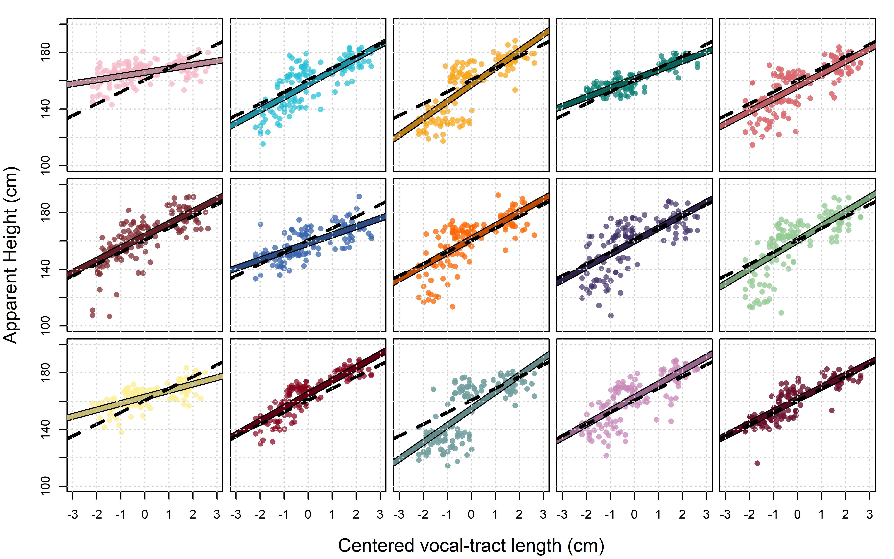
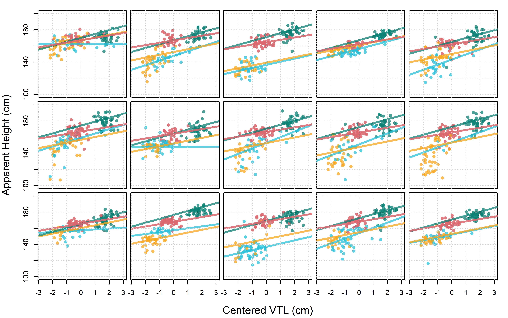

\newpage
```{r, include = FALSE}
knitr::opts_chunk$set(
  dpi = 600, dev = "jpeg", collapse=TRUE, options(digits=4)
)
rm (list=ls())
```

# Quantitative predictors and their interactions with factors

Santiago Barreda
https://orcid.org/0000-0002-1552-083X

Noah Silbert
https://orcid.org/0000-0003-2515-384X

Abstract:
This chapter introduces the use of quantitative predictors to model variation along lines, with a special focus on how the structure of our models affects the geometry of the lines implied by our model. First, a model with only a single slope and intercept is introduced. Then, models with a single quantitative predictor and a single categorical predictor, but no interaction, are introduced. These models predict variation along group-specific, but parallel, lines. After this, the chapter describes models with an interaction between a quantitative predictor and a categorical predictor, which can represent group-specific intercepts and slopes. After introducing some basic model structures, the chapter presents a random effects model including a single quantitative predictor but featuring 'random slopes' for each participant. Finally, the chapter presents a larger model where variation in both the intercepts and slopes of lines is predicted using two categorical predictors and their interaction, in addition to including listener-dependent ‘random’ effects for all predictors and their interaction.


So far, we've only discussed models that include categorical predictors (factors), predictors that split up our observations into a number of discrete groups or categories. In this chapter we're going to talk about the inclusion of quantitative predictors in our model that can explore the *linear relationship* (i.e. variation along lines) between a quantitative predictor and the dependent variable. We're going to focus on the interpretation of model coefficients and what these mean for the geometry of the lines we make. The geometric interpretations of the different model structures we will discuss in this chapter are not specifically *Bayesian*, and in fact, are shared by any approach to linear regression. 


## Chapter pre-cap

In this chapter, we introduce the use of quantitative predictors to model variation along lines, with a special focus on how the structure of our models affects the geometry of the lines implied by our model. First, a model with only a single slope and intercept is introduced. Then, models with a single quantitative predictor and a single categorical predictor, but no interaction, are introduced. These models predict variation along group-specific, but parallel, lines. After this, we describe models with an interaction between a quantitative predictor and a categorical predictor, which can represent group-specific intercepts and slopes. After introducing some basic model structures, we present a random effects model including a single quantitative predictor but featuring 'random slopes' for each participant. Finally, the chapter presents a larger model where variation in both the intercepts and slopes of lines is predicted using two categorical predictors and their interaction, in addition to including listener-dependent ‘random’ effects for all predictors and their interaction.


## Data and research questions 

To fit a model with a quantitative dependent variable and a single quantitative independent variable you need a data frame with at least two columns, both of which are quantitative variables (see section \@ref(c1-quantitative)), and which are being treated as numerical by R (rather than as strings or factors). We're going to try to predict apparent height given speaker vocal-tract length (VTL). We do this based on the hypothesis that listeners use information about the speaker's VTL to estimate their apparent height (see section \@ref(c13-perception-of-chars)). However, we want to note that what we are calling vocal-tract *length* is actually an acoustic measurement and might more accurately be referred to as spectral scaling. Please see section \@ref(c13-estimating-vtl) for more information about this. 

We're going to keep working with our experimental data originally described in section \@ref(c1-exp). Below we load our data and R packages, and center our continuous predictor (discussed below). 

```{r, warning=FALSE, message=FALSE}
library (brms)
library (bmmb)

data (exp_data)

options (contrasts = c('contr.sum','contr.sum'))

# make a copy of the VTL predictor and center it
exp_data$vtl_original = exp_data$vtl
exp_data$vtl = exp_data$vtl - mean(exp_data$vtl)
```

The relevant variables from our data frame are:

  * `height`: A number representing the *height* (in centimeters) reported for the speaker on each trial. 
  * `vtl`: An estimate of the speaker's *vocal-tract length* in centimeters. 

Initially, we will investigate the linear relationship between these two variables. As we progress through the chapter, we're also going to look for variation in this linear relationship based on the following predictors:

  * `C`: A letter representing the speaker *category* (`b`=boy, `g`=girl, `m`=man, `w`=woman) reported by the listener for each trial.
  * `G`: The *apparent gender* of the speaker indicated by the listener, `f` (female) or `m` (male). 
  * `A`: The *apparent age* of the speaker indicated by the listener, `a` (adult) or `c` (child). 

We're going to keep our research questions simple for now:

  (Q1) Is there a linear relationship between speaker VTL and apparent height?

  (Q2) Can we predict expected apparent height responses given only knowledge of speaker VTL?

## Modeling variation along lines

We're going to start by focusing on the geometry of different model structures. To do this, we're going to ignore the fact that we have repeated measures data and just fit a big complete pooling model like we did in chapter 3. This will likely lead to overly precise credible intervals for our parameters because it ignores all the correlations in our data and treats all our observations as independent when they are not. However, this approach will allow us to begin with simple models that are easier to discuss before fitting more realistic (and complex) models later in the chapter. 

The equation for a line is presented in \@ref(eq:9-1). This equation tells us that x and y enter into what's called a *linear relationship* (see section \@ref(c6-correlations)). The parameters of a line are called its **slope** ($a$) and **intercept** ($b$). Equation \@ref(eq:9-1) indicates that x can be transformed into y by multiplying it times the slope and then adding the intercept to the product. The slope parameter indicates how much of a change you expect in your y variable for a *1 unit change* in your x variable. This means that the magnitude of the slope depends on the unit of measurement of x. In general, dividing a predictor x by z will increase the slope of x by a factor of z. For example, imagine measuring the slope of a long hill with a constant rise. The amount of rise measured over one meter (e.g. 10 cm) will necessarily be 1/1000 as large as the rise measured over one kilometer (e.g., 10,000 cm). 

$$
\begin{equation}
\begin{split}
y = a + b \cdot x 
\end{split}
(\#eq:9-1)
\end{equation}
$$

We can update equation \@ref(eq:9-1) as in \@ref(eq:9-2), which changes the name of the parameters and replaces y with $\mu$. Equation \@ref(eq:9-2) now resembles a regression prediction equation where $\mu$ is the expected value of the dependent variable you are predicting using the independent variable x.

$$
\begin{equation}
\mu = \mathrm{Intercept} + \mathrm{slope} \cdot x 
(\#eq:9-2)
\end{equation}
$$

In figure \@ref(fig:F9-1) we plot the average apparent height for each token against the speaker's VTL. The scatter plot below shows the dependent variable (apparent height, the variable we are interested in understanding) along the y axis and the independent variable (the thing doing the explaining) along the x-axis. Our models so far have only featured categorical predictors, things like speaker category, gender, and age group. Despite this, and although it might be strange to think of it this way, our regression models have been making lines this whole time. However, these lines had slopes of 0 for any given quantitative variable that we might have shown along the x axis. This could have been speaker VTL or number of Star Wars movies seen, it doesn't matter because our model had no way to represent its effect. We see an example of such a relationship in the left plot in figure \@ref(fig:F9-1).

```{r F9-1, fig.height = 2.75, fig.width = 8, fig.cap = "(left) Average apparent height plotted against speaker vocal-tract length (VTL) for each token. The horizontal line is at the mean of the observations. (middle) The same points as generated by a normal distribution that slides along a horizontal line with a slope of 0 along the VTL axis. (right) The same points as generated by a normal distribution that slides along a line with a non-zero slope.", echo = FALSE}

################################################################################
### Figure 9.1
################################################################################

#library (bmmb)
#data (exp_data)
options (contrasts = c('contr.sum','contr.sum'))

tmp = as.numeric(exp_data$L) * 0 
count=1
for (i in c(15,2,1,14,3,13,4,12,5,6,11,10,8,7,9)){
  tmp[as.numeric(exp_data$L)==i] = count 
  count = count + 1
}
exp_data$L = tmp

Cs = c('b','g','m','w')[apply (table (exp_data$S, exp_data$C), 1, which.max)]
aggd = aggregate (height ~ vtl_original + S, data = exp_data, FUN=mean)
aggd$Cs = Cs

par (mfrow = c(1,3), mar = c(4,.5,.1,.5), oma = c(1,4,1,1))
plot (height ~ vtl_original, data = aggd, ylim = c(135,185),xlim = c(11,16.5), 
      pch=16,col=yellow, xlab="", ylab = "Height (cm)",cex.axis=1.2) 
abline (h = mean (aggd$height), col=deepgreen, lwd=4)
grid()
mtext (side=2,text="Apparent Height (cm)", cex = 1, outer = FALSE, line = 3)

#plot (height ~ vtl, data=aggd, ylim=c(135,185), xlim=c(11,16.5),ylab = "Height (cm)", 
#      pch=16,col=bmmb::cols[c(4,5,3,6)][factor(aggd$C)], xlab="Vocal-Tract Length (cm)") 
#abline (h = tapply (aggd$height, factor(aggd$C), mean), col=cols[c(4,5,3,6)], lwd=4)

#par (mfrow = c(1,2), mar = c(4,4,1,1))
plot (height ~ vtl_original, data = aggd, pch=16,col=yellow, cex=1, ylim = c(135,185),
      yaxt='n', xlab = "Vocal-tract Length (cm)",cex.lab=1.3,cex.axis=1.2 )
abline (h= mean (aggd$height), col=deepgreen, lwd=3)
grid()

for (i in seq(11.25,16,1.25)){
  mu =  mean (aggd$height)
  y = seq(mu-11*2,mu+11*2,.1)
  x = dnorm (y ,mu, 11)
  x = x / max (x) * 0.7
  points (i, mu, cex=2.5, pch=16,col=lavender)
  lines (i+x-.1,y, lwd=2, col=lavender)
}

plot (height ~ vtl_original, data = aggd, pch=16,col=yellow, cex=1, ylim = c(135,185),
      yaxt='n',xlab="",cex.axis=1.2 )
cffs = lm(height ~ vtl_original,data=aggd)$coefficients
abline (cffs,col=deepgreen,lwd=3); 
#abline (h=162, col=deepgreen, lwd=3)
grid()

for (i in seq(11.25,16,1.25)){
  mu = cffs[1] + i * cffs[2]
  y = seq(mu-4*2.5,mu+4*2.5,.1)
  x = dnorm (y ,mu, 4)
  x = x / max (x) * 0.7
  points (i, mu, cex=2.5, pch=16,col=lavender)
  lines (i+x-.1,y, lwd=2, col=lavender)
}
```

The left plot in figure \@ref(fig:F9-1) shows the line corresponding to an 'intercept only model' like the one we fit in chapter 3. This model features an intercept but no slope, which is equivalent to setting the intercept of our line to the mean of all the data points (160 cm) and setting the slope of the line along VTL to zero, as seen in \@ref(eq:9-3). 

$$
\begin{equation}
\begin{split}
\mathrm{Intercept} = 160, \; \mathrm{slope} = 0 \\ \\
\mu = \mathrm{Intercept} + \mathrm{slope} \cdot \mathrm{vtl} \\ 
\mu = \mathrm{Intercept} + 0 \cdot \mathrm{vtl} \\
\mu = \mathrm{Intercept} 
\end{split}
(\#eq:9-3)
\end{equation}
$$

When we model apparent height along lines parallel to the VTL dimension, this means our model thinks apparent height is *unrelated to* VTL. This is because VTL can vary from positive to negative infinity and we don't expect apparent height to change (since the line is flat). So, with intercept only models you can make horizontal lines, but you only ever change their intercepts. We can see a visual representation of an intercept only model (for normally-distributed data) in the middle plot in figure \@ref(fig:F9-1). This model can be thought of as a normal distribution that slides along a horizontal line, generating numbers as it slides. The mean of this data does not vary based on the value of speaker VTL and so is unrelated to it. The standard deviation of this distribution ($\sigma$) does not change as a function of perceived height so the 'width' of the data is stable across values of x. 

When you look at the middle plot in figure \@ref(fig:F9-1) you might wonder, how could the points all fall below the line for short vocal tracts and above the line for long vocal tracts? Our intercept-only model does not consider variation based on VTL, and so this strange distribution does not 'exist' in the model (i.e. all out data points are all in 'the same place' along the x axis as in a boxplot). When we do spread our observations out along the x axis as in figure \@ref(fig:F9-1), we see a clear organization in our observations based on the value of VTL. This suggests that there is a linear relationship between apparent height and speaker VTL, and that our model might benefit from including speaker VTL in its prediction. 

To predict apparent height as a function of speaker VTL we include a parameter representing the slope for VTL in our model, i.e., we don't constrain it to be zero as in \@ref(eq:9-3). When we tell our model to estimate both an intercept and a slope for VTL, it tries to find the 'best' line that passes through our points. This line might have a slope of zero, but it might not. In general the 'best' line is one that tends to minimize the square of the *residuals*, the difference between our observed data and our predicted values (see section \@ref(c3-errors-and-residuals)). In \@ref(eq:9-4) we see that our residual, $r$, for any given observation ($i$) is equal to the difference between the observation and the value of our line for the VTL associated with that observation. The reason parameters are generally preferred when they minimize residuals is because smaller residuals lead to larger likelihood values (see section \@ref(c2-chars-of-likelihoods-2)). Although our Bayesian multilevel models do not solely seek to maximize likelihoods, the likelihood often plays a dominant role in Bayesian model fitting.

$$
\begin{equation}
\begin{split}
r_{[i]} = (\mathrm{Intercept} + \mathrm{slope} \cdot \mathrm{vtl}_{[i]}) - height_{[i]}
(\#eq:9-4)
\end{split}
\end{equation}
$$

A model with non-zero slopes for some predictor can be thought of as a normal distribution sliding along a (possibly) *diagonal* line, generating numbers as it slides. In the right plot of figure \@ref(fig:F9-1) we can see what this might look like. In this model, the y axis value of the line at a given x axis location represents the expected value of our dependent variable ($\mu$). The actual values of observations then vary around this expected value in a normally distributed manner with a mean of 0 and a standard deviation equal to $\sigma$. This variation about expected values represents the residuals described in \@ref(eq:9-4). In other words, $r \sim \mathrm{N}(0,\sigma)$. When we model values of apparent height in this way, we're effectively saying that we think apparent height observations vary according to a normal distribution whose mean varies along straight lines *conditional* on the value of VTL.

Notice that the width (standard deviation) of our error distribution is much narrower when we allow expected apparent height to vary as a function of VTL. We've seen this sort of reduction in the error (i.e. $\sigma$) before. In the 'intercept only' model in the middle plot of figure \@ref(fig:F9-1), all variation is error, we don't know why any value ever varies from the mean. In contrast, in the right plot we see that quite a bit of variation in apparent height is (statistically) explainable based on the value of speaker VTL. In this model, it's only variation away from the line that's considered random error. 

### Description of the model

Just as we did in chapter 3, we're going to begin with 'incorrect' models that ignore the fact that we have repeated measures data. We can use the `brm` function to find estimates of the slope and intercept of a line through the points in our scatter plot as in figure \@ref(fig:F9-1). Our model formula will look like this:

`height ~ vtl`

Which tells `brms` to predict `height` based on the values of `vtl` and an intercept which is implicit in the model formula. If the variable on the right hand side of the `~` is numeric, `brm` will treat it as a quantitative predictor and assume a linear relationship between your dependent and independent variables. You should keep this behavior in mind because it may happen sometimes by accident. For example, if your group names are numeric and treated as such by R, including them in a model will result in them being treated as quantitative by default. To treat numeric predictors as categorical, you can convert them to a factor like this `factor(predictor)`.

The structure of a regression model with a single quantitative predictor (a **bivariate**, two-variable, regression) is shown in \@ref(eq:9-5). The first line says that we have a normally-distributed variable with an unknown mean that varies from trial to trial ($\mu_{[i]}$). The second line tells us that variation in the mean parameter is along a line with an intercept equal to $\mathrm{Intercept}$ and a slope of $VTL$ along the VTL axis. We name the slope term ($VTL$) after the quantitative predictor it is associated with ($\mathrm{vtl}$) because this is what R will do. However, we use capital letters to refer to the estimated parameter to help distinguish the two. Note that the predicted value ($\mu_{[i]}$) and the predictor variable ($\mathrm{vtl}_{[i]}$) receive subscripts, as these change from trial to trial. However, the slope and intercept *do not* receive subscripts because this model contains a single intercept and a single slope (i.e. it represents a single line) for *every* observation. 

$$
\begin{equation}
\begin{split}
height_{[i]} \sim \mathrm{N}(\mu_{[i]},\sigma) \\
\mu_{[i]} = \mathrm{Intercept} + VTL \cdot \mathrm{vtl}_{[i]}  \\ \\
\textrm{Priors:} \\
\mathrm{Intercept} \sim \mathrm{t}(3, 160, 12) \\
VTL \sim \mathrm{t}(3, 0, 12) \\
\sigma \sim \mathrm{t}(3, 0, 12)
\end{split}
(\#eq:9-5)
\end{equation}
$$

In plain English, our model says:

> We are modeling apparent height as coming from a normal distribution with unknown mean ($\mu$), and standard deviation ($\sigma$) parameters. The expected value for any given trial ($\mu$) is modeled as the sum of an intercept, and the product of the VTL predictor and the VTL slope. The 'fixed' effects were all given prior distributions appropriate for their expected range of values.

Here's two other ways to think about this model. First, we can think of it as making a line and then adding noise to it, as in \@ref(eq:9-6). From this perspective, each of our observed values is the sum of a line (representing systematic variation) plus a random draw from an error distribution ($\mathrm{N}(0,\sigma)$).

$$
\begin{equation}
height_{[i]} = \mathrm{Intercept} + VTL \cdot \mathrm{vtl_{[i]}} + \mathrm{N}(0,\sigma)
(\#eq:9-6)
\end{equation}
$$

Alternatively, we could place the formula for the line *inside* the normal distribution function, as in \@ref(eq:9-7). There's no particular reason to do this, but it's helpful to see it and realize that it will result in the same output as \@ref(eq:9-6). 

$$
\begin{equation}
height_{[i]} = \mathrm{N} (\mathrm{Intercept} + VTL \cdot \mathrm{vtl_{[i]}},\, \sigma)
(\#eq:9-7)
\end{equation}
$$

In \@ref(eq:9-6) we say: The data varies deterministically along a line, and normally distributed error with a mean of 0 and a standard deviation equal to $\sigma$ is added to this line. In \@ref(eq:9-7) we're saying: The data is generated according to a normal distribution whose mean varies along a line, and we expect the variation around this line to have a standard deviation equal to $\sigma$. 

### Centering quantitative predictors {#c9-centering}

There's one more thing to discuss before fitting our model, and that is the potential utility of *centering* quantitative predictors (first discussed in section \@ref(c2-standard-normal)). To center a quantitative predictor you subtract the sample mean from the observations in the sample. When we subtract the sample mean from our observations, each observation will now represent a deviation from 0 and the sum (and mean) of all the observations will equal zero (see section \@ref(c2-sample-mean)). For example, if we subtract 4 from the numbers 3, 4, and 5 we get -1, 0, and 1. 

When you carry out a regression with a single quantitative predictor, the intercept is the value of your dependent variable (y) when your predictor (x) is equal to 0 (i.e. when the line 'crosses' the y axis). Often, you won't specifically care about the value of the dependent variable when the value of your predictor is zero. For example, we don't care what the expected apparent height is when VTL equals zero because a VTL of zero centimeters does not exist in human beings. In the left plot of figure \@ref(fig:F9-2), we see the intercept of a line going through our observations with an 'uncentered' VTL. This tells us that a speaker with a VTL of 0 cm is expected to sound about 50 cm tall. This is not very useful information, and it is also obviously false (newborn babies are about 50 cm long and have non-zero VTLs). 

```{r F9-2, fig.height = 2.75, fig.width = 8, fig.cap = "(left) Individual apparent height judgments plotted against speaker vocal-tract length (VTL). (middle) The same points as in the left plot, but focused on the region containing the observations. (right) The same points as in the middle, but plotted according to centered VTL. In each plot, the horizontal line represents the mean of the points and the vertical line represents the y intercept.", echo = FALSE}

################################################################################
### Figure 9.2
################################################################################

#single_line_model_coefficients = fixef (single_line_model)[,1]

cffs = lm(height~vtl_original, data = exp_data)$coefficients

par (mfrow = c(1,3), mar = c(4,2,1,1), oma = c(2,3,0,0))

plot (height ~ vtl_original, data = exp_data, pch=16,col=4,xlim = c(-3,20),
      ylim=c(40,200), xlab="VTL (cm)",cex.lab=1.3,cex.axis=1.2);
abline (cffs,col=2,lwd=3); 
abline (h=mean(exp_data$height), v=0, lty=3)
mtext (side=2, text="Apparent Height (cm)", line = 3)

cffs = lm(height~vtl_original, data = exp_data)$coefficients
plot (height ~ vtl_original, data = exp_data, pch=16,col=4,xlim = c(10,17),
      ylim=c(100,200), xlab="VTL (cm)",cex.lab=1.3,cex.axis=1.2);
abline (cffs,col=2,lwd=3); 
abline (h=mean(exp_data$height), v=0, lty=3)

cffs = lm(height~vtl, data = exp_data)$coefficients
exp_data$vtl_c = exp_data$vtl - mean(exp_data$vtl)
cffs = lm(height~vtl_c, data = exp_data)$coefficients
plot (height ~ vtl_c, data = exp_data, pch=16,col=4,xlim = c(-3.5,3.5),
      ylim=c(100,200), xlab="Centered VTL (cm)",cex.lab=1.3,cex.axis=1.2);
abline (cffs,col=2,lwd=3); 
abline (h=mean(exp_data$height), v=0, lty=3)
```

In the right plot in figure \@ref(fig:F9-2) we see the result of centering VTL. Since the intercept of a line is the value of the dependent variable (y) when the predictor (x) is equal to zero, centering our predictor makes the intercept equal to the value of y when x is at its mean value. As a result, centering our quantitative predictors often makes the value of the intercept more interpretable. For example, our mean VTL value is 13.47 meaning that after centering this value is at 0. As a result, we know that the intercept of the line in the right plot in figure \@ref(fig:F9-2) corresponds to the expected apparent height for a VTL of 13.4 cm, an actual VTL value that we might be interested in (as opposed to a VTL of 0 cm).

Centering predictor variables affects the intercept of the model but does not affect the slope or any other aspect of the model. For example, in the middle and right plots in figure \@ref(fig:F9-2) we see that centering has changed the x-axis and moved our intercept to the mean VTL, but has not otherwise affected the plot. Thus, centering is basically like choosing the 'coding' (e.g., sum coding vs. treatment coding) for lines: It affects how the information is represented in the model but not the information itself. As a result, centering can be tremendously useful in yielding more interpretable intercept estimates. It can also greatly facilitate setting priors on the model intercept. For example, when the predictor is centered we just need to think of a reasonable value for our dependent variable when the predictor is at its mean, which is often a meaningful and common value. This is often easier to do than to imagine the expected value of the dependent variable when the predictor is equal to zero. 

Based on this, we will be centering our quantitative predictors simply because zero is not a useful or meaningful value for them, and so centering makes the intercepts more easily interpretable for our data. In your own work, the decision whether to center or not should be based on the information you hope to get out of your model (e.g. is 0 meaningful for your predictors?), just like the decision regarding which coding system to use for nominal variables.

### Fitting an interpreting the model

We can use the `brm` function to find the intercept and slope of the 'best' line through the points in our scatter plot in figure \@ref(fig:F9-2).   

```{r, eval = FALSE}
# Fit the model yourself
model_single_line =
  brm (height ~ vtl, data = exp_data, chains=1, cores=1,  
       warmup=1000, iter = 6000,
       prior = c(set_prior("student_t(3, 160, 12)", class = "Intercept"),
                 set_prior("student_t(3, 0, 12)", class = "b"),
                 set_prior("student_t(3, 0, 12)", class = "sigma")))
```
```{r, include = TRUE, eval = FALSE}
# Or download it from the GitHub page:
model_single_line = bmmb::get_model ('9_model_single_line.RDS')
```
```{r, include = FALSE}
# saveRDS (model_single_line, '../models/9_model_single_line.RDS')
model_single_line = readRDS ('../models/9_model_single_line.RDS')
```

The model print statement should be mostly familiar by now. Our model contains only population-level ('fixed') effects: an `Intercept`, indicating the intercept of our line, and `vtl` indicating the slope of the line relating VTL and apparent height. In addition, we get an estimate of the residual error (`sigma`, $\sigma$) around our line.  

```{r, collapse = TRUE}
bmmb::short_summary (model_single_line)
```    

We can see that the line predicting apparent height as a function of speaker VTL has an intercept of 160 cm and a slope for the `vtl` predictor of 8.6. Let's discuss the intercept first. Recall that for a bivariate regression (like ours) the intercept is the value of the dependent variable when the independent variable is equal to zero. Since we're using a centered predictor, when the mean of our `vtl` predictor is equal to zero, it is *really* (secretly) equal to its *true* mean of 13.4 cm (`mean(exp_data$vtl_original)`). This means that when a speaker's VTL equals 13.4 cm, we expect apparent height to equal 160.1 cm. The model *thinks* the mean of `vtl` is 0, but we *know* it is 13.4 cm, and the centering of the predictor does not affect our ability to interpret it as such. 

The slope of the `vtl` predictor is 8.6, meaning that for every 1 cm increase in vocal-tract length we expect an *increase* of 8.6 cm in apparent height. The slope is a *weight* that allows the line to accurately fit the points. In the absence of a slope, regression models would only work if there was a 1 to 1 relationship between the x and y variables. This would mean that for every 1 cm change in VTL we would need to see a 1 cm change in apparent height. What are the odds that the things we measure will be in a 1 to 1 relationship with all of our predictors? Very small. Instead, the slope coefficient in regression models allows a single unit change in the predictor to be associated with different units of change in the variable you're trying to understand. 

Figure \@ref(fig:F9-3) shows our observations compared to the line estimated using our model ($height = \mathrm{Intercept} + VTL \cdot \mathrm{vtl} = 160.1 + 8.6 \cdot \mathrm{vtl}$). What does this line mean? It means that *if* mean apparent height is linearly related to speaker VTL *and* the data is normally distributed around this mean with a fixed error ($\sigma$), *and* the rest of the details of our model are also true, *then* our best guess for the line relating centered VTL to apparent height has an intercept of 160.1 cm and a slope of 8.6 cm change in apparent height per 1 cm change in VTL. The previous sentence contained a lot of *ifs* and *ands*. Since we know that our assumptions are probably only approximately true, this means that we should treat our model parameters as (at best) an approximation of the underlying relationships we're trying to understand. 
  
```{r F9-3, fig.height = 2.75, fig.width = 8, fig.cap = "(left) Apparent speaker height plotted against speaker VTL for each data point. The line represents the linear relationship between apparent height and VTL for all points. Point colors represent speaker classifications. (middle) The same points as in the left plot. The horizontal lines represent category-dependent lines all constrained to have a slope of zero. The blue line represents the overall intercept. (right) The same points as in the left plot. The lines represent category-dependent lines with shared (but non-zero) slopes. The blue line represents the overall line.", echo = FALSE}

################################################################################
### Figure 9.3
################################################################################

#single_line_model_coefficients = fixef (single_line_model)[,1]

cffs_one = lm(height~vtl, data = exp_data)$coefficients
cols_use = bmmb::cols[as.numeric(factor(exp_data$C))+1]

par (mfrow = c(1,3), mar = c(1,.1,1,.5), oma = c(3,4,0,0))

exp_data$vtl = exp_data$vtl - mean(exp_data$vtl)

plot (height ~ vtl, data = exp_data, pch=16,col=cols_use,xlim = c(-2.5,3),
      ylim=c(105,195), xlab="Centered VTL (cm)",cex.lab=1.3,cex.axis=1.2);
grid()
abline (cffs_one[1],cffs_one[2],col=4,lwd=3); 
mtext (side = 2, 'Apparent Height (cm)', line = 3)
mtext (side = 1, 'Centered VTL (cm)', outer = TRUE, line = 2)

legend (1,140,legend=c("boy","girl","man","woman"),col=bmmb::cols[2:5],pch=16,bty='n',
        cex=1.3,pt.cex=1.5)

cffs = lm(height~C, data = exp_data)$coefficients
cffs = c(cffs, -sum(cffs[2:4]))

plot (height ~ vtl, data = exp_data, pch=16,col=cols_use,xlim = c(-2.5,3),
      ylim=c(105,195), xlab="Centered VTL (cm)",cex.lab=1.3,yaxt='n',cex.axis=1.2);
grid()
abline (cffs[1],0,col=4,lwd=3); 
abline (cffs[1]+cffs[2],0,col=bmmb::cols[2],lwd=4); 
abline (cffs[1]+cffs[3],0,col=bmmb::cols[3],lwd=4); 
abline (cffs[1]+cffs[4],0,col=bmmb::cols[4],lwd=4); 
abline (cffs[1]+cffs[5],0,col=bmmb::cols[5],lwd=4); 


cffs = lm(height~vtl+C, data = exp_data)$coefficients
cffs = c(cffs, -sum(cffs[3:5]))

plot (height ~ vtl, data = exp_data, pch=16,col=cols_use,xlim = c(-2.5,3),
      ylim=c(105,195), xlab="Centered VTL (cm)",cex.lab=1.3,yaxt='n',cex.axis=1.2);
grid()
abline (cffs[1],cffs[2],col=4,lwd=3,lty=1); 
abline (cffs[1]+cffs[3],cffs[2],col=bmmb::cols[2],lwd=4); 
abline (cffs[1]+cffs[4],cffs[2],col=bmmb::cols[3],lwd=4); 
abline (cffs[1]+cffs[5],cffs[2],col=bmmb::cols[4],lwd=4); 
abline (cffs[1]+cffs[6],cffs[2],col=bmmb::cols[5],lwd=4); 

```

We can see that the residuals (as reflected by variation about our line in figure \@ref(fig:F9-3)) are much larger and more negative for smaller (negative) values of VTL than they are for larger values. Since our model has a single, fixed $\sigma$ for all values of VTL (10.8), our model should have an error with a constant amount of variation around the predicted values. Since our model can't account for the sort of variation we see in our data, maybe our model could be better. One possible explanation for this lack of fit is that rather than varying around one single line, our data might be thought of as varying around *four* separate lines, one for each group, as seen in the middle and right plots of figure \@ref(fig:F9-3). We will consider this possibility in the following section.

## Models with group-dependent intercepts, but shared slopes

In chapter 7 we fit a model (`model_four_groups`) that predicted apparent height based on apparent speaker category. This model can be thought of as having one line for each speaker category. These lines differ in their intercepts, however, since this model did not include VTL as a predictor each line effectively had a slope of 0 for VTL (as in the middle plot in figure \@ref(fig:F9-3),). In this section we're going to consider a model that allows for differing intercepts between groups, but constrains these to have the same slope, as in the right plot in figure \@ref(fig:F9-3).  

We allow for category-dependent intercepts for our lines by including a nominal predictor specifying apparent speaker category (`C`) in our model formula, in addition to `vtl`:

`height ~ C + vtl`

The formula above says: "model apparent height as a function of VTL, allowing for group-specific variation in the intercept". The `C` and `vtl` terms in our formula represent *main effects*, overall, marginal effects. Our model does *not* include the interaction between `C` and `vtl`. Thus, our model can tell us about the overall slope for VTL but can't tell us if the VTL slope varies conditionally across levels of `C`. 

### Description of the model

The formula above corresponds to the model presented in \@ref(eq:9-8). The prediction equation is just like that of our previous model save for the addition of the $C_{[\mathsf{C_{[i]}}]}$ term. It is also very similar to the fixed effects structure of the four group model we fit in chapter 7, save for the addition of the $VTL \cdot \mathrm{vtl}_{[i]}$ term. 

$$
\begin{equation}
\begin{split}
height_{[i]} \sim \mathrm{N}(\mu_{[i]},\sigma) \\
\mu_{[i]} = \mathrm{Intercept} + C_{[\mathsf{C}_{[i]}]} + VTL \cdot \mathrm{vtl}_{[i]}  \\ \\
\textrm{Priors:} \\
\mathrm{Intercept} \sim \mathrm{t}(3, 160, 12) \\
VTL \sim \mathrm{t}(3, 0, 12) \\
C_{[\bullet]} \sim \mathrm{t}(3,0,12) \\
\sigma \sim \mathrm{t}(3, 0, 12) 
\end{split}
(\#eq:9-8)
\end{equation}
$$

In our model, the $C$ coefficients do not get multiplied by the `vtl` dependent variable in our prediction equation. As a result, the slope of our line along VTL is *entirely* determined by the $VTL$ coefficient. We can present an alternate, but equivalent, parametrization of this model that better conveys the organization of parameters into those affecting the slope and those affecting the intercepts of our prediction lines. The model in \@ref(eq:9-9) specifies a line in terms of trial-specific $a$ and $b$ parameters, where $a$ and $b$ are linear combinations of estimated parameters in the model.

$$
\begin{equation}
\begin{split}
height_{[i]} \sim \mathrm{N}(\mu_{[i]},\sigma) \\
\mu_{[i]} = a_{[i]} + b_{[i]} \cdot \mathrm{vtl}_{[i]}  \\ 
a_{[i]} = \mathrm{Intercept} + C_{[\mathsf{C}_{[i]}]} \\
b_{[i]} = VTL \\ \\
\textrm{Priors:} \\
\mathrm{Intercept} \sim \mathrm{t}(3, 160, 12) \\
VTL \sim \mathrm{t}(3, 0, 12) \\
C_{[\bullet]} \sim \mathrm{t}(3,0,12) \\
\sigma \sim \mathrm{t}(3, 0, 12) 
\end{split}
(\#eq:9-9)
\end{equation}
$$

In plain English, our model says:

> We are modeling apparent height as coming from a normal distribution with unknown mean ($\mu$), and standard deviation ($\sigma$) parameters. The expected value for any given trial ($\mu$) is modeled as the sum of a trial-specific intercept ($a_{[i]}$), and the product of the VTL predictor and a trial-specific VTL slope ($b_{[i]}$). The trial-specific intercept is equal to the sum of the model intercept ($Intercept$) and an effect for the apparent category of the speaker who produced that trial ($C_{[\mathsf{C}_{[i]}]}$). The trial-specific slope is equal to VTL slope ($VTL$) for all trials. The 'fixed' effects were all given prior distributions appropriate for their expected range of values.

Although it may be strange to think of it this way, in a sense our model intercept is the 'main effect' for the intercept, or the 'intercept intercept'. By this we mean that this is the reference value we use for the intercept of our line. The $C$ coefficients therefore represent the interaction of our intercept and category, that is, they represent *category-dependent*, variation for our intercept. Unlike our intercept, the slope term does not actually vary from trial to trial in practice, since it simply equals our $VTL$ slope parameter for every trial. This single parameter can be thought of as the 'intercept', or main effect, for our $VTL$ slope, a concept that will be expanded on when we include category-dependent slopes in our model a little later in this chapter. 

Finally, note that $a$ and $b$ in \@ref(eq:9-9) don't get priors, and in fact were not mentioned at all in our model formula above. This is because these parameters don't actually 'exist', we're just using them as a notational device to organize the way we think of the parameters in our models. As a result, the models in \@ref(eq:9-8) and \@ref(eq:9-9) are equivalent.

### Fitting and interpreting the model

We fit a model that contains apparent speaker category as a predictor in addition to speaker VTL, but not the interaction between the two. This model corresponds to that presented in the right plot of \@ref(fig:F9-3).

```{r, eval = FALSE}
# Fit the model yourself
model_many_intercept_one_slope =
  brm (height ~ C + vtl, 
       data=exp_data, chains=1,cores=1,warmup=1000,iter=6000,
       prior = c(set_prior("student_t(3, 160, 12)", class = "Intercept"),
                 set_prior("student_t(3, 0, 12)", class = "b"),
                 set_prior("student_t(3, 0, 12)", class = "sigma")))
```
```{r, include = TRUE, eval = FALSE}
# Or download it from the GitHub page:
model_many_intercept_one_slope = 
  bmmb::get_model ('9_model_many_intercept_one_slope.RDS')
```
```{r, include = FALSE}
# saveRDS (model_many_intercept_one_slope, '9_model_many_intercept_one_slope.RDS')
model_many_intercept_one_slope = 
  readRDS ('../models/9_model_many_intercept_one_slope.RDS')
```

For the sake of comparison, we also fit a model with speaker category as a predictor, but excluding speaker VTL (i.e. no quantitative predictor). As noted above, this is effectively a model with a bunch of horizontal lines, one for each group. This sort of model is seen in the middle plot of \@ref(fig:F9-3), and an abbreviated model description is presented in \@ref(eq:9-10). 

$$
\begin{equation}
\begin{split}
height_{[i]} \sim \mathrm{N}(\mu_{[i]},\sigma) \\
\mu_{[i]} = a_{[i]} + b_{[i]} \cdot \mathrm{vtl}_{[i]}  \\ 
a_{[i]} = \mathrm{Intercept} + C_{[\mathsf{C}_{[i]}]} \\
b_{[i]} = 0
\end{split}
(\#eq:9-10)
\end{equation}
$$

This model is very similar to `model_four_groups` from chapter 7, except for the omission of 'random effects' related to speaker and listener. We refit this simpler model here to allow for a more direct comparison to the model above.

```{r, eval = FALSE}
# Fit the model yourself
model_many_intercept_no_slope =
 brm (height ~ C, 
       data=exp_data, chains=1,cores=1,warmup=1000,iter=6000,
       prior = c(set_prior("student_t(3, 160, 12)", class = "Intercept"),
                 set_prior("student_t(3, 0, 12)", class = "b"),
                 set_prior("student_t(3, 0, 12)", class = "sigma")))
```
```{r, include = TRUE, eval = FALSE}
# Or download it from the GitHub page:
model_many_intercept_no_slope = 
  bmmb::get_model ('9_model_many_intercept_no_slope.RDS')
```
```{r, include = FALSE}
# saveRDS (model_many_intercept_no_slope, '9_model_many_intercept_no_slope.RDS')
model_many_intercept_no_slope = 
  readRDS ('../models/9_model_many_intercept_no_slope.RDS')
```

It's useful to think about the geometry of our models because pictures are often much easier to interpret than coefficient values. The coefficient values in your model have a one-to-one relationship with a set of lines that make up a plot. Seeing (or imagining) the implied geometry of your model can go a long way towards understanding the meaning of your model parameters. Below, we recover the overall intercept and the intercept for each group from `model_many_intercept_no_slope`. These parameters specify the lines for the middle plot in figure \@ref(fig:F9-3). Since this model contains no slope terms, these values represent the intercepts of horizontal lines, one for each group (and overall). Since the lines all have the same slope (0), they will necessarily be parallel to the VTL axis.

```{r, cache = TRUE, collapse = TRUE, echo = TRUE}
many_intercept_no_slope_hypothesis = bmmb::short_hypothesis (
  model_many_intercept_no_slope,
  hypothesis = 
    c("Intercept = 0",               # overall intercept
      "Intercept + C1 = 0",          # group 1 intercept
      "Intercept + C2 = 0",          # group 2 intercept
      "Intercept + C3 = 0",          # group 3 intercept
      "Intercept -(C1+C2+C3) = 0"))  # group 4 intercept

many_intercept_no_slope_hypothesis
```

We can also recover the intercepts for each group from `model_many_intercept_one_slope`. These parameters specify the lines for the right plot in figure \@ref(fig:F9-3). Like our previous model, this model has a different intercept for each line. However, these lines *can* (and do) have a non zero slope, albeit one shared by all. As a result, both models are still only capable of representing parallel lines for our four speaker groups.  

```{r, cache = TRUE, echo = TRUE}
many_intercept_one_slope_hypothesis = bmmb::short_hypothesis (
  model_many_intercept_one_slope,
  hypothesis = 
    c("Intercept = 0",              # overall intercept
      "Intercept + C1 = 0",         # group 1 intercept
      "Intercept + C2 = 0",         # group 2 intercept
      "Intercept + C3 = 0",         # group 3 intercept
      "Intercept + -(C1+C2+C3)=0",  # group 4 intercept
      "vtl = 0"))                   # overall slope
     
many_intercept_one_slope_hypothesis
```

### Interpreting group effects in the presence of shared (non-zero) slopes

When our only predictor was `C`, the $C$ coefficients reflected differences between group means and the intercept (the mean of the group means). In this situation, the $C$ model parameters reflect group-dependent differences in the intercept of the lines for your groups, i.e. the spacing between the lines along the y axis. When you include a quantitative predictor, the group effects *still* represent differences in the line intercepts *when VTL is equal to zero*. Of course, since the lines will be parallel, the spacing between the lines where VTL is equal to zero will also be the spacing between the lines when VTL is equal to any other value. So, when lines share a slope, group effects change the spacing between parallel lines and this is true whether the shared slope is zero or some non-zero value. 

We're going to compare the estimated group effects provided by the two models presented above: `model_many_intercept_no_slope`, and `model_many_intercept_many_slope`. Below, we use the `short_hypothesis` function to get the group effects for our model with no slope:

```{r, cache = TRUE, collapse = TRUE}
group_no_slope_effects = bmmb::short_hypothesis (
  model_many_intercept_no_slope,
  hypothesis = c("C1 = 0",              # group 1 effect
                 "C2 = 0",              # group 2 effect
                 "C3 = 0",              # group 3 effect
                 "-(C1+C2+C3) = 0"))    # group 4 effect   
group_no_slope_effects
```

And with a slope:

```{r, cache = TRUE, collapse = TRUE}
group_single_slope_effects = bmmb::short_hypothesis (
  model_many_intercept_one_slope,
  hypothesis = c("C1 = 0",             # group 1 effect
                 "C2 = 0",             # group 2 effect
                 "C3 = 0",             # group 3 effect
                 "-(C1+C2+C3) = 0"))   # group 4 effect   
  
group_single_slope_effects
```

Although the group effects reflect the spacing between parallel lines in both models, the inclusion of a slope clearly results in changes in this spacing. We can use `brmplot` to visually compare the group effects across the models in figure \@ref(fig:F9-4). The other two plots in the figure present the parallel lines implied by the group effects (ignoring the slopes) for the model with no slope and the model with a shared slope respectively (seen in the middle and right plots of figure \@ref(fig:F9-3)). We see that the group effects are smaller in magnitude when the quantitative predictor is included. This is visually apparent in the tighter clustering of the lines in the right plot of Figure \@ref(fig:F9-4). By the way, since the group effects change the spacing of the lines for each group, in the absence of group effects we would just see four overlapping lines and our model would be just like `model_single_line` we fit above.

```{r F9-4, fig.width = 8, fig.height = 3, echo = FALSE, fig.cap ="(left) Comparison of estimated group effects for the models with and without the VTL predictor. (middle) Lines reflect the triangle coefficients in the left plot. (right) Lines reflect the circle coefficients in the left plot."}

################################################################################
### Figure 9.4
################################################################################

vtl_c = exp_data$vtl - mean (exp_data$vtl) 
cffs_one = lm(height~vtl, data = exp_data)$coefficients
cols_use = bmmb::cols[as.numeric(factor(exp_data$C))+1]

par (mfrow = c(1,3), mar = c(4,.1,3,.5), oma = c(0,4,0,0))

brmplot (group_no_slope_effects, col = bmmb::cols[2:5], ylim = c(-15,18),cex=3,pch=2,
         labels = c("boys","girls","men","women"),ylab="f0 Effect (Hz)", 
         nudge = -.1, xlim = c(.75,4.25),cex.lab=1.3,cex.axis=1.3)
brmplot (group_single_slope_effects, add = TRUE, col = bmmb::cols[2:5],
         labels="", nudge = .1, cex=3,pch=1)
abline (h=0,lty=1); 
mtext (side=2,"Centimeters", outer = TRUE, line = 2.5)

legend (1,15, legend =c("No VTL","With VTL"), pch = 17:16, bty = 'n',
        cex=1.3, pt.cex=1.8)

cffs = lm(height~C, data = exp_data)$coefficients
cffs = c(cffs, -sum(cffs[2:4]))

plot (height ~ vtl_c, data = exp_data, pch=16,col=cols_use,
      ylim=c(-15,18), xlab="Centered VTL (cm)",cex.axis=1.3,
      cex.lab=1.3,yaxt='n',type='n', xlim = c(-3,3),main = "No VTL");
grid()
abline (h=0,lty=1); 
abline (cffs[2],0,col=bmmb::cols[2],lwd=4); 
abline (cffs[3],0,col=bmmb::cols[3],lwd=4); 
abline (cffs[4],0,col=bmmb::cols[4],lwd=4); 
abline (cffs[5],0,col=bmmb::cols[5],lwd=4); 

cffs = lm(height~vtl+C, data = exp_data)$coefficients
cffs = c(cffs, -sum(cffs[3:5]))

plot (height ~ vtl_c, data = exp_data, pch=16,col=cols_use,
      ylim=c(-15,18), xlab="Centered VTL (cm)",cex.axis=1.3,
      cex.lab=1.3,yaxt='n', xlim = c(-3,3),main = "With VTL");
grid()
abline (h=0,lty=1); 
abline (cffs[3],0,col=bmmb::cols[2],lwd=4); 
abline (cffs[4],0,col=bmmb::cols[3],lwd=4); 
abline (cffs[5],0,col=bmmb::cols[4],lwd=4); 
abline (cffs[6],0,col=bmmb::cols[5],lwd=4); 

legend (-2,16, legend =c("b","g","m","w"), pch=15, bty = 'n',
        cex=1.3, pt.cex=1.8, col = bmmb::cols[2:5], horiz =TRUE)

```

Our comparison of the group effects across the two models tells us that the difference in line intercepts according to apparent gender becomes much smaller when we include VTL as a predictor. We can see why this is in figure \@ref(fig:F9-3). When VTL is not included as a predictor, the difference in apparent height between women and men, and girls and boys, can only be 'explained' by a difference in line intercepts. In contrast, when we include VTL as a predictor, the difference in apparent height between these groups can potentially be explained based on the average difference in VTL between these categories of speakers. 

The fact that the lines representing men and women in `model_many_intercept_one_slope` have the same intercept indicates that, *given a fixed value of VTL*, we expect adult males and females to be about the same apparent height. This does *not* mean that men and women have the same average apparent height in our data, we know that they do not. Instead, it suggests that, if we take into account only the VTL of a given talker, apparent speaker category does not predict any additional systematic variation in apparent speaker height for adults.  

We can again think of this as a reduction in the variation associated with one model component after introducing some more complexity to our model. Previously, our model could only explain the differences in apparent height based on variation according to apparent speaker category. Now, armed with knowledge of speaker VTL, our model says: "Actually there is no intercept difference between the male and female lines. If you slide the group mean along a line based on VTL, you can get from the adult female mean to the adult male mean using *the same line*".  

## Models with group-dependent slopes and intercepts

Our previous model was ok, but ideally our model would allow for the possibility of differences in slopes across apparent speaker category. If we want to include group-dependent slopes, in addition to intercepts, we must consider the value of the VTL slope *conditional* on apparent speaker category. To do this, we need to include the *interaction* (see section \@ref(c7-interactions-and-plots)) between apparent category and VTL in our model using either of the two formulas below:

`height ~ C * vtl`

`height ~ C + vtl + vtl:C`

In either case, the model above says: "model apparent height as a function of VTL (`vtl`), allowing for category-dependent variation in intercepts (`C`), and a category-dependent VTL slope (`vtl:C`)".

### Description of the model

In \@ref(eq:9-11) we present an 'expanded' version of our prediction equation where each term that relates to the slope (i.e., $VTL, VTL \colon C$) is independently multiplied by our VTL predictor ($\mathrm{vtl}_{[i]}$). 

$$
\begin{equation}
\mu_{[i]} = \mathrm{Intercept} + C_{[\mathsf{C}_{[i]}]} + VTL \cdot \mathrm{vtl}_{[i]} + VTL \colon C_{[\mathsf{C}_{[i]}]} \cdot \mathrm{vtl}_{[i]}
(\#eq:9-11)
\end{equation}
$$

The equation above says that our expected value for a given trial $i$ is equal to the sum of the intercept ($\mathrm{Intercept}$), the category predictor ($C_{[\mathsf{C}_{[i]}]}$), the product of VTL and the VTL slope 'main effect' ($VTL \cdot \mathrm{vtl}_{[i]}$), and the product of VTL and the VTL slope by category interaction (($VTL \colon C_{[\mathsf{C}_{[i]}]} \cdot \mathrm{vtl}_{[i]}$)). We can group the terms affecting intercepts, and those affecting slopes, in parenthesis as in \@ref(eq:9-12).

$$
\begin{equation}
\mu_{[i]} = (\mathrm{Intercept} + C_{[\mathsf{C}_{[i]}]}) + (VTL \cdot \mathrm{vtl}_{[i]} + VTL \colon C_{[\mathsf{C}_{[i]}]} \cdot \mathrm{vtl}_{[i]})
(\#eq:9-12)
\end{equation}
$$

We can factor out the VTL predictor from the second parenthesis as in \@ref(eq:9-13).

$$
\begin{equation}
\mu_{[i]} = (\mathrm{Intercept} + C_{[\mathsf{C}_{[i]}]}) + (VTL + VTL \colon C_{[\mathsf{C}_{[i]}]} ) \cdot \mathrm{vtl}_{[i]}
(\#eq:9-13)
\end{equation}
$$

At this point, despite the complexity, we can see that our model consists of an expanded intercept and an expanded slope. We can break up our prediction equation into three elements as we did in \@ref(eq:9-9): One for our expected value, one for the intercept, and one for the slope. We replace the terms on the right hand side in \@ref(eq:9-13) with $a$ and $b$ and define each on its own line in \@ref(eq:9-14). 

$$
\begin{equation}
\begin{split}
\mu_{[i]} = a_{[i]} + b_{[i]} \cdot \mathrm{vtl}_{[i]}  \\
a_{[i]} = \mathrm{Intercept} + C_{[\mathsf{C}_{[i]}]} \\
b_{[i]} = VTL + VTL \colon C_{[\mathsf{C}_{[i]}]}) 
\end{split}
(\#eq:9-14)
\end{equation}
$$

The three equations in \@ref(eq:9-14) say:

  * Our expected apparent height ($\mu$) varies according to a trial-dependent intercept ($a$) and VTL slope ($b$) parameters. 
  * The intercept for a given trial is equal to the $\mathrm{Intercept}$ (the intercept main effect) and the $C$ predictor (effectively, the $\mathrm{Intercept} \colon  C$ interaction). 
  * The slope expected on a given trial is equal to the $VTL$ predictor (effectively, the slope 'main effect') and the $VTL \colon C$ interaction.  
  
As our models get more and more complicated, it can help to organize them in this manner. By thinking of all our terms as either 'main effects' or 'interactions' for the different predictors in our data, we can organize our understanding of how different parameters are expected to relate to the dependent variable. For example, \@ref(eq:9-14) makes it clear that the $VTL \colon C$ predictor can affect the *slopes* of our lines, but has no mechanism by which to affect our line *intercepts*. Below, we compare a model specification that puts all our predictors directly in the prediction equation:

$$
\begin{equation}
\begin{split}
height_{[i]} \sim \mathrm{N}(\mu_{[i]},\sigma) \\
\mu_{[i]} = (\mathrm{Intercept} + C_{[\mathsf{C}_{[i]}]}) + (VTL \cdot \mathrm{vtl}_{[i]} + VTL \colon C_{[\mathsf{C}_{[i]}]} \cdot \mathrm{vtl}_{[i]}) \\ \\
\textrm{Priors:} \\
\mathrm{Intercept} \sim \mathrm{t}(3, 160, 12) \\
VTL \sim \mathrm{t}(3, 0, 12) \\ 
C_{[\bullet]} \sim \mathrm{t}(3, 0, 12) \\ 
VTL\colon C_{[\bullet]} \sim \mathrm{t}(3, 0, 12) \\ 
\sigma \sim \mathrm{t}(3, 0, 12)
\end{split}
(\#eq:9-15)
\end{equation}
$$

To one that organizes parameters into those affecting intercepts and those affecting slopes: 

$$
\begin{equation}
\begin{split}
height_{[i]} \sim \mathrm{N}(\mu_{[i]},\sigma) \\
\mu_{[i]} = a_{[i]} + b_{[i]} \cdot \mathrm{vtl}_{[i]}  \\
a_{[i]} = \mathrm{Intercept} + C_{[\mathsf{C}_{[i]}]} \\
b_{[i]} = VTL + VTL \colon C_{[\mathsf{C}_{[i]}]} \\\\
\textrm{Priors:} \\
\mathrm{Intercept} \sim \mathrm{t}(3, 160, 12) \\
VTL \sim \mathrm{t}(3, 0, 12) \\ 
C_{[\bullet]} \sim \mathrm{t}(3, 0, 12) \\ 
VTL\colon C_{[\bullet]} \sim \mathrm{t}(3, 0, 12) \\ 
\sigma \sim \mathrm{t}(3, 0, 12)
\end{split}
(\#eq:9-16)
\end{equation}
$$

We think the latter is clearer, and will tend to favor it in our model descriptions. Our plain English description is now:

> We are modeling apparent height as coming from a normal distribution with unknown mean ($\mu$), and standard deviation ($\sigma$) parameters. The expected value for any given trial ($\mu$) is modeled as the sum of a trial-specific intercept ($a_{[i]}$), and the product of the VTL predictor and a trial-specific VTL slope ($b_{[i]}$). The trial-specific intercept is equal to the sum of the model intercept ($Intercept$) and an effect for the apparent category of the speaker who produced that trial ($C_{[\mathsf{C}_{[i]}]}$). The trial-specific slope is equal to the sum of the VTL slope ($VTL$) and the interaction between VTL slope and apparent speaker category ($VTL \colon C_{[\mathsf{C}_{[i]}]}$). The 'fixed' effects were all given prior distributions appropriate for their expected range of values.

### Fitting and interpreting the model {#c9-fitting-3}

We fit the model with group-dependent intercepts and slopes below. Remember that the line `set_prior("student_t(3, 0, 12)", class = "b")` sets the prior for all non-intercept 'Population-Level' predictors (i.e. fixed effects). This includes all of our main effects predictors and our interaction terms. 

```{r, eval = FALSE}
# Fit the model yourself
options (contrasts = c('contr.sum','contr.sum'))
model_multi_slope =
  brm (height ~ C + vtl + vtl:C, 
       data=exp_data, chains=1,cores=1,warmup=1000,iter=6000,
       prior = c(set_prior("student_t(3, 160, 12)", class = "Intercept"),
                 set_prior("student_t(3, 0, 12)", class = "b"),
                 set_prior("student_t(3, 0, 12)", class = "sigma")))
```
```{r, include = TRUE, eval = FALSE}
# Or download it from the GitHub page:
model_multi_slope = bmmb::get_model ('9_model_multi_slope.RDS')
```
```{r, include = FALSE}
# saveRDS (model_multi_slope, '../models/9_model_multi_slope.RDS')
model_multi_slope = readRDS ('../models/9_model_multi_slope.RDS')
```

We inspect the model 'fixed effects' below and see that our model contains eight parameters. These are necessary because the model we fit looks for a linear relationship between VTL and apparent height and allows for a different line representing this relationship for our four apparent speaker categories. Since each line requires two parameters to be specified, our four lines will necessarily require eight coefficients, four intercepts and four slopes. 

```{r, collapse = TRUE}
# inspect fixed effects
brms::fixef (model_multi_slope)
```    

We can recover the overall (main effects) intercept and slope directly from the model estimates. We can get the group-specific intercept and slopes by adding the 'main effects' and the appropriate parameters. The first five values below are intercepts and the next five are slopes. Note that we are missing one intercept (`C4`) and one slope (`C4:vtl`), each corresponding the the last level of the `C` predictor. To recover the 'missing' intercept (and slope), we find the negative sum of the parameters that *are* estimated (see section \@ref(c5-sum-coding)). 

```{r, cache = TRUE, collapse = TRUE, echo = TRUE}
multi_slope_hypothesis = bmmb::short_hypothesis (
  model_multi_slope,
  hypothesis = 
    c("Intercept = 0",                       # overall intercept
      "Intercept + C1 = 0",                  # group 1 mean
      "Intercept + C2 = 0",                  # group 2 mean
      "Intercept + C3 = 0",                  # group 3 mean
      "Intercept + -(C1+C2+C3) = 0",         # group 4 mean
      "vtl = 0",                             # overall slope
      "vtl + C1:vtl = 0",                    # group 1 slope
      "vtl + C2:vtl = 0",                    # group 2 slope
      "vtl + C3:vtl = 0",                    # group 3 slope      
      "vtl + -(C1:vtl+C2:vtl+C3:vtl) = 0"))  # group 4 slope
```

These coefficients are presented in figure \@ref(fig:F9-5) and are used to make the lines in the right plot of the figure. We can see that the lines seem to have substantially different slopes and intercepts between the four groups, suggesting that the relative complexity of this model is likely justified.  

```{r F9-5, fig.width = 8, fig.height = 2.75, echo = FALSE, fig.cap = "(left) Posterior means and 95% credible intervals for group-specific intercepts. (middle) Group-specific VTL slopes. (right) Lines for each speaker group based on the slopes and intercepts in the left and middle plots. Group colors match the other plots."}

################################################################################
### Figure 9.5
################################################################################

labs = c("boys","girls","men","women")

par (mfrow = c(1,3), mar = c(4,2,1,1), oma = c(0,3,0,0))

brmplot(multi_slope_hypothesis[2:5,],labels = labs, cex=2,cex.lab=1.3,cex.axis=1.3,
        col = bmmb::cols[c(2:5)], xlim = c(.75,4.25), ylim = c(148,173) )
abline (h = 0)

brmplot(multi_slope_hypothesis[7:10,],labels = labs,cex=2,cex.lab=1.3,cex.axis=1.3,
        col = bmmb::cols[c(2:5)], xlim = c(.75,4.25), ylim = c(-1,9.5))
abline (h = 0, lty = 3)

mtext (side = 2, outer = TRUE, line = 2.5, text = "")

multi_slope_coefficients = multi_slope_hypothesis[,1]

plot (height ~ vtl_c, data = exp_data, pch=16,col=cols_use,xlim = c(-2.5,3),
      ylim=c(100,200), ylab="",xlab="Centered VTL (cm)",cex.lab=1.3,cex.axis=1.3);
grid ()
for (i in 1:4) {
  abline (multi_slope_coefficients[i+1], 
          multi_slope_coefficients[i+6], col="grey10", lwd=6)
    abline (multi_slope_coefficients[i+1], 
          multi_slope_coefficients[i+6], col=bmmb::cols[c(2,3,4,5)][i], lwd=4)
}
abline (multi_slope_coefficients[1], 
        multi_slope_coefficients[6], lwd=2, lty=2)
mtext (side=2,outer=TRUE,"Centimeters", adj = 0.55, cex = 0.9, line = 1.5)
```

### Interpreting group effects in the presence of varying slopes

When the lines representing the groups in our model all share a slope, the intercept is very easy to interpret: It is the spacing between parallel lines representing our groups. Because of this, the group predictors represent the difference between our groups for *all* values of VTL. However, when the lines representing our groups do *not* share a slope, the group intercepts reflect the spacing of the lines *only* when the quantitative predictor (in this case VTL) is *exactly* equal to zero. For example, consider the intercept parameters in the left plot of figure \@ref(fig:F9-5) and compare these to the spacing of the lines in the right plot of the same figure. It's clear that the intercepts represent the spacing of the lines when VTL equals zero and *at no other point*. For example, the spacing between the lines is substantially different when VTL is 2 or negative 2. 

Recall that we subtracted 13.4 from our VTL predictor so that 0 represents a real VTL value of 13.4. Imagine that we had decided to subtract our minimum VTL value, 11.2 cm, from the predictor instead. This would be perfectly acceptable and would simply move the 0 in the right plot in figure \@ref(fig:F9-5) to the point that now says -2. If we did this, our group effects would now reflect the spacing of the lines at the left edge of the plot (at -2) rather than in the middle of the plot (at 0). As a result, the category-dependent intercepts in this model would be substantially different to those we see in figure \@ref(fig:F9-5), while at the same time reflecting *the same* lines. 

When the lines for different groups in our model do not share a slope, i.e. when there is a non-zero interaction between our slope parameter and the group predictor, intercepts must be interpreted with caution. It is important to avoid seeing that one group has a higher intercept and thinking "this group has higher values of the dependent variable in general, for all values of VTL". This reasoning will only hold if all groups share a slope (as in the right plot in figure \@ref(fig:F9-3)). Instead, if groups do not share a slope then the spacing between the lines for each group needs to be considered for specific values of the quantitative predictor.
  
## Answering our research questions: Interim discussion
 
We're going to provide a simple, interim answer for our research questions, keeping in mind that our models are not 'proper' repeated measures models. 

  (Q1) Is there a linear relationship between speaker VTL and apparent height?

  (Q2) Can we predict expected apparent height responses given only knowledge of speaker VTL?

Yes, there definitely seems to be a linear relationship between apparent speaker height and speaker VTL. And yes, it appears that we can predict speaker height responses given only knowledge of speaker VTL. However, it also appears that the relationship between apparent height and VTL may vary based on apparent speaker category such that using *only* VTL will not result in the best estimates from among the models we've considered so far. 

## Data and research questions: Updated

One obvious way to improve our models is to include speaker and listener-related predictors. In particular, we may want to consider how different listeners used VTL in order to make height judgments since this is extremely unlikely to be identical for all listeners. Now that we've covered the inclusion of quantitative predictors and discussed their interactions with categorical predictors, we can start talking about models where these characteristics vary across the levels of our grouping variable (e.g. listener). For example, just like we found that the slope for VTL varies across levels of the apparent speaker category, maybe it also varies across levels of the listener factor? 

In addition to adding information about speakers and listeners to our model, we're going to *decompose* our speaker category predictor ($C$) into the effect for apparent age and gender, in the same way we did in chapter 7. However, this time we're going to perform this decomposition on both the model intercept and the model slope. Our research questions are:

  (Q1) What is the linear relationship between speaker VTL and apparent height?

  (Q2) Is the effect of VTL on apparent height affected by the apparent age and gender of the speaker?
  
We again load our data and packages (just in case), and center our VTL predictor:
  
```{r, warning=FALSE, message=FALSE}
library (brms)
library (bmmb)

data (exp_data)

options (contrasts = c('contr.sum','contr.sum'))

# make a copy of the VTL predictor and center it
exp_data$vtl_original = exp_data$vtl
exp_data$vtl = exp_data$vtl - mean(exp_data$vtl)
```

We require some additional predictors for this more complicated model. The relevant variables from our data frame are now: 

  * `L`: A number from 1-15 indicating which *listener* responded to the trial. 
  * `height`: A number representing the *height* (in centimeters) reported for the speaker on each trial. 
  * `S`: A number from 1-139 indicating which *speaker* produced the trial stimulus. 
  * `vtl`: An estimate of the speaker's *vocal-tract length* in centimeters. 
  * `G`: The *apparent gender* of the speaker indicated by the listener, `f` (female) or `m` (male). 
  * `A`: The *apparent age* of the speaker indicated by the listener, `a` (adult) or `c` (child). 

## Models with intercepts and slopes for each level of a grouping factor (i.e. 'random slopes')

To this point we've been focusing on the geometry implied by different sorts of models. We focused on the fact that categorical predictors that interact with our quantitative predictors affect the *slopes* of our lines, while those that do not interact with them affect line *intercepts*. However, the models we fit so far were not multilevel models and did not properly account for the repeated measures nature of our data. In this section we will build a multilevel model with a single 'random slope', i.e. a slope term fit using adaptive pooling, before considering a more complex multilevel model in the following section. 

### Description of the model

The model we fit in the previous section had a formula that looked like this:

`height ~ C + vtl + vtl:C`

This means that it included an effect for VTL, category-dependent intercepts, and category-dependent VTL slopes. We noted in section \@ref(c4-random-effects) that 'random effects' are simply batches of predictors that are estimated with adaptive pooling. That is, these predictors are assumed to come from a distribution whose variance is estimated from the data. The model above contained only 'fixed' effects simply because we did not use adaptive pooling to estimate any of our effects. We might imagine a model like this:

`height ~ L + vtl + vtl:L`

This model would be analogous to the model with category-dependent intercepts and slopes, however, this model would feature *listener* dependent intercepts and slopes. In actual practice, researchers would not fit a model like this because it treats listener (`L`) and the listener by `vtl` interaction (`vtl:L`) as 'fixed' effects (i.e., fits the relevant parameters without adaptive pooling). Instead, researchers would tend to estimate the `L` and `vtl:L` terms using adaptive pooling (i.e., treat these as 'random' effects). The formula corresponding to such a model is given by:

`height ~ vtl + (vtl|L)`

The term `(vtl|L)` indicates that we're estimating an intercept (implicit in the formula) and `vtl` parameter for every level of `L`. Remember that, as discussed in section \@ref(c4-random-effects), we treat listener as a 'random' effect not because it is inherently 'random' in a way that apparent speaker category was not. In fact, there is no qualitative difference between `C` and `L` in our data: They are both just categorical predictors. The only reason we are treating one as 'fixed' and the other as 'random' is due to the number of levels contained by one vs. the other. We have 15 levels of listener and only four speaker categories. Recall that estimating 'random' effects involved adaptive pooling, which means estimating parameters for each level of the categorical variable of interest as well as a standard deviation that governs the variation among these parameters. Although it is possible to do this with a variable that has a small number of levels, the fewer levels you have, the less information you have to constrain the estimated standard deviation (i.e., the less you are able to benefit from the *adaptive* aspect of adaptive pooling).

In many situations, your data may comprise observations from 50 or more listeners/subjects/participants, resulting in large numbers of parameters for any associated predictors. Treating these as 'random effects', i.e. using adaptive pooling to estimate them, can help out-of-sample prediction and protect us against many of the problems that arise when you estimate large numbers of parameters using no pooling (Gelman et al. 2012). For this reason it's common practice, and recommended, to include all predictors with large (around >10) numbers of levels as 'random' effects. However, we just want to reinforce that there is no qualitative difference between 'fixed' and 'random' effects; the difference is only in the way they are estimated. For example, there are only 50 states in the USA. They are not some infinite population with totally unpredictable characteristics. And yet, if you were modelling something related to the 50 states your model would likely benefit from fitting parameters related to the states using adaptive partial pooling (i.e., treating them as 'random' effects). 

The model formula we're actually going to use is seen below. This model says "apparent height is expected to vary along lines as a function of the VTL of the speaker. We expect listener-dependent variation in the intercepts and slopes of these lines and speaker-dependent variation in the intercept of these lines". We include speaker-dependent intercepts but not speaker-dependent VTL slopes. This is because every listener heard every speaker, meaning their responses are associated with a range of VTL values. In contrast, each speaker only had a single fixed VTL value. It's impossible to calculate a slope for a single point as there are an infinite number of lines that pass through it (i.e. the slope is not *identifiable*, see section \@ref(c8-identifiability)). For this reason, it's impossible to calculate speaker-dependent VTL slopes for our lines, and the inclusion of a term like `(vtl|S)` would cause serious problems for our model.

`height ~ vtl + (vtl|L) + (1|S)`

The formal specification of our model is presented in \@ref(eq:9-17), excluding the 'construction' of the $\Sigma$ parameter (as usual). Structurally, this is very similar to the one in \@ref(eq:9-16), save for the fact that $L$ replaces $C$ throughout. In addition, our model now recognizes the repeated measures nature of our data and estimates several of our predictors using adaptive pooling. 

$$
\begin{equation}
\begin{split}
height_{[i]} \sim \mathrm{t}(\nu, \mu_{[i]},\sigma) \\ 
\mu_{[i]} = a +  b \cdot \mathrm{vtl}_{[i]} \\
a_{[i]} = \mathrm{Intercept} +  L_{[\mathsf{L}_{[i]}]} + S_{[\mathsf{S}_{[i]}]} \\ 
b_{[i]} = VTL + VTL \colon L_{[\mathsf{L}_{[i]}]}  \\ \\
\mathrm{Priors:} \\ 
S_{[\bullet]} \sim \mathrm{t}(3,0,\sigma_S) \\
\begin{bmatrix} L_{[\bullet]} \\ VTL \colon L_{[\bullet]} \end{bmatrix} \sim \mathrm{MVNormal} ( \begin{bmatrix} 0 \\ 0 \\ \end{bmatrix}, \mathrm{\Sigma}) \\ \\
\mathrm{Intercept} \sim \mathrm{t}(3,156,12) \\
VTL \sim \mathrm{t}(3,0,12) \\
\sigma_L, \sigma_{VTL \colon L}, \sigma_S \sim \mathrm{t}(3,0,12) \\
\sigma \sim \mathrm{t}(3,0,12) \\
\nu \sim \mathrm{gamma}(2, 0.1) \\ 
R \sim \mathrm{LKJCorr} (2)
\end{split}
(\#eq:9-17)
\end{equation}
$$

The plain English description of our model is below:

> We are modeling apparent height as coming from a t distribution with unknown mean ($\mu$), scale ($\sigma$), and nu ($\nu$) parameters. The expected value for any given trial ($\mu$) is modeled as the sum of a trial-specific intercept ($a_{[i]}$), and the product of the VTL predictor and a trial-specific VTL slope ($b_{[i]}$). The trial-specific intercept is equal to the sum of the model intercept ($Intercept$), listener ($L$), and speaker-dependent ($S$) deviations from the intercept. The trial-specific slope is equal to the slope 'main effect' ($VTL$) and a listener-dependent deviation from this ($VTL \colon L$). The speaker effects were drawn from a univariate normal distribution with a standard deviation ($\sigma_S$) estimated from the data. The two listener effects were drawn from a bivariate normal distribution with standard deviations ($\sigma_L, \sigma_{VTL \colon L}$) and a correlation matrix ($R$) that was estimated from the data. The remainder of the 'fixed' effects and correlations were given prior distributions appropriate for their expected range of values.

### Fitting and interpreting the model

Below we fit the model including listener-dependent slopes and intercepts. We call this our 'simple' model because in the following section we will be fitting one that is substantially more complex. 

```{r, eval = FALSE}
# Fit the model yourself
priors = c(brms::set_prior("student_t(3,160, 12)", class = "Intercept"),
           brms::set_prior("student_t(3,0, 12)", class = "b"),
           brms::set_prior("student_t(3,0, 12)", class = "sd"),
           brms::set_prior("lkj_corr_cholesky (2)", class = "cor"), 
           brms::set_prior("gamma(2, 0.1)", class = "nu"),
           brms::set_prior("student_t(3,0, 12)", class = "sigma"))

model_random_slopes_simple =  
  brms::brm (height ~ vtl + (vtl|L) + (1|S), data = exp_data, chains = 4, 
             cores = 4, warmup = 1000, iter = 5000, thin = 4, 
             prior = priors, family = "student")
```
```{r, include = TRUE, eval = FALSE}
# Or download it from the GitHub page:
model_random_slopes_simple = 
  bmmb::get_model ('9_model_random_slopes_simple.RDS')
```
```{r, include = FALSE}
##  saveRDS (model_random_slopes_simple, '../models/9_model_random_slopes_simple.RDS')
model_random_slopes_simple = 
  readRDS ('../models/9_model_random_slopes_simple.RDS')
```

We can inspect the short print statement below:

```{r, eval = TRUE}
bmmb::short_summary(model_random_slopes_simple)
```

And see that our model contains two 'fixed' effects, the model intercept and the slope. As we know, the model 'random' effects are hidden from us but can be easily accessed in several ways (see section \@ref(c5-manipulating-random-effects)). Before discussing the random effects let's compare this model to the first model we fit in this chapter, the one that included only a single slope and intercept:

```{r}
bmmb::short_summary(model_single_line)
```

We can see that the intercept and VTL slope terms are very similar across the two models. This is to be expected since both represent the average intercept and slope across all listeners and are fit using the same data. What is substantially different is the credible intervals around these parameters, with these being 4-5 times wider for our model including random effects. As noted in section \@ref(c6-fitting) this is a good thing, it means our model recognizes that these estimates are based on only 15 different listeners and that each one of our data points do not represent totally independent information. 

We can see from our model output that the standard deviation of listener-dependent intercepts is 3.7 cm and the standard deviation of listener dependent variation in VTL slopes was 2.8 cm. It's difficult to say whether this is 'big' or 'small' definitively, but here are some things to think about. A difference in height of 3.7 cm (about 1.5 inches) is clearly salient visually and differentiated in many social contexts. This suggests that an average difference of about 3.7 cm in apparent height 'matters'. The VTL slope is 8.4 cm, meaning that the between-listener variation in this is about 1/3 the magnitude of the slope main effect. Again, something that varies about 1/3 of its magnitude on average between listeners is likely to 'matter' for outcomes. For both of these reasons, it seems that the between-listener variation in slopes and intercepts is worth considering when trying to understand variation in apparent height. 

We can use the `hypothesis` function to easily and conveniently recreate our listener-dependent slopes and intercepts. Here, we will use the `short_hypothesis` function simply because the output is easier to deal with for our purposes. Below we set `scope = "ranef"` and `group="L"`. This tells the function to return the listener-dependent intercept ($L_{[j]}$) and slope ($VTL \colon L_{[j]}$) 'random' effects for each level of the predictor `L`. 

```{r}
# get listener effects
listener_effects = short_hypothesis(
  model_random_slopes_simple, c("Intercept = 0","vtl = 0"),
  scope = "ranef",group="L")
```

If you inspect `listener_effects` you'll see the familiar four-column matrix indicating parameter estimates, standard deviations and 95% credible intervals. Additional columns present information about the specific level of the grouping factor and the hypothesis for each row. This matrix has 30 rows representing our 15 intercept and slope random effects, one for each listener. Since we asked for intercepts and slopes for each level of listener (`L`) in that order, the first 15 parameters represent the intercept effects for listeners one through 15, and rows 16 through 30 represent the slope effects for listeners one through 15. For example, the third row in `listener_effects`, i.e. `listener_effects[3,]` presents information about $L_{[3]}$ and the 18th row (`listener_effects[18,]`) contains information about $VTL \colon L_{[3]}$. Since these effects represent listener-dependent differences from the 'main effect' for each predictor, we can see below that listener 3 had an intercept -3.5 cm lower than average and a slope that was 3.4 cm greater than average. 

```{r}
# get 3rd and 18th row of our listener effects
# these are the intercept and slope effects for listener 3
listener_effects[c(3,18),]
```

Instead of the listener *effects*, we can also reconstruct the listener-dependent intercepts and slopes directly using the `short_hypothesis` function. The listener-dependent intercept is the sum of the listener effect and the model intercept, $\mathrm{Intercept} +  L_{[j]}$ for listener $j$. The listener-dependent slope is the sum of the $VTL$ parameter and the listener by VTL interaction, $VTL + VTL \colon L_{[j]}$ for listener $j$. We can quickly get these values for all of our listeners by setting `scope = "coef"` in `short_hypothesis`. 

```{r}
# get listener coefficients
listener_coefficients = short_hypothesis(
  model_random_slopes_simple, c("Intercept = 0","vtl = 0"),
  scope = "coef",group="L")
```

We inspect these values for listener three and see that the intercept and slope deviate from the average 'main effect' values of the parameters (160.6, 8.4) in the expected ways. 

```{r}
# get 3rd and 18th row of our listener coefficients
# these are the intercept and slope coefficients for listener 3
listener_coefficients[c(3,18),]
```

In figure \@ref(fig:F9-6) we see the distribution of apparent height as a function of speaker VTL individually for each listener. Clearly, there is a general tendency shared by all listeners: Each listener-dependent line is reasonably similar to the line drawn using the marginal intercept and slope terms (the broken line in each plot). However, although there are general similarities between listeners there is also noticeable between-listener variation such that the listener-specific lines do a much better job of representing each listener's behavior than the overall line. 

```{r F9-6, fig.width = 8, fig.height = 5, fig.cap="Each plot shows responses from a single subject. The line with matched color represents the listener-specific line. The broken black line in each plot is the average 'main effects' line.", echo = FALSE, cache=FALSE}

################################################################################
### Figure 9.6
################################################################################



# jpeg ("Figure 9.6.jpg",4800,3000,res=600)
# yaxts = c('s','n','n','n','n','s','n','n','n','n','s','n','n','n','n')
# xaxts = c('n','n','n','n','n','n','n','n','n','n','s','s','s','s','s')
# 
# cffs = brms::fixef(model_random_slopes_simple)[,1]
# par (mar = c(.25,.25,.25,.25), mfrow = c(3,5), oma = c(4.3,4.3,1,1))
# for (i in 1:15){
#   tmp = exp_data[exp_data$L == i,]
#   plot (height ~ vtl, data = tmp, col=bmmb::cols[i],pch=16,xlim=c(-3,3),
#         ylim=(c(100,200)),xlab="",ylab="",yaxt=yaxts[i],xaxt=xaxts[i])
#   #points (height ~ vtl, data = tmp, col=1)
#   #abline (lm(height ~ vtl, data = tmp)$coefficients, col=cols[i],lwd=4)
#   abline (listener_coefficients[i,1],listener_coefficients[i+15,1],
#           col=1,lwd=6, lty=1)
#   abline (listener_coefficients[i,1],listener_coefficients[i+15,1],
#           col=bmmb::cols[i],lwd=4, lty=1)
#   abline (cffs[1], cffs[2], lwd = 3,col=1, lty=2)
#   grid()
# }
# mtext (side = 1, outer = TRUE, text = "Centered vocal-tract length (cm)", line = 3)
# mtext (side = 2, outer = TRUE, text = "Apparent Height (cm)", line = 3)
# dev.off()
```

## Models with multiple predictors for each level of a grouping factor

We just fit a 'simple' multilevel model in that it contained at most a single slope and intercept term for each level of our grouping factors (i.e. speaker and listener). Now, we're going to fit a more 'complex' model to our data. In chapter 7 we saw that variation between our groups could be decomposed into an effect for speaker age, an effect for speaker gender, and the interaction between those factors. Here, we're going to apply this same decomposition to the intercepts and slopes of our lines, in addition to including the potential for listener-dependent variation in all these parameters.

### Description of the model

If we want our model to investigate the effect of apparent age and gender (and the interaction of these) for our VTL slopes and intercepts, we need to include the interactions between all these predictors. To do this, our model formula needs to look like this:

`height ~ vtl*A*G + (vtl*A*G|L) + (1|S)`

This is a very compact way of saying "include the predictors `A`, `G`, and `vtl`, and all possible interactions between them". If this formula were expanded it would look like this:

```
height ~ vtl + A + G + A:G + vtl:A + vtl:G + vtl:A:G + 
        (vtl + A + G + A:G + vtl:A + vtl:G + vtl:A:G|L) + (1|S)
```

Recall that any term interacting with a quantitative predictor affects the slope of our lines and any term *not* interacting with a quantitative predictor affects our line intercepts. We can see that there's a symmetry to our model in that we are estimating the effect for `A`, `G`, and `A:G` for both our intercept and VTL slopes. We also see that we're estimating listener-dependent effects for all the fixed effects in our model, but only speaker-dependent intercepts. Our formal model specification is given in \@ref(eq:9-18), though we omit many of the priors as they have not changed, are taking up increasingly large amounts of space, and are given when we fit our model below. 

$$
\begin{equation}
\begin{aligned}
\mathrm{height}_{[i]} \sim \mathrm{t}(\nu, \mu_{[i]},\sigma) \\ 
\mu_{[i]} = a +  b \cdot \mathrm{vtl}_{[i]} \\
\\ a_{[i]} = \mathrm{Intercept} +  A + G + A \colon G + \\ A \colon L_{[\mathsf{L}_{[i]}]} + G \colon L_{[\mathsf{L}_{[i]}]} + A \colon G \colon L_{[\mathsf{L}_{[i]}]} + L_{[\mathsf{L}_{[i]}]} + S_{[\mathsf{S}_{[i]}]} \\ 
\\ b_{[i]} = VTL + VTL \colon A + VTL \colon G + VTL \colon A \colon G + \\ VTL \colon A \colon L_{[\mathsf{L}_{[i]}]}  +  VTL \colon G \colon L_{[\mathsf{L}_{[i]}]} + VTL \colon A \colon G \colon L_{[\mathsf{L}_{[i]}]} + VTL \colon L_{[\mathsf{L}_{[i]}]}  \\ \\
\mathrm{Priors:} \\ 
S_{[\bullet]} \sim \mathrm{t}(3,0,\sigma_S) \\
\begin{bmatrix} A \colon L_{[\bullet]} \\ G \colon L_{[\bullet]} \\ A \colon G \colon L_{[\bullet]} \\ L_{[\bullet]} \\
VTL \colon A \colon L_{[\bullet]} \\ VTL \colon G \colon L_{[\bullet]} \\ VTL \colon A \colon G \colon L_{[\bullet]} \\ VTL \colon L_{[\bullet]}
\end{bmatrix} \sim \mathrm{MVNormal} \left( \begin{bmatrix} 0 \\ 0 \\ 0 \\ 0 \\ 0 \\ 0 \\ 0 \\ 0 \\ \end{bmatrix}, \mathrm{\Sigma} \right) \\\\
\ldots
\end{aligned}
(\#eq:9-18)
\end{equation}
$$

The model specification is getting unwieldy, and we may stop spelling out the full models when they get this big. However, we do think its useful to be aware of how much complexity is involved in what may seem to be a short model formula (`height ~ vtl*A*G + (vtl*A*G|L) + (1|S)`). We can see that with the exception of the speaker predictor, our $a$ and $b$ equations contain a parallel structure. The parameters represent, for intercepts and VTL slopes respectively: Main effects ($\mathrm{Intercept}, \, VTL$), the effect for age ($A, \, A \colon VTL$), the effect for gender ($G, \, G \colon VTL$), the interaction between age and gender ($A \colon G, \, A \colon G \colon VTL$), listener-dependent intercept and slope effects ($L, \, VTL \colon L$), listener-dependent effects for age ($A \colon L, \, A \colon VTL \colon L$), listener-dependent effects for gender ($G \colon L, \, G \colon VTL \colon L$), and the listener-dependent interaction between age and gender ($A \colon G \colon L, \, A \colon G \colon VTL \colon L$). We can see above that the eight listener-dependent effects are drawn from an eight-dimensional multivariate normal distribution. Of course, this also entails estimating the correlation between each pair of dimensions resulting in 28 ($(8 \cdot 8 - 8) / 2$) unique correlations estimated for the listener random effects.

### Fitting and interpreting the model {#c9-fitting-5}

Below we fit our 'complex' model. 

```{r, eval = FALSE}
# Fit the model yourself
priors = c(brms::set_prior("student_t(3,160, 12)", class = "Intercept"),
           brms::set_prior("student_t(3,0, 12)", class = "b"),
           brms::set_prior("student_t(3,0, 12)", class = "sd"),
           brms::set_prior("lkj_corr_cholesky (2)", class = "cor"), 
           brms::set_prior("gamma(2, 0.1)", class = "nu"),
           brms::set_prior("student_t(3,0, 12)", class = "sigma"))

model_random_slopes_complex =  
  brms::brm (height ~ vtl*A*G + (vtl*A*G|L) + (1|S), data = exp_data, 
             chains = 4, cores = 4, warmup = 1000, iter = 5000, thin = 4, 
             prior = priors, family = "student")
```
```{r, include = TRUE, eval = FALSE}
# Or download it from the GitHub page:
model_random_slopes_complex = 
  bmmb::get_model ('9_model_random_slopes_complex.RDS')
```
```{r, include = FALSE}
##  saveRDS (model_random_slopes_complex, '../models/9_model_random_slopes_complex.RDS')
model_random_slopes_complex = 
  readRDS ('../models/9_model_random_slopes_complex.RDS')
```

Our model print statement is very long since it includes eight fixed effects, nine random effect standard deviations and 28 correlation estimates, among other things.

```{r, eval = FALSE}
bmmb::short_summary (model_random_slopes_complex)
```

Printing it would use up too much page space at this point, but we can make plots to efficiently summarize the information contained in the model. We can get the fixed effects from our model using the `fixef` function. The book R package (`bmmb`) also contains the functions `get_corrs` to extract model correlations for random effects, and the function `get_sds` to get the random effects standard deviations from a model. We get this information below:

```{r}
# model fixed effects
fixef_effects = brms::fixef (model_random_slopes_complex)

# model random effect standard deviations
sds = bmmb::get_sds (model_random_slopes_complex)

# model random effect correlations
correlations = bmmb::get_corrs (model_random_slopes_complex, factor="L")
```

And plot it all using the `brmplot` function in \@ref(fig:F9-7). In the left plot we see the model fixed effects. In the middle plot we see the standard deviations of the listener-dependent effects and the model error (`sigma`, $\sigma$). For example, the standard deviation of `A1` in the middle plot reflects the variation in the `A1` parameter from the left plot between our different listeners (i.e. $\sigma_{A \colon L}$). The right plot presents the correlations of different listener random effects. For example, the `G1:Int.` correlation reflects the correlation of listener intercepts and listener `G1` effects across our different listeners. 

```{r F9-7, fig.width = 8, fig.height = 3, fig.cap="(left) Estimates and 95% credible intervals for model fixed effects for `model_random_slopes_complex`. (middle) Standard deviation estimates and 95% credible intervals for listener-dependent random effects parameters, and the error. (right) Estimates and 95% credible intervals for listener random effects correlations.", echo = FALSE, cache=FALSE}

################################################################################
### Figure 9.7
################################################################################

par (mfrow = c(1,3), mar = c(10,2,1,1), oma = c(0,3,0,0))
bmmb::brmplot (fixef_effects[-1,], las = 2, ylim = c(-3,10),cex.lab=1.3,cex.axis=1.3)
bmmb::brmplot (sds, las = 2, ylim = c(0,10.5), yaxs='i',cex.lab=1.3,cex.axis=1.3)
bmmb::brmplot (correlations, las = 2, ylim = c(-1,1), yaxs='i',cex.lab=1.3,cex.axis=1.3)
mtext (side=2,outer=TRUE,line=1.5,"Centimeters", adj = 0.75)
```

Figure \@ref(fig:F9-7) provides a good outline of much of the information contained in our model. We can use combinations of our parameters to predict category-dependent intercepts and slopes just as we did for `multi_slope_hypothesis` in section \@ref(c9-fitting-3) (shown in figure \@ref(fig:F9-5)) above. This results in parameters specifying four lines, one for each apparent speaker category. 

```{r, cache = TRUE, collapse = TRUE, eval = TRUE, echo = FALSE}
random_slopes_complex_hypothesis = bmmb::short_hypothesis (
  model_random_slopes_complex,
  hypothesis = 
    c("Intercept - A1 - G1 + A1:G1 = 0",         # group 1 mean
      "Intercept - A1 + G1 - A1:G1 = 0",         # group 2 mean
      "Intercept + A1 - G1 - A1:G1 = 0",         # group 3 mean
      "Intercept + A1 + G1 + A1:G1 = 0",         # group 4 mean
      "vtl - vtl:A1 - vtl:G1 + vtl:A1:G1 = 0",   # group 1 slope
      "vtl - vtl:A1 + vtl:G1 - vtl:A1:G1 = 0",   # group 2 slope
      "vtl + vtl:A1 - vtl:G1 - vtl:A1:G1 = 0",   # group 3 slope      
      "vtl + vtl:A1 + vtl:G1 + vtl:A1:G1 = 0"))  # group 4 slope
```

We're going to leave the interpretation of the model for the next section where we attempt to answer our research questions. For now, we're going to think about how to use our model parameters to understand listener and category-dependent variation in responses. In other words, rather than getting a single set of category-dependent lines, as in figure \@ref(fig:F9-5), we're going to calculate a set of category-dependent lines for each listener. By using the `scope` and `group` coefficients appropriately, we can use nearly the same code to calculate listener-specific intercepts and slopes for each speaker category. 

```{r, cache = TRUE, collapse = TRUE}
random_slopes_complex_hypothesis_listener = bmmb::short_hypothesis (
  model_random_slopes_complex,
  hypothesis = 
    c("Intercept - A1 - G1 + A1:G1 = 0",         # group 1 mean
      "Intercept - A1 + G1 - A1:G1 = 0",         # group 2 mean
      "Intercept + A1 - G1 - A1:G1 = 0",         # group 3 mean
      "Intercept + A1 + G1 + A1:G1 = 0",         # group 4 mean
      "vtl - vtl:A1 - vtl:G1 + vtl:A1:G1 = 0",   # group 1 slope
      "vtl - vtl:A1 + vtl:G1 - vtl:A1:G1 = 0",   # group 2 slope
      "vtl + vtl:A1 - vtl:G1 - vtl:A1:G1 = 0",   # group 3 slope      
      "vtl + vtl:A1 + vtl:G1 + vtl:A1:G1 = 0"),  # group 4 slope  
  scope = "coef",group="L")
```

The listener-dependent, group-specific lines are presented in figure \@ref(fig:F9-8). Two things are clear from this figure. First, there is substantial variation in lines across apparent speaker categories. Second, there is substantial variation in the lines representing each category across different listeners. In both cases, this suggests that this model is preferable to `model_random_slopes_simple` since that model included only a single intercept and VTL slope for each listener. 

```{r F9-8, fig.width = 8, fig.height = 5, fig.cap="Each plot shows responses from a single subject. Lines indicate listener-specific relationships between VTL and apparent height for each speaker category.", echo = FALSE, cache=TRUE}

################################################################################
### Figure 9.8
################################################################################



# jpeg ("../wrong_plots/Figure 9.8.jpg",4800,3000,res=600)
# par (mar = c(.25,.25,.25,.25), mfrow = c(3,5), oma = c(4.3,4.3,1,1))
# yaxts = c('s','n','n','n','n','s','n','n','n','n','s','n','n','n','n')
# xaxts = c('n','n','n','n','n','n','n','n','n','n','s','s','s','s','s')
# 
# for (i in 1:15){
#   tmp = exp_data[exp_data$L == i,]
#   cols_use = bmmb::cols[as.numeric(factor(tmp$C))+1]
# 
#   plot (height ~ vtl, data = tmp, pch=16,col=cols_use,xlim = c(-2.8,3),
#         ylim=c(100,200), xlab="",cex.lab=1.3,
#         yaxt=yaxts[i], xaxt=xaxts[i])
# 
#   #cffs = lm(height ~ vtl*C, data = tmp)$coefficients
#   #cffs = c(cffs[1:5], -sum(cffs[3:5]), cffs[6:8], -sum(cffs[6:8]))
#   #abline (cffs[1]+cffs[3],cffs[2]+cffs[7],col=cols[2],lwd=4);
#   #abline (cffs[1]+cffs[4],cffs[2]+cffs[8],col=cols[3],lwd=4);
#   #abline (cffs[1]+cffs[5],cffs[2]+cffs[9],col=cols[4],lwd=4);
#   #abline (cffs[1]+cffs[6],cffs[2]+cffs[10],col=cols[5],lwd=4);
# 
#   cffs = random_slopes_complex_hypothesis_listener[,1]
#   abline (cffs[i+0],cffs[i+60],col=bmmb::cols[2],lwd=3);
#   abline (cffs[i+15],cffs[75],col=bmmb::cols[3],lwd=3);
#   abline (cffs[i+30],cffs[90],col=bmmb::cols[4],lwd=3);
#   abline (cffs[i+45],cffs[105],col=bmmb::cols[5],lwd=3);
#   grid()
# }
# mtext (side = 1, outer = TRUE, text = "Centered VTL (cm)", line = 3)
# mtext (side = 2, outer = TRUE, text = "Apparent Height (cm)", line = 3)
# dev.off()
```

### Model selection 

We can approach the question of model selection more formally by using leave one out cross-validation (discussed in chapter 8). First we add the `loo` criterion to each model:

```{r, cache = TRUE}
model_multi_slope = 
  brms::add_criterion(model_multi_slope,"loo")

model_random_slopes_simple = 
  brms::add_criterion(model_random_slopes_simple,"loo")

model_random_slopes_complex =
  brms::add_criterion(model_random_slopes_complex,"loo")
```

And compare models:

```{r}
loo_compare (model_multi_slope, 
             model_random_slopes_simple, 
             model_random_slopes_complex)
```

Our comparison indicates a *very* large advantage for our newest model with respect to the model with no random effects (`model_multi_slope`), and the model without age and gender predictors (`model_random_slopes_complex`). We can get some idea of how much the fit changes across models by using Bayesian $R^2$. Since $R^2$ is the proportion of variance in the dependent variable our model explains, we can use differences in $R^2$ to interpret the differences in $\mathrm{elpd}$ presented in our cross-validation above. 

```{r, cache = TRUE}
bmmb::r2_bayes(model_multi_slope)

bmmb::r2_bayes(model_random_slopes_simple)

bmmb::r2_bayes(model_random_slopes_complex)
```

It's clear that our most complicated model explains the most variance in our dependent variable. By 'explaining the most variance', we mean that this model provides predictions that are closest to our observed data. Based on the results of the cross-validation above, we also think that the most-complex model is justified given its expected out-of-sample prediction. In other words, the most complex model offers the best prediction *and* justifies its complexity. As a result, we will answer our research questions on the latest, and most complicated, model we fit.

## Answering our research questions: Updated

The research questions we posed above are repeated below:

  (Q1) What is the linear relationship between speaker VTL and apparent height?

  (Q2) Is the effect of VTL on apparent height affected by the apparent age and gender of the speaker?
  
Rather than answer our research questions one by one, we're going to attempt to answer these in a narrative like we might include in an academic journal or presentation. We call this a 'narrative' because (in our opinion) reporting your results should not be a long list of numbers like means and credible intervals. Instead, we suggest that it's better to focus on the 'story' of the results as a whole, and to reveal this by presenting individual results (like means and credible intervals). Thinking about the overall story of your results can help the reader make sense of what might otherwise seem like an endless stream of disconnected results. Often things that seem clear and obvious to the researcher, who may have spent months if not years with a data set, are not clear at all to someone reading the analysis for the first time. Using your results to tell 'the story' of your data can help people understand and retain the information you present to them. We will return to these issues in chapter 13.

Figures \@ref(fig:F9-7) and \@ref(fig:F9-8) indicate that our model slopes and intercepts vary based on apparent age and gender, and the interaction of the two. This means that the effect for apparent speaker age varied across levels of gender, and vice versa. As discussed in section \@ref(c7-interactions-and-plots), in the presence of interactions we need to consider the *simple effects*, the effects of one predictor at a single level of another. The group-specific intercepts and slopes from `model_random_slopes_complex` are presented in the first and third plots in figure \@ref(fig:F9-9). 

```{r F9-9, fig.width = 8, fig.height = 2.75, fig.cap="(left) Group-specific intercepts from `model_random_slopes_complex`. (mid-left) Difference between group specific intercepts (i.e. intercept simple effects). (mid-right) Group-specific slopes from `model_random_slopes_complex`. (right) Difference between group specific slopes (i.e. slope simple effects).", echo = FALSE, cache=FALSE}

################################################################################
### Figure 9.9
################################################################################

simple_effects = bmmb::short_hypothesis (
  model_random_slopes_complex,
  hypothesis = 
    c("2*(A1 + A1:G1) = 0",   # age difference for women
      "2*(A1 - A1:G1) = 0",   # age difference for men 
      "2*(G1 + A1:G1) = 0",   # gender difference for adults 
      "2*(G1 - A1:G1) = 0",   # gender difference for children 
      "2*(vtl:A1 + vtl:A1:G1) = 0",  # VTL difference by age for women
      "2*(vtl:A1 - vtl:A1:G1) = 0",  # VTL difference by age for men
      "2*(vtl:G1 + vtl:A1:G1) = 0",  # VTL difference by gender for adults
      "2*(vtl:G1 - vtl:A1:G1) = 0")) # VTL difference by gender for children

par (mfrow = c(1,4), mar = c(4,3,.5,0.2), oma = c(.1,1.2,.1,.1))
bmmb::brmplot (random_slopes_complex_hypothesis[1:4,], las = 1,cex.lab=1.3,
               cex.axis=1.3, lab = c("b","g","m","w"), col = bmmb::cols[2:5])
bmmb::brmplot (simple_effects[1:4,], las = 2,cex.lab=1.3,cex.axis=1.3,
               lab = c("w-g","m-b","w-m","g-b"), col = bmmb::cols[6:9])

bmmb::brmplot (random_slopes_complex_hypothesis[5:8,], las = 1,cex.lab=1.3,
               cex.axis=1.3, lab = c("b","g","m","w"), col = bmmb::cols[2:5])
bmmb::brmplot (simple_effects[5:8,], las = 2,cex.lab=1.3,cex.axis=1.3,
               lab = c("w-g","m-b","w-m","g-b"), col = bmmb::cols[6:9])
mtext (side = 2, outer = TRUE, "Centimeters",adj = .6, cex=0.9)

```

The second plot in the figure presents  differences between group-specific intercepts, effectively representing different simple effects. For example, the difference between women and girls (`w-g`) represents the simple effect for age for females and the difference between men and boys (`m-b`) represents the simple effect for age for males. The fourth plot contrasts the differences in group-specific slopes, representing different simple effects for the VTL slope. For example, the difference in slope between women and men (`w-m`) represents the simple effect for gender on the VTL slope for apparent adults, and the difference between girls and boys (`g-b`) represents the simple effect of VTL for gender given apparent children.

As seen in figure \@ref(fig:F9-9), the simple effects are the differences between levels of one predictor at a specific level of another predictor. Based on our simple effects we can say that the effect for speaker age is large, and somewhat greater for male (`m-b`) than female (`w-g`) speakers. Based on the simple effects for gender within levels of age we can say the perceived femaleness is associated with shorter apparent speakers for adults (`w-m`), but no consistent difference for children (`g-b`). We can use the same approach to discuss the simple effects for VTL slope (fourth plot in figure \@ref(fig:F9-9)). The only simple effect that has a value that seems reliably different from zero and likely to not be trivially small is the difference between women and girls (`w-g`). This simple effect indicates that the effect for VTL was substantially smaller for women than for girls. Overall, our results indicate that apparent age had a larger effect on apparent height judgments than apparent gender. In addition, VTL effects were larger for younger speakers, and in particular for girls. 

Below, we use the `short_hypothesis` function to calculate the simple effects for age and gender for intercepts and slopes (seen in figure \@ref(fig:F9-9)). In each case, we double the value of the effect so that these reflect differences between groups rather than the difference between the group and the main effect.

```{r, cache = TRUE, collapse = TRUE}
simple_effects = bmmb::short_hypothesis (
  model_random_slopes_complex,
  hypothesis = 
    c("2*(A1 + A1:G1) = 0",          # age difference for women
      "2*(A1 - A1:G1) = 0",          # age difference for men 
      "2*(G1 + A1:G1) = 0",          # gender difference for adults 
      "2*(G1 - A1:G1) = 0",          # gender difference for children 
      "2*(vtl:A1 + vtl:A1:G1) = 0",  # VTL difference by age for women
      "2*(vtl:A1 - vtl:A1:G1) = 0",  # VTL difference by age for men
      "2*(vtl:G1 + vtl:A1:G1) = 0",  # VTL difference by gender for adults
      "2*(vtl:G1 - vtl:A1:G1) = 0")) # VTL difference by gender for children
```

The estimated simple effects are presented in table \@ref(tab:T9-1), and you can confirm that the values in the table match up with the information presented in the second and fourth plots in figure \@ref(fig:F9-9). 

```{r T9-1}
knitr::kable (simple_effects, caption="Information regarding estimated simple effects for `model_random_slopes_complex` calculated in `simple_effects`.", digits = 2)
```

### A word on causality

We've specifically tried to avoid causal language so far, saying things like 'is associated with a change' rather than 'causes a change'. In earlier chapters, this was because we were modeling apparent height based on apparent speaker category. In that case, it's totally unclear based on the information we have what is causing what. For example, do listeners determine apparent age and then guess apparent height based on this? Do they estimate apparent height and then use this to estimate apparent age? Are both characteristics estimated simultaneously but in a related manner? So, in our models in previous chapters we were unsure about the causal direction of the effect and even of the process by which these might be related.

In the case of the models we fit in this chapter, we can be a little more sure about some causal directions, but not much more sure about the process. It's obvious that, if anything, speaker VTL influences apparent height rather than the other way around. We also know based on substantial previous research (see chapter 13) that speaker VTL does predictably affect apparent height judgements in easily replicable ways in carefully controlled experiments. As a result, we *do* believe that longer VTLs (as measured via speech acoustics) 'cause' the reporting of taller apparent speakers. What we are less sure about is exactly how this occurs. 

For example, in this chapter we find that apparent age and gender affect apparent height and also affect the use of VTL. However, we still don't know if apparent age and gender influence apparent height, if the relation is the other way around, or if there is some more complicated way that these variables all affect each other. We also know from previous research (see chapter 13) and our own models that speaker VTL is also very predictive of apparent gender and apparent age. As a result, we *can* say, somewhat definitively, that independent changes in speaker VTL cause changes in apparent height either directly or indirectly. However, we *cannot* say that the last model we fit (`model_random_slopes_complex`) is a *true* model nor that we know much about how exactly VTL is used to estimate apparent height, gender, and age together, nor about the relationship between the processes underlying the *reporting* (as opposed to perception) of these three apparent speaker characteristics. 

The sorts of models that can help you really dig down into causal relationships are beyond the scope of this book. However, these models are usually built up out of the model components outlined in this book. The gap between not knowing much about statistics and understanding this book is much larger than the gap from the end of this book to building models to investigate causal relations. For more information on these sorts of models we suggest Angrist and Pischke (2009), Glymour et al. (2016), and McElreath (2020).


## Exercises

The analyses in the main body of the text all involve only the unmodified 'actual' resonance level (in `exp_data`). Responses for the stimuli with the simulate 'big' resonance are reserved for exercises throughout. You can get the 'big' resonance in the `exp_ex` data frame, or all data in the `exp_data_all` data frame. 

Fit and interpret one or more of the suggested models:

1) Easy: Analyze the (pre-fit) model that's exactly like `model_random_slopes_complex`, except using the data in `exp_ex` (`bmmb::get_model("9_model_random_slopes_complex_ex.RDS")`).

2) Medium: Fit a model like `model_random_slopes_complex` except replace one of the existing categorical predictors with the resonance predictor.

3) Hard: Fit a model like `model_random_slopes_complex` except add the resonance predictor to the model, and possibly some interactions involving the resonance.

In any case, describe the model, present and explain the results, and include some figures.


## References

Angrist, J. D., & Pischke, J. S. (2009). Mostly harmless econometrics: An empiricist's companion. Princeton university press.

Gelman, A., Hill, J., & Yajima, M. (2012). Why we (usually) don’t have to worry about multiple comparisons. Journal of Research on Educational Effectiveness, 5(2), 189–211.

Glymour, M., Pearl, J., & Jewell, N. P. (2016). Causal inference in statistics: A primer. John Wiley & Sons.

McElreath, R. (2020). Statistical rethinking: A Bayesian course with examples in R and Stan. Chapman and Hall/CRC.
