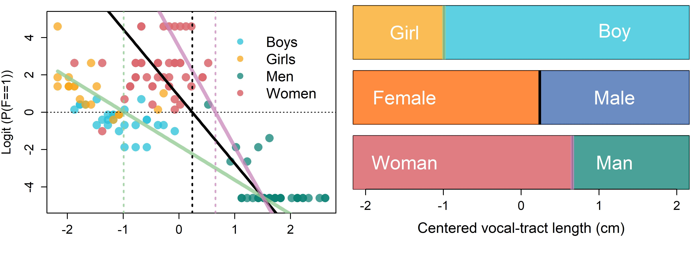

\newpage
```{r, include = FALSE}
knitr::opts_chunk$set(
  dpi = 600, dev = "jpeg", collapse=TRUE
)
```

# Logistic regression and signal detection theory models

Santiago Barreda
https://orcid.org/0000-0002-1552-083X

Noah Silbert
https://orcid.org/0000-0003-2515-384X

Abstract:

This chapter introduces linear models for the prediction of dichotomous variables, that is, variables that can take on one of two possible discrete values. First, it introduces dichotomous data and the Bernoulli and binomial distributions. After that, link functions and the generalized linear model are discussed. The chapter presents logistic regression, discusses logits and their characteristics, and introduces the inverse logit function, the link function for logistic regression. Following this, a multilevel logistic regression model with a single quantitative predictor is discussed, and this model is used to understand the predictions made by our model across the stimulus space, resulting in territorial maps. Finally, the chapter introduces the use of logistic regression to fit a signal detection theory model, estimating response bias and sensitivity using a multilevel logistic regression model.


To this point we've only discussed the prediction of quantitative variables that can take on a large number of values and are measured on an interval (or ratio) scale. In this chapter we being talking about the prediction of categorical variables, variables that take on a (usually small) number of discrete values. For now, we will focus on dichotomous (i.e. binary) outcomes, however, the ideas presented will be extended to the prediction of ordinal (ordered categories such as 1st, 2nd, 3rd), and multinomial (unordered categories such as English, French and Spanish) data in chapter 12. In the second half of the chapter, we will discuss how logistic regression models can be used to investigate the discrimination of categories, and response bias, using signal detection theory. 

## Chapter pre-cap

This chapter introduces linear models for the prediction of dichotomous variables, that is, variables that can take on one of two possible discrete values. First, we introduce dichotomous data and the Bernoulli and binomial distributions. After that, link functions and the generalized linear model are discussed. We present logistic regression, discuss logits and their characteristics, and introduce the inverse logit function, the link function for logistic regression. Following this, we fit a multilevel logistic regression model with a single quantitative predictor, and use this model to understand the predictions made by our model across the stimulus space, resulting in territorial maps. Finally, we introduce the use of logistic regression to fit a signal detection theory model, estimating response bias and sensitivity using a multilevel logistic regression model.

## Dichotomous variables and data {#c10-dichotomous}

The models we fit in chapter 9 featured linear relationships between our predictor and the expected value of the dependent variable ($\mu$). For a model predicting apparent height using speaker vocal-tract length (VTL), like the ones we fit in chapter 9, this means the $\mu$ parameter of a normal distribution slides along straight lines as in \@ref(eq:10-1). 

$$
\begin{equation}
\begin{split}
\mathrm{height}_{[i]} \sim \mathrm{N}(\mu_{[i]},\sigma) \\
\mu_{[i]} = \mathrm{Intercept} + VTL \cdot \mathrm{vtl}_{[i]} 
\end{split}
(\#eq:10-1)
\end{equation}
$$

We can see an example of a linear relationship in the top left plot of figure \@ref(fig:F10-1) where expected apparent height ($\mu$) varies along a line as a function of vocal-tract length (VTL). In this model, the observations we collect are assumed to be normally, and independently, distributed around the expected value (the line). Importantly, our predicted values *directly* model the values we're interested in. What we mean by this is that the values along our line are the actual apparent heights we expect to observe for a given value of VTL. 

```{r F10-1, fig.width = 8, fig.height = 5, fig.cap = "(top left) Average apparent height for each speaker against speaker VTL. Point color represents veridical speaker category. (top right) Individual gender identifications plotted according to speaker VTL. Female responses were given a value of 1, male responses 0. (bottom left) Probability of a female response as a function of speaker VTL. (bottom right) Logit of the probability of a female response as a function of speaker VTL.", echo = FALSE, message = FALSE, warning = FALSE}

################################################################################
### Figure 10.1
################################################################################


library (bmmb)
data (exp_data)
options (contrasts = c('contr.sum','contr.sum'))

tab = table (exp_data$S, exp_data$C_v)
mod_cat = apply (tab, 1,which.max)


exp_data$vtl = exp_data$vtl - mean (exp_data$vtl)

aggd = aggregate (cbind ( height, A=="a", G=="f", vtl,f0, vtl) ~ S + C_v, 
                      data = exp_data, FUN = mean)

par (mfrow = c(2,2), mar = c(2,4,1,1.5), oma = c(3,1,0,0))
plot (aggd$vtl, aggd$height, cex =2, col = bmmb::cols[c(2:5)][factor(aggd$C_v)], 
      xlim=c(-3,3),  pch=16,lwd=2,ylim = c(130,185),xlab = "",
      ylab="Apparent height (inches)",cex.lab=1.2,cex.axis=1.2)
grid()
abline (lm(aggd$height~aggd$vtl)$coefficients, lwd=2)
points (aggd$vtl, aggd$height, cex =2, pch=16,lwd=2,
      col = bmmb::cols[c(4,6)][aggd$group])

legend (.8,165, legend = c("Boys","Girls","Men","Women"),lwd=2,lty=0,
        col = cols[2:5], bty='n',pch=16,pt.cex=2)
plot (exp_data$vtl, exp_data$G=='f', cex =2, col = bmmb::cols[c(2:5)][factor(aggd$C_v)], yaxt='n',
      xlim=c(-3,3),  pch=16,lwd=2,ylim = c(-.1,1.1),xlab = "",
      ylab="G == 'f'",cex.lab=1.2,cex.axis=1.2)
grid()
abline (lm(aggd[,5]~aggd$vtl)$coefficients, lwd=2)
points (aggd$vtl, aggd[,5], cex =2, pch=16,lwd=2,
      col = bmmb::cols[c(4,6)][aggd$group])
abline (h=.5)
axis (side=2, at=0:1)

plot (aggd$vtl, aggd[,5], cex =2, col = bmmb::cols[c(2:5)][factor(aggd$C_v)], 
      xlim=c(-3,3),  pch=16,lwd=2,ylim = c(-.1,1.1),xlab = "",
      ylab="P(G  = 'f')",cex.lab=1.2,cex.axis=1.2)
grid()
abline (lm(aggd[,5]~aggd$vtl)$coefficients, lwd=2)
points (aggd$vtl, aggd[,5], cex =2, pch=16,lwd=2,
      col = bmmb::cols[c(4,6)][aggd$group])
abline (h=.5)

plot (aggd$vtl, logit(aggd[,5]), cex =2, col = bmmb::cols[c(2:5)][factor(aggd$C_v)], 
      xlim=c(-3,3),  pch=16,lwd=2,ylim = c(-6.1,6.1),xlab = "",
      ylab="Logit (P(G  = 'f'))",cex.lab=1.2,cex.axis=1.2)
grid()
abline (lm(logit(aggd[,5])~aggd$vtl)$coefficients, lwd=2)
points (aggd$vtl, logit(aggd[,5]), cex =2, pch=16,lwd=2,
      col = bmmb::cols[c(4,6)][aggd$group])
abline (h=0)

mtext (side=1,text="Centered VTL (cm)", outer = TRUE, line = 1.5, cex=0.9)
```

Unlike quantitative variables, **dichotomous** variables can only take on two different values, and these are not measured on an interval scale. We can easily think of many examples of this kind of data: A response to an item on a test that is wrong or right, a person who is either male or female, or someone who is an adult or a child. None of these examples are meant to suggest that reality is this simple. For example, males and females are not two discrete and internally homogeneous classes that fully explain variation in human sex or gender. Obviously, variation in human age and development is more complicated than adult or child. And, in fact, in real life it is common that situations or questions arise that cannot simply be labelled as 'wrong' or 'right'. Despite this, things like gender and age can be *coded* as dichotomous variables so that they have only two possible values within the context of our model.

The decision to represent these groups of speakers using binary variables is just as artificial as assuming that apparent height and VTL relate perfectly along a line, assuming that our errors are normally distributed and so on. Despite this, we can use our models to look for statistical associations between the dependent variable and our predictors *given the structure of our model*, that is, based on the simplifying assumptions we have made in order to turn an infinitely complicated reality into a regression model with a small number of parameters. 

When your variable has only two categorical outcomes (within the context of your model), you need to find a way to represent these numerically. The way this is usually done is by coding one category as 1 (a 'success') and the other as 0 (a 'failure'). The designation of one category as 1 and the other as 0 will not affect your analysis in any meaningful way (it will flip the sign of most coefficients) and can be based on what 'makes sense' given the analysis at hand. In our case we will define a new variable called `Female` and assign 1 to cases where listeners identified a speaker as female, thereby associating female responses with 'successes'. Keep in mind, this variable does not reflect whether the speaker *was* female but that the listener *thought* the speaker was female. 

The distribution of dichotomous female (1) and male (0) responses with respect to speaker VTL is presented in the top right plot of figure \@ref(fig:F10-1). Plotting ones and zeros against speaker VTL is not very informative, in addition, using a line to directly predict dichotomous data leads to strange outcomes. For example, our line predicts all sorts of values between 0 and 1 that our variable can never actually have. It also suggests a continuous, gradual change in the value of our dependent variable with respect to VTL, which is also impossible. 

We can make the situation a bit better by finding the average value of our dichotomous variable for each speaker, where female responses equal 1 and male responses equal 0 (bottom left plot in figure \@ref(fig:F10-1)). When we do this, we obtain the probability ($p$) of observing a female response for each speaker. For example, imagine you are playing basketball and keep track of 1000 free throws over several practices. Imagine you sink 753 of these shots, and let's assume that this represents your actual ability fairly well. You consider these 1000 shots observations of the variable "successful free throw" which equals 1 when you make it and 0 when you don't. If you add up all your made shots (753) and divide by the total number of observations (1000), you can conclude that there is a 0.753 (753/1000) probability of you sinking a free throw (i.e. ($p=0.753$)). 

Since the $p$ parameter is the 'average' made shot, this seems similar to the $\mu$ parameter in a normal distribution. However, the $p$ parameter can't be used with a normal distribution to generate dichotomous data. A normal distribution generates continuous variation symmetrically around its mean. Instead, we need a distribution that takes a parameter like $p$ and generates a variable with only two possible values. The two distributions most commonly used to model dichotomous variables are the *Bernoulli* distribution and the *binomial* distribution.

The **Bernoulli distribution** generates individual dichotomous outcomes. This distribution has only one parameter: The probability of a success ($p$). The $p$ parameter also represents the *expected value* of the Bernoulli distribution. Imagine you have ten observations from a Bernoulli variable and you observe 6 ones and 4 zeros. This suggests a probability of observing a success, $p$, of 0.6 (6/10). The expected value ($\mathbb{E}$) of a discrete variable is the sum of the values it can take times the probability of each value. For a Bernoulli variable this is relatively simple to calculate as it involves the addition of only two values. In \@ref(eq:10-2), we see that to find the expected value of a Bernoulli variable $y$, we multiply the probability of a success ($p$) times one, the probability of a failure ($1-p$) times zero, and add the two. Since the probability of failures is multiplied by zero, the expected value of the Bernoulli variable is simply equal to $p$. 

$$
\begin{equation}
\begin{split}
\mathbb{E}(y) = \sum_{i=1}^{2} y_{[i]} P(y_{[i]}) \\
\mathbb{E}(y) = (1 \cdot p)+(0 \cdot (1-p)) \\
\mathbb{E}(y) = p
\end{split}
(\#eq:10-2)
\end{equation}
$$

Below, we use the `rbernoulli` function to generate random Bernoulli variables. First we generate a single Bernoulli variable (a **Bernoulli trial**) and then ten variables with the same probability of success. 

```{r, collapse = TRUE}
# a single trial, probability of 0.5
bmmb::rbernoulli (1,.5)

# ten single trials, probability of 0.5
bmmb::rbernoulli (10,.5)
```

The **binomial distribution** generates a *set* (batch) of dichotomous outcomes. This distribution has two parameters: The probability of a success ($p$) and the number of trials ($n$). The Bernoulli distribution is a special case of the binomial distribution where $n$ is always one. If you were playing basketball and you took 5 free throws and made 3 (3/5=0.6), then the $p$ parameter suggested by your data is 0.6 and the $n$ parameter is 5. If you use this distribution, you are treating all 5 trials as a single observation. This means that your data is 3 (out of five) and not 0, 1, 1, 0, and 1 (or whatever). In this case, another 5 shots would constitute one more 'observation' summarized by the total number of successes. The expected value of the binomial distribution is $np$ since a single observation of a binomial variable is equal to $n$ Bernoulli trials, and the expected value of a single Bernoulli trial is $p$. 

Below we generate random binomial variables using the `rbinom` (random binomial) function, which takes parameters in this order: `number of observations, size, probability of success`. We can compare the data generated by the Bernoulli and the binomial distributions. In the top row we get a single number, the total number of successes in the trials. We don't get any information about what happened on any individual trial. In the bottom row we do get information about what happens on each individual trial.  

```{r, collapse = TRUE}
# a single batch of 10 trials, probability of 0.5
rbinom (1,10,.5)

# ten individual trials, probability of 0.5
bmmb::rbernoulli (10,.5)
```

So, when we have a dichotomous dependent variable and are interested in predicting individual trials, we use a Bernoulli distribution and our data model is $y \sim \mathrm{Bernoulli} (p)$. When our dependent variable consists of groups of Bernoulli trials treated as a single unit we can use a binomial distribution. If this is the case our data model looks like this $y \sim \mathrm{Binomial} (p, n)$, and keep in mind $n$ is *data* (i.e. is provided by the researcher) and not an parameter that is estimated by the model. 

Before moving on we want to note that unlike the normal distribution, the Bernoulli and binomial distributions do not generate individual data points near their expected value $p$. Instead, they generate sequences of 1s and 0s whose sample estimate of $p$ is expected to be close to its underlying value *hypothetically* given a large enough sample. For example, below we generate sequences of a dichotomous variable with a true $p$ of 0.5. In each case, the estimate of $p$ gets closer to the true value as the length of the sample gets longer, but it is never exactly equal to the true parameter value of 0.5. 

```{r, include = FALSE}
set.seed (7)
```
```{r, collapse = TRUE}
mean (rbernoulli (10,.5)) # the mean of 10 observations
mean (rbernoulli (100,.5))  # the mean of 100 observations
mean (rbernoulli (1000,.5))  # the mean of 1000 observations
mean (rbernoulli (100000,.5))  # the mean of 100000 observations
```

## Generalizing our linear models

The bottom left plot in figure \@ref(fig:F10-1) shows the probability of observing a classification of 'female' for each speaker as a function of their vocal-tract length (VTL). We can see that the perception of femaleness is negatively related to speaker VTL: As VTL increases the probability of observing a female response decreases. Despite this, we can't directly model variation in $p$ using lines as shown in the figure. There are many reasons for this but the main one is that using lines to model $p$ causes problems near 0 and 1. For example, imagine a predictor is associated with an increase in probability of 0.2 per unit change in the predictor. If the Intercept is 0.7, a two unit increase in the predictor is associated with a probability of 1.1, which is not possible. This suggests that a curve with a constant slope (e.g. a line) is fundamentally ill-suited to predict a bounded variable like probability. 

The above seems problematic, after all, so far this book has been about linear regression models and we're saying lines are no good for modeling variation in probabilities. The solution to this is to remember that our regression models consist of a bunch of components stuck together. Early on we discussed two general parts: The random component and the systematic component (see section \@ref(c3-what-is-reg)). The systematic component predicts variation in expected values using shapes like lines and planes. The random component specifies how our data randomly varies around the expected value. We can add a third component to this called a **link function**, a function that takes some parameter you're interested in (e.g. $p$) and transforms it so that the *transformed* value can be modeled along straight lines. When you rely on link functions, modeling becomes a three step process like this:

  1) Predict variation in expected values ($\theta$) along straight lines (or related shapes), for example $\theta  = a + b \cdot x$. This is the systematic component, and $\theta$ is linearly related to the predictor $x$.
  
  2) Transform $\theta$ using a link function. For example, given the link function $f$ we can transform our expected value $\theta$ to $p$ like so: $p = f(\theta)$. The transformed parameter ($p$) may no longer be linearly related to the dependent variable $x$ or the linear predictor $\theta$.
  
  3) Use the *transformed* parameter ($p$) in the data generating distribution. For example $y \sim \mathrm{Bernoulli}(p)$. This is the random component.
  
Our link function literally *links* our systematic and random components: The random component does not *directly* use the information in the systematic component. The models we've been fitting so far featured what's known as the **identity** link function. The identity link function is basically a function that does nothing, the input equals the output like $\mu = f(\mu)$. Using the identity link function is equivalent to modeling $\mu$ directly in our prediction equation. This works for the mean parameter of the normal distribution because it can actually vary continuously from positive to negative infinity as lines do. However, it doesn't work for the Bernoulli or binomial distributions since $p$ must fall between 0 and 1. This suggests that we'll need to include a function ($f$) that maps some continuous predicted value ($\theta$) to a probability ($p$), as in \@ref(eq:10-3). 

$$
\begin{equation}
\begin{split}
\mathrm{Female}_{[i]} \sim \mathrm{Bernoulli}(p_{[i]}) \\
p_{[i]} = f(\theta_{[i]}) \\
\theta_{[i]} = \mathrm{Intercept} + VTL \cdot \mathrm{vtl}_{[i]} \\ 
\end{split}
(\#eq:10-3)
\end{equation}
$$

The presentation in \@ref(eq:10-3) separates our model into a random component, a link function, and a systematic component. Each of these components play a crucial role in our ability to build regression models that predict dichotomous variables. The random component is the distribution underlying the data-level error in our dependent variable. This component helps us account for the fact that our observations are not perfectly predictable given our independent variables, and that they can only equal 0 or 1. The systematic component allows us to make predictions about variability in the dependent variable using combinations of our predictors. The link function lets us use lines to model variation in parameters even when these may not vary in an unbounded manner.

This division of regression models into three discrete components is referred to as the **generalized linear model**. The generalized linear model allows the user to change the random component and/or link function as appropriate to model a wide range of data. It's called the 'generalized' linear model because it represents the extrapolation of principles related to the prediction of quantitative variables coming from a normal distribution to the general case. For more information on the generalized linear model see Kruschke (2014) for a Bayesian introduction, or McCullagh and Nelder (2019) for a more advanced, and classic, treatment.

## Logistic Regression

**Logistic regression** is an approach to regression for predicting dichotomous dependent variables. Since it is extremely common, we're going to focus on modeling Bernoulli data (i.e. individual dichotomous variables) in this chapter. However, most of the information presented here directly applies to binomial regression, and binomial regression is simple to carry out using `brms`.

Logistic regression assumes a Bernoulli distribution for the random component, and the *inverse logit* function ($\mathrm{logit}^{-1}$, discussed below) as its link function. The systematic component still consists of linear combinations of our independent variables, i.e., adding them up after multiplying by their respective model coefficients, as it has in previous chapters. A general description of logistic regression with a single quantitative predictor is given in \@ref(eq:10-4). 

$$
\begin{equation}
\begin{split}
y_{[i]} \sim \mathrm{Bernoulli}(p_{[i]}) \\
p_{[i]} = \mathrm{logit}^{-1}(z_{[i]}) \\
z_{[i]} = Intercept + \beta \cdot \mathrm{x}_{[i]} \\
\end{split}
(\#eq:10-4)
\end{equation}
$$

The information in \@ref(eq:10-4) says the following: Our data ($y$) is a Bernoulli-distributed dichotomous variable with a $p$ parameter that varies on each trial. The $p$ parameter is the output of the inverse logit ($\mathrm{logit}^{-1}$) applied to our linear predictor $z$. The linear predictor is the sum of an intercept and product of the independent variable ($\mathrm{x}$) and its slope parameter ($\beta$). We noted above that $p$ is the expected value of the Bernoulli distribution. Thus, we can see that logistic regression predicts expected values ($p$) just like our regressions in previous chapters (e.g. $\mu$ for a normal model). However, logistic regression doesn't model $p$ directly but instead models the *logit* of the expected value, $z$.

### Logits 

**Logits** are log-odds, the logarithm of the odds of a success. The odds of a success are defined as:

$$
\begin{equation}
\mathrm{odds}_{\mathrm{success}} = \frac{N_{\mathrm{success}}}{N_{\mathrm{failures}}}
(\#eq:10-5)
\end{equation}
$$

Where $N_{\mathrm{success}}$ is the number of observed (or expected) successes and $N_{\mathrm{failures}}$ is the observed (or expected) number of failures. For example, odds of 3/1 indicate that success is three times as likely as a failure. We can also define odds by expressing them in terms of the probability of a success, $p$, and the probability of a failure, $1-p$, as in \@ref(eq:10-7).

$$
\begin{equation}
\mathrm{odds} = p / (1-p)
(\#eq:10-7)
\end{equation}
$$

We can turn odds into probabilities with the following calculation. For example, odds of 3/1 imply a probability of 0.25 (3 / (3+1)). 

$$
\begin{equation}
\mathrm{P}(\mathrm{success}) = \frac{N_{\mathrm{success}}}{N_{\mathrm{failures}} + N_{\mathrm{success}}} = \frac{N_{\mathrm{success}}}{N_{\mathrm{total}}}
(\#eq:10-6)
\end{equation}
$$

Odds are still bounded by zero on the lower end so they still can't be modeled using lines, however, if we take the *logarithm* of the odds we get a **logit**, the log odds. Unlike odds, logits *can* take on values from positive to negative infinity. This is because, for variable x, logarithms represent the values of x between 0 and 1 with values of log(x) from $-\infty$ to 0. Values of x from 1 to $+\infty$ are represented by values of log(x) from 0 to $+\infty$ (see section \@ref(c2-logarithms)). You can see this relationship by running the code below.

```{r, eval=FALSE}
# this plot compares x and log (x). Note that log(x)<0 when x<1.
curve (log(x), xlim = c(0,10),n=1000,lwd=2,col=4)
abline (v = 1, lwd=2,col=2)
abline (h=0,v=0, lty=3,col="grey",lwd=3)
```

We can calculate the logit of a probability in either of the two following ways:

$$
\begin{equation}
\begin{split}
\mathrm{logit}(p) = \log (p / (1-p)) \\
\mathrm{logit}(p) = \log (p) - \log(1-p)
\end{split}
(\#eq:10-8)
\end{equation}
$$

Equation \@ref(eq:10-8) is sometimes called the **logit function** because it turns probabilities into logits. The `bmmb` package contains a function that carries out this transformation (`logit`). We can see below that this function takes the second approach to calculate logits. 

```{r}
bmmb::logit
```

Note that when p is equal to 1 or 0, the function arbitrarily changes those values to 0.99 and 0.01. This is because the logarithm of zero is undefined, and so the logit of probabilities of 0 and 1 cannot be calculated. To accommodate these values, the `logit` function sets extreme (but manageable) values for probabilities of 0 and 1. The effect of this can be seen in the bottom right plot of figure 10.1. Several speakers classified as female 100% or 0% of the time appear along horizontal lines at the bottom and top of the y axis range.

### The inverse logit link function {#c10-inverse-logit}

Logistic regression models express expected values in *logits*. The lines represented by these models describe continuous changes in logits as a function of the predictors, and intercepts represent shifts in the values of logits across different situations. However, our data generating distribution (Bernoulli) requires a parameter $p$ that is bounded by 0 and 1. This means that the link function for logistic regression needs to convert logits to probabilities. The function that does this is called the **logistic function**, the **antilogit function**, or the **inverse logit function**. We will refer to it as the inverse logit function to highlight the fact that it is the inverse of the logit, that it *undoes* the logit transform. 

The inverse logit function is presented in \@ref(eq:10-9), for logit (i.e. log odds) values, $z$, ranging continuously from positive to negative infinity. The symbol $e$ represents the mathematical constant (Euler's number, 2.718...) that serves as the base for natural logarithms and for the exponential function so that $\exp(z)=e^z$.

$$
\begin{equation}
P(y=1)=\mathrm{logit}^{-1}(z) = \frac{e^{z}}{1 + e^{z}}
(\#eq:10-9)
\end{equation}
$$

The inverse logit function may seem inscrutable, but it is in fact very scrutable. First, note its structural similarity to equation \@ref(eq:10-6) which describes the conversion of counts of successes and failures to probabilities. Recall that $z$ is the *log-odds* of observing a 'success'. This means that $e^z$ is the *odds* of observing a success (since exponentiation 'undoes' log transforms). The odds are the ratio of the number of successes to the number of failures observed (or expected) for some number of trials. As a result, $e^z$ can be *thought of* as the expected number of successes relative to some number of failures. How many failures?

In equation \@ref(eq:10-6) we see that the left term in the denominator represents the number of failures. Based on this, it seems as though in \@ref(eq:10-9) we're fixing the expected 'count' of failures at 1, and this is effectively what the inverse logit function does. This is necessary because for $n$ trials if you have $S$ successes then you *must* have $n-S$ failures. This means that the odds (or probabilities) of successes *and* failures cannot both be independently estimated. We ran into similar constraints when we discussed contrasts in chapter 5, and our discussion of why all levels of a factor cannot be independently estimated. To resolve this issue, logistic regression only estimates the odds of successes and not of failures. However, we still need a number of failures in order to turn odds into probabilities. To resolve this issue, the inverse logit function fixes the number of failures to 1 for all cases. 

Thinking of $e^z$ as the expected number of successes relative to 1 expected failure may help interpret logits and understand the inverse logit function. For example, since $e^0=1$ a logit of 0 means we expect 1 success compared to 1 failure. This results in $p=0.5$ for a logit of 0, as shown in \@ref(eq:10-10).

$$
\begin{equation}
\frac{e^{0}}{1 + e^{0}}=\frac{1}{1 + 1}=0.5
(\#eq:10-10)
\end{equation}
$$

When $z$ is a negative value, $e^{z}$ is bounded by 0 and 1. This means that a success is less likely than a failure in these cases since we've fixed the number of failures at 1. For example if $z=-3$ then $e^{z}=e^{-3}=0.05$. This means that when $z<0$, we expect probabilities between 0.0 and 0.5, as in \@ref(eq:10-11).

$$
\begin{equation}
\frac{e^{-3}}{1 + e^{-3}}=\frac{0.05}{1 + 0.05}=0.0474
(\#eq:10-11)
\end{equation}
$$

On the other hand, when $z$ is positive, $e^{z}$ will be a number greater than 1, meaning success is more likely than failure. Thus, for positive values of $z$ we expect probabilities between 0.5 and 1 as in:

$$
\begin{equation}
\frac{e^3}{1 + e^{3}}=\frac{20.1}{1 + 20.1}=0.953
(\#eq:10-12)
\end{equation}
$$

Notice also that the inverse logit function can't actually generate values of 1 or 0. This is because no matter how large the value of $z$ gets, the denominator will always be 1 greater. This sets the upper range of the inverse logit at 1. On the other hand, no matter how negative the value of $z$ gets, exponentiating the value will *always* result in a number greater than 0. This is because the exponential function can only generate positive, non-zero values. As a result, \@ref(eq:10-12) will also always provide values greater than 0.

In Figure \@ref(fig:F10-2) we draw a line with a slope of one and an intercept of 0 (i.e., y=x). We can imagine that this line defines expected values in *logits* as a function of some predictor x. In the middle plot, we've applied the inverse logit function to the line so that $\mathrm{logit}^{-1}(y) = x$. This results in what's known as a **sigmoid curve** relating our x and y variables. If we apply the logit function to this sigmoid curve, the result is a return of our original line again. Thus, we can see that the logit and inverse logit transformations can be applied over and over to go back and forth between a probability or logit representation of the same information. 

```{r F10-2, fig.width = 8, fig.height = 2.75, fig.cap = "(left) A plot of a line with a slope of 1 and intercept of 0. We can treat the y-axis as logits. (middle) The result of applying the inverse logit function to every point of the line in the left plot. (right) Calculating the logit of each value specified on the curve in the middle turns our sigmoid curve back to a line.", echo = FALSE}

################################################################################
### Figure 10.2
################################################################################

x = seq (-8,8,.01)
y = x

par (mfrow = c(1,3), mar=c(4,4,3,1))
plot (x,y, type = 'l',lwd=4, col=bmmb::"deepgreen", xlim=c(-7,7), main = "y = x",
      xlab = "Predictor", ylab = "Logits",cex.lab=1.2,cex.axis=1.2)
abline (h=0,v=seq(-8,8,2),lty=3)

plot (x,bmmb::inverse_logit (y), type = 'l',lwd=4, col=bmmb::"darkorange", xlim=c(-7,7), 
      main = "y = inverse logit ( x )", xlab = "Predictor", ylab="Probability",
      cex.lab=1.2,cex.axis=1.2)
abline (h=c(0,1,.5),v=seq(-8,8,2),lty=3)

plot (x,bmmb::logit(bmmb::inverse_logit (y)), type = 'l',lwd=4, 
      col=bmmb::"lavender", xlim=c(-7,7), cex.lab=1.2,cex.axis=1.2,
      main = "y = logit ( inverse logit ( x ) )", xlab = "Predictor", ylab="Logits")
abline (h=0,v=seq(-8,8,2),lty=3)
```

In chapter 9 we mentioned that when you do a linear regression you effectively model the data as being generated by distributions that slide along lines, 'producing' data along the way (see figure \@ref(fig:F9-1)). Logistic regression leads to an analogous but slightly different interpretation. In logistic regression you model the data as a Bernoulli distribution sliding along a sigmoid curve (middle plot, figure \@ref(fig:F10-2)), generating a ratio of successes to failures based on the value of $p$ specified by the curve.

The second and third lines in \@ref(eq:10-4) represent the model link function and systematic component, respectively. We can skip the middleman ($z$) and just put the prediction equation directly inside the inverse logit function as in \@ref(eq:10-13).

$$
\begin{equation}
p = \mathrm{logit}^{-1}(\mathrm{Intercept} + \beta \cdot x_{[i]}) =  \frac{e^{(\mathrm{Intercept} + \beta \cdot x_{[i]})}}{1 + e^{(\mathrm{Intercept} + \beta \cdot x_{[i]})}}
(\#eq:10-13)
\end{equation}
$$

We can then take the inverse logit function and put it directly inside the Bernoulli distribution, as in \@ref(eq:10-14).

$$
\begin{equation}
F \sim \mathrm{Bernoulli} \left (\frac{e^{(\mathrm{Intercept} + \beta \cdot x_{[i]})}}{1 + e^{(\mathrm{Intercept} + \beta \cdot x_{[i]})}} \right ) 
(\#eq:10-14)
\end{equation}
$$

There's no particular reason to do this, apart from the fact that it illustrates that our link function really does *link* our prediction equation ($Intercept + VTL \cdot \mathrm{vtl}$) and our data distribution (Bernoulli). 

### Building intuitions about logits and the inverse logit function

The logit and inverse logit functions are **non linear** functions. In the simplest sense this means that the relationships they form between x and y variables, when plotted, do not form straight lines. In our case, this means that when we compare logits and their associated probabilities we will not see a straight line. The sigmoid curve in the left plot of figure \@ref(fig:F10-3) reveals a changing relationship between logits and probabilities: The slope is very shallow for large negative logit values but increases in value as the curve approaches 0. The slope then begins to decrease in value as the logits become large again. This behavior allows the sigmoid curve in the figure to extend from positive infinity to negative infinity without ever crossing 1 and 0: As logit values become arbitrarily large in magnitude, the slope of the sigmoid curve becomes arbitrarily small in magnitude to the point where it is effectively parallel to the x axis on both ends of the curve. 

```{r F10-3, fig.width = 8, fig.height = 2.75, fig.cap = "(left) A sigmoid curve expressing the probability associated with each logit value along the x axis. Horizontal lines are placed every 0.1 from 0.1 to 0.9 probability. (right) A line relating some predictor to logits. Horizontal lines are placed every 0.1 from 0.1 to 0.9 probability.", echo = FALSE}

################################################################################
### Figure 10.3
################################################################################

x = seq (-3.5,3.5,.01)
y = x

par (mfrow = c(1,2), mar=c(4,4,1,1))

plot (x,inverse_logit (y), type = 'l',lwd=3, col=darkorange, xlim=c(-3,3),
      xlab="Logit",ylab="Probability", ylim = c(0,1),yaxs='i',xaxs='i')
abline (h=seq(0,1,.1),v=(-9:9),lty=3)
abline (h = 0.5, lwd=2)

plot (x,y, type = 'l',lwd=3, col=deepgreen, xlim=c(-3,3),xlab="Predictor",
      ylab = "Logit",yaxs='i',xaxs='i')
abline (h=logit(seq(0.1,0.9,.1)),v=c(-9:9),lty=3)
abline (h = 0, lwd=2)

```

In the right plot of figure \@ref(fig:F10-3) we see the relationship between the logit of the probability and our predictor. We can see the consequences of the changing relationship between logits and probabilities by looking at the horizontal lines in the plot. These lines represent equal differences in probability (0.1 change per line). The lines are closer together when logits have a small magnitude and further when logits are large. This is a consequence of the non-linearity of the transforms: A one unit change in probabilities/logits does not always map to the same size of change in the other value. In general, small changes when logits are close to zero (i.e., when $p$ is close to 0.5) map to large changes in probabilities, while larger changes in logits with large magnitudes (i.e., when $p$ is close to 0 or 1) tend to map to small changes in probabilities. As noted above, this is reflected in the changing slope of the sigmoid curve in the left plot.

The top row below contains a sequence of probabilities and the bottom row shows equivalent logits. Notice that the difference between 0.5 and 0.6 is 0.41 logits, but the difference between 0.8 and 0.9 is 0.81 logits. Meanwhile the difference between 0.9 and 1 is infinity.

```{r, collapse = TRUE}
rbind ( (seq (0.1,.9,.1)), 
        round ( logit (seq (0.1,0.9,.1)) , 2) )
```

We can think about the cause of this behavior by thinking about some situation where you're trying to change a probability. Imagine that you keep track of your free throws in basketball practice. You sink 500/1000 free throws, giving you a 0.5 probability of success. Now imagine you take a further 100 shots and sink them all. Now your probability of success is 600/1100, meaning your amazing streak has increased your probability to 0.54. However, suppose that you had been a 900/1000 shooter, a probability of 0.9 of success. If you had the same streak of 100 made baskets you would only increase your probability to 0.901 (1000/1100). This change is *forty* times smaller than the change when you begin at 0.5 (0.001/0.040). Thus, we can see that 'the same' increase in made baskets results in a large increase in one probability (0.5 to 0.54, almost 10%) and a minuscule change in another (0.9 to 0.901, about 0.1%). Basically, as you approach 0 and 1 it gets harder to make large changes in your probabilities, and this is reflected in the logits of those probabilities. 

Here are some useful things to keep in mind when interpreting logits, in no particular order: 

  * A probability of 0.5 is 0 logits. Positive logits means more likely to be a success, negative logits means more likely to be a failure. 
  
  * -3 and 3 are 4.7% and 95.2%. Basically -3 and 3 logits are useful bounds for "very likely 1" and "very likely 0". 
  
  * Since a logit of 3 translates to a $p$ of about 0.95, all of the space between +3 and infinity logits represents the probability space between 0.95 and 1, while logits between 0 and 3 represent the space from 0.5 to 0.95.
  
  * Logits far beyond 3 might not have much practical significance. A logit of 4 is a probability of 0.982 and a logit of 6 is 0.997. For many purposes, probabilities of 0.95, 0.98, and 0.99 are nearly interchangeable. Also, it is very difficult to distinguish 95%, 98%, and 99% in practice since you will be observing very few cases of 0.
  
  * Effects can be considered important or not based on how far they get you along -3 to 3 (or -4 to 4). Basically, anything in the +1 range is very likely to matter, while effects smaller than 0.1 or so are likely having only a small influence on outcomes.
  
Here is one final thing to keep in mind about logits: You **must** combine your model parameters as logits **before** transforming them into probabilities. This is due to the fact that the inverse logit function is non-linear, and will be discussed in more detail in section \@ref(c10-fitting-1). 

## Logistic regression with one quantitative predictor

In the previous chapter we tried to predict apparent height using speaker VTL, apparent age, and apparent gender. Here, we're going to predict the perception of femaleness, i.e., the identification of the speaker as female, based on speaker VTL an apparent age and using a logistic regression.

### Data and research questions

Below we load the necessary R packages and the data. We create a new variable called `Female` which will be our dependent variable. This variable equals 1 when listeners indicated hearing a female speaker and 0 when listeners indicated a male speaker. We'll predict this using a single quantitative predictor, speaker VTL, which we also center below. 

```{r, warning=FALSE, message=FALSE}
library (brms)
library (bmmb)
options (contrasts = c('contr.sum','contr.sum'))

data (exp_data)

# our dependent variable
exp_data$Female = as.numeric (exp_data$G == 'f')

# make a copy of vtl
exp_data$vtl_original = exp_data$vtl
# center vtl
exp_data$vtl = exp_data$vtl - mean (exp_data$vtl)
```

The variables from our data frame that will be used in this model are: 

  * `L`: A number from 1-15 indicating which *listener* responded to the trial, being treated as a character. 
  * `S`: A number from 1-139 indicating which *speaker* produced the trial stimulus. 
  * `vtl`: An estimate of the speaker's *vocal-tract length* in centimeters. 
  * `G`: The *apparent gender* of the speaker indicated by the listener, `f` (female) or `m` (male). 
  * `A`: The *apparent age* of the speaker indicated by the listener, `a` (adult) or `c` (child). 

We saw in figure \@ref(fig:F10-1) that VTL is negatively related to the probability that a speaker will be identified as female. In addition, it seems that the relationship between speaker VTL and the perception of female speakers may differ based on the apparent age of the speaker. We would like to know:

  (Q1) What is the relationship between speaker VTL and the perception of femaleness?

  (Q2) Does the relationship between VTL and apparent speaker gender vary in an age-dependent manner?

### Description of the model

In order to answer the questions posed above, our model needs to represent the linear relationship between VTL and the logit of the probability of observing a female classification. It also needs to allow this linear relationship to vary between apparent children and adults. The formula for our model needs to look like this:

`Female ~ vtl*A + (vtl*A|L) + (1|S)`

The formula above tells our model to predict perceived femaleness using speaker VTL (centered as in the previous chapter), information about whether the speaker was identified as a child or an adult, and age-dependent use of VTL. Since we include the interaction between apparent age and speaker VTL, we are effectively estimating two lines relating speaker VTL and apparent gender: One for apparent adults and another for apparent children. Our formula also includes by-listener effects for all predictors and by-speaker intercepts. This model would be relatively 'simple' at this point if it were dealing with normally distributed data. The prior specification we're going to use looks like this:

```{r}
prior = c(set_prior("student_t(3, 0, 3)", class = "Intercept"),
                 set_prior("student_t(3, 0, 3)", class = "b"),
                 set_prior("student_t(3, 0, 3)", class = "sd"),
                 set_prior("lkj_corr_cholesky (2)", class = "cor"))
```

You'll notice that we're using priors with a standard deviation of 3 across the board. This is because logit values of 3, 6, and 9 correspond to probabilities of 0.9526, 0.9975, and 0.9999 (`inverse_logit(c(3,6,9))`) respectively. So, a prior with a standard deviation of 3 suggests we expect group differences, or a one-unit change in VTL, have the potential to change probabilities from 50% to 95% (a difference of 3 logits). We think it's plausible that apparent age may, for example, change an expected probability from 50% to 95%. In terms of continuous predictors like VTL, the important thing to keep in mind is that the slope estimated for a predictor depends on the unit of measurement for that predictor. For example, below we see the average VTL in centimeters for each speaker category. 

```{r}
tapply (exp_data$vtl_original, exp_data$C_v, mean)
```

We can see that the average difference between men and women is about 2 cm. If we assume that people at the averages are classified correctly more often than not, this means that the logit of the probability of observing a female response for an adult with a 15 cm VTL may be about -3, and the logit of the same for a 13 cm VTL may be about 3. Thus, we might expect a slope of about 3 logits per 1 cm change in VTL with respect to the perception of female speakers. However, what if we had measured VTL in meters? Then the difference in VTL would be only 0.02, meaning that the model slope would now have to be 300 in order to change from -3 to 3 in only 0.02 units of change ($300 = 6/0.02$). Based on this we can see that it's important to think about the amount of variation there is in your quantitative predictors and how this might relate to the probabilities you are modeling when setting your priors. 

Our full model specification, omitting the deterministic construction of the covariance matrix $\mathrm{\Sigma}$ (as usual), is:

$$
\begin{equation}
\begin{split}
\mathrm{Female}_{[i]} \sim \mathrm{Bernoulli}(p_{[i]}) \\
p_{[i]} = \mathrm{logit}^{-1} (z_{[i]}) \\
z_{[i]} = a_{[i]} + b_{[i]} \cdot \mathrm{vtl}_{[i]}  \\ 
a_{[i]} = \mathrm{Intercept} + A + A \colon L_{[\mathsf{L}_{[i]}]} + L_{[\mathsf{L}_{[i]}]} + S_{[\mathsf{S}_{[i]}]} \\ 
b_{[i]} =  VTL + VTL \colon A + VTL \colon L_{[\mathsf{L}_{[i]}]} + VTL \colon A \colon L_{[\mathsf{L}_{[i]}]}  \\ \\
\textrm{Priors:} \\
S_{[\bullet]} \sim \mathrm{Normal}(0,\sigma_{S}) \\ 
\begin{bmatrix} L_{[\bullet]} \\ A \colon L_{[\bullet]} \\ VTL \colon L_{[\bullet]} \\ VTL \colon A \colon L_{[\bullet]} \\ \end{bmatrix}	
\sim \mathrm{MVNormal} \left(\, \begin{bmatrix} 0\\ 0 \\ 0 \\ 0 \\ \end{bmatrix}, \mathrm{\Sigma} \right) \\ \\
\mathrm{Intercept} \sim \mathrm{t}(3, 0, 3) \\
A, VTL, VTL \colon A \sim \mathrm{t}(3, 0, 3) \\
\sigma_{S}, \sigma_{L}, \sigma_{A \colon L}, \sigma_{VTL \colon L} , \sigma_{VTL  \colon A \colon L}  \sim \mathrm{t}(3, 0, 3) \\ R \sim \mathrm{LKJCorr} (2)
\end{split}
(\#eq:10-13)
\end{equation}
$$

The main differences compared to our previous models are the lack of terms related to $\sigma$, the inclusion of a link function, and the reliance on a Bernoulli rather than the normal or t distributions at the data level. In plain English, this model could be read like: 

> We're treating our femaleness judgments (1 or 0 for female or male) as coming from a Bernoulli distribution with a probability ($p$) that varies from trial to trial. The *logit of the probability* ($z$) varies along lines. The lines are specified by intercepts ($a$) and slopes ($b$) that vary from trial to trial, and there is a single continuous predictor (speaker VTL). The intercept of these lines varies based on an overall intercept, an effect for apparent age ($A$), listener-specific effects for apparent age ($A \colon L$), listener-specific deviations ($L$), and speaker-specific deviations (S). The slope of these lines varies based on an overall slope ($VTL$, the main effect), deviations based on apparent age ($VTL \colon A$), listener-specific deviations ($VTL \colon L$), and listener-specific interactions between apparent age and VTL ($A \colon VTL \colon L$)). The speaker intercept ($S$) terms were drawn from a normal distribution with a mean of zero and a standard deviation estimated from the data. The listener random effects were drawn from a multivariate normal distribution with means of zero and a covariance matrix estimated from the data. All other effects (e.g., the Intercept, VTL, A, etc.) were treated as 'fixed' and drawn from prior distributions appropriate for their expected range of values. 

### Fitting the model {#c10-fitting-0}

We're going to fit the model outlined above. Below is the function call we need to run the model described in \@ref(eq:10-13):

```{r, eval = FALSE}
# Fit the model yourself
priors = c(brms::set_prior("student_t(3, 0, 3)", class = "Intercept"),
           brms::set_prior("student_t(3, 0, 3)", class = "b"),
           brms::set_prior("student_t(3, 0, 3)", class = "sd"),
           brms::set_prior("lkj_corr_cholesky (2)", class = "cor"))

model_gender_vtl =
  brm (Female ~ vtl*A + (vtl*A|L) + (1|S), data=exp_data, chains=4, cores=4, 
       family="bernoulli", warmup=1000, iter = 5000, thin = 4,prior = priors)
```
```{r, include = TRUE, eval = FALSE}
# Or download it from the GitHub page:
model_gender_vtl = bmmb::get_model ('10_model_gender_vtl.RDS')
```
```{r, include = FALSE, TRUE}
# saveRDS (model_gender_vtl, '../models/10_model_gender_vtl.RDS')
model_gender_vtl = readRDS ('../models/10_model_gender_vtl.RDS')
```

However, we're going to (retroactively) pause before continuing in order to update our discussion of prior predictive checks. In section \@ref(c8-prior-prediction) we discussed these in the context of quantitative variables. In these cases, our predictions take on a range of values and can be summarized effectively using histograms and plots showing the density of the distribution. In contrast, our dichotomous variables only take on values of 1 and 0, and so histograms and densities of these no longer provide as much useful information. 
Instead of considering the distribution of values of the dependent variable directly, we can consider prior predictions as logits, allowing us to use densities or histograms just as we did for quantitative variables. 

We can look at the location of the logit predictions to see how expected outcomes vary across conditions or overall. A concentration around 0 means that predictions are balanced across successes and failures, whereas positive or negative predictions indicate one or the other category is more likely. We can also look at the variation of predictions about their average, and in particular, in the magnitude of the logits being predicted. Predicted logits with very large magnitudes indicate near certainty in the outcome, whereas predictions concentrated near zero indicate that either category is equally likely. We can use the code below to run our prior predictive check and then use the `p_check` function to get and plot our prior predictions (not shown here). 

```{r, eval = FALSE}
priors = c(brms::set_prior("student_t(3, 0, 1)", class = "Intercept"),
           brms::set_prior("student_t(3, 0, 1)", class = "b"),
           brms::set_prior("student_t(3, 0, 1)", class = "sd"),
           brms::set_prior("lkj_corr_cholesky (2)", class = "cor"))

model_gender_vtl_priors =
  brm (Female ~ vtl*A + (vtl*A|L) + (1|S), data=exp_data, chains=4, 
       cores=4, family="bernoulli", warmup=1000, iter = 5000, thin = 4,
       prior = priors, sample_prior = "only")

qq = p_check (model_gender_vtl_priors)

hist (bmmb::inverse_logit(qq[,1]))
```

Our prior predictions indicate some logits with very high values (>40), with the bulk of variation seemingly between -20 and 20 logits. This indicates that in some cases, speakers would be identified as female with a probability of 0.000000002 (since $\mathrm{logit}^{-1}(-20)=0.000000002$), or about once every 500 million trials. This might seem crazy but it might not be. For example, consider someone with a very deep voice and a deep resonance like James Earl Jones (a.k.a Mufasa in the *Lion King* and Darth Vader in *Star Wars*). You ask: What's the probability that this voice would be identified as an adult female by a random listener, knowing nothing about the speaker other than a single example of their voice? In some cases, you might reasonably think that this might *never* happen, other than perhaps due to accidental responses. But what if you *had* to put a number on never? Well in that case logits as large as 20, or a one in half billion chance, may not seem so crazy. 

Although we've spent the last paragraph defending these priors, they probably are too wide, just not excessively so. If our model has problems converging or has any other pathologies (e.g., divergent transitions, see section \@ref(c3-checking-convergence)), we may want to reconsider these priors. 

### Interpreting the model {#c10-fitting-1}

If we inspect the model summary:

```{r, eval = TRUE}
short_summary(model_gender_vtl)
```

We see that it looks just like all our previous models except for two main differences: 

  1) All our parameters, including means, errors, and credible intervals, are now expressed in logits. 
  
  2) The absence of the `Family-Specific` parameter section of the model where `sigma` and `nu` (i.e., $\sigma$ and $\nu$) were usually found.

In chapter 9 we talked about the geometry of models that include a single quantitative predictor, a categorical predictor with several levels, and the interaction of the two. Essentially, these models result in a set of lines, one overall 'main effects' line, and another line for each level of the categorical predictor interacting with the quantitative predictor. Since our model includes effects for apparent age (`A1`), VTL (`vtl`), and their interaction (`vtl:A1`), our model can be thought of as three lines relating VTL to the logit of the probability of observing a female response: The overall (main effects) line, the line for apparent adult speakers, and the line for apparent child speakers. We can recover the parameters for these three lines by adding the appropriate model coefficients together using the hypothesis function. Since `A1` (and related parameters) represent the adult group and we are using sum coding, the effect for children is represented by subtracting, rather than adding, the relevant parameters (i.e. `Intercept - A1` to find the child intercept). 

```{r, cache = TRUE, collapse = TRUE}
gender_vtl_hypothesis = bmmb::short_hypothesis (
  model_gender_vtl,
  hypothesis = c("Intercept = 0",           # overall intercept
                 "Intercept + A1 = 0",      # adult intercept
                 "Intercept - A1 = 0",      # child intercept
                 "vtl = 0",                 # overall slope
                 "vtl + vtl:A1 = 0",        # adult slope
                 "vtl - vtl:A1 = 0") )      # child slope

gender_vtl_hypothesis
```

These parameters can be used to plot lines predicting the logit of the probability of a female response given speaker VTL. The left plot of figure \@ref(fig:F10-4) presents the overall 'main effects' line and the age-dependent lines, compared to our data. We can see that our age-dependent lines follow the data much better than the single average line does. In the right plot of figure \@ref(fig:F10-4) we see what happens when we apply the inverse logit transform on the lines (and points) in the left plot of the figure. The result is a set of sigmoid curves representing expected variation in the $p$ parameter of a Bernoulli distribution as a function of speaker VTL. These curves are a better fit for our probabilities than the lines we originally used in figure \@ref(fig:F10-1), and also do not ever result in values below zero or above one. 

```{r F10-4, fig.width = 8, fig.height = 3, fig.cap = "(left) Lines indicating the linear relationship between VTL and the logit of the probability of a female response. Point colors indicate modal speaker category classification. (right) Same as the left plot but indicating probabilities on the y axis.", echo = FALSE, cache = TRUE}

################################################################################
### Figure 10.4
################################################################################

tab = table (exp_data$S, exp_data$C)
mod_cat = apply (tab, 1,which.max)

aggd = aggregate (cbind ( height, A=="a", G=="f", vtl,f0, vtl) ~ S + C_v, 
                      data = exp_data, FUN = mean)
aggd$C_v = factor(aggd$C_v)

cffs = gender_vtl_hypothesis[,1]

par (mfrow = c(1,2), mar = c(3,4,1,1))

plot (aggd$vtl, logit(aggd[,5]), cex =2, ylim = c(-5,5),xlab="",
      ylab = "Logit (P(F==1))", col = bmmb::cols[c(2:5)][mod_cat],pch=16,
      lwd=2, xlim =range (exp_data$vtl))
grid()
abline (h=0,lty=3)
curve ( (cffs[1] + cffs[4]*x), xlim =range (exp_data$vtl), add = TRUE, 
        col = 1, lwd=4)
curve ( (cffs[3] + cffs[6]*x), xlim =range (exp_data$vtl), add = TRUE, 
        col = bmmb::cols[10], lwd=4, lty=1)
curve ( (cffs[2] + cffs[5]*x), xlim =range (exp_data$vtl), add = TRUE, 
        col = bmmb::cols[14], lwd=4, lty=1)

legend (0.8,4.5, legend = c("Boys","Girls","Men","Women"),lwd=2,lty=0,
        col = bmmb::cols[2:5], bty='n',pch=16,pt.cex=1.5)

plot (aggd$vtl, (aggd[,5]), cex =2, ylim = c(0,1),xlab="",
      ylab = "P(F==1)", col = bmmb::cols[c(2:5)][mod_cat],
      pch=16,lwd=2, xlim =range (exp_data$vtl))
grid()
abline (h=.50,lty=3)

curve ( inverse_logit(cffs[1] + cffs[4]*x), xlim =range (exp_data$vtl), 
        add = TRUE, col = 1, lwd=4)
curve ( inverse_logit(cffs[3] + cffs[6]*x), xlim =range (exp_data$vtl), 
        add = TRUE, col = bmmb::cols[10], lwd=4, lty=1)
curve ( inverse_logit(cffs[2] + cffs[5]*x), xlim =range (exp_data$vtl), 
        add = TRUE, col = bmmb::cols[14], lwd=4, lty=1)

legend (-2,-1, legend = c("Boys","Girls","Men","Women"),lwd=2,lty=0,
        col = bmmb::cols[3:6], bty='n',pch=1,pt.cex=1.5)

mtext (side=1, text = "Centered VTL (cm)", outer = TRUE, cex = 1, line=-1)

legend (0.8,.9, legend = c("Overall","Adult","Child"),lwd=5,
        col = c(1,bmmb::cols[c(14,10)]), bty='n')

```

Let's discuss the values of our fixed effects parameters. The most important thing to remember when interpreting the coefficients of a logistic model is that positive coefficients push us towards a 1 response ('female'), while negative values push us towards a 0 response ('male'). A predicted value of exactly 0 means the outcome is 50/50. The model intercept is the value of the line when VTL=0. Since we centered our VTL predictor, our positive intercept suggests a speaker with an average VTL (13.4 cm) was more likely to be classified as female (with a probability of 0.67 (`inverse_logit(0.71)`). The effect for perceived adultness (`A1`) is positive indicating that a speaker with an average VTL is more likely to be identified as a woman when the speaker is also thought to be an adult. The negative effect for VTL tells us that as VTL increases, we are *less* likely to observe a 'female' response and *more* likely to observe a 'male' response. The interaction between VTL and age is negative, meaning this slope is even more negative when the speaker is thought to be an adult. This is evident in figure \@ref(fig:F10-4) where the line for apparent adults has a much steeper slope than the line for apparent children. In addition, the magnitude of the slope increases/decreases by more than 50% since the VTL parameter is -3.6 and the interaction is -1.76.

We can interpret our model entirely in the logit space, focusing on the geometry of our models and interpreting our intercept and slope terms just as we did above and in the previous chapter. However, if we want to think of our model parameters in terms of probabilities (rather than logits), we need to combine parameters as logits first, and then carry out the inverse logit function on these values. It is absolutely essential that the operations be done in this order because the inverse logit function is not an **additive** function. Earlier we noted that the logit (and inverse logit) are non linear. One of the characteristics of non-linear transformations is that they are generally not additive. A function, $f(x)$, is additive if the following property holds:

$$
\begin{equation}
f(x+y) = f(x) + f(y) 
(\#eq:10-14)
\end{equation}
$$

A function is additive if it preserves the operation of addition. This means that adding two things and putting them into the function provides the same results as passing them individually through the function and adding them up after. For example imagine our function is $f(x)=x \cdot 2$. We put in $3+2$ (i.e. $5$) and get $10$ out. We then put in $3$ and $2$ individually, get $6$ and $4$ out, add them up and get $10$ again. Based on this we say that our function appears to be *additive*. As noted above, the inverse logit function is not. For example, let's consider the meaning of the `Intercept` and `A1` coefficients:

```{r}
# model intercept
inverse_logit (0.86)

# model A1, adultness, term
inverse_logit (2.65)
```

The intercept reflects the logit of the probability of a female response, overall, when VTL was 0. This intercept is not a difference or a parameter indicating a rate of change. As a result, the probability of 0.7 (`inverse_logit (0.86)`) *can* be interpreted in isolation. But what does 0.934 represent? Nothing useful, actually. The `A1` parameter reflects the difference in logits (2.65) between perceiving a female speaker at 0 VTL overall compared to when listeners indicated hearing an adult. However, since this is a *difference* it needs to be combined with a baseline number in order to be interpreted. For example if I say "that group was 3 seconds faster", you need to know "faster than what?" in order to know the speed of the group. So, in order to get the log odds (and probability) of observing a female response given some apparent age, we need to combine the `Intercept` and `A1` parameters, and then turn this into a probability using the inverse logit function. Since the inverse logit transform is not additive, we will not get the same output if we combine these parameters and then transform versus transform and then combine. See \@ref(eq:10-15) and compare to \@ref(eq:10-14).

$$
\begin{equation}
\mathrm{logit}^{-1}(\mathrm{Intercept}+A1) \; \neq \; \mathrm{logit}^{-1}(\mathrm{Intercept}) + 
\mathrm{logit}^{-1}(A1) 
(\#eq:10-15)
\end{equation}
$$

Since they are not equal, only one can be correct. Our model combines parameters as logits, and therefore the appropriate way to consider our parameters is by also combining them as logits. So, in order to turn the `A1` effect into a probability it first needs to be combined with the intercept as a logit, and *then* converted using the inverse logit function. As seen below, converting to a probability and then combining can lead to strange outcomes: 1.64 is not even a valid probability. When we combine first and then convert, we see that the result is a reasonable probability that matches what we see in the right plot of figure \@ref(fig:F10-4) (i.e. 0.97 is a plausible value for the adult line at x=0). 


```{r, collapse = TRUE}
# intercept + adult (bad)
inverse_logit (0.86) + inverse_logit (2.65)

# intercept + adult (good)
inverse_logit (0.86 + 2.65)
```

The same reasoning applies to the interpretation of slopes in logistic regression models. Our slope tells us that for every unit change in VTL we expect a 3.6 logit increase/decrease in our expected values. We cannot convert this to probabilities and then multiply this by VTL to predict probabilities. For example, the difference from 0 to 3.6 logits results in a change from 0.5 to 0.97 in probability. We may be inclined to say that our VTL slope suggests an increase of 0.47 in probabilities (0.97-0.5) for every unit change in VTL. Obviously, this will not work since it suggests a difference in probability of 1.41 for a VTL difference of 3 cm. As a result, slopes in logistic models can only be interpreted as reflecting consistent changes in the *logit* of a probability, and not in the probability itself. 

Think of it this way. You can move along lines in the logit space (the left plot in figure \@ref(fig:F10-4)), and you can use the inverse logit to calculate the probability associated with any given value along this line. However, the slope of the curve relating our predictor to probabilities (the right plot in above) does *not have a constant slope*. You can't find the slope of this curve for one fixed position and just move along it in a straight line. Obviously, if you did this you would immediately diverge from the curve in the right plot in figure \@ref(fig:F10-4) because that line does not have a constant slope. So, when you want to interpret slopes, just remember that your model only thinks of these as lines in the logit space, not in the probability space. 

### Using logistic models to understand classification {#c10-classification}

Our models so far have presented us with the y-intercepts of our lines, the value of the y axis at x=0. However, when modeling in logits we might also be interested in the **x intercepts** of our lines. The x intercept is the value of x where *y is equal to zero*, the point where our line crosses the horizontal x axis. Why do we care about this? Consider the prediction lines in the left plot in figure \@ref(fig:F10-4). When these lines have positive values we know a female response is expected and when these lines have a negative value we know that a male response is expected. Imagine a vertical line placed at the x axis intercept. This line would represent the **category boundary** between our two possible outcomes along the x axis (according to our model). Crossing the x intercept in one direction along the x axis means one category is more likely, and crossing in the other direction means the other category is now more likely. 

We can find the x intercept by setting y=0 in our prediction equation and solving for (isolating) x, as in \@ref(eq:10-16). For complicated prediction equations (and even for simple ones), you can rely on algebra solving websites easily found on the internet. Below, we see that when y is equal to zero, the value of x is equal to the negative intercept ($a$) divided by the slope ($b$). 

$$
\begin{equation}
\begin{split}
y = a + b \cdot x \\
0 = a + b \cdot x \\
-a = b \cdot x \\ 
-a/b = x
\end{split}
(\#eq:10-16)
\end{equation}
$$

We can use the equation above to calculate our predicted boundary between male and female classifications along the VTL dimension. For example, based on the numbers in our model summary above, we expect that the overall category boundary is at $-(a/b) = -(0.86 / -3.59) = -0.24$. However, remember that to do arithmetic operations on, or otherwise combine, our parameters, we have to use the original samples and not the summaries (see section \@ref(c5-manipulating-random-effects) for a discussion on this). We will present three ways to do this, in order of decreasing difficulty/tediousness. The first is by directly combining the fixed effects samples as necessary. First we get the unsummarized fixed effects samples:

```{r}
samples = fixef (model_gender_vtl, summary = FALSE)
```

Then we divide the column representing the overall intercept by the column representing the overall slope. The result is a vector of individual samples from the posterior distribution of the x intercept of the line, i.e. the category boundary along the VTL dimension. We refer to specific columns by using the same names seen in the print statement for the fixed effects. 

```{r, collapse = TRUE}
# calculate overall boundary = -a/b
boundary = -samples[,"Intercept"] / samples[,"vtl"]
```

To find the x intercept for the lines for apparent adults and children, we combine parameters in the same way as when we found the age-dependent lines above. However, this time we also relate these parameter estimates as a fraction as seen below.   

```{r, collapse = TRUE}
# same but for adults
boundary_adults = -(samples[,"Intercept"] + samples[,"A1"]) / 
  (samples[,"vtl"] + samples[,"vtl:A1"])

# now for children
boundary_children = -(samples[,"Intercept"] - samples[,"A1"]) / 
  (samples[,"vtl"] - samples[,"vtl:A1"])
```

The result of the above combinations is a set of vectors. Each of these vectors represents the posterior distribution of the category boundary (i.e. the x intercept) given the structure of our model and our model parameters. We can stick the vectors representing boundaries together and summarize them as seen below. We see that the overall boundary is close to what we predicted using the fixed effect summaries above.

```{r, cache = TRUE, collapse = TRUE}
boundaries_1 = posterior_summary (
  cbind (boundary, boundary_adults, boundary_children)) 

boundaries_1
```

Our boundaries are expressed relative to a mean VTL of zero. If we want them expressed relative to the true mean we need to add it back in. Below we add the original mean VTL back to our summary (excluding the standard error), and we see the category boundaries relative to values of VTL in the range of our real speakers. This might seem to violate our many (repeated) warnings about summarizing posterior distributions before combining them. Why does this work? Because we are just adding a single number to all our observations, and not a set of values that are possibly correlated with our posterior samples. Adding a number to all samples raises/lowers the sample mean and all the quantiles exactly by that number, but otherwise has no effect on our summaries. Further, adding a single number to all values has no effect on their posterior standard deviation, which means that we don't need to worry about misrepresenting the amount of uncertainty in our estimates. 

```{r}
# omit standard error column
boundaries_1[,-2] + 13.4   # i.e. mean (exp_data$vtl_original)
```

The second way to find boundaries is to use the line parameters we calculated in the previous section. We get the samples from our hypothesis object using the `attr` function as seen below. The individual samples underlying each hypothesis are stored as attributes so that these are not printed out every time the summary is. 

```{r}
line_parameters = attr (gender_vtl_hypothesis, "samples")
```

Since we know the first second and third hypotheses represented the overall, adult, and child intercepts, and the fourth, fifth, and sixth hypothesis represented the overall, adult, and child slopes, we can find the boundaries as seen below. 

```{r, collapse = TRUE}
# calculate boundary = -a/b
boundary = -line_parameters[,1] / line_parameters[,4]
boundary_adults = -line_parameters[,2] / line_parameters[,5]
boundary_children = -line_parameters[,3] / line_parameters[,6]
```

This process results in identical outcomes to our previous approach. 

```{r, cache = TRUE, collapse = TRUE}
boundaries_2 = posterior_summary (
  cbind (boundary, boundary_adults, boundary_children)) 

boundaries_2[,-2] + 13.4
```

The final way to find the boundaries is to just find the age-dependent parameters, *and* the ratio of these, directly in `hypothesis` (or `short_hypothesis`). We can also add the average VTL value back in at the same time for good measure.  


```{r, cache = TRUE, collapse = TRUE}
boundaries_3 = bmmb::short_hypothesis (
  model_gender_vtl,
  c("-(Intercept) / (vtl) + 13.4= 0",                   # overall boundary
    "-(Intercept + A1) / (vtl + vtl:A1) + 13.4 = 0",    # adult boundary
    "-(Intercept - A1) / (vtl - vtl:A1)  + 13.4 = 0"))  # child boundary

boundaries_3[,-5]
```

If the last way is so quick and easy, why bother learning how to combine and summarize the samples by hand? The problem is if you only know how to use a helper function (like `hypothesis`), you may become reliant on it for your work, and you can be limited by what it can and can't do. If it changes or goes away, your ability to do what you need to do may suffer. If you know what `hypothesis` is doing, and know how to do it yourself, you can use it when it does what you want, but you also have the ability to do things independently when you want or need to.

The boundaries calculated above are presented with our data in figure \@ref(fig:F10-5). The right plot below can be thought of as representing a **stimulus space**, a space indicating variation in our experimental stimuli along one or more dimensions. We say *a* stimulus space and not *the* stimulus space because there may be many ways to consider variation in the stimuli, and this is just one of them. In this case, the only dimension we're considering is VTL and all of our speakers can be placed along this dimension. In the right plot of figure \@ref(fig:F10-5) the y axis doesn't matter since this is a unidimensional representation.

```{r F10-5, fig.width = 8, fig.height = 3, fig.cap = "(left) Points represent individual speakers in our data based on their VTL and the logit of the probability that they were identified as female. Lines indicate the overall relationship (black), the relationship expected for apparent children (green), and that expected for apparent adults (pink). Vertical lines indicate each line's x-intercept. Point colors indicate veridical speaker categories. (right) Territorial maps implied by each line presented in the left plot. Each map divides the VTL dimension into 'territories' associated with male and female responses.", echo = FALSE}

################################################################################
### Figure 10.5
################################################################################




# jpeg ("../wrong_plots/Figure 10.5.jpg",4800,1800,res=600)
# 
# tab = table (exp_data$S, exp_data$C_v)
# mod_cat = apply (tab, 1,which.max)
# 
# muvtl = round (mean(exp_data$vtl),1)
# 
# aggd = aggregate (cbind ( height, A=="a", G=="f", vtl,f0, vtl) ~ S + C_v,
#                       data = exp_data, FUN = mean)
# aggd$C_v = factor(aggd$C_v)
# 
# cffs = gender_vtl_hypothesis[,1]
# 
# bounds = boundaries_1[,1]
# 
# par (mfrow = c(1,2), mar = c(4.1,4.1,1,1))
# layout (mat = matrix(c(1,2,1,3,1,4,1,5),4,2,byrow=TRUE))
# 
# plot (aggd$vtl, bmmb::logit(aggd[,5]), cex =2, ylim = c(-5,5),xlab="",
#       ylab = "Logit (P(F==1))", col = bmmb::cols[c(2:5)][mod_cat],pch=16,
#       lwd=2, xlim =range (exp_data$vtl),cex.lab = 1.3,cex.axis=1.3,
#       xaxt = 'n')
# axis (at = -2:2, labels = (-2:2) + muvtl,
#       cex.axis = 1.3, side=1)
# abline (h=0,lty=3)
# 
# curve ( (cffs[1] + cffs[4]*x), xlim =range (exp_data$vtl), add = TRUE,
#         col = 1, lwd=3)
# curve ( (cffs[3] + cffs[6]*x), xlim =range (exp_data$vtl), add = TRUE,
#         col = bmmb::cols[10], lwd=4, lty=1)
# curve ( (cffs[2] + cffs[5]*x), xlim =range (exp_data$vtl), add = TRUE,
#         col = bmmb::cols[14], lwd=4, lty=1)
# 
# legend (0.8,4.7, legend = c("Boys","Girls","Men","Women"),lwd=2,lty=0,
#         col = bmmb::cols[2:5], bty='n',pch=16,pt.cex=1.5,cex=1.5)
# 
# abline (v = c(0.24,.655,-.99), col = c(1,bmmb::cols[14],bmmb::cols[10]),
#         lwd=2,lty=3)
# 
# par (mar = c(.5,.5,.5,.5))
# 
# bound = bounds[3]
# plot (0,xlim = c(-2,2),ylim=c(0,1),xaxt='n',yaxt='n',type='n')
# rect(-3, -1, bound, 2, col=bmmb::cols[3])
# rect(bound, -1, 3, 2, col=bmmb::cols[2])
# text (c(-1.5,1.2),c(0.5,0.5), c("Girl","Boy"), cex = 2, col = 0)
# abline (v = bounds[3], lwd = 4, col = bmmb::cols[10])
# 
# bound = bounds[1]
# plot (0,xlim = c(-2,2),ylim=c(0,1),xaxt='n',yaxt='n',type='n')
# rect(-3, -1, bound, 2, col=bmmb::cols[8])
# rect(bound, -1, 3, 2, col=bmmb::cols[7])
# text (c(-1.5,1.2),c(0.5,0.5), c("Female","Male"), cex = 2, col = 0)
# abline (v = bounds[1], lwd = 3, col = 1)
# 
# bound = bounds[2]
# plot (0,xlim = c(-2,2),ylim=c(0,1),yaxt='n',type='n',
#       cex.axis = 1.3, xaxt = 'n')
# rect(-3, -1, bound, 2, col=bmmb::cols[5])
# rect(bound, -1, 3, 2, col=bmmb::cols[4])
# text (c(-1.5,1.2),c(0.5,0.5), c("Woman","Man"), cex = 2, col = 0)
# axis (at = -2:2, labels = (-2:2) + muvtl,
#       cex.axis = 1.3, side=1)
# abline (v = bounds[2], lwd = 4, col = bmmb::cols[14])
# 
# mtext (side=1, "VTL (cm)", line = 3)
# 
# dev.off()
```

We can divide the stimulus space into different regions associated with different expected outcomes of our dependent variable. We do this by finding the boundary and then finding which 'region' of the space corresponds to each response category. In our case, since the VTL slope is negative for all of our groups, we know that larger VTL values correspond to more male responses. As a result, VTL values greater than the boundary must correspond to the male category. Figure \@ref(fig:F10-5) show three divisions of our stimulus space based on our three boundaries we calculated above: One for apparent children, one for apparent adults, and an overall boundary. We can see in each case that the category boundary falls at the x intercept corresponding to each line in the left plot of the same figure. Nearey (1990, 1992, 1997) promoted the use of figures of this kind for perceptual modeling, and referred to these as **territorial maps**. Territorial maps divide a stimulus space into regions (or territories) based on the most probable outcome in that region, given the model. These maps have a very simple and useful interpretation: Stimuli falling in a category's 'territory' is expected to be identified as a member of that category. 

We can think about the characteristics of our fixed effects parameters, and our age-dependent lines, in terms of what they mean for the classification of speakers as female or male. It can be useful to think about category boundaries when interpreting logits because our model parameters can be interpreted as shifts in these boundaries. For example, our model intercept estimate was 0.86, and the effect for perceived adultness (`A1`) was 2.65. If we consider lines with fixed slopes, the effect of shifts in the y intercept on classification can be understood in terms of the slope of the line. Since our line has a downward (negative) slope along VTL, raising the $y$-intercept has the effect of moving our x intercept to the 'right' towards higher values of VTL. In other words, the positive intercept shift associated with perceived adultness increases the category boundary between apparent male and female speakers along the VTL dimension. If the slope of our line had been positive the associations would be reversed: Positive y intercept shifts would lead to a 'leftward' motion of the category boundary. 

Increasing the magnitude of our slopes (positive or negative) does not *necessarily* affect the location of the category boundary. Sometimes there can be compensatory change in the y intercept such that the x intercept remains unchanged. In general, we can say that two lines with unequal slopes but equal x intercepts differ in terms of how 'categorical' or 'fuzzy' classifications tend to be. This is because a steeper slope gets from high probabilities to low probabilities (or vice versa) faster, and therefore has a smaller ambiguous region relative to a slope with a smaller magnitude. For example, the points representing women and men are further apart along VTL than boys and girls. This means they are more separable along this dimension, and this is represented in the model by the steeper slope for speakers judged to be adults. 
When lines differ in both slopes and intercepts, the effect on classification boundaries needs to be considered on a case by case basis. However, in general it is quite straightforward: One only needs to imagine the effects on our lines and the locations where they will cross zero. In figure \@ref(fig:F10-4), we can see that the overall effect of apparent adultness is to increase the boundary between female and male responses along speaker VTL. 

### Answering our research question

We can answer our research questions based on our model above:

  (Q1) What is the relationship between speaker VTL and the perception of femaleness?
  
  (Q2) Does the relationship between VTL and apparent speaker gender vary in an age-dependent manner?

Speaker VTL is negatively related to the perception of femaleness with a slope of -3.59 logits per unit change in cm (s.d. = 0.39, 95% C.I = [-4.41, -2.88])). This effect increased by about 50% when listeners thought the speaker was an adult and decreased by about 50% when listeners thought the speaker was a child (mean = 2.65, s.d. = 0.35, 95% C.I = [2.01, 3.39]). Our results do indicate that the relationship between VTL and apparent femaleness varies as a function of the apparent age of the speaker. These differences can be understood in terms of the information presented in figure \@ref(fig:F10-5) and, in particular, the territorial maps presented in the right plot. In the plot we see that when listeners thought the speaker was a child, the boundary between male and female speakers is at a lower value of VTL (12.4 cm based on our calculations above), which makes sense given that children are smaller overall. When the listener thinks the speaker is an adult, a higher value of VTL (14.0 cm) is required to predict a male response. 

We think this model reflects behavior that 'makes sense' for human listeners. Research suggests that listeners more or less 'know' how different sorts of people sound as evidenced by their ability to classify speakers by age, size, and gender. If this is true, listeners need to know that younger speakers have shorter VTLs than older speakers. Necessarily, if there is a category boundary between male and female responses for both adults and children, the one between boys and girls *must* be lower along the VTL dimension than the boundary between men and women. In the absence of this, the model would not result in the accurate classification of stimuli. For example, the overall category boundary in figure \@ref(fig:F10-5) would result in the expectation of female classifications for *all* the boys in our sample since they all fall to the left of this line (i.e. in the 'female' territory in the overall territorial map). 

## Measuring sensitivity and bias

Previously we considered the probability that a listener would respond female based on speaker vocal-tract length (VTL) and apparent age. What our model didn't really tell us much about was the extent to which listeners were able to correctly identify male and female voices. To do that, we have to carry out an analysis using principles developed in signal detection theory. Whole books can (and have) been written on this topic, and we are only going to deal with it very superficially here. Our intention is to show how *sensitivity* and *bias* (to be discussed momentarily) can be estimated with signal detection theory models implemented using logistic regression. The implementation used here is described in DeCarlo (1998), and a thorough introduction to detection theory can be found in Green and Swets (1966) or Wickens (2001). 

Imagine we want to know how well listeners can identify cases when the speaker is actually female. To do this we might just calculate the percent of trials in which a speaker was female and was also identified as being female. However, imagine a listener identifies 100% of male and female speakers as female. If we only measure accuracy on female speaker trials this speaker would appear to perform perfectly. However, obviously, if they also think 100% of male speakers sound female then they show no ability to distinguish male and female speakers. Clearly, we need a measure that considers whether listeners can detect when female speakers are *not* there, in addition to being able to identify when they are. 

First, we need to define some terminology. Consider the general case where the listener is trying to identify some signal or characteristic (e.g., femaleness), and the signal is either present or it is not. We define the **hit rate** ($\mathrm{H}$) as the probability that a listener will say the speaker is female when they are. The **false alarm rate** ($\mathrm{FA}$) is the probability that the listener will identify the speaker as female when they were not. We present this below for our data where $Female$ is our vector indicating whether the listener indicated hearing a male (0) or female speaker (1), and $G_v$ is a vector (`G_v`) that indicates whether the speaker's veridical gender was male (`m`) or female (`f`).      

$$
\begin{equation}
\begin{split}
\mathrm{H} = P(Female=1 | G_v= \mathrm{f} \,) \\
\mathrm{FA} = P(Female=1 | G_v= \mathrm{m} \, )
\end{split}
(\#eq:10-17)
\end{equation}
$$

The lines above say: $H$ is equal to the probability the $Female$ equals 1 given that the veridical gender is female, and $FA$ is equal to the probability the $Female$ equals 1 given that the veridical gender is male. We can calculate the overall hit and false alarm rates for our data with the code below:

```{r, eval = FALSE}
H = mean(exp_data$Female[exp_data$G_v == "f"])
FA = mean(exp_data$Female[exp_data$G_v == "m"])
```

Or more simply using: 

```{r, collapse = TRUE}
tapply(exp_data$Female, exp_data$G_v, mean)
```

**Sensitivity** is the ability to discriminate categories and is a function of the difference between a listener's hit rate and their false alarm rate. If the hit rate is 1 and the false alarm rate is 0, this listener exhibits perfect discrimination: They can identify all females as females and identify *no* males as female. If a person has a hit rate of 0.5 and a false alarm rate of 0.5 it means they show no sensitivity at all, their hit and false alarm rates are equal. This person would perform as well as someone who was not even listening to the stimuli. However, a person with a hit rate of 0.9 and a false alarm rate of 0.9 *also* shows no sensitivity, even though they are identifying 90% of women as women. The reason for this is that they are identifying 90% of *people*, including men, as women. 
  
There are potentially many ways to measure sensitivity. For example, we could just subtract the hit rate from the false alarm rate. However, this is not the best idea for many of the same reasons that we do not base our linear models directly on probabilities. One of the most common measures of sensitivity is $d'$ ('d-prime'), which is calculated as in \@ref(eq:10-17). 

$$
\begin{equation}
d' = z(H) - z(FA)
(\#eq:10-18)
\end{equation}
$$

Where $z(\cdot)$ is a function that converts a proportion (or probability) to a z-score (a standard normal variable, see section \@ref(c2-standard-normal)). Models estimating $d'$ can be implemented with Probit regression, which is basically analogous to logistic regression save for the fact that they rely on the cumulative Gaussian link function (see section \@ref(c12-cumulative-density)) rather than the inverse logit link function. The inverse logit function effectively performs the same function as $z(\cdot)$ in \@ref(eq:10-17), meaning that logistic regression can be used to estimate $d$ (rather than $d'$). We define $d$ as the difference between the logit of the hit rate and the logit of the false alarm rate as in \@ref(eq:10-19). 

$$
\begin{equation}
d = \mathrm{logit}(H) - \mathrm{logit}(FA)
(\#eq:10-19)
\end{equation}
$$

When hit rates and false alarm rates are balanced around probabilities of 0.5, this is equivalent to balancing out around values of 0 logits. When hits and false alarms balance out like this, this means that errors were equally likely to occur in response to both male and female speakers. For example, a hit rate of 0.9 means listeners made a mistake on 10% of female trials, and a false alarm rate of 0.1 indicates the same error rate for male trials. But what if they don't balance out? 

Imagine a situation where a listener identifies 100% of females as female (hit rate = 1) and 50% of men as females (false alarm rate = 0.5). This seems to suggest that they make no mistakes on female trials but are only performing at chance for male trials. How could this be possible? In order to do well on female trials they need to know the speaker is female (obviously). But if they know when speakers are female, they must also know when the speaker is *not* male. So, why do they perform so poorly on the male trials? Rather than indicating differential performance across the two categories, a lack of balance across hits and false alarms indicates **response bias**, the tendency to select one category more than another. In this case, the listener does not show an increased ability to identify female speakers but rather a bias towards identifying speakers as female. A common way to measure bias is using what is called a **criterion**, defined as the negative of the average of the transformed hit and false alarm rates (\@ref(eq:10-20)). Since we are using logits we call this $c'$ to distinguish it from the $c$ criterion measured using a probit model (DeCarlo 1998). 

$$
\begin{equation}
c' = -\frac{1}{2} \, [\mathrm{logit}(H) + \mathrm{logit}(FA)]
(\#eq:10-20)
\end{equation}
$$

For historical reasons, in signal detection theory a negative criterion (negative bias) is associated with more positive responses and a positive criterion (positive bias) is associated with more negative responses. Note however that the calculation of $c'$ in \@ref(eq:10-17) includes negating the mean of the logit of the hit and false alarm rates. As a result, this definition of bias involves a double negative which unnecessarily complicates things for many purposes: A higher average hit/false alarm rate is *negatively* related to the criterion, which is itself *negatively* related to outcomes. We think it's important to be aware of this convention but do not feel bound to follow it. As a result, we're going to divert from detection theory somewhat and simply define a bias measure $b$ as the negative of the criterion, as seen in \@ref(eq:10-21). 


$$
\begin{equation}
b = -c' = \frac{1}{2} \, [\mathrm{logit}(H) - \mathrm{logit}(FA)]
(\#eq:10-21)
\end{equation}
$$

When defined in this way, we see that increasing values of $b$ (positive bias) reflect the tendency for both hits and false alarm rates to increase, while negative values of $b$ (negative bias) reflects the tendency of both hits and false alarm rates to decrease. For our data, a positive bias would indicate an increased tendency to identify speakers as female (since this was the variable coded with a 1) while a negative bias would indicate an increased probability of a male response. As an example, let's consider the detection of femaleness in our speaker's voices. We're going to consider how sensitivity and bias varies according to the veridical (not apparent) age of the speakers. Below we divide our data into trials involving (veridical) children and trials involving (veridical) adult speakers.

```{r}
# adult speaker data
adults = exp_data[exp_data$A_v == "a",]

# child speaker data
children = exp_data[exp_data$A_v == "c",]
```

We can find the hit and false alarm rates by finding the average of our `Female` variable independently for veridical male and female speakers. We see these values below for adults, children, and overall.  

```{r, collapse = TRUE}
# hit and false alarm rate, overall
tapply (exp_data$Female, exp_data$G_v, mean)

# hit and false alarm rate, for adult
tapply (adults$Female, adults$G_v, mean)

# hit and false alarm rate, for children
tapply (children$Female, children$G_v, mean)
```

Figure \@ref(fig:F10-6) presents these probabilities in addition to their logit values. Across all speakers, we see a balanced (zero bias) case, with hits and false alarms equally spaced around 0 logits. For veridical adults, the false alarm rate is lower than the hit rate is high. This indicates a negative bias meaning that listeners were more likely to respond male than female for adult speakers. We also see that hits and false alarm rates are more separated for adults, indicating a higher value of $d$ (i.e. sensitivity). For children, we see largely the opposite pattern: Hits were more likely than false alarms indicating a positive bias (and more female responses). In addition, the distance between hits and false alarm rates was much smaller than for adults, indicating a substantially reduced sensitivity and ability to discriminate male and female speakers. 

```{r F10-6, fig.width = 8, fig.height = 3, fig.cap = "(left) Hits and false alarm rates for the detection of speaker 'femaleness', averaged across all listeners. (right) Same as in the left plot, except as logits of the rates. The black point represents the average of hits and false alarms (the bias, $b$) and the distance between the green and red points reflects sensitivity ($d$).", echo = FALSE}

################################################################################
### Figure 10.6
################################################################################


par (mfrow = c(1,2), mar = c(4,4,1,1))

p1 = (tapply (exp_data$Female, exp_data$G_v, mean))
p2 = (tapply (adults$Female, adults$G_v, mean))
p3 = (tapply (children$Female, children$G_v, mean))

plot (c(1,1), p1, type = 'b', pch=16, xlim = c(0.8,3.2), ylim = c(0,1),
      ylab= "P(F==1)", col=c(1,1),xaxt='n',xlab='')
#points (1, mean(p1), cex=1.5,pch=16)
points (c(1,1), p1, col=c(3,2), pch=16,cex=1.5)
lines (c(2,2), p2, type = 'b', pch=16)
points (c(2,2), p2, col=c(3,2), pch=16,cex=1.5)
#points (2, mean(p2), cex=1.5,pch=16)
lines (c(3,3), p3, type = 'b', pch=16)
#points (3, mean(p3), cex=1.5,pch=16)
points (c(3,3), p3, col=c(3,2), pch=16,cex=1.5)
abline (h = 0.5)
axis (side=1,at=1:3, labels=c("All","Adults","Chidren"))

legend (2.3, 0.9, legend=c("H","FA"),col=c(3,2),pch=16,bty='n',pt.cex=1.3)

p1 = bmmb::logit (tapply (exp_data$Female, exp_data$G_v, mean))
p2 = bmmb::logit (tapply (adults$Female, adults$G_v, mean))
p3 = bmmb::logit (tapply (children$Female, children$G_v, mean))

plot (c(1,1), p1, type = 'b', pch=16, xlim = c(0.8,3.2), ylim = c(-4,2.5),
      ylab= "logit (P(F==1))", col=c(1,1),xaxt='n',xlab='')
points (1, mean(p1), cex=1.5,pch=16)
points (c(1,1), p1, col=c(3,2), pch=16,cex=1.5)
lines (c(2,2), p2, type = 'b', pch=16)
points (2, mean(p2), cex=1.5,pch=16)
points (c(2,2), p2, col=c(3,2), pch=16,cex=1.5)
lines (c(3,3), p3, type = 'b', pch=16)
points (3, mean(p3), cex=1.5,pch=16)
points (c(3,3), p3, col=c(3,2), pch=16,cex=1.5)
axis (side=1,at=1:3, labels=c("All","Adults","Chidren"))

abline (h = 0)
```

When considered as in the right plot of figure \@ref(fig:F10-6), the estimation of hit rates, false alarm rates, and their average, is very similar to the two-group models described in chapter 5. In chapter 5 we estimated the effect of apparent adultness on apparent height. In that model we had two 'groups' in our data: Trials where listeners indicated hearing an adult and trials where listeners indicated hearing a child. So. our model predicted apparent height given the apparent age of the speaker. Since we used sum coding, the intercept in our model was the average of the two group means and the effect for age was equal to 1/2 the distance between the group means. 

Here, we are predicting the probability of observing a female response and we have two groups: Trials where the speaker was *actually* a female and trials where they were not. Our model predicts the logit of the probability of a female response given the veridical gender of the speaker. The probability of a female response when the speaker is actually female corresponds to the hit rate, i.e. $P(Female=1 | G_v= \mathrm{f} \,)$, as in \@ref(eq:10-17). So, one of the groups in our two-group models is estimating the logit of the hit rate. Conversely, since the probability of a female response when the speaker is actually male corresponds to the false alarm rate, that means that the probability of a female response for actual male speakers represents our false alarm rate (i.e. $P(Female=1 | G_v= \mathrm{f} \,)$. As a result, the other group in our two-group model estimates the false alarm rate. Since we are using sum coding, the intercept in our model is the average of the two group means and so is a measure of *bias* (since it is equal to $b$ and $-c'$, see \@ref(eq:10-20) and \@ref(eq:10-21)). The effect for our group predictor, in this case the group separation based on veridical gender, will equal 1/2 the distance between the hit and false alarm rates. This means that our predictor in this case will equal $d/2$, meaning that the effect for veridical gender is related to *sensitivity*.

Before continuing, we want to highlight an extremely important property of these models. Any parameter interacting with the predictor indicating *veridical category*, in this case `G_v`, reflects variation in the separation of hit and false alarm rates. Therefore, any parameters that make the `G_v` effect change in our models reflect variation in sensitivity. In contrast, any predictor that does *not* interact with veridical category cannot affect the separation between hit and false alarm rates across different conditions. Instead, these effects simply move hit and false alarm rates together in the same direction, but do not affect the separation between them. As a result, such effects can only affect response bias, the overall tendency to report one category or the other. 


### Data and research questions

We're going to keep working with the data we loaded above, which we reload below for convenience. We also center our VTL predictor and create a new predictor representing veridical gender. To represent veridical gender in our model we're going to do something new, were going to directly specify one of the 'secret' numerical variables our models have been relying on all along (for example, see sections \@ref(c5-description-1), \@ref(c7-description-1)). 

When you have a categorical predictor with only two levels, the coefficient representing one of the levels cannot be estimated because it is the negative of the other coefficient. When using sum coding, this is represented numerically using a predictor that equals 1 for one group (the estimated parameter) and -1 for the other group. Below, we add a variable representing veridical speaker femaleness (`F_v`) with values of 1 (for female) and -1 (for male). 

```{r, warning=FALSE, message=FALSE}
library (brms)
library (bmmb)
options (contrasts = c('contr.sum','contr.sum'))
data (exp_data)

# our dependent variable
exp_data$Female = as.numeric (exp_data$G == 'f')

# make a copy of vtl
exp_data$vtl_original = exp_data$vtl
# center vtl
exp_data$vtl = exp_data$vtl - mean (exp_data$vtl)

# create veridical gender predictor 
exp_data$F_v = ifelse (exp_data$G_v=="f", 1,-1)
```

We add the `F_v` numerical values 'by hand', rather than using a factor as we've usually done, for two reasons. First, as will be discussed below, we need the category coded with a 1 in our predictor (the estimated category) to be the same category coded with a 1 in the dependent variable. Creating a vector that we know equals 1 for a specific category and -1 for the other is a simple way to be sure of this. Second, we do this as a pedagogical device to highlight the fact that, for factors with two levels, a categorical predictor is effectively a 'slope' indicating the difference between groups expected for a 1 unit change in our fake predictor. In our case our groups have values of -1 and 1 resulting in a difference of 2 between groups for our fake predictor. This is why, in the two group case, the difference between groups is equal to twice the value of the estimated parameter (i.e. the real difference is two fake units). In any case, representing a factor with two levels using -1 for one group and 1 for the other has the same effects as sum coding that factor, and we will simply be treating the `F_v` as a sum coded factor in the discussion below. 

The variables from our data frame involved in this analysis are:
  
  * `L`: A number from 1-15 indicating which *listener* responded to the trial, being treated as a character. 
  * `S`: A number from 1-139 indicating which *speaker* produced the trial stimulus. 
  * `G`: The *apparent gender* of the speaker indicated by the listener, `f` (female) or `m` (male). 
  * `G_v`: The *veridical gender* of the speaker indicated by the listener, `f` (female) or `m` (male).
  * `A_v`: The *veridical age* of the speaker indicated by the listener, `a` (adult) or `c` (child). 

We're going to model the ability of listeners to discriminate the gender of speakers from their voices. We would like to know:

  (Q1) How different is listeners' ability to discriminate the gender of children and adults?
  
  (Q2) Is response bias different for children and for adults?
 
### Description of the model

Our model formula should minimally be:

`Female ~ F_v + (F_v|L) + (1|S)`

Which predicts the response (female = 1, male = 0) as a function of the actual speaker gender (female = 1, male = -1). Again, note the similarity to the two group models we fit in chapter 5. For this model, the intercept would reflect response bias and the `F_v` parameter would reflect sensitivity. The model formula we're actually going to use looks like this:

`Female ~ F_v * A_v + (F_v * A_v|L) + (1|S)`

Which we can expand to:

`Female ~ F_v + A_v + F_v:A_v + (F_v + A_v + F_v:A_v|L) + (1|S)`

Where `A_v` represents veridical adultness. As noted above, all predictors in these sorts of models that do not interact with `F_v` represent bias terms. Thus, the model intercept represents overall bias and the `A_v` term reflects changes in bias as a function of the veridical adultness of the speaker. All model parameters that *do* interact with `F_v` reflect sensitivity. So, `F_v` represents overall sensitivity and the `F_v:A_v` interaction represents variation in sensitivity dependent on veridical age. We're going to keep using the same priors we fit for our last logistic model:

```{r, eval = FALSE}
prior = c(set_prior("student_t(3, 0, 3)", class = "Intercept"),
                 set_prior("student_t(3, 0, 3)", class = "b"),
                 set_prior("student_t(3, 0, 3)", class = "sd"),
                 set_prior("lkj_corr_cholesky (2)", class = "cor"))
```

Our full model specification is:

$$
\begin{equation}
\begin{split}
Female_{[i]} \sim \mathrm{Bernoulli}(p_{[i]}) \\
p_{[i]} = \mathrm{logistic} (z_{[i]}) \\
z_{[i]} = b_{[i]} + d_{[i]}  \\ 
b_{[i]} = \mathrm{Intercept} + A_v + A_v \colon L_{[\mathsf{L}_{[i]}]} + L_{[\mathsf{L}_{[i]}]} + S_{[\mathsf{S}_{[i]}]} \\ 
d_{[i]} =  F_v + F_v \colon A_v + F_v \colon L_{[\mathsf{L}_{[i]}]} + F_v \colon A_v \colon L_{[\mathsf{L}_{[i]}]}  \\ \\
\textrm{Priors:} \\
S_{[\bullet]} \sim \mathrm{Normal}(0,\sigma_{S}) \\ 
\begin{bmatrix} L_{[\bullet]} \\ A_v \colon L_{[\bullet]} \\ F_v \colon L_{[\bullet]} \\ A \colon F_v \colon L_{[\bullet]} \\ \end{bmatrix}	
\sim \mathrm{MVNormal} \left(\, \begin{bmatrix} 0\\ 0 \\ 0 \\ 0 \\ \end{bmatrix}, \mathrm{\Sigma} \right) \\ \\
Intercept \sim \mathrm{t}(3, 0, 3) \\
A, VTL, A \colon VTL \sim \mathrm{t}(3, 0, 3) \\
\sigma_{L}, \sigma_{A_v \colon L}, \sigma_{F_v \colon L} , \sigma_{A_v  \colon F_v \colon L}, \sigma_{S} \sim \mathrm{t}(3, 0, 3) \\ 
R \sim \mathrm{LKJCorr} (2)
\end{split}
(\#eq:10-22)
\end{equation}
$$

In chapter 9 we discussed how the model representation above separates our line parameters into those affecting slopes and those affecting intercepts. In \@ref(eq:10-22) we can instead see a segregation of parameters into those affecting biases ($b_{[i]}= \dots$) and those affecting sensitivity ($d_{[i]}= \dots$). Our plain English model description is now:

> We're treating our femaleness judgments (1 or 0 for female or male) as coming from a Bernoulli distribution with a probability that varies trial to trial. The *logit of the probability* ($z$) varies based on the sum of parameters related to response bias ($b$) and discrimination ($d$). The expected bias for a given situation is equal to the sum of the overall intercept, an effect for veridical age ($A_v$), listener-specific effects for veridical age ($A_v \colon L$), listener-specific deviations ($L$), and speaker-specific deviations (S). The expected discrimination in a given situation varies based on an overall discrimination ($F_v$, the main effect), deviations based on veridical age ($F_v \colon A_v$), listener-specific deviations ($F_v \colon L$), and listener-specific interactions between veridical age and veridical femaleness ($F_v \colon A_v \colon L$)). The speaker intercept ($S$) terms were drawn from a normal distribution with a mean of zero and a standard deviation estimated from the data. The listener random effects were drawn from a multivariate normal distribution with means of zero and a covariance matrix estimated from the data. All other effects (e.g., the Intercept, VTL, A, etc.) were treated as 'fixed' and drawn from prior distributions appropriate for their expected range of values. 


### Fitting and interpreting the model

Below is the function call we need to fit the model described in \@ref(eq:10-22). Note that it is simply a logistic regression model, just one with a specific structure as discussed above. 

```{r, eval = FALSE}
# Fit the model yourself
model_gender_dt =
  brm (Female ~ F_v*A_v + (F_v*A_v|L) + (1|S), data=exp_data, 
       chains=4, cores=4, family="bernoulli", 
       warmup=1000, iter = 5000, thin = 4,  
       prior = c(set_prior("student_t(3, 0, 3)", class = "Intercept"),
                 set_prior("student_t(3, 0, 3)", class = "b"),
                 set_prior("student_t(3, 0, 3)", class = "sd"),
                 set_prior("lkj_corr_cholesky (2)", class = "cor")))
```
```{r, include = TRUE, eval = FALSE}
# Or download it from the GitHub page:
model_gender_dt = bmmb::get_model ('10_model_gender_dt.RDS')
```
```{r, include = FALSE}
# saveRDS (model_gender_dt, '../models/10_model_gender_dt.RDS')
model_gender_dt = readRDS ('../models/10_model_gender_dt.RDS')
```

We are mainly interested in the fixed effects and combinations of these:

```{r}
fixef (model_gender_dt)
```

We can find the age-specific intercept terms, representing the bias, and double the age-specific `F_v` effects, representing sensitivity, as seen below. 

```{r, cache = TRUE, collapse = TRUE}
gender_dt_hypothesis = bmmb::short_hypothesis (
  model_gender_dt,
  hypothesis = c("Intercept = 0",           # overall bias
                 "Intercept + A_v1 = 0",    # adult bias
                 "Intercept - A_v1 = 0",    # child bias
                 "2*(F_v) = 0",             # overall sensitivity
                 "2*(F_v + F_v:A_v1) = 0",  # adult sensitivity
                 "2*(F_v - F_v:A_v1) = 0")) # child sensitivity
```

We plot these biases and sensitivities in the left plot of figure \@ref(fig:F10-7). In the same figure we also compare listener-dependent biases and sensitivities for veridical adults and children. Since we've covered how to easily recover these 'random effects' previously (e.g. in section \@ref(c4-inspecting-random-effects)) we only provide a single example below.

```{r, eval = FALSE}
# listener-dependent biases for veridical adults
biases_adult = bmmb::short_hypothesis (
  model_gender_dt,
  hypothesis = c("Intercept+A_v1 = 0"),group="L", scope="coef")
```

```{r F10-7, fig.width = 8, fig.height = 3, fig.cap = "(left) Average bias and sensitivity and the 'simple effects' of bias and sensitivity across levels of veridical adultness. (middle) Bias and sensitivity for adult speakers, presented individually for each listener. (right) Bias and sensitivity for child speakers, presented individually for each listener.", echo = FALSE}

#############################################################################
### Figure 10.7
#############################################################################

biases1 = bmmb::short_hypothesis (
  model_gender_dt,
  hypothesis = c("Intercept+A_v1 = 0"),group="L", scope="coef")
biases2 = bmmb::short_hypothesis (
  model_gender_dt,
  hypothesis = c("Intercept-A_v1 = 0"),group="L", scope="coef")

sensitivities1 = bmmb::short_hypothesis (
  model_gender_dt,
  hypothesis = c("2*(F_v+F_v:A_v1) = 0"),group="L", scope="coef")
sensitivities2 = bmmb::short_hypothesis (
  model_gender_dt,
  hypothesis = c("2*(F_v-F_v:A_v1) = 0"),group="L", scope="coef")


par (mar = c(4,4,1,.2))
layout (m=t(c(1,2,3)), widths = c(.30,.4,.4))
bmmb::brmplot (gender_dt_hypothesis[1:3,], ylim = c(-3,13), col = bmmb::cols[7],
               nudge = -.01, labels="", ylab = "Logits",cex.lab=1.2,cex.axis=1.2)
bmmb::brmplot (gender_dt_hypothesis[4:6,], add = TRUE, col = bmmb::cols[8], 
               nudge = .01, labels="")
axis (side = 1, at = 1:3, labels = c("All","Adults","Children"),cex.axis=1.2)

par (mar = c(4,.1,1,.2))
bmmb::brmplot (biases1, ylim = c(-3,13), col = bmmb::cols[7],yaxt='n',
               labels=1:15, cex.lab=1.2,cex.axis=1.2)
bmmb::brmplot (sensitivities1, add = TRUE, col = bmmb::cols[8], labels="")

par (mar = c(4,.1,1,.2))
bmmb::brmplot (biases2, ylim = c(-3,13), col = bmmb::cols[7],yaxt='n',
               labels = 1:15,cex.lab=1.2,cex.axis=1.2)
bmmb::brmplot (sensitivities2, add = TRUE, col = bmmb::cols[8], pch=16, labels="")

legend (5, 11, legend =c("Sensitivity", "Bias"), pch=16,lwd=2,
        col = bmmb::cols[c(8,7)], cex = 1.5, bty='n')
```

### Answering our research questions

The following verbal description of the results in figure \@ref(fig:F10-7) are based on the biases and sensitivities reconstructed in `gender_dt_hypothesis`, presented in table \@ref(tab:T10-1). Our model suggests a bias towards male responses for adults , and perhaps a slight bias towards female responses for children. Speaker femaleness appeared to be discriminable for both adults and children, although sensitivity was substantially larger for adults. Based on figure \@ref(fig:F10-7) We can also say that all listeners were able to discriminate male and female adult speakers, and most (but not all) were able to do this for children.

```{r T10-1, echo = FALSE}
tmp_hyp = gender_dt_hypothesis[,1:4]
rownames(tmp_hyp) = c("Overall Bias","Adult Bias","Child Bias",
                      "Overall Sensitivity","Adult Sensitivity","Child Sensitivity")

knitr::kable (tmp_hyp, digits=2,caption = "Posterior means, standard errors, and 2.5% and 97.5% quantiles for bias and sensitivity under different conditions.")
```

We can potentially understand the difference in sensitivity between veridical children and veridical adults if we assume that: 1) Speaker VTL is a useful clue in the discrimination of male and female speakers, and 2) The distribution of VTL between our speaker categories in the whole population is roughly the same as in our data. Consider the distribution of speaker VTL across boys and girls, and women and men in figure \@ref(fig:F10-8). Imagine a listener encounters a speaker with a VTL of 15 cm. This value is typical for an adult male but *extremely* unlikely for an adult female. As a result, a speaker with a VTL of 15 cm is very likely to be an male. Because of the lack of overlap along VTL for adult males and females, there are many values of VTL that are plausible for adult males that are implausible for adult females. As a result, adult men and women will be easier to discriminate along the VTL dimension. In contrast, the boy and girl distributions largely overlap. This means a VTL of 12 cm could plausibly be either a boy or a girl, and the same could be said for most VTL values for boys and girls. As a result, it will clearly be more difficult to distinguish the gender of children along the VTL dimension and we can reasonably expect sensitivity to be smaller than it is for adults.
 
```{r F10-8, fig.width = 8, fig.height = 3, fig.cap = "Distribution of boys, girls, men, and women in our speaker data according to their vocal-tract length.", echo = FALSE}

################################################################################
### Figure 10.8
################################################################################

tmp = bmmb::exp_data
par (mfrow = c(1,1), mar = c(4,4,1,1))

plot (density (tmp$vtl[tmp$C_v=="b"]), xlim = c(11,16),
      ylim = c(0,1.3),lwd=2,col=cols[2],main="",xlab="Vocal-Tract Length (cm)")
polygon (density (tmp$vtl[tmp$C_v=="b"]),
       lwd=2,col=cols[2])
polygon (density (tmp$vtl[tmp$C_v=="g"]),
       lwd=2,col=cols[3])
polygon (density (tmp$vtl[tmp$C_v=="w"]),
       lwd=2,col=cols[5])
polygon (density (tmp$vtl[tmp$C_v=="m"]),
       lwd=2,col=cols[4])

legend (13.7,1.2,legend = c("boys","girls","men","women"),col=bmmb::cols[2:5],
        pch=16,bty='n',cex=1.0)

```

We can also potentially explain the changes in response bias that we saw in our results based on figure \@ref(fig:F10-8). Below we see a table showing categorizations for adult males and females. 

```{r}
xtabs ( ~ adults$C_v + adults$C)
```

We see that men are rarely confused with girls or women (18 out of 675 trials, 2.7%). In contrast, women are confused with males in 15% (100/675) of cases, and specifically confused with boys in 14% (97/675) of cases. This is likely because adult males tend to have substantially longer VTLs than women and girls, but the VTLs of adult females and younger boys overlap somewhat. Recall that a response bias is simply an increase in responses for that category overall. Since men and women are balanced in our sample, if adult males tend to be identified as male almost always, and adult females are sometimes confused with younger males, this will necessarily result in a 'bias' towards male responses. 

## Exercises

The analyses in the main body of the text all involve only the unmodified 'actual' resonance level (in `exp_data`). Responses for the stimuli with the simulate 'big' resonance are reserved for exercises throughout. You can get the 'big' resonance in the `exp_ex` data frame, or all data in the `exp_data_all` data frame. 

Fit and interpret one of the suggested models:

1) Easy: Analyze the (pre-fit) model that's exactly like the logistic regression model in this chapter, except using the data in `exp_ex` (`model_gender_vtl_ex`).

2) Easy: Analyze the (pre-fit) model that's exactly like the signal detection model in this chapter, except using the data in `exp_ex` (`model_gender_dt_ex`).

3) Medium: Fit a model like the ones in this chapter, but using other predictors or a different structure in some way. For example, f0 or duration can be used as predictor, or the four speaker categories can be used rather than apparent age and gender. 

4) Hard: Fit models like the ones in this chapter, but include comparisons across resonance levels. For example, the model formula for a model could be `Female ~ vtl*A+R+A:R + (vtl*A+R+A:R|L) + (1|S)`. This model includes an effect for resonance level, in addition to an interaction between resonance and apparent age.

In any case, describe the model, present and explain the results, and include some figures.


## References

DeCarlo, L. T. (1998). Signal detection theory and generalized linear models. Psychological Methods, 3(2), 186.

Gelman, A., Hill, J., & Yajima, M. (2012). Why we (usually) dont have to worry about multiple comparisons. Journal of Research on Educational Effectiveness, 5(2), 189211.

Green, D. M., & Swets, J. A. (1966). Signal detection theory and psychophysics (Vol. 1, pp. 1969-2012). New York: Wiley.

Kruschke, J. (2014). Doing Bayesian data analysis: A tutorial with R, JAGS, and Stan.

McCullagh, P., & Nelder, J. A. (2019). Generalized linear models. Routledge.

Nearey, T. M. (1990). The segment as a unit of speech perception. Journal of Phonetics.

Nearey, T. M. (1992). Context effects in a double-weak theory of speech perception. Language and 
Speech, 35(1-2), 153-171.

Nearey, T. M. (1997). Speech perception as pattern recognition. The Journal of the Acoustical Society of America, 101(6), 3241-3254.

Wickens, T. D. (2001). Elementary signal detection theory. Oxford university press.
