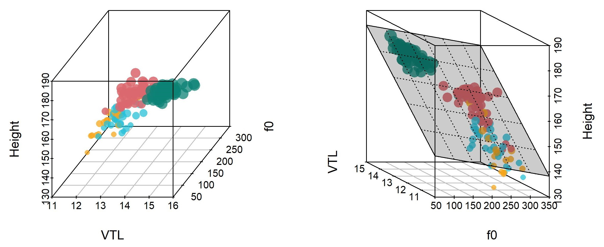
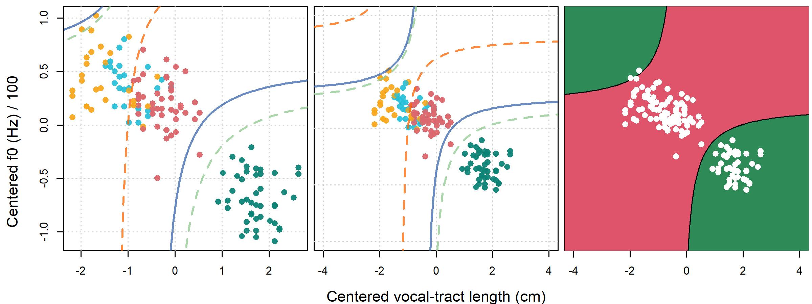
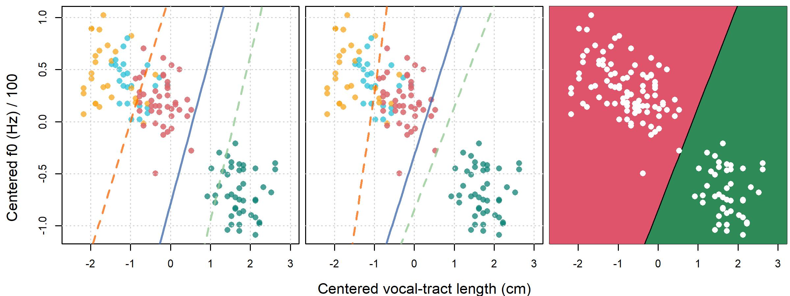

\newpage
```{r, include = FALSE}
knitr::opts_chunk$set(
  dpi = 300, dev = "jpeg", collapse=TRUE
)
#options(knitr.duplicate.label = "allow")
```

# Multiple quantitative predictors, dealing with large models, and Bayesian ANOVA

Santiago Barreda
https://orcid.org/0000-0002-1552-083X

Noah Silbert
https://orcid.org/0000-0003-2515-384X

Abstract:


In this chapter we introduce models with multiple quantitative predictors and interactions between them. After that, we will have covered the basic modeling concepts necessary to fit most linear models. The models you fit to your own data will include some combination of the elements covered in the previous chapters, and can potentially result in large models with hundreds (or thousands) of estimated parameters. Traditionally, models with many estimated parameters have had three general problems:

1) A model with many predictors may have 'too many' predictors. We will vaguely define 'extra' predictors as those which have no meaningful statistical association with your dependent variable, and which do not appreciably improve your model in any way. Sometimes, the 'extra' predictors have estimated values that are difficult to distinguish from those of the 'real' parameters, leading to incorrect conclusions.  
  
2) A model with many parameters may have more difficulties with fitting/convergence, meaning you can't get good estimates for the model coefficients. Regardless of the approach to parameter estimation, more-complicated models make it more difficult to find the optimal parameter values given the data and chosen model structure. 

3) It can be difficult to interpret a model with hundreds (or thousands) of parameters. With so many parameters it is important to not miss the forest for the trees, that is, not consider every parameter in isolation to the detriment of understanding what information your fitted model provides in general.
  
In this chapter we're going to cover a Bayesian approach to working with large models. First we're going to discuss how working with multilevel Bayesian models can help us with problems (1) and (2) above. After that we're going to discuss an easy way to approach problem (3) using our Bayesian models.

Before continuing, we should note that designs with many quantitative predictors, factors, and interactions between these can result in very complicated models which then have to be interpreted. However, the researcher is ultimately the one who determines the complexity of the analysis they are then faced with. Once when Santiago was buying a backpack for traveling, he was looking for the biggest backpack possible. One of the reviews said "1/5 stars, it was way too heavy when I filled it all the way up with my stuff". However, if we buy a large backpack and fill it with many heavy things, it doesn't seem fair to blame the backpack when it becomes difficult to carry. In the same way, if you are faced with a complex model that you then need to interpret, you shouldn't blame the model, `brms`, or us, for your predicament. 

In order to avoid a situation where you end up with data you can't analyze or a model you can't interpret, it's worth considering the following questions *before* advancing to the data collection stage of your experiment: 

  * How will I analyze the data? Will I be able to carry out my planned analysis? 
  * What will the model structure be? 
  * What kind of results am I expecting? 
  * How will expected results be reflected by the model parameters? How would different results manifest in the model parameters?


## Chapter pre-cap

In this chapter, a discussion of how Bayesian multilevel models are well suited for the analysis of complex models with large numbers of parameters is presented, and some strategies for interpreting these models are given. A model with two quantitative predictors and an interaction between them is outlined, and the model is fit and interpreted. Bayesian analysis of variance (ANOVA) and Bayesian ANOVA plots are introduced, and these are applied to the initial model presented in the chapter. Following that, a complex multilevel logistic regression model is fit, and then interpreted using a Bayesian ANOVA. After this, a discussion of how this model can be used to interpret classification and listener behavior is explained. Finally, there is a discussion of model selection and misspecification, and some diagnostics that can help find and diagnose problems in large models are presented. 

## Models with multiple quantitative predictors

Our regression models so far have only involved at most a single quantitative predictor. This means that the relationship between the dependent variable and our predictor formed surfaces with a single dimension: Lines. In the left and middle plots in figure \@ref(fig:F11-1) we see the linear relationships between speaker vocal-tract length (VTL) and fundamental frequency (f0) with apparent speaker height (see chapter 1, or 13, for more information on these variables). In each case, the expected value for the y-axis variable is the value of the line at each x-axis location. The residual, the error in the prediction of each observation, is the vertical distance between the line and the observation.   

```{r F11-1, fig.height = 2.75, fig.width = 8, fig.cap='(left) Average apparent height reported for each speaker plotted against speaker vocal-tract length (VTL). Point size reflects average apparent height. (middle) Same as the left plot but comparing apparent height to f0. (right) A comparison of VTL and f0 for each speaker.', echo = FALSE, cache = FALSE}

###############################################################################
### Figure 11-1
###############################################################################

agg_data = aggregate (height~f0+vtl+C_v, data = bmmb::exp_data, FUN=mean)
agg_data = agg_data[nrow(agg_data):1,]

ptcex = agg_data[,4] - min(agg_data[,4])
ptcex = 1 + (ptcex / max(ptcex))*1.5

par (mfrow = c(1,3), mar = c(4,4,1,1))
plot (agg_data[,c(2,4)],pch=16,col = bmmb::cols[2:5][factor(agg_data[,3])], 
      cex=ptcex,xlab="VTL (cm)",ylab="Height (cm)",cex.lab=1.3,cex.axis=1.3)
abline (lm(agg_data[,c(4)]~agg_data[,c(2)]),lwd=2,lty=2)
grid()
plot (agg_data[,c(1,4)],pch=16,col = bmmb::cols[2:5][factor(agg_data[,3])], 
      cex=ptcex,xlab="f0 (Hz)",ylab="Height (cm)",cex.lab=1.3,cex.axis=1.3)
abline (lm(agg_data[,c(4)]~agg_data[,c(1)]),lwd=2,lty=2)
grid()

plot (agg_data[,c(1,2)],pch=16,col = bmmb::cols[2:5][factor(agg_data[,3])], 
      cex=ptcex,xlab="f0 (Hz)",ylab="VTL (cm)",cex.lab=1.3,cex.axis=1.3)
grid()

```

We can also think about how apparent height, VTL, and f0 vary together. Every point in figure \@ref(fig:F11-1) has a specific value of f0, VTL, and apparent height. These three quantitative variables can be thought of as defining a single location in a 3-dimensional space. Imagine you had a clear plastic cube containing points arranged as in \@ref(fig:F11-1) inside it, where each dimension along the cube represented one of the dimensions in the figure. Looking 'through' the cube at different orientations would result in arrangements just like the plots in figure \@ref(fig:F11-1). The first plot shows the view through the VTL side, and the second plot shows the view down the f0 side, a 1/4 rotation of the cube. The final plot shows the view down through the top of the cube.  

It may be easier to see what we mean in figure \@ref(fig:F11-2), which attempts to present our points in three dimensions. The left plot of figure \@ref(fig:F11-2) corresponds (more or less) to the left plot in figure \@ref(fig:F11-1), while the right plot of figure \@ref(fig:F11-2) corresponds (more or less) to the middle plot in figure \@ref(fig:F11-1). When we have two quantitative predictors, our models predict values along **planes** rather than lines. If we want to predict apparent height based on speaker f0 and VTL, we are basically asking: Can we predict the height of a point in our 3-dimensional space (i.e., location on the vertical z axis) based on its x and y-axis location? 

```{r F11-2, fig.height = 4, fig.width = 8, fig.cap='(left) A three-dimensional plot of the variables presented in figure \\@ref(fig:F11-1). (right) The same as the left plot but the cube has been rotated 90 degrees counter-clockwise.', echo = FALSE, cache = FALSE}

################################################################################
### Figure 11.2
################################################################################



# agg_data = aggregate (height~f0+vtl+C_v, data = bmmb::exp_data, FUN=mean)
# colnames(agg_data) = c("f0","VTL","C_v","Height")
# 
# 
# par (mfrow = c(1,2), mar = c(0,1,0,2), oma = c(0,0,0,0))
# 
# tmp = agg_data[,c(2,1,4)]
# s3d = scatterplot3d::scatterplot3d (tmp, color = bmmb::cols[2:5][factor(agg_data[,3])],
#                      pch=16, angle = 55,type = "p",ylim=c(90,310), cex.symbols=rev(ptcex)*.9)
# my.lm <- lm(Height ~ f0+VTL, data = agg_data)
# #s3d$plane3d(my.lm, col = 1)
# 
# s3d = scatterplot3d::scatterplot3d (agg_data[,-3],pch=16, angle = 155,
#                                     color = bmmb::cols[2:5][factor(agg_data[,3])],    
#                                     type = "p",xlim=c(90,310),
#                                     cex.symbols=rev(ptcex)*.9)
# my.lm <- lm(Height ~ f0+VTL, data = agg_data)
# s3d$plane3d(my.lm, col = 1,lty=3, draw_polygon=TRUE,
#             polygon_args = list(col = rgb(0, 0, 0, 0.2)))
```

For example, any given point in the room you are sitting in right now can be specified using three variables that determine its location along the width, depth, and height of the room. Imagine the points in figure \@ref(fig:F11-2) were floating in the room with you, arranged just as in the figure. You are given a large flat board (a *plane*) and asked to find the 'best' orientation for the board. When we fit lines, we preferred those that tended to minimize the residuals, the y-axis distance of the points to the line. The same principle holds when we fit models with two (or more) quantitative predictors. In general, planes are 'better' when they minimize the distance from each point to the surface of the plane along the axis representing the dependent variable. Though it's a bit more complicated than this for multilevel models, this general principle (i.e. the minimization of the residuals) still applies. In the right plot of figure \@ref(fig:F11-2), we see the plane that results in the smallest residuals for our points, i.e. the smallest distances between the surface of the plane and the points along the apparent height axis.   

In equation \@ref(eq:11-1) we see that the height of the plane along the z axis is determined by an intercept ($a$) plus the product of the x axis coordinate and its slope ($b$), and the product of the y axis coordinate and its slope ($c$). When we fit a model that includes two quantitative predictors, the model represents the planes it estimates using their $a$, $b$, and $c$ parameters. 
  
$$
\begin{equation}
z =  \mathrm{a} + \mathrm{b} \cdot x + \mathrm{c} \cdot y 
(\#eq:11-1)
\end{equation}
$$

Since the plane has two dimensions it has two slopes: A field can be uphill/downhill away from you, but also be up/downhill left to right. The slope coefficient for each quantitative predictor changes the slope of the plane independently for each dimension. In fact, the slope of each predictor reflects the expected change in the dependent variable when all other predictors are *held constant*. The intercept of the model slides the planes up/down the z axis without changing their slopes along either the x or y dimensions. 

Our discussion above has been entirely about planes, and we will stick to two quantitative predictors for our models. However, your model can include any number of quantitative predictors, it just gets harder to have good intuitions about the geometry involved. If your model has $n$ quantitative predictors, your data specifies points in an $n+1$ dimensional space, where dimension $n+1$ represents the dependent variable. Residuals in such models represent the difference between the surface of the $n$ dimensional shape specified by the predictors, and the position of each point along the $n+1$ dimension. 
  
## Interactions between quantitative predictors

Models with two quantitative predictors model variation in the dependent variable along planes. The 'interaction' between quantitative variables in regression models is represented by adding a new predictor, the **cross-product** (i.e. $x \cdot y$) of the two variables. We can add a term representing the interaction between our two quantitative predictors to equation \@ref(eq:11-2). It's common to refer to this term as the 'interaction' between our quantitative predictors, and we will adopt this convention. Just keep in mind that we are actually referring to the product of the two variables.  

$$
\begin{equation}
z =  \mathrm{a} + (\mathrm{b} \cdot x) + (\mathrm{c} \cdot y) + (\mathrm{d} \cdot x \cdot y)
(\#eq:11-2)
\end{equation}
$$

In general, interaction terms are parameters that allow for the effect of a predictor to vary according to the value of some other predictor. When it comes to quantitative predictors, an interaction means that the slope of each predictor continuously increases/decreases as a function of the value of the *other* predictor. Consider the equation below which omits the term $(c \cdot y)$ for the sake of simplicity. If we factor out the x from the second and third terms on the right, we can see that the slope for the x dimension, $b$, will vary as a function of the value of y and the interaction coefficient $d$.

$$
\begin{equation}
\begin{split}
z =  \mathrm{a} + (\mathrm{b} \cdot x) + (\mathrm{d} \cdot x \cdot y) \\
z =  \mathrm{a} + (\mathrm{b}) \cdot x + (\mathrm{d} \cdot y) \cdot x \\
z =  \mathrm{a} + (\mathrm{b} + \mathrm{d} \cdot y) \cdot x \\
\end{split}
(\#eq:11-3)
\end{equation}
$$

Imagine a case where the slope ($b$) along the $x$ dimension is fixed at 2 and the interaction term ($d$) is equal to zero. In this case there is no interaction between $x$ and $y$. When this happens the slope of $x$ is constant and does not change based on the value of $y$, as in \@ref(eq:11-4). 

$$
\begin{equation}
\begin{split}
b = 2, \; d = 0 \\
z =  \mathrm{a} + (\mathrm{b} + \mathrm{d} \cdot y) \cdot x \\
z =  \mathrm{a} + (2 + 0 \cdot y) \cdot x \\
z =  \mathrm{a} + 2  \cdot x \\
\end{split}
(\#eq:11-4)
\end{equation}
$$

Now consider a situation where the interaction term has some non-zero value (e.g. 1). In this case we *will* see the slope along x change as a function of the value of y. In \@ref(eq:11-5) we see that as y increases from 1 to 5, the effective slope along the x axis increases from 3 to 7. This reasoning also holds for the y dimension and also means that negative interactions result in a *decrease* in slopes as the value of variables increase.   

$$
\begin{equation}
\begin{split}
b = 2 , \; d = 1 , \; y = 1   \\
z =  \mathrm{a} + (2 + 1 \cdot 1) \cdot x \\
z =  \mathrm{a} + 3 \cdot x \\ \\ 
b = 2 , \; d = 1 , \; y = 5   \\
z =  \mathrm{a} + (2 + 1 \cdot 5) \cdot x \\
z =  \mathrm{a} + 7 \cdot x \\
\end{split}
(\#eq:11-5)
\end{equation}
$$

The inclusion of cross-product terms means that we are not modeling variation along planes anymore, but rather along **hyperbolic parabaloids**. Sometimes these sorts of surfaces are referred to as **saddle surfaces** because they contain what's known as a **saddle point**, a point where the slopes along the x and y dimension are both equal to zero. Informally, a saddle point can be thought of as the flat spot in the middle of a shape that curves along two dimensions in a manner resembling a horse saddle. We're often going to refer to hyperbolic parabaloids as *saddles* because their full name is a bit of a mouthful, and because we are mainly interested in contrasting these with planes. However, it's important to keep in mind that hyperbolic parabaloids are one among many types of saddle surface. 

The function for a hyperbolic parabaloid can be seen below, where the height of the surface is equal to the product of some parameter $d$ and its $x$ and $y$ coordinates. 

$$
\begin{equation}
z = d \cdot x \cdot y 
(\#eq:11-6)
\end{equation}
$$

Clearly, the interaction of quantitative predictors results in a saddle shape as defined in \@ref(eq:11-6). When our models include effects for x, y, *and* their interactions (cross product), we are effectively modeling a surface that combines a plane and a saddle shape, as in equation \@ref(eq:11-2). In figure \@ref(fig:F11-3) we can see a comparison of a plane in the top row and a saddle shape in the middle row. In the middle row on the left we can imagine that if we were walking 'into' the plot, the ground would first be sloping down left to right. However, as we proceeded into the plot the ground would gradually change so that it is sloping up from left to right further into the figure. In other words, the left-to-right slope would gradually increase as we walk further into the plot.  

```{r F11-3, fig.height = 6, fig.width = 8, fig.cap='(top row) Three perspectives of the same plane. (middle row) Three perspectives of the same saddle shape. (bottom row) Three perspectives of the sum of the plane and the saddle shape in the top two rows.', echo = FALSE, cache = FALSE}

################################################################################
### Figure 11.3
################################################################################

f1 = function (a,b,c) a * 1 + b *1  
f2 = function (a,b,c) a*b*2
f3 = function (a,b,c) a * 1 + b *1 + a*b*2

x <- y <- seq(-1, 1, length= 12)

par (mfrow = c(3,3), mar = c(1,1,0,0), oma = c(0,0,0,0))

z <- outer(x, y, f1)
persp(x, y, z, col = bmmb::cols[2],theta = 0,zlim = c(-3,3))
persp(x, y, z, col = bmmb::cols[2],theta = -90,zlim = c(-3,3))
persp(x, y, z, col = bmmb::cols[2],theta = 45,zlim = c(-3,3))

z <- outer(x, y, f2)
persp(x, y, z, col = bmmb::cols[3],theta = 0,zlim = c(-3,3))
persp(x, y, z, col = bmmb::cols[3],theta = -90,zlim = c(-3,3))
persp(x, y, z, col = bmmb::cols[3],theta = 45,zlim = c(-3,3))

z <- outer(x, y, f3)
persp(x, y, z, col = bmmb::cols[4],theta = 0,zlim = c(-3,5))
persp(x, y, z, col = bmmb::cols[4],theta = -90,zlim = c(-3,5))
persp(x, y, z, col = bmmb::cols[4],theta = 45,zlim = c(-3,5))

```

We can combine a plane and a saddle, as in the bottom row of figure \@ref(fig:F11-3). The general formula for such a shape is presented below, and we've placed the terms in parentheses just to make it easier to interpret the equation. Notice that all we really did was add the term for the saddle shape in \@ref(eq:11-6) to the plane in \@ref(eq:11-1). 

$$
\begin{equation}
z =  \mathrm{a} + (\mathrm{b} \cdot x) + (\mathrm{c} \cdot y) + (\mathrm{d} \cdot x \cdot y)
(\#eq:11-7)
\end{equation}
$$

When you include interactions between quantitative predictors in your regression models, it is very important to center these predictors, if only for use as the cross product. To see why, we generate two samples of 100 random Gaussian variables (`x, y`) with a mean of 500 and a standard deviation of 1. These variables are almost totally uncorrelated (-0.00099) and yet their cross product (`xy`) is strongly correlated with both variables (0.683, and 0.729). This happens because the cross product of two values that are both positive or both negative will always be greater when one of the variables increases in magnitude. In other words, the value of $x \cdot (y+a)$ will *always* be greater than the value of $x \cdot y$ for some positive value of $a$, as long as $x$ and $y$ are both positive or negative.  

```{r}
set.seed(1)
x = rnorm (100,500,1)
y = rnorm (100,500,1)
xy = x*y

cor (cbind(x,y,xy))
```

The above correlation arises because our values are far from, and do not cross, zero much. We can help minimize this sort of correlation if we center `x` and `y`. When we do this, the centered values (`x_c, y_c`) will vary around zero: They will be positive when they are above the sample mean and negative when they are below it. Under these conditions their cross product (`xy_c`) will only have a large magnitude when both variables have values above or below their mean at the same time. The result, as can be seen below, is that centering can dramatically reduce the correlation between quantitative predictors and the interaction between them. Given this and the lack of a compelling reason to not center in most cases, you should consider centering quantitative predictors routinely whenever you plan to include interactions between these in your models. 

```{r}
x_c = x - mean (x)
y_c = y - mean (y)
xy_c = x_c * y_c

cor (cbind(x_c,y_c,xy_c))
```

### Data and research questions

The models we fit in chapter 9 and 10 were missing an obvious and important predictor: The fundamental frequency (f0) of the speaker's voice. The fundamental frequency of a sound is the main acoustic correlate of perceived pitch. We know from previous studies that, in general, speakers with lower speaking f0s tend to be identified as taller (see chapter 13 for a discussion of this). In this section, we're going to fit a model that tries to predict apparent height from VTL, f0, and the interaction of the two. 

Below we load our packages and data, and center our quantitative predictors. We also scale f0 so that it has a reasonably similar between-group difference as the VTL predictor. Specifically, the average difference in VTL between adult females and males is about 2 cm, and the difference in f0 between the groups is about 100 Hz. This means that if we divide f0 by 100 the difference between men and women is about 1 unit, comparable to the 2 unit difference between these groups in VTL. The reason we don't divide by 50 to make them even more similar is that dividing by 100 results in frequencies being represented in hectohertz (1 hectohertz = 100 Hertz), which is easier to interpret than 50 Hz units. 

```{r, warning=FALSE, message=FALSE}
library (brms)
library (bmmb)
options (contrasts = c('contr.sum','contr.sum'))

data (exp_data)

# center VTL
exp_data$vtl_original = exp_data$vtl
exp_data$vtl = exp_data$vtl - mean (exp_data$vtl)

# center and scale f0
exp_data$f0_original = exp_data$f0 
exp_data$f0 = exp_data$f0 - mean(exp_data$f0)
exp_data$f0 = exp_data$f0 / 100
```

We're not going to have well-defined research questions this time. Instead, we have a more 'meta' question that we will try to deal with:

(Q1) What do we do with all these parameters? How do we know what to focus on, and where to begin?

### Description of the model {#c11-description-1}

We're going to begin with a model that includes all possible interactions between our predictors, and also includes listener-dependent versions of all of our 'fixed' effects parameters. Models of this sort are sometimes referred to as **maximal** models because they include the maximal (i.e. most complicated) random effects structure 'supported' by the data (see section \@ref(c8-identifiability)). This means that we include corresponding 'random' listener effects for each of our 'fixed' effects predictors. However, notice that we don't include any speaker-dependent predictors in our model (other than intercepts). This is because each speaker had a single f0 and VTL, and many were only identified as either male or female, or only as either adults or children. As a result, estimating interactions between these predictors and speaker is not *supported* by our data. Our model formula is:

`height ~ vtl*f0*A*G + (vtl*f0*A*G|L) + (1|S)`

We're going to use the same priors we used for our regression models in chapter 9. We won't present the full model description as this is too long at this point, and all of the required elements have already been presented and discussed at this point. However, we can talk about all our model coefficients and what they mean for our model. Below is an 'expanded' version of our model formula that spells out all of the fixed effect parameters implied by the formula above.

```
height ~ Intercept + vtl + f0 + A + G + 
         A:G1 + vtl:f0 + vtl:A + vtl:G + f0:A + f0:G + 
         vtl:f0:A + vtl:f0:G + vtl:A:G + f0:A:G + vtl:f0:A:G
```

We can group these parameters together based on the way they affect the surfaces they represent: Intercept parameters (`a`), VTL slope parameters (`b`), f0 parameters (`c`), and VTL:f0 interaction parameters (`d`).

```
a = Intercept + A        + G        + A:G 
b = vtl       + vtl:A    + vtl:G    + vtl:A:G
c = f0        + f0:A     + f0:G     + f0:A:G
d = vtl:f0    + vtl:f0:A + vtl:f0:G + vtl:f0:A:G
```

Notice that there is a symmetry to the parameters for each 'dimension' in our model. Each one contains a 'main effect' term (`Intercept, vtl, f0, vtl:f0`), an interaction with apparent age (`A, vtl:A, f0:A, vtl:f0:A`), an interaction with apparent gender (`G, vtl:G, f0:G, vtl:f0:G`), and an interaction with apparent age *and* gender (`A:G, vtl:A:G, f0:A:G, vtl:f0:A:G`). This means that our models have intercepts, slopes (along two dimensions), and a saddle component (`d`), that can each vary as a function of apparent gender, age, and the interaction of the two. This is a complicated model, which is why it has so many parameters. In fact, it actually has many more parameters than this. For example, to calculate the listener dependent `a,b,c` and `d` parameters, which we can call `a_L, b_L, c_L` and `d_L`, we would need to add the following (hypothetical) parameters (implied by this `(vtl*f0*A*G|L)`) to our calculations. 

```
a_L = a + Intercept:L + A:L        + G:L        + A:G:L 
b_L = b + vtl:L       + vtl:A:L    + vtl:G:L    + vtl:A:G:L
c_L = c + f0:L        + f0:A:L     + f0:G:L     + f0:A:G:L
d_L = d + vtl:f0:L    + vtl:f0:A:L + vtl:f0:G:L + vtl:f0:A:G:L
```

As a result, the calculation of the intercept alone would actually be:

`a = Intercept + A + G + A:G + Intercept:L + A:L + G:L + A:G:L`

Which can be rearranged to show that it is simply the sum of each corresponding 'fixed' effect and the corresponding listener-dependent effect.

`a = (Intercept + Intercept:L) + (A + A:L) + (G + G:L) + (A:G + A:G:L)`

This relatively complex model has been built up out of parts: We discussed the decomposition of intercepts into multiple factors, as in $a$ in chapter 7. We discussed the inclusion of quantitative predictors and the decomposition of variation in these, as in $b$ and $c$ in chapter 9. Now, we discuss the addition of more quantitative predictors ($c$) and the interactions between these ($d$). Effectively, we have been incrementally adding complexity to our models and, from here on, increasing complexity mostly consists of sticking together larger numbers of these basic components in different ways. 

We said we weren't going to provide a formal definition of this model, but if we had, the first few lines might have looked something like this: 

$$
\begin{equation}
\begin{split}
\mathrm{height}_{[i]} \sim \mathrm{t}(\nu, \mu_{[i]},\sigma) \\ 
\mu_{[i]} = a_{[i]} +  (b_{[i]} \cdot \mathrm{vtl}_{[i]}) + (c_{[i]} \cdot \mathrm{f0}_{[i]}) + (d_{[i]} \cdot \mathrm{f0}_{[i]} \cdot \mathrm{vtl}_{[i]}) \\
\ldots
\end{split}
(\#eq:11-8)
\end{equation}
$$

And the following lines would have described $a$, $b$, $c$, and $d$ as the sum of the appropriate model parameters as we did above (for `a` and `a_L`). Below, we provide an abbreviated plain English description corresponding to this formula: 

`height ~ vtl*f0*A*G + (vtl*f0*A*G|L) + (1|S)`. 

> Apparent speaker height is predicted based on two quantitative variables, speaker f0 and VTL, and two categorical variables, apparent gender and apparent age. Our model includes all possible interactions between these predictors, resulting in 16 'fixed' effects predictors (see above). Our model also included listener dependent effects for all fixed effects, which were drawn from a 16-dimensional normal distribution whose standard deviations and covariance matrix were estimated from the data. Our model included speaker dependent intercepts drawn from a normal distribution with a mean of zero and a standard deviation estimated from the data. All remaining parameters were given prior distributions appropriate for their expected range of values.

### Fitting the model

We fit our model using the code below:

```{r, eval = FALSE}
# Fit the model yourself
priors = c(brms::set_prior("student_t(3,160, 12)", class = "Intercept"),
           brms::set_prior("student_t(3,0, 12)", class = "b"),
           brms::set_prior("student_t(3,0, 12)", class = "sd"),
           brms::set_prior("lkj_corr_cholesky (2)", class = "cor"), 
           brms::set_prior("gamma(2, 0.1)", class = "nu"),
           brms::set_prior("student_t(3,0, 12)", class = "sigma"))

model_height_vtl_f0 =  
  brms::brm (height ~ vtl*f0*A*G + (vtl*f0*A*G|L) + (1|S), data = exp_data, 
             chains = 4, cores = 4, warmup = 1000, iter = 5000, thin = 4, 
             prior = priors, family = "student")
```
```{r, include = TRUE, eval = FALSE}
# Or download it from the GitHub page:
model_height_vtl_f0 = bmmb::get_model ('11_model_height_vtl_f0.RDS')
```
```{r, include = FALSE, eval = TRUE}
# saveRDS (model_height_vtl_f0, '../models/11_model_height_vtl_f0_noint.RDS')
model_height_vtl_f0 = readRDS ('../models/11_model_height_vtl_f0.RDS')
```

Normally this is where we would discuss and interpret the characteristics of our model. We're going to leave this for chapter 13, where we present a model very similar to this in a format more similar to what you might see in an academic journal. Instead, we will discuss some advantages of working with Bayesian models over some more 'traditional' (although still modern) approaches. 

### Advantages of Bayesian multilevel models for large models

At this point we have learned enough components to build very large and complicated models, like the one we fit above. Traditionally, models with many predictors have presented researchers with some combination of the three general problems outlined at the beginning of this chapter. In this section we're going to discuss how working with multilevel Bayesian models can help us with problems (1) and (2) above. In the following section we'll discuss an approach to solving problem (3) as well.   

The Bayesian models fit by `brms` have two properties that help minimize the first two problems above. First, the use of prior probabilities and shrinkage, when properly applied, tend to 'pull' weakly-supported parameter values closer to the group mean (or to zero). This can help reduce many of the problems associated with models with large numbers of parameters (Gelman et al. 2012). Second, the fact that credible intervals are provided for all parameters helps distinguish random variation from variation that is unlikely to be small or zero. 

To this point, we have not discussed the `lmer` function (from the `lme4` package) very much apart from in 'Traditionalist corner' at the end of some chapters. The `lmer` function (linear mixed-effects regression) is an extremely popular and extremely useful function. In general, `lmer` and an equivalent model specified in `brms` should result in very similar results when fit to the same data. However, there are some important differences between the two approaches. First, rather than provide a distribution of samples for each parameter, `lmer` returns *point estimates* representing the *best* values of parameters, in addition to estimated intervals around some (but not all) parameters. A second difference between `lmer` and our Bayesian multilevel models is that `lmer` doesn't use prior probabilities to estimate most of its parameters. This can cause some problems when estimating large numbers of parameters without large amounts of data. 

We're going to compare the output of `lmer` and `brms` for the model we fit above. Just to be clear, our intention in comparing `lmer` and `brms` is not to compare different statistical *philosophies* or epistemological systems. Our aim is much, much more modest than that. We simply wish to compare `brms`, an approach that 1) uses priors, and 2) provides intervals for all parameters, to a broadly similar approach that does not (`lmer`). Below we fit a model equivalent to `model_height_vtl_f0` using `lmer`.

```{r, eval = FALSE}
# Fit the model yourself
lme_model_height_vtl_f0 =
  lme4::lmer (height ~ vtl*f0*A*G + (vtl*f0*A*G|L) + (1|S), 
              data=exp_data,verbose = TRUE,
              control=lme4::lmerControl(optCtrl=list(maxfun=20000),optimizer="bobyqa"))
```
```{r, include = TRUE, eval = FALSE}
# Or download it from the GitHub page:
lme_model_height_vtl_f0 = bmmb::get_model ('11_lme_model_height_vtl_f0.RDS')
```
```{r, include = FALSE, eval = TRUE}
#saveRDS (lme_model_height_vtl_f0, '11_lme_model_height_vtl_f0.RDS')
lme_model_height_vtl_f0 = readRDS ('../models/11_lme_model_height_vtl_f0.RDS')
```

We won't show the model print statements as they are both quite large, but we compare the estimates of our fixed effects in figure \@ref(fig:F11-4). Clearly, the two approaches provide very similar estimates for the model fixed effects. That's reassuring because if results differed dramatically for approximately the same model based on the software used, we would need to think very carefully about the causes and possible meaning of these differences. 

```{r F11-4, fig.height = 3.5, fig.width = 8, fig.cap='A comparison of fixed effect estimates provided by the brms (red) and lmer (black) models. The brms intervals are the 95% credible intervals, those for lmer are twice the standard error of the parameter estimate. Filled points have 95% credible intervals that exceed 0.5 cm.', echo = FALSE, cache = FALSE}

################################################################################
### Figure 11.4
################################################################################
pts = lme4::fixef (lme_model_height_vtl_f0)[-1]
err_bars = summary (lme_model_height_vtl_f0)$coefficients[-1,2]

fixefs = brms::fixef (model_height_vtl_f0)[-1,]
good = (fixefs[,3] < -0.5 & fixefs[,4] < -0.5) | (fixefs[,3] > 0.5 & fixefs[,4] > 0.5) 
pchs = ifelse (good, 16,1)

par (mfrow = c(1,1), mar = c(6,4,1,1))
bmmb::brmplot (brms::fixef (model_height_vtl_f0)[-1,], ylim = c(-7,10),las=2, pch=pchs,lwd=2)
points (brms::fixef (model_height_vtl_f0)[-1,1], pch=pchs,lwd=2,cex=1.5)
points ((1:15)+.2, pts, cex=1.5,lwd=2,col=2,pch=16)
segments((1:15)+.2, pts-2*err_bars,(1:15)+.2, pts+2*err_bars,lwd=2,col=2)

abline (h = c(-0.5,0.5), lty = 3, col = bmmb::cols[6],lwd=2)
```

Since our model has a large number of parameters we're going to focus on interpreting those that seem likely to result in 'meaningful' differences in apparent height, about 1 cm (as discussed in Section \@ref(c7-answering)). We will discuss the Bayesian model fixed effects, which you can see by running `fixef(model_height_vtl_f0)`. Our model suggests non-zero slopes for our plane along the VTL (mean = 3.12, s.d. = 0.64, 95% C.I = [1.85, 4.4]) and f0 dimensions (mean = -3.52, s.d. = 1.45, 95% C.I = [-6.32, -0.63]). However, there is not much evidence that the cross-product term (`vtl:f0`) has a meaningful non-zero value (mean = -1.28, s.d. = 1.05, 95% C.I = [-3.32, 0.81]). This means that our responses can be predicted by a flat plane along f0 and VTL without curving the plane into a saddle shape. The `vtl:A1` interaction suggests a differing use of VTL based on apparent adultness (mean = -2.02, s.d. = 0.51, 95% C.I = [-3.03, -1.02]), but there do not appear to be any other meaningful interactions between VTL, f0 and the other predictors. 

In terms of intercept terms (i.e. those not interacting with quantitative predictors), there is a large effect for apparent age (mean = 7.04, s.d. = 1.18, 95% C.I = [4.69, 9.35]) but no main effect for apparent gender (mean = -0.17, s.d. = 0.75, 95% C.I = [-1.63, 1.36]). However, the interaction between apparent age and apparent gender (`A1:G1`) had a 95% credible interval that did not overlap with zero and had a posterior mean value of -1.72 cm (s.d. = 0.61, 95% C.I = [-2.9, -0.5]). This indicates that although apparent gender had an average effect of about 0 cm on apparent height it may have had meaningful, but opposite, effects based on the apparent age of the speaker. 

In order to interpret our predictors in the presence of interactions, we need to consider the simple effects. For example, in order to consider the `vtl:A1` interaction we need to find the simple effect of VTL for apparent children, and then for apparent adults. This is done in the manner outlined in chapter 9 for quantitative predictors, independently for each dimension (predictor or cross-product).  We're not going to go over the interpretation of the coefficients and the reconstruction of the simple effects here, as this will be carried out in chapter 13.  

Whereas figure \@ref(fig:F11-4) focused on the similarity of our `lmer` and `brm` models, figure \@ref(fig:F11-5) presents some ways that these models differ. In the top row we see a comparison of the 'random effects' standard deviation estimates, and the error terms (i.e., `sigma` or $\sigma$), estimated by our two models. For example, the standard deviation of the listener f0 'random effect' (`f0:L`, $\sigma_{F0 \colon L}$) represents the amount of variation between the listener-specific effects for f0 in each model. As we can see, the models provide reasonably similar standard deviation estimates for many, if not most, parameters. However, note that the `brm` model provides intervals for all parameters, while the `lmer` model only provides point estimates for these.

```{r F11-5, fig.height = 5, fig.width = 8, fig.cap='Points and intervals represent means and 95% credible intervals for brms parameter estimates for `model_height_vtl_f0`. Crosses indicate point estimates provided in `lme_model_height_vtl_f0`. (top) Estimates of random effect standard deviations. (middle) Estimates for the listener dependent effects of apparent age. (bottom) Estimates of correlations between listener random effects.', echo = FALSE, cache = FALSE}

################################################################################
### Figure 11.5
################################################################################

Ssd = attr(lme4::VarCorr(lme_model_height_vtl_f0)[[1]],'stddev')
Lsd = attr(lme4::VarCorr(lme_model_height_vtl_f0)[[2]],'stddev')
lmer_vars = c(sigma(lme_model_height_vtl_f0), Lsd, Ssd)
vars_final = bmmb::banova (model_height_vtl_f0, superpopulation =TRUE)
vars_final = vars_final[vars_final$cluster != "fixefs",]

layout (m=1:3, heights = c(.4,.3,.3))
par (mar = c(5,4,.5,1))
bmmb::brmplot (vars_final, ylim = c(0,8.5), las = 2,cex.axis=1.3,
               col=bmmb::cols[14],yaxs="i", labels = "")
points (lmer_vars, cex=3,lwd=3,col=bmmb::cols[2],pch=4)
axis (1:nrow(vars_final), labels = rep("",nrow(vars_final)),side=1)
text (1:nrow(vars_final),-.5,rownames(vars_final), srt=35, 
      xpd = TRUE, adj = 1, cex=1.2)

pts = lme4::ranef(lme_model_height_vtl_f0)$L[,4]

par (mar = c(.5,4,.5,1))
bmmb::brmplot (brms::ranef(model_height_vtl_f0)$L[,,4],labels="", col = bmmb::cols[8])
points ((1:15), pts, cex=3,lwd=3,col=bmmb::cols[7],pch=4)


corrs_lme = attr(lme4::VarCorr(lme_model_height_vtl_f0)$L,"correlation")
corrs_lme = corrs_lme[lower.tri (corrs_lme)]
corrs_brms = bmmb::getcorrs(model_height_vtl_f0, "L")

bmmb::brmplot (corrs_brms, ylim = c(-.97,.97), las = 2, labels = "",line=FALSE,col=bmmb::cols[4])
abline (h=0)
points (corrs_lme, cex=1.5,lwd=3,pch=4, col = bmmb::cols[12])

```

The lack of intervals on parameter estimates makes it difficult to 'rule out' variance parameters since they will *never* equal exactly zero. So, we will always have non-zero estimates for these parameters, and 'secretly' some of these are zero or nearly zero. Notice that it is difficult to predict which standard deviation parameters are distinguishable from zero based on their magnitude alone. For example, consider `G1:L` and `vtl:f0:G1:L` in figure \@ref(fig:F11-5). Our `lmer` model provides estimates of about the same magnitude for these two components, but our `brms` model credible intervals suggest that one of these is likely to be larger than the other. So, we can use our credible intervals to figure out which variance components are unlikely to matter: Variance components whose credible intervals are concentrated near zero. There are several such components in figure \@ref(fig:F11-5). For example, consider the listener-dependent interaction between VTL and apparent gender `vtl:G1:L`. If this variation is non zero, in the *best case*, this component reflects a tiny amount of systematic variation in our outcomes and so is unlikely to matter much. 

Variance components very close to zero can sometimes cause problems when estimating models. For example, fitting our `lmer` model resulted in the following error: 

`boundary (singular) fit: see help('isSingular')`

Which warns us that some of the variance components we are trying to estimate are quite small. However, the estimation of small variance components is not generally problematic for models fit using `brms` (and *Stan*). 

In the middle plot of figure \@ref(fig:F11-5) we see a comparison of the listener-dependent `A1` 'random effects' (i.e. `A1:L`) estimated using `brms` and `lmer`. Just as with the estimates of the fixed effects in the middle plot of figure \@ref(fig:F11-4), we see a close alignment between the two approaches. However, just as for our standard deviation terms, we see that a lack of intervals around our `lmer` estimates makes it difficult to compare our parameter estimates to specific values (such as zero). 

Finally, in the bottom plot of figure \@ref(fig:F11-5) we compare the correlations for the listener random effects across the two models. Since there were 16 listener-dependent parameters, we needed to estimate 120 unique correlations between these parameters. As with our standard deviation parameters, `brms` gives us intervals while `lmer` returns point estimates. In addition, for the first time we see a substantial difference between the estimates provided by `lmer` and those provided by `brms`. This is likely a result of the fact that `lmer` does not use adaptive pooling, or shrinkage, to estimate correlations. As a result, we see that the `lmer` estimates vary substantially around 0 while the `brms` estimates are mostly close to zero and have intervals that include zero. We see that in this case our Bayesian model protects us by: 1) Providing credible intervals for all parameters, letting us accept values of zero as likely, and 2) the LKJ prior we used for our random effect correlation matrices pulls weakly-supported correlations to zero, thereby protecting against spurious results. 

The fact that most of our correlation estimates are nearly zero not only lets us rule many out as not interesting, but also focuses our attention on those correlations that *do* deviate from this pattern. For example, the third correlation from the left in the bottom plot of figure \@ref(fig:F11-5) represents the correlation between the listener-dependent intercepts and effects for apparent age. Although its 95% credible interval includes some very small values (mean = -0.38, s.d. = 0.17, 95% C.I = [-0.69, -0.01]), it seems reasonable that this correlation may in fact be negative and non-zero. In fact, we found this correlation in a previous model and also discussed why we think this correlation 'makes sense' (in section \@ref(c6-answering)). 
  
## Bayesian Analysis of Variance {#c11-BANOVA}

The information we presented in the previous section can be used to consider which predictors, or groups of predictors, are important for understanding variation in the dependent variable. This approach becomes more and more useful as our models increase in complexity and we end up with dozens or hundreds of parameters that we then need to interpret. The framework to be presented here is outlined by by Gelman and colleagues in Gelman (2005), Gelman and Hill (2006, chapter 22), and Gelman et al. (2013, chapter 15).

The **analysis of variance** (**ANOVA**) is a set of modeling techniques meant to help understand the components of variation in a dependent variable. A 'traditional' ANOVA tries to **decompose** variation in the dependent variable into independent components. It then carries out different statistical tests by relating the different variance components as ratios and comparing values to a reference distribution. If those statements make no sense to you, that's because that approach is fundamentally different to the sorts of things we've been doing with our multilevel Bayesian models. We're not going to talk about a 'traditional' ANOVA in any detail here as that would involve the introduction of a *parallel universe* of statistical concepts and jargon that has not been discussed in this book. In addition, there are many excellent treatments on the subject including Myers et al. (2013), Pedhazur and Schmelkin (2013), and Wickens and Keppel (2004). That being said, we can discuss how ANOVA features concepts that are very useful for Bayesian multilevel models. 

At its core ANOVA consists of thinking of variation in the dependent variable as the sum of a set of **components of variation** related to the predictors in our model. For example, consider the formula for `model_four_groups` we fit in chapter 7:

`height ~ C + (C|L) + (1|S)`

This formula implies a model with a relatively large number of parameters. These parameters can be thought of as 'batches' of thematically related coefficients. For example, we can think of the following batches of parameters:

  * 3 parameters representing the fixed effects for apparent speaker category `C`: `C1, C2, C3`.
  * 15 parameters representing the listener-dependent intercepts. 
  * 45 (15 $\cdot$ 3) parameters representing the listener-dependent effects for parameters `C1`, `C2`, and `C3`.  
  * 139 parameters representing the speaker-dependent intercepts. 

Each of these batches has a thematic or semantic link; these are not just parameters grouped at random. When we break up variation into thematically-grouped parameters, we are doing an **ANOVA-like decomposition** of variation of the dependent variable. We introduced this approach in chapter 7 without directly referring to ANOVA and have generally been using this approach to understand variation in our predictors throughout the book.  Here's what Gelman and Hill (2006) have to say about the analysis of variance in the context of multilevel models:

> "When moving to multilevel modeling, the key idea we want to take from the analysis of variance is the estimation of the importance of different batches of predictors (“components of variation” in ANOVA terminology). As usual, we focus on estimation rather than testing: instead of testing the null hypothesis that a variance component is zero, we estimate the standard deviation of the corresponding batch of coefficients. If this standard deviation is estimated to be small, then the source of variation is minor—we do not worry about whether it is exactly zero. In the social science and public health examples that we focus on, it can be a useful research goal to identify important sources of variation, but it is rare that anything is truly zero." (p. 490)

Batches of parameters that vary a lot from each other reflect large differences in our dependent variable across the parameters. Batches of parameters that vary a lot from each other will have large standard deviations, i.e., they will be dispersed around the mean for that batch. In contrast, parameters that do not vary much from each other will be represented by small standard deviations, and will generally be close to their mean. These parameters do not have a large effect on our data (since they do not vary much). 

For example, in figure \@ref(fig:F11-5) we see that the standard deviation of listener-dependent intercepts (`Intercept:L`, $\sigma_L$) is much larger than the listener-dependent interaction between VTL and apparent gender (`vtl:G1:L`, $\sigma_{VTL \colon G \colon L}$). We can see that this directly relates to the variation of each batch of 'random effects' around zero, as shown in figure \@ref(fig:F11-6). Whether or not $\sigma_{VTL \colon G \colon L}$ is *exactly* zero, we can look at figure \@ref(fig:F11-6) and see that this predictor does not predict much variation in our dependent variable. As a result of this, by inspecting the standard deviations in figure \@ref(fig:F11-5) we can see that although there are a large number of predictors, only a couple are having any meaningful effect on apparent height judgments. 

```{r F11-6, fig.height = 2.5, fig.width = 8, fig.cap='Listener-dependent intercepts (Intercept:L) and vtl:G1 interactions (VTL:G1:L).', echo = FALSE, cache = FALSE}

################################################################################
### Figure 11.6
################################################################################

par (mfrow = c(1,1), mar = c(4,4,.5,.5))

bmmb::brmplot (brms::ranef (model_height_vtl_f0)$L[,,"Intercept"], 
               col = bmmb::cols[9], line=TRUE, xlab = "Listener")
bmmb::brmplot (brms::ranef (model_height_vtl_f0)$L[,,"vtl:G1"], add = TRUE, 
         nudge = 0.1, labels = "", col = bmmb::cols[10],pch=17)

legend (11,10, legend =c("Intercept:L","VTL:G:L"),pch=16:17,horiz = TRUE,bty='n',
        col=bmmb::cols[9:10],pt.cex=1.5)
```
  
Gelman and Hill (2006) distinguish two types of standard deviations for a 'random' effect with J levels (p. 459) (emphasis ours):

> "The **superpopulation** standard deviation, which represents the variation among the modeled probability distribution from which they were drawn, is relevant for determining the uncertainty about the value of a new group not in the original set of J." 

> "The **finite-population** standard deviation of the particular J values of [some coefficient] describes variation within the existing data." 

So, the *finite-population* standard deviation terms reflect the variation we observe in our actual model parameters. This concept can be applied to batches of 'random' effects estimated with adaptive partial pooling and to 'fixed' effects estimated with fixed priors. For example, if your estimated parameters are -1, 0, and 1, your finite-population estimate would be directly based on these values. In contrast, the *superpopulation* standard deviation estimates correspond to the specific $\sigma_{\beta}$ term estimated by our model for some batch $\beta$ of 'random' effects. No analogue exists for our 'fixed' effects, and so we can only get superpopulation standard deviations for batches of parameters fit with adaptive partial pooling (i.e. 'random' effects). Gelman and colleagues suggest the following general process, that can be referred to as a **Bayesian analysis of variance**, or **BANOVA**:

  1) Fit the model with the structure you think is required to capture the variation in the data and answer your research questions. 
  2) Calculate the finite-population (and/or superpopulation) standard deviations for predictors or batches of predictors. 
  3) Make a plot comparing the magnitudes of different batches of predictors, and of the uncertainty in the estimates. The authors refer to this as an **ANOVA plot**.
  4) Use the ANOVA plot to make inferences about the relative importance of your predictors, and to guide your analysis. 
  
We could potentially add a fifth step: 5) Re-fit a reduced model if some components show little to no meaningful variation, and if you have some compelling reason to do so. This step is not strictly necessary, and may even be a bad idea sometimes, but we will consider it as a possibility. 
  
### Getting the standard deviations from our models 'manually'

The superpopulation standard deviation is our model's estimate of the standard deviation of a batch of parameters. We can extract the superpopulation standard deviations using the `VarCorr` function. This function returns all sorts of information about the variance and correlation parameters estimated by our model. In the second line below we specify that we only want information related to the standard deviation (`"sd"`) of our listener effects (`"L"`). We're not goint to go into detail about the information provided by this function, but you can probably figure most of it out by inspecting the output carefully.

```{r, cache = TRUE, collapse = TRUE, eval = FALSE}
brms::VarCorr(model_height_vtl_f0)

brms::VarCorr(model_height_vtl_f0)[["L"]][["sd"]]
```

We can also get information regarding our error ($\sigma$, `sigma`) using `Varcorr` as seen below:

```{r, cache = TRUE, collapse = TRUE, cache = TRUE}
brms::VarCorr(model_height_vtl_f0)$residual$sd
```

The `bmmb` package contains a function called `get_sds` that collects estimates of all standard deviations estimated by the model, including the error. We show the first five lines of the output of this function below. 

```{r}
bmmb::get_sds (model_height_vtl_f0)[1:5,]
```

Getting the finite-sample standard deviations is a bit trickier. First, we should note that although they are called standard deviations, they are actually calculated by finding the root-mean squared error. The **root-mean-squared** (RMS) error for each batch of coefficients is exactly what it sounds like, it's the (square) root of the mean square. In other words, as seen in equation \@ref(eq:11-9), you square a bunch of values, find the average of these, and then find the square root of this value. 

$$
\begin{equation}
RMS_x = \sqrt {\sum_{i=1}^{n} x_{[i]}^2 / n}
(\#eq:11-9)
\end{equation}
$$

Note that this is just like the formula to calculate the sample variance (equation \@ref(eq:2-4)) if we assume that the sample mean is equal to zero. In fact, when we use sum coding we *do* assume a mean of 0 for each batch of parameters and our parameters already reflect deviations from the mean. Further, remember that in all our model specifications each batch of random effects is assumed to have a mean of zero (i.e. the prior for $L$ is $\mathrm{N}(0,\sigma_L)$). In addition, it's possible that the sample mean of any given batch of random effects will actually *not* be zero. This is because there is no guarantee that the sample mean will equal the population mean (which we know to be zero), and this applies to our 'random effects' as it does to variables in general. As a result, we should use the RMS function when calculating the standard deviation for our batches of parameters.

To calculate the standard deviations of different batches of parameters you need to calculate the root-mean squared deviation for each batch, *for each sample*. This means you end up with an estimate of the finite-sample standard deviation for each set of posterior samples. For example, equation \@ref(eq:11-10) has been updated to show the calculation of the RMS of the listener-dependent intercept terms ($L$) across $J$ listeners. The little $^s$ superscript indicates that each calculation is made for an individual posterior sample ($s$). As a result, the measure below will produce 4000 estimates of the RMS for $L$ given 4000 posterior samples. 

$$
\begin{equation}
RMS^s_L = \sqrt {\sum_{j=1}^{J} (L^s_{[j]})^2 / \,J}
(\#eq:11-10)
\end{equation}
$$


The code below shows how to calculate the finite-population standard deviations for listener based on the random effects parameter estimates. 

```{r, cache = TRUE, collapse = TRUE, eval = TRUE}
# extract matrix representing listener random intercepts from our model
listener_intercepts = 
  ranef(model_height_vtl_f0, summary = FALSE)[["L"]][,,"Intercept"]

# the output is a 2d matrix. dimensions 
# are: (rows) samples, (columns) parameters
str (listener_intercepts)

# we find the RMS error across each row in the matrix
listener_intercepts_finite = apply (listener_intercepts,1,bmmb::rms)

# we summarize the output 
listener_intercepts_finite = 
  posterior_summary (listener_intercepts_finite)

listener_intercepts_finite
```

For the fixed effects, we can use the absolute value of the parameters when these are each a single 'degree of freedom' (i.e. a single parameter). The code below shows how to get the fixed effects standard deviation estimates assuming that all parameters are unrelated. 

```{r, cache = TRUE, collapse = TRUE, eval = TRUE, echo = TRUE}
# get individual parameter samples
fixefs_finite = fixef(model_height_vtl_f0, summary = FALSE)

# summarize absolute value
fixefs_finite = posterior_summary (abs (fixefs_finite))
```

Finally, we can estimate the finite-sample error by getting the model residuals, and then calculating the standard deviation of the residuals for each set of samples as shown below.

```{r, cache = TRUE, collapse = TRUE, eval = TRUE}
# get residuals
sigma_finite = residuals (model_height_vtl_f0, summary = FALSE)

# find standard deviation for each set of samples
sigma_finite = apply (sigma_finite, 1, sd)

# summarize
sigma_finite = posterior_summary (sigma_finite)

# name row, because it has no name by default
row.names(sigma_finite) = 'sigma'
```

In the examples above, we treated each fixed effect predictor, and the interaction of each of these with listener, as independent. This is actually appropriate for this model because all our predictors *are* conceptually distinct so that we don't really have batches of fixed effects. However, the process Gelman proposes is potentially more complicated than what we've done above. For example, imagine if we had included `C` as a predictor in our model and calculated the listener-dependent effects of `C`. This would result in the fixed effects `C1`, `C2`, and `C3`, 15 `C1:L` random effects, 15 `C2:L` random effects, and 15 `C3:L` random effects. The process described here would treat each of the 3 fixed effects as independent, and also treat each batch of 15 random effects as independent. In contrast, Gelman and colleagues recommend treating the 3 category-related fixed effects as a single batch, and the 45 category-related random effects as a single batch. 

The main reason to do it the way we've shown above is because it can be done easily for all models, and you still get very useful information from the analysis. However, it is undeniable that, for example, treating the 45 `C:L` terms in our example above as related may be desirable in some cases. If you do want to investigate the variation associated with entire clusters of multiple predictors at a time, the code provided above can be modified to do this as necessary, and you should also probably see the readings referred to at the top of section \@ref(c11-BANOVA).

### Using the `banova` function

The `bmmb` package contains a function called `banova` that can get the finite-sample or superpopulation standard deviations for you. This function will only calculate standard deviations the 'simple' way outlined in the previous section, treating each fixed effect and the random effects for each individual parameter as an independent batch. The output of the `banova` function is a single data frame that contains a summary of the standard deviations for fixed and random effects, and the error term if the model contains one. Below we use the function to get both kinds of standard deviations compared in the previous section.

```{r, cache = TRUE, include = TRUE, cache = TRUE}
banova_height_vtl_f0_finite = 
  banova (model_height_vtl_f0, superpopulation = FALSE)

banova_height_vtl_f0_super = 
  banova (model_height_vtl_f0, superpopulation = TRUE)
```

The output of the `banova` function can be used to make a Bayesian ANOVA plot of our model using the `banovaplot` function in the `bmmb` package. An example of a Bayesian ANOVA plot is shown in figure \@ref(fig:F11-7). These plots compare the (absolute) values of your fixed effects, the standard deviation of different batches of random effects, and you residual error ($\sigma$) if applicable. This is effectively the same information shown in the top row of figure \@ref(fig:F11-5) save for the inclusion of the 'fixed' effects in the figure. If we make a BANOVA plot right after fitting our model, we would have a pretty good idea of which of our predictors are associated with meaningful variation in our dependent variable and which don't seem to matter much.

```{r F11-7, fig.height = 4, fig.width = 8, fig.cap='(top) Finite sample BANOVA plot for `model_height_vtl_f0` showing the model error, fixed effects, listener random effects, and speaker random effects. (bottom) The superpopulation BANOVA plot for the same model.', echo = FALSE}

################################################################################
### Figure 11.7
################################################################################

par (mar = c(.125,4,.125,.125), mfrow = c(2,1), oma = c(6.5,0,1,0))
banovaplot (banova_height_vtl_f0_finite[-2,], las = 2,line=FALSE,labels = "",
            yaxs="i", ylim = c(0,10))
abline (h=0)
legend (10,10,legend = c("Error","Fix.Eff","L.Ran.Eff","S.Ran.Eff"),
        pch=16,bty='n',col = bmmb::cols[2:5], horiz = TRUE)
box()
banovaplot (banova_height_vtl_f0_super[-2,], las = 2, line=FALSE,yaxs="i",
            ylim = c(0,10))
abline (h=0)
box()

```

### Fitting and comparing the reduced model

Our initial model formula was:

`height ~ f0*vtl*A*G + (f0*vtl*A*G|L) + (f0*vtl*A*G|S)`

Because we include all possible interactions between 'fixed' effects and listener 'random effects' for each predictor and interaction, we're basically saying that we think its possible for every predictor to affect every other predictor, and for all of this to vary in a listener-dependent manner. We might instead consider the following model formula which includes only those effects we (arbitrarily) deemed 'large enough' based on our inspection of the Bayesian ANOVA above. 

`height ~ f0 + vtl + A*G + vtl:A1 + (f0 + vtl + A*G + vtl:A1|L) + (1|S)`

In some situations we may be justified in fitting a 'final' model that includes only the important components. We fit the reduced model below:

```{r, eval = FALSE}
# Fit the model yourself
priors = c(brms::set_prior("student_t(3,160, 12)", class = "Intercept"),
           brms::set_prior("student_t(3,0, 12)", class = "b"),
           brms::set_prior("student_t(3,0, 12)", class = "sd"),
           brms::set_prior("lkj_corr_cholesky (2)", class = "cor"), 
           brms::set_prior("gamma(2, 0.1)", class = "nu"),
           brms::set_prior("student_t(3,0, 12)", class = "sigma"))

model_height_vtl_f0_reduced =  
  brms::brm (height ~ f0+vtl+A*G+vtl:A + (f0+vtl+A*G+vtl:A|L) + (1|S),
             data = exp_data, chains = 4, cores = 4, warmup = 1000, 
             iter = 5000, thin = 4, prior = priors, family = "student")
```
```{r, include = TRUE, eval = FALSE}
# Or download it from the GitHub page:
model_height_vtl_f0_reduced = 
  bmmb::get_model ('11_model_height_vtl_f0_reduced.RDS')
```
```{r, include = FALSE, eval = TRUE}
# saveRDS (model_height_vtl_f0_reduced, '../models/11_model_height_vtl_f0_reduced.RDS')
model_height_vtl_f0_reduced = readRDS ('../models/11_model_height_vtl_f0_reduced.RDS')
```

We can see that the fixed effects shared in common are very similar, as are the estimates of the superpopulation random effects for the listener-dependent parameters (although intervals are wider for the full model).  

```{r F11-8, fig.height = 3, fig.width = 8, fig.cap='(left) A comparison of the means and 95% credible intervals for shared fixed effects parameters in our full and reduced models. (right) A comparison of the means and 95% credible intervals for shared superpopulation standard deviations in our full and reduced models.', echo = FALSE, cache = FALSE}

################################################################################
### Figure 11.8
################################################################################

sds_reduced = getsds(model_height_vtl_f0_reduced)
sds = getsds(model_height_vtl_f0)
use = rownames(sds) %in% rownames(sds_reduced)
sds = sds[use,]

par (mfrow = c(1,2), mar = c(4,4,1,1))
layout (m = t(c(1,2)),widths = c(.55,.45))
brmplot (fixef (model_height_vtl_f0)[c(2,3,4,5,7,11),], ylim = c(-6,10),las=2,
         ylab = "Centimeters", col = bmmb::cols[2])
brmplot (fixef (model_height_vtl_f0_reduced)[c(3,2,4,5,7,6),],
         add = TRUE, nudge = 0.2, col = bmmb::cols[12],labels = "")
abline (h=0)

legend (4, 10, legend = c("Full","Reduced"),bty='n',pch=16,
        col=bmmb::cols[c(2,12)], pt.cex = 1.3)

brmplot (sds, las = 2, ylab = "Centimeters", col = bmmb::cols[2])
brmplot (sds_reduced, add = TRUE, col = bmmb::cols[12], nudge = .2, labels = "")

```

We can use cross-validation to compare the expected model out-of-sample prediction: 

```{r, cache = TRUE}
model_height_vtl_f0 = 
  add_criterion (model_height_vtl_f0, "loo")

model_height_vtl_f0_reduced = 
  add_criterion (model_height_vtl_f0_reduced, "loo")
```

And see that the reduced model has a lower $\mathrm{elpd}$, but that the difference is only about 1 standard error, making it not at all reliable. 

```{r}
loo_compare (model_height_vtl_f0,model_height_vtl_f0_reduced) 
```

We can also consider the variance explained ($R^2$) by each model:

```{r}
# R2 for full model
bmmb::r2_bayes(model_height_vtl_f0)

# R2 for reduced model
bmmb::r2_bayes(model_height_vtl_f0_reduced)
```

And see that all of the extra complexity included in our full model gains us less than 1% additional variance explained. All of this suggests that a researcher would be justified in fitting and interpreting the reduced model for their research, especially if there is a compelling reason to do so. However, being able to say "these parameters are near zero/show no meaningful variation" is potentially useful, and we lose that ability when we base our analysis on the reduced model. Of course, we could say something like "we fit a larger model that showed all these effects are zero but we are not presenting it here, please take our word for it". If we *do* want to say something like this it may make sense to present the full model to the reader so that they can reach the same conclusions you did (or not).

## A logistic regression model with multiple quantitative predictors

We're going to fit a logistic regression model with two quantitative predictors and an interaction between them. We're also going to inspect the model using the principles of Bayesian ANOVA (henceforth **BANOVA**) outlined in the previous section. Before continuing we want to talk briefly about the geometry of the models we'll be fitting. 

A logistic regression model with two quantitative predictors specifies planes (top row, figure \@ref(fig:F11-9)) along a third dimension (z) representing the logit of the probability of observing a 'success' (a value of 1 for the dependent variable). We will refer to these surfaces as **response surfaces** because they specify the expected value of the response variable based on the value of our quantitative predictors. When the value on the response surface is negative, the model predicts a response of 0 at this location of the predictor space (i.e. the space defined by the quantitative predictors). When the value of the plane is positive the model predicts a 1. When we want to know the probability expected for any given x and y axis location, we can transform the value of the response surface using the inverse logit function (equation \@ref(eq:10-9)). When the predicted logits are transformed to probabilities, our model defines a curved surface (bottom row of figure \@ref(fig:F11-9)) rather than a flat plane. 

```{r F11-9, fig.height = 4, fig.width = 8, fig.cap='(top) Three perspectives on a plane that specifies logits along its z axis. (bottom) The same plane after undergoing the inverse logit transform, now expressing probabilities along the z axis.', echo = FALSE, cache = FALSE}

################################################################################
### Figure 11.9
################################################################################

f1 = function (a,b,c) a * 1 + b *1  
x <- y <- seq(-3, 3, length= 12)

par (mfrow = c(2,3), mar = c(1,1,0,0), oma = c(0,0,0,0))

z <- outer(x, y, f1)
persp(x, y, z, col = bmmb::cols[14],theta = 0,zlim = c(-6.5,6.5))
persp(x, y, z, col = bmmb::cols[14],theta = -90,zlim = c(-6.5,6.5))
persp(x, y, z, col = bmmb::cols[14],theta = 45,zlim = c(-6.5,6.5))

z <- outer(x, y, f1)
persp(x, y, inverse_logit(z), col = bmmb::cols[13],theta = 0,zlim = c(0,1))
persp(x, y, inverse_logit(z), col = bmmb::cols[13],theta = -90,zlim = c(0,1))
persp(x, y, inverse_logit(z), col = bmmb::cols[13],theta = 45,zlim = c(-0,1))

```

When our models include interactions between quantitative predictors (i.e. the cross-product), our predicted logits will no longer vary along planes. Instead, the surface will resemble a saddle shape based on the sign of the parameter and its magnitude relative to the slopes of the relevant quantitative predictors in the model (top row, figure \@ref(fig:F11-10)). When we convert these saddle shapes to probabilities using the inverse logit function, the resulting shape can be strange. For example, in the bottom row in figure \@ref(fig:F11-10), we see that saddle shapes can result in non-contiguous regions associated with successes, with a canyon in the middle associated with failures.

```{r F11-10, fig.height = 4, fig.width = 8, fig.cap='(top) Three perspectives on a saddle shape that specifies logits along its z axis. (bottom) The same saddle shape after undergoing the inverse logit transform, now expressing probabilities along the z axis.', echo = FALSE, cache = FALSE}

################################################################################
### Figure 11-10
#######################\#########################################################

f1 = function (a,b,c) a * 1 + b *1 + a*b*1  

x <- y <- seq(-3, 3, length= 12)

par (mfrow = c(2,3), mar = c(1,1,0,0), oma = c(0,0,0,0))

z <- outer(x, y, f1)
persp(x, y, z, col = bmmb::cols[10],theta = 0,zlim = c(-9.5,15.5))
persp(x, y, z, col = bmmb::cols[10],theta = -90,zlim = c(-9.5,15.5))
persp(x, y, z, col = bmmb::cols[10],theta = 45,zlim = c(-9.5,15.5))

z <- outer(x, y, f1)
persp(x, y, ztop(z), col = bmmb::cols[6],theta = 0,zlim = c(0,1))
persp(x, y, ztop(z), col = bmmb::cols[6],theta = -90,zlim = c(0,1))
persp(x, y, ztop(z), col = bmmb::cols[6],theta = 45,zlim = c(-0,1))

```

### Data and research questions

In the code below we load our packages, set our contrasts, and load our experimental data. We also add our dependent variable, `Female`, to our data frame. This variable equals 1 when the listener indicated hearing a female speaker and 0 when the listener indicated hearing a male speaker. As with our previous model we center our quantitative variables and divide f0 by 100 to make the expected regression coefficients for VTL and f0 more similar in magnitude.

```{r, warning=FALSE, message=FALSE}
library (brms)
library (bmmb)
options (contrasts = c('contr.sum','contr.sum'))

data (exp_data)

# create our dependent variable
exp_data$Female = ifelse(exp_data$G == 'f', 1, 0)

# center vtl
exp_data$vtl_original = exp_data$vtl
exp_data$vtl = exp_data$vtl - mean (exp_data$vtl)

# center and scale f0
exp_data$f0_original = exp_data$f0 
exp_data$f0 = exp_data$f0 - mean(exp_data$f0)
exp_data$f0 = exp_data$f0 / 100
```

As with our height model, we'll leave more detailed research questions for chapter 13. For now we are only interested in two general questions:

(Q1) Can we use what we've learned so far to fit and evaluate a logistic regression model with two quantitative predictors?

(Q2) Can we extend the concepts from chapter 10 to classify speakers along two stimulus dimensions (f0 and VTL) using our logistic models?

### Description of the model

Our model formula is very much like the one we used to investigate the perception of femaleness in the last chapter, save for the addition of f0 and its interaction with the other predictors. Our formula will be:

`Female ~ vtl * f0 * A + (vtl * f0 * A|L) + (1|S)`

We'll use the same priors we used for our logistic models last chapter. Since we scaled f0 so that a change of 1 corresponds to 100 Hz, a 1 unit change in f0 represents about the average difference in f0 between adult males and females. As a result, we think it's reasonable to use a prior of the same magnitude as we used for our VTL parameter. 

We will omit our model specification since it is quite large and very similar to the one presented in chapter 10 for `model_gender_vtl`. However we can say what it's doing in general. We are predicting the perception of femaleness using planes, or potentially saddle shapes, that vary as a function of speaker VTL and f0, and the apparent age of the speaker. These shapes can vary arbitrarily, in their slopes along each dimension, degree of curvature, and intercepts, as a function of apparent age. *All* of the aforementioned characteristics can vary in a listener dependent way, and intercepts can vary in a speaker dependent way. If the preceding sentences make no sense to you, you should review the description of the linear model in section \@ref(c11-description-1). All we've done here is briefly say the same thing we said in more detail in that section. 

### Fitting and the model and applying a Bayesian ANOVA

We fit our model with the code below:

```{r, eval = FALSE}
# Fit the model yourself
model_gender_vtl_f0 =
  brm (Female ~ vtl*f0*A + (vtl*f0*A|L) + (1|S), data=exp_data, 
       chains=4, cores=4, family="bernoulli", 
       warmup=1000, iter = 5000, thin = 4,  
       prior = c(set_prior("student_t(3, 0, 3)", class = "Intercept"),
                 set_prior("student_t(3, 0, 3)", class = "b"),
                 set_prior("student_t(3, 0, 3)", class = "sd"),
                 set_prior("lkj_corr_cholesky (2)", class = "cor")))
```
```{r, include = TRUE, eval = FALSE}
# Or download it from the GitHub page:
model_gender_vtl_f0 = bmmb::get_model ('11_model_gender_vtl_f0.RDS')
```
```{r, include = FALSE, eval = TRUE}
# saveRDS (model_gender_vtl_f0, '../models/11_model_gender_vtl_f0.RDS')
model_gender_vtl_f0 = readRDS ('../models/11_model_gender_vtl_f0.RDS')
```

We can inspect the model fixed effects using `brmplot` in figure \@ref(fig:F11-11). Beside that we make a BANOVA plot comparing the model fixed effects and the finite-sample standard deviations for 'batches' of our random effects parameters.

```{r, include = FALSE}
banova_gender_vtl_f0 = bmmb::banova (model_gender_vtl_f0)
```
```{r F11-11, fig.height = 3, fig.width = 8, fig.cap='(left) A plot showing fixed effects estimates and 95% credible intervals for `model_gender_vtl_f0`. (right) A BANOVA plot of the same model, showing posterior means and 95% credible intervals for the finite sample standard deviation estimates.', echo = FALSE, cache = FALSE}

################################################################################
### Figure 11-11
################################################################################

par ( mfrow = c(1,2), mar = c(5.5,3,1,1))
layout (mat= t(c(1,2)), widths = c(.4,.6))
bmmb::brmplot (brms::fixef(model_gender_vtl_f0), line = TRUE, las = 2)
bmmb::banovaplot (banova_gender_vtl_f0, line = TRUE, las = 2)
```

In figure \@ref(fig:F11-11) we see a relatively complex model, with an important role for f0 and VTL. We also see that unlike for our model predicting apparent height above, this model features a prominent f0 by VTL interaction (`vtl:f0`), and an interaction between this and apparent age (`vtl:f0:A1`). Just as with our height model above, we will leave interpretation of this model for chapter 13. Instead, we're going to focus on using our models to understand the classification of speakers into apparent females and apparent males based on their VTL and f0, and on whether we actually *like* this model or not.

### Categorization in two dimensions {#c12-2d-categorization}

Imagine a horizontal plane such that z=0 for all values of x and y in figures \@ref(fig:F11-9) and \@ref(fig:F11-10). If the z (vertical) axis represents logits, this plane would represent an expected probability of 0.5, meaning it is the boundary between successes (1) and failures (0) along the z axis. Our response surface will intersect with the horizontal z=0 plane, forming a curve at this intersection. These curves represent the division of the response surface into sections with values greater than 0 (expected response 1) and sections with values less than 0 (expected response 0). Thus, the curves formed by the intersection of our response surface and the z=0 plane represent the *category boundary* along the predictor space, as defined by our model.

We will begin by discussing the case where the response surface is a plane, i.e., there is no cross product term in our model. The intersection of two planes forms a straight line. Although the surfaces in the bottom row of figure \@ref(fig:F11-9) are not planes, the intersection of these surfaces with planes still form straight lines. Thus, their intersection with the plane at p=0.5 (i.e. the plane where logit(p) = 0) will still form straight lines. To find the intersection of our response surfaces and the plane at z=0, we can use some basic algebra. We take the equation defining the shape of our response and set z to zero:

$$
\begin{equation}
\begin{split}
z =  \mathrm{a} + (\mathrm{b} \cdot x) + (\mathrm{c} \cdot y) \\
0 =  \mathrm{a} + (\mathrm{b} \cdot x) + (\mathrm{c} \cdot y)
\end{split}
(\#eq:11-11)
\end{equation}
$$

We will arbitrarily decide to draw a line that treats y as the 'dependent' variable. To find the equation for this line we need to solve for y (i.e. isolate it on one side of the equal sign), as shown in \@ref(eq:11-12). 

$$
\begin{equation}
\begin{split}
0 =  \mathrm{a} + (\mathrm{b} \cdot x) + (\mathrm{c} \cdot y) \\
y =  -(\mathrm{b} \cdot x - \mathrm{a}) / \mathrm{c}
\end{split}
(\#eq:11-12)
\end{equation}
$$

We can use the above method to calculate the category boundaries implied by a model including a cross product as seen below. In the interest of full disclosure, we use online algebra solving tools to solve equations like this. There is no shame in doing so, and it minimizes on the probability of an error on your part. Of course, you need to make sure the tool you use is reliable, but you can always double (or triple) check proposed solutions across different analysis methods.

$$
\begin{equation}
\begin{split}
0 =  \mathrm{a} + (\mathrm{b} \cdot x) + (\mathrm{c} \cdot y) + (d \cdot x \cdot y) \\
y =  (-\mathrm{b} \cdot x - \mathrm{a}) / (d \cdot x + c)
\end{split}
(\#eq:11-13)
\end{equation}
$$

As seen in \@ref(eq:11-13), the intersection between a saddle shape and the plane where z=0 will not be a straight line. Instead, it will be a **hyperbola** a shape that resembles a pair of parabolas that approach, but never cross an asymptote (a boundary line). Since saddle shapes can fall and then rise again, a surface of this kind may intersect with the plane at z=0 in more than one location (seen in figure \@ref(fig:F11-10)). The $a, b, c$ and $d$ parameters above represent model coefficients for the intercept, VTL slope, f0 slope, and cross-product respectively. Below we get the samples for our fixed effects parameters from our model, in addition to the marginal, or 'main effect', estimates of these parameters. 

```{r, collapse = TRUE}
# get fixed effect parameters
samples = brms::fixef (model_gender_vtl_f0, summary = FALSE)

# get a,b,c,d coefficients for overall surface
a_all = mean (samples[,"Intercept"])
b_all = mean (samples[,"vtl"])
c_all = mean (samples[,"f0"])
d_all = mean (samples[,"vtl:f0"])
```

We can also add up appropriate combinations of the fixed effects to calculate separate $a, b, c$ and $d$ parameters for apparent adults and for apparent children, as seen below. Note that in each case we combine the necessary parameters first and then find the average across the samples of the parameter. Of course, in both cases we could have used the `hypothesis` (or `short_hypothesis`) function rather than do it 'by hand'.

```{r, collapse = TRUE}
# get a,b,c,d coefficients for adult surface
a_adult = mean (samples[,"Intercept"] + samples[,"A1"])
b_adult = mean (samples[,"vtl"] + samples[,"vtl:A1"])
c_adult = mean (samples[,"f0"] + samples[,"f0:A1"])
d_adult = mean (samples[,"vtl:f0"] + samples[,"vtl:f0:A1"])

# get a,b,c,d coefficients for child surface
a_child = mean (samples[,"Intercept"] - samples[,"A1"])
b_child = mean (samples[,"vtl"] - samples[,"vtl:A1"])
c_child = mean (samples[,"f0"] - samples[,"f0:A1"])
d_child = mean (samples[,"vtl:f0"] - samples[,"vtl:f0:A1"])
```

We can use these parameters to generate curves representing the boundaries between expected female and expected male responses. We do this for our hyperbolic (equation \@ref(eq:11-13)) boundaries in figure \@ref(fig:F11-12). When we 'zoom out' in the middle plot of the same figure, we see that this model actually predicts male classifications in the top left corner as well as in the bottom right corner. This is a result of the fact that our hyperbolic boundaries come in pairs, resulting from the bimodal (i.e. two peaked) shape seen in the bottom row of figure \@ref(fig:F11-10).

```{r F11-12, fig.width = 8, fig.height = 2.75, fig.cap = "(left) Each point represents a single speaker, labels indicate most common group classification. Curves indicate male/female boundaries for adults (green), children (orange), and overall (blue). (middle) The same as the left figure but zoomed out more. (right) Territorial maps showing expected classifications for apparent adults in different regions of the f0 by VTL stimulus space.", echo = FALSE, cache = FALSE}

################################################################################
### Figure 11-12
################################################################################



# jpeg ("F11-12-1.jpeg",2400,900,res=300)
# # y = (-b*x - a - z) / (dx+c)
# # fixef(model_gender_vtl_f0)
# 
# tmp = bmmb::exp_data
# tmp = tmp[tmp$R=='a',]
# 
# tmp$vtl_original = tmp$vtl
# mu_vtl = mean (tmp$vtl_original)
# tmp$vtl = tmp$vtl - mean (tmp$vtl)
# 
# tmp$f0_original = tmp$f0 
# mu_f0 = mean (tmp$f0_original)
# tmp$f0 = tmp$f0 - mean(tmp$f0)
# tmp$f0 = tmp$f0 / 100
# 
# aggd = aggregate (cbind ( height, A=="a", G=="f", vtl,f0, vtl) ~ S + C_v, 
#                       data = tmp, FUN = mean)
# aggd$C = ""
# aggd$C[aggd[,4]>= 0.5 & aggd[,5]>= 0.5] = "w"
# aggd$C[aggd[,4]>= 0.5 & aggd[,5]<= 0.5] = "m"
# aggd$C[aggd[,4]<= 0.5 & aggd[,5]>= 0.5] = "g"
# aggd$C[aggd[,4]<= 0.5 & aggd[,5]<= 0.5] = "b"
# #table(aggd$C)
# 
# tab = table (tmp$S, tmp$C)
# mod_cat = apply (tab, 1,which.max)
# 
# par (mfrow = c(1,3), mar = c(4,.25,.5,.25), oma = c(0,4.5,0,0))
# 
# plot (aggd$vtl,aggd$f0, cex =1.2, col = bmmb::cols[c(2:5)][factor(aggd$C)], 
#       pch=16,lwd=2, xlab = "",ylab="Height (inches)")
# grid()
# points (aggd$vtl, aggd$f0, cex =1.2, pch=16,lwd=2,
#       col = bmmb::cols[c(2:5)][factor(aggd$C)])
# 
# curve ((-b_all*x - a_all) / (d_all*x+c_all), from = -6, to = -c_all/d_all, 
#        add = TRUE,lwd=2,col=bmmb::cols[7])
# curve ((-b_all*x - a_all) / (d_all*x+c_all), from = -c_all/d_all, 
#        to = 6, add = TRUE,lwd=2,col=bmmb::cols[7])
# 
# curve ((-b_adult*x - a_adult) / (d_adult*x+c_adult), from = -6, 
#        to = -c_adult/d_adult-.05, add = TRUE,
#        lwd=2, lty=2,col=bmmb::cols[10])
# curve ((-b_adult*x - a_adult) / (d_adult*x+c_adult), from = -c_adult/d_adult+.05, 
#        to = 6, add = TRUE,
#        lwd=2, lty=2,col=bmmb::cols[10])
# 
# curve ((-b_child*x - a_child) / (d_child*x+c_child), from = -6, 
#        to = -c_child/d_child, add = TRUE,
#        lwd=2, lty=2,col=bmmb::cols[8])
# curve ((-b_child*x - a_child) / (d_child*x+c_child), from = -c_child/d_child, 
#        to = 6, add = TRUE,
#        lwd=2, lty=2,col=bmmb::cols[8])
# 
# plot (aggd$vtl,aggd$f0, cex =1.2, col = bmmb::cols[c(2:5)][factor(aggd$C)], 
#       pch=16,lwd=2, xlab = "",ylab="Height (inches)",xlim = c(-4,4),ylim = c(-2,2),
#       yaxt='n')
# grid()
# points (aggd$vtl, aggd$f0, cex =1.2, pch=16,lwd=2,
#       col = bmmb::cols[c(2:5)][factor(aggd$C)])
# 
# curve ((-b_all*x - a_all) / (d_all*x+c_all), from = -6, to = -c_all/d_all, add = TRUE,lwd=2,col=bmmb::cols[7])
# curve ((-b_all*x - a_all) / (d_all*x+c_all), from = -c_all/d_all, to = 6, add = TRUE,lwd=2,col=bmmb::cols[7])
# 
# curve ((-b_adult*x - a_adult) / (d_adult*x+c_adult), from = -6, 
#        to = -c_adult/d_adult-.05, add = TRUE,
#        lwd=2, lty=2,col=bmmb::cols[10])
# curve ((-b_adult*x - a_adult) / (d_adult*x+c_adult), from = -c_adult/d_adult+.05, 
#        to = 6, add = TRUE,
#        lwd=2, lty=2,col=bmmb::cols[10])
# 
# curve ((-b_child*x - a_child) / (d_child*x+c_child), from = -6, 
#        to = -c_child/d_child, add = TRUE,
#        lwd=2, lty=2,col=bmmb::cols[8])
# curve ((-b_child*x - a_child) / (d_child*x+c_child), from = -c_child/d_child, 
#        to = 6, add = TRUE,
#        lwd=2, lty=2,col=bmmb::cols[8])
# 
# plot (aggd$vtl,aggd$f0, cex =1.2, col = bmmb::cols[c(2:5)][factor(aggd$C)], 
#       xlim=c(-4,4), ylim = c(-2,2),  pch=16,lwd=2, xlab = "",yaxt='n',
#       ylab="Height (inches)")
# grid()
# 
# rect (-5,-3,5,3,col=2)
# 
# x = seq(-c_adult/d_adult+.05,5,0.1)
# y = (-b_adult*x - a_adult) / (d_adult*x+c_adult)
# polygon (c(-5,x,5),c(-3,y,-3),col="seagreen")
# 
# x = seq(-5 , -c_adult/d_adult-.05,0.1)
# y = (-b_adult*x - a_adult) / (d_adult*x+c_adult)
# polygon (c(-5,x,5),c(3,y,3),col="seagreen")
# 
# points (aggd$vtl, aggd$f0, cex =1.2, pch=16,lwd=2,
#       col = 0)
# 
# mtext (side=1, outer = TRUE,line=-1, "Centered vocal-tract length (cm)", cex=0.9)
# mtext (side=2, outer = TRUE,line=3, "Centered f0 (Hz) / 100",cex=0.9)
# dev.off()
```

In the right plot of figure \@ref(fig:F11-12) we present a *territorial map* of our stimulus space as defined by speaker VTL and f0, for apparent adults. This map tells us the expected classification of speakers into males and females given their voice f0 and VTL, and assuming that they are perceived as being adults (broken green lines in the left and middle plots). Unlike the territorial maps presented in the previous chapter (in figure \@ref(fig:F10-5)), this map is defined along a two-dimensional stimulus space. In addition, although we only present one map in the plot, we can make three separate maps, one for apparent children, one for apparent adults, and an overall map. 

The high-frequency male region in the top-left corner of the plot suggests that speakers with a very high f0 and a very short VTL are likely to be identified as males, even for adults. Note that we don't have many speakers in these regions and so we can only guess how listeners might have responded to voices there. However, common sense suggests that speakers with a very short VTL and a very high f0 are not very likely to be identified as adult males. Does this matter? Yes and no. Does it matter that the earth isn't flat but our maps mostly act like it is? If it's *flat enough* in the area described by our map, then maybe not. If you're trying to find the shortest flight path between two cities, it probably does. 

This suggests we should decide what our model is for. If we only want to understand behavior in the regions where we mostly have a lot of data, then the high-frequency male region may not matter. On the other hand, if we want to understand how listeners might be using acoustic information in general, we might worry that the model predicts behavior that we think is very unlikely to be correct. In other words, we might want our model to 'make sense' even for data we don't have. 

### Model selection and misspecification

In the hopes of finding a model that 'makes more sense', we're going to drop the cross-product and related predictors. Below we fit a reduced model that is otherwise the same as our initial model, but without the interaction between f0 and VTL. 

```{r, eval = FALSE}
# Fit the model yourself
model_gender_vtl_f0_reduced =
  brm (Female ~ (vtl+f0)*A + ((vtl+f0)*A|L) + (1|S), data=exp_data, 
       chains=4, cores=4, family="bernoulli", 
       warmup=1000, iter = 5000, thin = 4,  
       prior = c(set_prior("student_t(3, 0, 3)", class = "Intercept"),
                 set_prior("student_t(3, 0, 3)", class = "b"),
                 set_prior("student_t(3, 0, 3)", class = "sd"),
                 set_prior("lkj_corr_cholesky (2)", class = "cor")))
```
```{r, include = TRUE, eval = FALSE}
# Or download it from the GitHub page:
model_gender_vtl_f0_reduced = 
  bmmb::get_model ('11_model_gender_vtl_f0_reduced.RDS')
```
```{r, include = FALSE, eval = TRUE}
# saveRDS (model_gender_vtl_f0_reduced, '../models/11_model_gender_vtl_f0_reduced.RDS')
model_gender_vtl_f0_reduced = readRDS ('../models/11_model_gender_vtl_f0_reduced.RDS')
```

We find the $a,b$ and $c$ parameters for the response plane given our model, calculating the overall (marginal) plane, a plane for apparent children, and another for apparent adults. There is no $d$ parameter this time since there is no cross-product term in this model. 

```{r, collapse = TRUE}
# get fixed effect parameters
samples = brms::fixef (model_gender_vtl_f0_reduced, summary = FALSE)

# get a,b,c coefficients for overall plane
a_all_reduced = mean (samples[,"Intercept"])
b_all_reduced = mean (samples[,"vtl"])
c_all_reduced = mean (samples[,"f0"])

# get a,b,c coefficients for adult plane
a_adult_reduced = mean (samples[,"Intercept"] + samples[,"A1"])
b_adult_reduced = mean (samples[,"vtl"] + samples[,"vtl:A1"])
c_adult_reduced = mean (samples[,"f0"] + samples[,"f0:A1"])

# get a,b,c coefficients for child plane
a_child_reduced = mean (samples[,"Intercept"] - samples[,"A1"])
b_child_reduced = mean (samples[,"vtl"] - samples[,"vtl:A1"])
c_child_reduced = mean (samples[,"f0"] - samples[,"f0:A1"])
```

We use these parameters to plot the linear category boundaries in our stimulus space. Figure \@ref(fig:F11-13) compares the linear boundaries implied by our reduced model (middle) to those implied by our full model (left), ignoring the $d$ coefficients in the case of the full model. We can see that in the absence of the cross-product (middle), the boundaries for children (orange) and adults (green) differ noticeably in their slope. The change in slope indicates that f0 differences matter less for children than they do for adults. This is because since the male-female boundary is almost parallel to the y axis (f0), it is difficult to cross the boundary by moving along this axis. In general, when a boundary is parallel to an axis this means that variable is not strongly associated with category changes. If a boundary is perpendicular to an axis that means the predictor may be strongly associated with category changes. 

```{r F11-13, fig.width = 8, fig.height = 3, fig.cap = "(left) Each point represents a single speaker, labels indicate most common group classification. Lines indicate male/female boundaries for adults (green), children (orange), and overall (blue) implied by the full model, ignoring the cross-product term. (middle) The same as the left figure but for the reduced model. (right) Territorial maps showing expected classifications for apparent adults in different regions of the f0 by VTL stimulus space, for the reduced model.", echo = FALSE, cache = FALSE}

################################################################################
### Figure 11-13
################################################################################



# 
# jpeg ("F11-13-1.jpeg",2400,900,res=300)
# 
# fixef_1 = brms::fixef (model_gender_vtl_f0)
# fixef_2 = brms::fixef (model_gender_vtl_f0_reduced)
# 
# # y = (-b*x - a - z) / (dx+c)
# # fixef(model_gender_vtl_f0)
# 
# tmp = bmmb::exp_data
# tmp = tmp[tmp$R=='a',]
# 
# tmp$vtl_original = tmp$vtl
# mu_vtl = mean (tmp$vtl_original)
# tmp$vtl = tmp$vtl - mean (tmp$vtl)
# 
# tmp$f0_original = tmp$f0 
# mu_f0 = mean (tmp$f0_original)
# tmp$f0 = tmp$f0 - mean(tmp$f0)
# tmp$f0 = tmp$f0 / 100
# 
# aggd = aggregate (cbind ( height, A=="a", G=="f", vtl,f0, vtl) ~ S + C_v, 
#                       data = tmp, FUN = mean)
# aggd$C = ""
# aggd$C[aggd[,4]>= 0.5 & aggd[,5]>= 0.5] = "w"
# aggd$C[aggd[,4]>= 0.5 & aggd[,5]<= 0.5] = "m"
# aggd$C[aggd[,4]<= 0.5 & aggd[,5]>= 0.5] = "g"
# aggd$C[aggd[,4]<= 0.5 & aggd[,5]<= 0.5] = "b"
# #table(aggd$C)
# 
# tab = table (tmp$S, tmp$C)
# mod_cat = apply (tab, 1,which.max)
# 
# par (mfrow = c(1,3), mar = c(4,.25,.5,.25), oma = c(0,4.5,0,0))
# 
# plot (aggd$vtl,aggd$f0, cex =1.2, col = bmmb::cols[c(2:5)][factor(aggd$C)], 
#       xlim=c(-2.5,3),  pch=16,lwd=2, xlab = "",
#       ylab="Height (inches)")
# grid()
# points (aggd$vtl, aggd$f0, cex =1.2, pch=16,lwd=2,
#       col = bmmb::cols[c(2:5)][aggd$C])
# 
# legend (1,300, legend = c("Boys","Girls","Men","Women"),lwd=2,lty=0,
#         col = bmmb::cols[2:5], bty='n',pch=16,pt.cex=1.5)
# 
# 
# curve ((-b_all*x - a_all) / (c_all), from = -3, to = 3, add = TRUE,lwd=2,col=bmmb::cols[7])
# curve ((-b_adult*x - a_adult)/ (c_adult), from = -3, to = 3, add = TRUE,lwd=2, lty=2,col=bmmb::cols[10])
# curve ((-b_child*x - a_child)/ (c_child), from = -3, to = 3, add = TRUE,lwd=2, lty=2,col=bmmb::cols[8])
# 
# plot (aggd$vtl,aggd$f0, cex =1.2, col = bmmb::cols[c(2:5)][factor(aggd$C)], 
#       xlim=c(-2.5,3),  pch=16,lwd=2, xlab = "",yaxt='n',
#       ylab="Height (inches)")
# grid()
# points (aggd$vtl, aggd$f0, cex =1.2, pch=16,lwd=2,
#       col = bmmb::cols[c(2:5)][aggd$C])
# 
# legend (1,300, legend = c("Boys","Girls","Men","Women"),lwd=2,lty=0,
#         col = bmmb::cols[2:5], bty='n',pch=16,pt.cex=1.5)
# 
# curve ((-b_all_reduced*x - a_all_reduced) / (c_all_reduced), from = -3, to = 3, add = TRUE,lwd=2,col=bmmb::cols[7])
# curve ((-b_adult_reduced*x - a_adult_reduced)/ (c_adult_reduced), from = -3, to = 3, add = TRUE,lwd=2, lty=2,col=bmmb::cols[10])
# curve ((-b_child_reduced*x - a_child_reduced)/ (c_child_reduced), from = -3, to = 3, add = TRUE,lwd=2, lty=2,col=bmmb::cols[8])
# 
# 
# plot (aggd$vtl,aggd$f0, cex =1.2, col = bmmb::cols[c(2:5)][factor(aggd$C)], 
#       xlim=c(-2.5,3),  pch=16,lwd=2, xlab = "",yaxt='n',
#       ylab="Height (inches)")
# grid()
# 
# xlim = par()$usr[1:2]
# ylim = par()$usr[3:4]
# 
# x = seq(-3,4,0.1)
# y = (-b_adult_reduced*x - a_adult_reduced)/ (c_adult_reduced)
# polygon (c(-3,x,4),c(-3,y,-3),col="seagreen")
# 
# y = (-b_adult_reduced*x - a_adult_reduced)/ (c_adult_reduced)
# polygon (c(-3,x,1),c(3,y,3),col=2)
# 
# points (aggd$vtl, aggd$f0, cex =1.2, pch=16,lwd=2,
#       col = 0)
# 
# mtext (side=1, outer = TRUE,line=-1, "Centered vocal-tract length (cm)", cex=0.9)
# mtext (side=2, outer = TRUE,line=3, "Centered f0 (Hz) / 100",cex=0.9)
# dev.off()
```

We can use cross-validation to investigate which of our two models is preferable.  

```{r, eval = FALSE, cache = TRUE}
model_gender_vtl_f0 = 
  brms::add_criterion(model_gender_vtl_f0,"loo")

model_gender_vtl_f0_reduced = 
  brms::add_criterion(model_gender_vtl_f0_reduced,"loo")
```

The comparison suggests the model that includes the interaction does a better job of explaining our data. The difference between the two models is large-ish, but just under two standard errors in magnitude and so is not terribly reliable. 

```{r, eval = TRUE}
brms::loo_compare (model_gender_vtl_f0, model_gender_vtl_f0_reduced)
```

When adding the `loo` criterion to our models we got error messages like this:

`Warning: Found 205 observations with a pareto_k > 0.7 in model 'model_gender_vtl_f0'. It is recommended to set 'moment_match = TRUE' in order to perform moment matching for problematic observations.`

When we add the `loo` criterion to our model, `brms` (and *Stan*) don't actually fit a new model for every left out data point (i.e. a 'real' leave-one-out cross validation). Instead, there's a way to approximate what the model *would* look like had it actually been refit without each data point. This approximation uses something called **Pareto smoothed importance sampling** (**PSIS**). The Pareto-k ($\hat{k}$, `pareto_k`) statistic is a diagnostic for this estimation method that helps you check the assumptions underlying the leave-one-out approximation (Vehtari et al. 2017). Essentially, the $\hat{k}$ statistic is a measure of how unusual a given observation is. A very unusual observation is highly influential in your model and will have a higher value of $\hat{k}$. If an observation is *too* unusual, then the estimate of $\mathrm{elpd}$ associated with that observation may not be reliable. The general rule of thumb is that values of $\hat{k}$ that are less than 0.5 are 'good', values between 0.5 and 0.7 are 'ok' (not so great but not bad either), values greater than 0.7 are 'bad' and values greater than 1.0 are 'very bad'. 

Vehtari (2022) outlines three general situations that cause Pareto-k statistics to be large. To understand these it might help to review the information on model comparison previously discussed in section \@ref(c6-model-comparison), and \@ref(c6-out-sample-crossval) specifically. The number of estimated parameters in a model is the total actual number of parameters estimated, including all fixed effects, random effects, and 'distributional' parameters such as $\sigma$ and $\nu$. We may distinguish this from the *effective* number of parameters, `p_loo` when calculated using `loo`, which takes the flexibility of the model into account. If a model shows little variability in its random effects, its effective number of parameters may be smaller than its total number of estimated parameters. The three situations that can cause large Pareto-k statistics are:

1) p_loo is *smaller* the number of estimated parameters: If the estimated number of parameters (p) is relatively large relative to the number of observations (n), e.g. p > n/5, then the model may be too flexible, or your priors may be too weak. 
2) p_loo is *much smaller* than the number of estimated parameters: The model is likely to be **misspecified**. A misspecified model is one whose structure contains important differences compared to the processes being modeled.
3) p_loo is *greater than* the number of parameters: The model is likely to be *'badly'* misspecified. 
  
In each case, a posterior predictive check may help understand the issues, as can inspecting the distribution of Pareto-k statistics. Below, we print the actual and effective number of parameters for our full model, as well as our number of observations.

```{r}
# actual number of estimated parameters
ncol (bmmb::get_samples(model_gender_vtl_f0))-2

# number of observations
nrow (model_gender_vtl_f0$data)

# information related to loo creiterion
model_gender_vtl_f0$criteria$loo$estimates
```

Based on the information above, we believe that our model falls into the first case. Our `p_loo` is only about 30% as large as our number of parameters. Although we do have more than 5 times as many observations (2085) as estimated parameters (304), the ratio of 6.86 is not much greater than 5. In addition, we *do* think there is a possibility that the model is *misspecified* and may be too flexible. We've said repeatedly that no model can really 'prove' itself to be the 'real' model, and even that it's not totally clear what it would mean for a formalism like regression to represent the 'real' process underlying our observations. Given this, it seems that every model is 'misspecified' to some extent, making a focus on the misspecification of this one model seem somewhat arbitrary. 

Although the above may be generally true, we can focus on misspecifications that cause noticeable 'misbehaviors' in our models. What might 'misbehaviors' look like? We think an example of this is given by the hyperbolic category boundaries seen in figure \@ref(fig:F11-12). We noted above that these boundaries defied logic and were unlikely to represent listener behavior in all areas of the stimulus space. In other words, the model did not seem to correctly reflect the underlying process we are trying to understand: Listener judgments of apparent gender based on speech acoustics and apparent speaker age. 

To investigate the issue, we can get the Pareto-k estimates for our initial model using the code below:

```{r, cache = TRUE}
pareto_k = model_gender_vtl_f0$criteria$loo$diagnostics$pareto_k
```

We plot these in figure \@ref(fig:F11-14), and compare them to the same values for our reduced model. When plotting these, we noted that there was a pattern such that $\hat{k}$ values were highest for adult male speakers, and that the problems largely disappear when the cross product is removed.  

```{r F11-14, fig.width = 8, fig.height = 2.5, fig.cap = "(left) Pareto k estimates for data points in `model_gender_vtl_f0`. (right) Pareto k estimates for data points in `model_gender_vtl_f0_reduced`. Point colors reflect veridical speaker category.", echo = FALSE, cache = FALSE}

################################################################################
### Figure 11-14
################################################################################
point_col = tapply (exp_data$C_v, exp_data$S,findmode)
point_col = as.numeric(factor(point_col))

par (mfrow = c(1,2), mar = c(1,.5,1,.5), oma = c(0,4,0,0))

plot (model_gender_vtl_f0$criteria$loo$diagnostics$pareto_k, ylab="", 
      ylim = c(0,1.5),col=bmmb::cols[1+point_col],pch=16, xaxt='n')
abline (h = c(0.5,.7,1), col = deeppurple, lwd = 2, lty=2)
plot (model_gender_vtl_f0_reduced$criteria$loo$diagnostics$pareto_k, ylab="", 
      ylim = c(0,1.5),col=bmmb::cols[1+point_col],pch=16, yaxt='n', xaxt='n')
abline (h = c(0.5,.7,1), col = deeppurple, lwd = 2, lty=2)
mtext (side = 2, "Pareto k", outer = TRUE, line= 2.5, cex = 1.2)

legend (10, 1.4, legend=(c("boy","girl","man","woman")), col = bmmb::cols[2:5],pch=16,
        horiz = TRUE, bty = 'n',x.intersp = .8)
```

Below we make posterior predictions for the full model, taking the average across all posterior samples: 

```{r, cache = TRUE}
p_preds = predict (model_gender_vtl_f0)
```

Pareto-k values are plotted according to their predicted probability of a female response in the left plot of figure \@ref(fig:F11-15). It's clear that the main issue seems to be with adult males who are predicted to be female nearly 0% of the time. In fact, in the data several men *were* identified as women in 0% of cases. Since a probability of 0 implies, in the limit, a logit of negative infinity, the model appears to have a hard time finding reasonable values for some parameters in these cases. We considered a boxplot of Pareto k values by speaker (not presented here), which revealed that a small number of individual men were responsible for most high k values. We found that these men tended to have the lowest f0 values from among our speakers. In the middle plot we present each speaker plotted according to their f0 and VTL, where point size reflects the average Pareto-k value for each speaker.

```{r F11-15, fig.width = 8, fig.height = 3, fig.cap = "(left) Pareto k estimates for data points in `model_gender_vtl_f0` plotted against the predicted probability of a female response for each data point. Point color represents veridical speaker category. (middle) Adult male and female speakers plotted according to voice characteristics. Point size reflects Pareto k values. (right) A 'topographic map' of our predicted surface for adult speakers. The same points as in the middle figure. Black lines indicate female/male category boundaries (i.e. logit = 0). Red lines indicate 2-logit decreases in expected values, green lines indicate 2-logit increases in expected values.", echo = FALSE, cache = FALSE}

################################################################################
### Figure 11-15
################################################################################

tmp = bmmb::exp_data
tmp = tmp[tmp$R=='a',]

tmp$vtl_original = tmp$vtl
mu_vtl = mean (tmp$vtl_original)
tmp$vtl = tmp$vtl - mean (tmp$vtl)

tmp$f0_original = tmp$f0 
mu_f0 = mean (tmp$f0_original)
tmp$f0 = tmp$f0 - mean(tmp$f0)
tmp$f0 = tmp$f0 / 100

point_col = tapply (tmp$C_v, tmp$S,findmode)
point_col = as.numeric(factor(point_col))

par (mfrow = c(1,3), mar = c(4,4,1,1))

plot (p_preds[,1], model_gender_vtl_f0$criteria$loo$diagnostics$pareto_k,
      col=bmmb::cols[1+point_col],pch=16, ylim = c(0,1.5),cex.lab=1.2,cex.axis=1.2,
      xlab="Expected Probbility of a Female Response",ylab="Pareto k")

legend (0.2,1.3,legend=c("boy","girl","man","woman"),bty='n',pch=16,
        col = bmmb::cols[2:5],cex=1.2)

aggd = aggregate (pareto_k ~ f0 + vtl + S + A_v, data = tmp, FUN = mean)
aggd = aggd[aggd$A_v=="a",]

tmp = tmp[tmp$A_v=="a",]
point_col = tapply (tmp$C_v, tmp$S,findmode)
point_col = as.numeric(factor(point_col))+2

plot(aggd[,2:1], cex = aggd$pareto_k*4, col = cols[1+point_col], pch=16,lwd=2,
     xlab = "Centered VTL (cm)", xlim = c(-2.2,3), cex.lab=1.2,cex.axis=1.2,
     ylim = c(-1.2,1.1), ylab = "Centered f0 (Hz)/100")

curve ((-b_adult*x - a_adult) / (d_adult*x+c_adult), from = -6, xlab="Centered VTL (cm)",
       ylab = "Centered f0 (Hz)/100", to = -c_adult/d_adult-.01, add = FALSE, lwd=2, lty=1,col=1, 
       xlim = c(-2.2,3), ylim = c(-1.2,1.1),cex.lab=1.2,cex.axis=1.2,)
curve ((-b_adult*x - a_adult) / (d_adult*x+c_adult), from = -c_adult/d_adult+0.01, 
     to = 6, add = TRUE, lwd=2, lty=1,col=1)

colors = colorRampPalette(c("blue",bmmb::cols[4],bmmb::darkorange))(13)
for (i in seq(-62,-2,2)){
  curve ((-b_adult*x - a_adult - i) / (d_adult*x+c_adult), from = -6, 
         to = -c_adult/d_adult-0.01, add = TRUE, lwd=1, lty=1,col=bmmb::cols[5])
  curve ((-b_adult*x - a_adult - i) / (d_adult*x+c_adult), from = -c_adult/d_adult+0.01, 
       to = 6, add = TRUE, lwd=1, lty=1,col=bmmb::cols[5])
}

for (i in seq(2,62,2)){
  curve ((-b_adult*x - a_adult - i) / (d_adult*x+c_adult), from = -6, 
         to = -c_adult/d_adult-0.01, add = TRUE, lwd=1, lty=1,col=bmmb::cols[4])
  curve ((-b_adult*x - a_adult - i) / (d_adult*x+c_adult), from = -c_adult/d_adult+0.01, 
       to = 6, add = TRUE, lwd=1, lty=1,col=bmmb::cols[4])
  
}
points(aggd[,2:1], cex = 1, col = "grey40", pch=16,lwd=2)
```

Based on figure \@ref(fig:F11-15), we can see that the problematic male voices are those with extreme values of VTL and, in particular f0. If we think of our saddle shapes (see figure \@ref(fig:F11-10)), they can have areas where z values (i.e., the dependent variable) can rise or fall extremely rapidly. For example, the right plot of figure \@ref(fig:F11-15) presents a sort of topographical map of the response surface for adults in our full model. In this sort of plot, lines indicate differences in 'elevation' and lines that are close together indicate rapid rises/falls in the height of the surface. 

We can see that the voices with the highest Pareto-k values were in a region that includes very high values of z that also rise rapidly based on small differences in f0 and VTL. So, it appears that in this case we have some male speakers whose probability of being identified as female is very low, implying very negative logit values, in a region of our surface that is curved such that extremely negative predicted values are possible. Combining this with our relatively small number of observations (given the complexity/flexibility of our model) results in the very high Pareto-k values seen above.

To resolve this situation we could refit the full model with tighter priors, especially since our priors are actually relatively wide and could be quite a bit narrower without likely having much of an effect on results. However, it may be the case that our full model is simply too flexible given the amount of data we have. Independently of all of this, we are still concerned with the very basic problem that the high-frequency region associated with male responses (presented in figure \@ref(fig:F11-12)) defies common sense and is probably wrong. As a result of this, we're not going to try to 'fix' the more complicated model but simply abandon it, relying instead on the reduced model that does not include the VTL by f0 interaction. We should note that our reduced model *also* had a handful of high Pareto-k values, albeit only a small number (6) and with no values near 1. We don't think this necessarily means that our model is fundamentally misspecified, but rather that sometimes listeners do unpredictable things. It may be the case that a more 'robust' approach to logistic regression is justified in this case, as discussed in Kruschke (2014, chapter 21). 

## Exercises

The analyses in the main body of the text all involve only the unmodified 'actual' resonance level (in `exp_data`). Responses for the stimuli with the simulate 'big' resonance are reserved for exercises throughout. You can get the 'big' resonance in the `exp_ex` data frame, or all data in the `exp_data_all` data frame. 

Fit and interpret one or more of the suggested models:

1) Easy: Analyze the (pre-fit) model that's exactly like the ones in this chapter, except using the data in `exp_ex` (`model_height_vtl_f0_ex`, or `model_gender_vtl_f0_reduced_ex`).

2) Medium: Fit a model like the ones in this chapter but include the resonance predictor, and any interactions you may be interested in.

2) Hard: Fit a model like the ones in this chapter but include the duration predictor, and any interactions you may be interested in.

In any case, describe the model, present and explain the results, and include some figures. 


## References

Gelman, A. (2005). Analysis of variance—why it is more important than ever. The annals of statistics, 33(1), 1-53.

Gelman, A., & Hill, J. (2006). Data analysis using regression and multilevel/hierarchical models. Cambridge university press.

Gelman, A., Hill, J., & Yajima, M. (2012). Why we (usually) don’t have to worry about multiple comparisons. Journal of Research on Educational Effectiveness, 5(2), 189–211.

Gelman, A., Carlin, J. B., Stern, H. S., Dunson, D. B., Vehtari, A., & Rubin, D. B. (2013). Bayesian Data Analysis.

Kruschke, J. (2014). Doing Bayesian data analysis: A tutorial with R, JAGS, and Stan.

Myers, J. L., Well, A. D., & Lorch, R. F. (2013). Research design and statistical analysis. Routledge.

Pedhazur, E. J., & Schmelkin, L. P. (2013). Measurement, design, and analysis: An integrated approach. psychology press.

Vehtari, A., Gelman, A., & Gabry, J. (2017). Practical Bayesian model evaluation using leave-one-out cross-validation and WAIC. Statistics and computing, 27(5), 1413-1432.

Vehtari, A. (2022). Cross-validation FAQ.Model Selection. ttps://avehtari.github.io/modelselection/CV-FAQ.html

Wickens, T. D., & Keppel, G. (2004). Design and analysis: A researcher's handbook. Upper Saddle River, NJ: Pearson Prentice-Hall.

