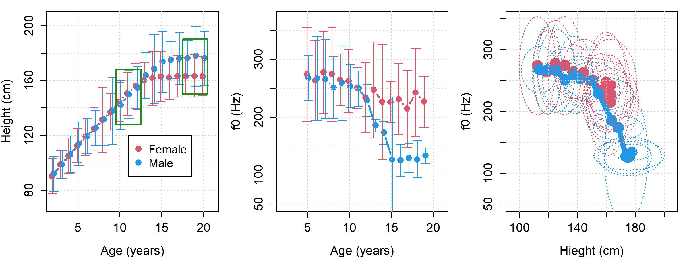
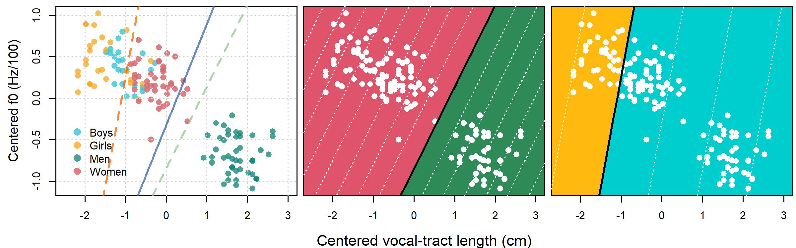

\newpage
```{r, include = FALSE}
knitr::opts_chunk$set(
  dpi = 300, dev = "jpeg", collapse=TRUE
)
rm (list=ls())
```

# Writing up experiments: An investigation of the perception of speaker category from speech acoustics

In this chapter we will present an analysis of our experimental data based on models similar to the ones we considered in chapter 11. The chapter will be written in the general structure of an academic paper, but less formally, and will include a meta-discussion of what we are doing and why we are doing it. Writing a paper is like directing a short (maybe slightly dull) movie. A movie is made up of hundreds or thousands of discrete "shots", stuck together to give the impression of a single, continuous, coherent story. Do you ever watch a movie and wonder, why is this scene here? What is this character's motivation? Where are characters right now and how did they get here? If so, it's possible that either the director or the editor (or both) has been careless with the way they have stuck their shots together, or the shots they've chosen to include, resulting in problems with your understanding of the story. 

In the same way, the papers you write based on data analysis need to present the reader with dozens or hundreds of individual pieces of information, information regarding your research questions, data collection, analysis, results, interpretation, and so on. You are in charge of stitching these pieces of information into paragraphs, sections, and ultimately, into a paper. When the reader reads the paper, they should feel like they are reading a coherent story regarding your research questions and what your experiment says about them. If someone reads your paper and thinks: Why are they telling me this? Why/how did they do this? What does this parameter mean? How did they reach that conclusion? Then there may be problems in terms of the information you've presented to the reader, or in the way that the information has been presented. 

We're going to present two independent models: One predicts apparent height based on acoustics, apparent age and apparent gender, and the other predicts apparent gender based on speech acoustics and apparent age. Our intention in this chapter is simply to provide examples of analyses of a quantitative variable and a dichotomous variable. Imagine a pair of researchers who ran the same experiment in two parallel dimensions where everything is the same, except for these researchers decided on slightly different research questions. One of these researchers, the one predicting apparent height, treats apparent age and gender as given in order to understand height. The other researcher, the one predicting apparent gender, treats apparent age as given in order to understand apparent gender. We might consider a third researcher (in another dimension) who decides to consider both apparent age and apparent height simultaneously in a model with multiple dependent variables in some configuration. This sort of thing is possible with *Stan* and `brms`, however, it's not something we'll be getting to in this book. Luckily, building these models is mostly a modest extension of the things we *have* covered.

Because of the similarity in the subject areas, much of the background information in the introduction of the two 'experiments' would be repetitive. In addition, since only one experiment was carried out there was only one set of methods. As a result, a single introduction and methods section will be presented for both 'analyses.'experiments'. After that, the experimental analyses diverge substantially, and so are presented separately for each 'experiment'. However, in order to avoid jumping back and forth between topics, we present contiguous results, discussion, and conclusion sections for each of the two experiments. 

## Introduction

The acoustic characteristics of the human voice vary in a systematic way between speakers with different indexical characteristics such as age and gender. Listeners are familiar with these patterns of co-variation and use this information to guess speaker indexical characteristics from their speech. Although listeners are often incorrect in their assessments they tend to be fairly consistent. Thus, listener judgments of speaker indexical characteristics are often incorrect but generally precise: People often make errors but their errors are fairly predictable. In this experiment we will investigate how listeners assess speaker characteristics from speech acoustics. 

Our discussion of the perception of apparent speaker characteristics will focus on three of these: Apparent height, apparent age, and apparent gender. We will begin by talking about the perception of speaker size and height more generally. The main acoustic predictors of apparent speaker age, size and gender are the *fundamental frequency*, and the *resonance* properties of speech. Both of these acoustic characteristics will be introduced in the following sections, and the veridical relationships between these and apparent speaker characteristics will be discussed. After that, we will briefly review the current state of knowledge regarding listener perception of these characteristics. 

### Fundamental frequency and voice pitch

Your vocal folds, housed inside your larynx (in your neck) vibrate when you speak. For example, you will feel the front of your neck vibrate when you produce a 'zzzzzz' or a vowel sound. The rate of vibration of the vocal folds varies as a function of the mass and length of the vocal folds, and the size of the laryngeal structures in general. Think of guitar strings and the fact that the lower frequency strings tend to be thicker while higher frequency strings tend to be thinner. In addition, the rate of vibration of the vocal folds is easily modifiable within a large range by speakers in the same way that a guitar player can adjust the tightness of a string to modify the note it plays. Rate of vibration is measured in units of cycles per second, referred to as Hertz (Hz).

The repetitive vibration of the vocal folds results in a repetitive speech sound. Repetitive sounds can feel 'musical' or 'harmonic' to humans; these are terms that are difficult to define but that most people intuitively understand. A whistle or flute is harmonic, a waterfall or the noise a fan makes is not. The repetition rate of sounds is referred to as the fundamental frequency (f0) of the sound. The f0 of a sound is the strongest determinant of perceived pitch. We say strongest because perceived pitch can also be (weakly) affected by the loudness of a sound, among other things (e.g. spectral shape), however it is still primarily dependent on f0.

Pitch is the internal *sensation* associated with sounds such that they can be ranked from 'low' to 'high'. Think of pitch like spiciness, it's the way something *feels*. In general spiciness may relate to the amount of capsaicin in a food, but other factors such as the amount of sugar in the food may also affect how the food *feels* (i.e. tastes) when we eat it. You can rank foods from more to less spicy, you can rank sounds from lower to higher pitch. When you do this, in general, the ranking will result in an ordering of the sounds according to f0: Sounds with higher f0s generally have higher pitches. So, when you hear someone with a 'high pitched voice', that is your auditory system (and brain) telling you, in its own way, that that person's vocal folds are vibrating at a high rate (i.e. they have a high speaking f0). 

### Variation in fundamental frequency between speakers

There are two main sources of average f0 differences between speakers. First, there is age related growth, meaning that f0 tends to decrease as humans age into their full adult size, as seen in figure \@ref(fig:F13-1). Second, there is substantial growth of laryngeal structures, including the vocal folds, during the typical course of male puberty. For this reason, most adult males produce speaking f0s that are lower than those of adult females of the same body size and age. This tendency is also clearly evident in figure \@ref(fig:F13-1). In summary, we can say that taller speakers tend to have lower f0s than shorter speakers, adults tend to have lower f0s than children, and adult males tend to have lower f0s than the rest of the population. 

```{r F13-1, echo = FALSE, fig.height = 3, fig.width = 8, echo = FALSE, fig.cap = "(left) Average height of males and females in the United States of America, organized by age (Fryar et al. (2012)). Error bars indicate two standard deviations and boxes highlight the age ranges featured in this experiment. (middle) Average f0 produced by male and female speakers from 5 years of age until adulthood (Lee et al. 1999). Error bars indicate two standard deviations. (right) The heights from the first plot plotted against the f0s from the second plot. These data were collected from different sets of people, so this comparison is simply illustrative. Ellipses enclose two standard deviations and assume no correlation between the dimensions.", eval = TRUE}

################################################################################
### Figure 13.1
################################################################################



#jpeg ("F13-1-1.jpeg",2400,900,res=300)
# library (bmmb)
# data(height_data)
# data (lee_etal_data)
# 
# lee_etal_data$f0_original=lee_etal_data$f0
# lee_etal_data$f0 = log(lee_etal_data$f0_original)
# 
# aggdmu = aggregate (f0 ~ age+gender, FUN = mean, data = lee_etal_data)
# aggdmu[,3] = exp(aggdmu[,3])
# 
# lee_etal_data$f0 = log(lee_etal_data$f0sd/lee_etal_data$f0_original)
# aggdsd = aggregate (f0 ~ age+gender, FUN = sd, data = lee_etal_data)
# aggdsd[,3] = (exp(aggdsd[,3])-1)*aggdmu[,3]
# 
# aggdmuf0 = aggdmu
# aggdsdf0 = aggdsd
# 
# par (mfrow = c(1,3), mar = c(4.1,4.1,1,1))
# 
# plot (height_data$age[height_data$gender=="f"]-.1,
#       height_data$height[height_data$gender=="f"],
#       pch=16,col=2,lwd=2,cex=1.5, ylim = c(70,205),type='b', xlab="Age (years)",
#       ylab = "Height (cm)",xlim=c(2,21),cex.axis=1.3,cex.lab=1.3)
# lines (height_data$age[height_data$gender=="m"]+.1,
#        height_data$height[height_data$gender=="m"],
#        pch=16,col=4,lwd=2,cex=1.5,type='b')
# grid()
# legend (11,120,legend = c("Female","Male"), col = c(2,4),pch=16,cex=1.2,pt.cex=1.5)
# 
# 
# phonTools::errorbar(height_data$age[height_data$gender=="f"]-.1,
#                     height_data$height[height_data$gender=="f"],
#                     height_data$sd[height_data$gender=="f"]*2,col=2,lwd=1,length=0.051)
# phonTools::errorbar(height_data$age[height_data$gender=="m"]+.1,
#                     height_data$height[height_data$gender=="m"],
#                     height_data$sd[height_data$gender=="m"]*2,col=4,lwd=1,length=0.051)
# 
# rect (9.5,128,12.5,168,lwd=2,border="forestgreen",lty=1)
# rect (17.5,150,20.5,190,lwd=2,border="forestgreen",lty=1)
# 
# plot (aggdmu$age[aggdmu$gender=="f"]-.1,aggdmu$f0[aggdmu$gender=="f"],
#       pch=16,col=2,lwd=2,cex=1.5, ylim = c(50,370),type='b', xlab="Age (years)",
#       ylab = "f0 (Hz)",xlim=c(2,21),cex.axis=1.3,cex.lab=1.3)
# lines (aggdmu$age[aggdmu$gender=="m"]+.1,aggdmu$f0[aggdmu$gender=="m"],
#       pch=16,col=4,lwd=2,cex=1.5,type='b')
# grid()
# 
# phonTools::errorbars(aggdmu$age[aggdmu$gender=="f"]-.1,aggdmu$f0[aggdmu$gender=="f"],
#                    aggdsd$f0[aggdsd$gender=="f"]*2,col=2,lwd=1,length=0.051)
# phonTools::errorbars(aggdmu$age[aggdmu$gender=="m"]+.1,aggdmu$f0[aggdmu$gender=="m"],
#                    aggdsd$f0[aggdsd$gender=="m"]*2,col=4,lwd=1,length=0.051)
# 
# plot (height_data$height[height_data$gender=="f"][-c(1,2,3,19)],
#       aggdmu$f0[aggdmu$gender=="f"], pch=16,col=2,lwd=6,cex=2.75, ylim = c(50,350),
#       type='b', xlab="Hieght (cm)", ylab = "f0 (Hz)",xlim=c(95,205),cex.axis=1.3,
#       cex.lab=1.3)
# lines (height_data$height[height_data$gender=="m"][-c(1,2,3,19)],
#        aggdmu$f0[aggdmu$gender=="m"],
#       pch=16,col=4,lwd=6,cex=2.75,type='b')
# grid()
# 
# count = 1
# for (i in (1:19)[-c(1,2,3,19)]){
#   phonTools::sdellipse (
#     matrix(c((height_data$sd[height_data$gender=="f"][count]),0,
#              0,(aggdsd$f0[aggdsd$gender=="f"][count]))^2,2,2),
#     means = c(height_data$height[height_data$gender=="f"][i],
#               aggdmu$f0[aggdmu$gender=="f"][count]), col = 2,lty=3)
# 
#   phonTools::sdellipse (
#     matrix(c((height_data$sd[height_data$gender=="m"][count]),0,
#              0,(aggdsd$f0[aggdsd$gender=="m"][count]))^2,2,2),
#     means = c(height_data$height[height_data$gender=="m"][i],
#               aggdmu$f0[aggdmu$gender=="m"][count]), col = 4, lty=3)
# 
#   count = count + 1
# }
# dev.off()

```

### Voice resonance and vocal-tract length

Another way that speakers vary systematically in their speech acoustics is in their voice resonance. **Resonance** occurs when a sound wave bounces back and forth in an enclosed cavity so the energy can't leave the system easily, and builds up inside. Resonance forms the basis of the sounds produced by most musical instruments and (loud) animals. So, dogs, cats, and humans, but also guitars and pianos, all make sounds by comprising structures that can produce resonances. A common way of generating a resonance is by putting acoustic energy into a tube or enclosed space. For example, an acoustic guitar uses its strings to introduce energy into the cavity in its body, which serves to substantially amplify the sound. Without this amplification, the guitar strings alone would only make a quiet and unappealing buzzing sound. In the same way, resonance is what allows us to produce very loud speech, with relatively little effort. Think of the fact that babies that aren't strong enough to hold up their own heads can scream surprisingly loud, for a very long time. 

For human speech communication, the enclosed structure used to create acoustic resonances is the **vocal tract**, the space between the vocal folds and the lips. The vocal tract is an empty space comprising the oral cavity (your mouth) and the pharyngeal cavity (your throat). As you speak you push air out of your lungs towards your mouth. The vocal folds are like the reed of a saxophone: They periodically open and close letting through (periodic) puffs of air. The puffs of air go from your larynx (in your neck) to your mouth and, even if your mouth is open, their energy 'bounces' back and forth between the mouth and the vocal folds. The small amounts of energy reflected between the mouth and vocal folds add up and result in what are known as acoustic resonances, build ups of acoustic energy inside of an enclosed space.

**Resonators**, that is, structures like the vocal tract that can resonate, usually have one or more preferred **resonant frequencies**, frequencies that they amplify the most. A complete explanation of this is beyond the scope of this chapter, but see Johnson (2004) for more information on the topic. Here we will provide a not-entirely-right but conceptually simple explanation of the topic. The speed of sound is fixed for a given environment (temperature, pressure, gas composition, etc.). This means that the bouncing back and forth between your mouth and your larynx occurs at a fixed speed (i.e. the speed of sound). As a result, the number of times per second a sound wave can travel back and forth along the vocal tract, measured in Hertz, is determined by the length of that vocal tract. This is obvious: A longer travel time at a fixed velocity entails fewer repetitions ('laps') per unit time. 

As a consequence of the above relationships, longer resonators have lower **resonant frequencies**. All other things being equal, if resonator *x* is 20% shorter than resonator *y*, waves will take 20% less time to complete one travel back and forth. This means that resonator x will have resonant frequencies 20% higher than those of y. In general, sounds with lower resonances *sound* and *feel* bigger to listeners. The difference between a violin and a cello playing the same note, or a small child and a large adult singing the same note, is resonance. In each case, listeners can detect the sound with lower resonances and identify it as the larger object. 

The resonance frequencies of most sounds can be estimated using analysis software such as Praat or the `phonTools` package in R (Barreda, 2015). This means that, for speech, we could potentially estimate the length of the vocal tract (vocal-tract length, VTL) that produced some speech based on the frequencies of its resonances. 

### Estimating vocal-tracts length from speech {#c13-estimating-vtl}

We may define a 'true' **anatomical VTL** measuring the distance between the vocal folds and lips of a speaker in units of distance, perhaps measured using magnetic resonance imaging or x-ray images. It's not clear how one might establish a 'true' anatomical VTL for a speaker or what the direct relevance of this for speech communication would be. For example, anatomical VTL varies across the different gestures employed by the mouth in the process of producing speech. Which of these is the 'true' anatomical VTL, or, how should the different VTL estimates be combined across speech samples? 

In fact, the estimation of anatomical VTL from speech acoustics is an underdetermined problem: There are an infinite number of combinations of vocal tract anatomy and gesture that can result in a given resonance pattern (Wakita 1977). How can any acoustic estimate of VTL know that a speaker isn't adopting some gesture that causes their acoustic VTL to diverge from their 'resting' anatomical VTL in meaningful ways? As a result, it is difficult, if not impossible, to reliably associate the acoustic speech signal to certain knowledge of the speaker's anatomical VTL (however that's defined). For example, imagine trying to estimate the height of a person using only their shadow. If everyone is standing up straight this might work, but given random differences in body posture this becomes a much more difficult problem.

Instead of worrying about speakers' *anatomical* VTL, we're going to focus on their **acoustic VTL** or **effective VTL**, which we define as the VTL implied by the resonant frequencies produced during speech. When two speakers say 'the same thing', the differences in their vocal tract resonances will primarily reflect differences in their effective/acoustic VTL. Thus, if two speakers saying 'the same thing' differ by 10% in their resonant frequencies, they differ by about 10% in their (acoustic) VTL, and by some indeterminate amount in their anatomical VTL. Unless otherwise specified, when we refer to VTL we will be discussing acoustic VTL, an estimate of VTL based on estimated resonant frequencies. 

### Variation in vocal-tract length between speakers

In figure \@ref(fig:F13-2) we see a comparison of age, height, and  (acoustic) VTL for males and females. We can see that VTL increases as a function of age (and height) for both men and women. In addition, we see that male and female speakers are approximately the same in height until around 13 or 14 years of age, at which point female and male averages begin to diverge in height (and VTL). However, note that male and female averages are always within two standard deviations of each other, meaning that a degree of overlap is expected.

```{r F13-2, echo = FALSE, fig.height = 3, fig.width = 8, echo = FALSE, fig.cap = "(left) Average height of males and females in the United States of America, organized by age (Fryar et al. (2012)). Error bars indicate two standard deviations and boxes highlight the age ranges featured in this experiment. (middle) Average acoustic vocal-tract length (VTL) of male and female speakers from 5 years of age until adulthood (Lee et al. 1999). The average adult male VTL was set to 15 cm. Error bars indicate two standard deviations. (right) The heights from the first plot plotted against the f0s from the second plot. These data were collected from different sets of people, so this comparison is simply illustrative. Ellipses enclose two standard deviations and assume no correlation between the dimensions.", eval = TRUE}

################################################################################
### Figure 13.2
################################################################################

data (lee_etal_data)

gbars = (log(lee_etal_data$f1)+log(lee_etal_data$f2)+log(lee_etal_data$f3))/3

aggdmu = aggregate (gbars ~ age+gender, FUN = mean, data = lee_etal_data)
aggdmu[,3] = (aggdmu[,3])

aggdmu$vtl = exp(-((aggdmu$gbar)-min(aggdmu$gbars)))
aggdmu$vtl = 15 * aggdmu$vtl

vtl = (log(lee_etal_data$f1sd/lee_etal_data$f1)+
         log(lee_etal_data$f2sd/lee_etal_data$f2)+
         log(lee_etal_data$f3sd/lee_etal_data$f3))/3

aggdsd = aggregate (vtl ~ age+gender, FUN = mean, data = lee_etal_data)
aggdsd[,3] = exp(aggdsd[,3])*aggdmu$vtl

aggdmuvtl = aggdmu
aggdsdvtl = aggdsd

par (mfrow = c(1,3), mar = c(4.1,4.1,1,1))
plot (height_data$age[height_data$gender=="f"]-.1,
      height_data$height[height_data$gender=="f"],
      pch=16,col=2,lwd=2,cex=1.5, ylim = c(70,205),type='b', xlab="Age (years)",
      ylab = "Height (cm)",xlim=c(2,21),cex.axis=1.3,cex.lab=1.3)
lines (height_data$age[height_data$gender=="m"]+.1,
       height_data$height[height_data$gender=="m"],
      pch=16,col=4,lwd=2,cex=1.5,type='b')
grid()
legend (11,120,legend = c("Female","Male"), col = c(2,4),pch=16,cex=1.2,pt.cex=1.5)

phonTools::errorbar(height_data$age[height_data$gender=="f"]-.1,
                    height_data$height[height_data$gender=="f"],
                    height_data$sd[height_data$gender=="f"]*2,col=2,lwd=1,length=0.051)
phonTools::errorbar(height_data$age[height_data$gender=="m"]+.1,
                    height_data$height[height_data$gender=="m"],
                    height_data$sd[height_data$gender=="m"]*2,col=4,lwd=1,length=0.051)

rect (9.5,128,12.5,168,lwd=2,border="forestgreen",lty=1)
rect (17.5,150,20.5,190,lwd=2,border="forestgreen",lty=1)

plot (aggdmu$age[aggdmu$gender=="f"]-.1,aggdmu$vtl[aggdmu$gender=="f"],
      pch=16,col=2,lwd=2,cex=1.5, ylim = c(8.5,17),type='b', xlab="Age (years)",
      ylab = "VTL (cm)",xlim=c(2,21),cex.axis=1.3,cex.lab=1.3)
lines (aggdmu$age[aggdmu$gender=="m"]+.1,aggdmu$vtl[aggdmu$gender=="m"],
      pch=16,col=4,lwd=2,cex=1.5,type='b')
grid()


phonTools::errorbars(aggdmu$age[aggdmu$gender=="f"]-.1,
                   aggdmu$vtl[aggdmu$gender=="f"],
                   aggdsd$vtl[aggdsd$gender=="f"]*2,col=2,lwd=1,length=0.051)
phonTools::errorbars(aggdmu$age[aggdmu$gender=="m"]+.1,
                   aggdmu$vtl[aggdmu$gender=="m"],
                   aggdsd$vtl[aggdsd$gender=="m"]*2,col=4,lwd=1,length=0.051)

plot (height_data$height[height_data$gender=="f"][-c(1,2,3,19)],
      aggdmu$vtl[aggdmu$gender=="f"],
      pch=16,col=2,lwd=6,cex=2.75, ylim = c(8.5,17.5),type='b', xlab="Height (cm)",
      ylab = "VTL (cm)",xlim=c(105,185),cex.axis=1.3,cex.lab=1.3)
lines (height_data$height[height_data$gender=="m"][-c(1,2,3,19)],
       aggdmu$vtl[aggdmu$gender=="m"],
      pch=16,col=4,lwd=6,cex=2.75,type='b')
grid()

count = 1
for (i in (1:19)[-c(1,2,3,19)]){
  phonTools::sdellipse (
    matrix((c(height_data$sd[height_data$gender=="f"][count],0,
             0,aggdsd$vtl[aggdsd$gender=="f"][count]))^2,2,2), 
    means = c(height_data$height[height_data$gender=="f"][i],
              aggdmu$vtl[aggdmu$gender=="f"][count]), col = 2,lty=3)
  
  phonTools::sdellipse (
    matrix((c(height_data$sd[height_data$gender=="m"][count],0,
             0,aggdsd$vtl[aggdsd$gender=="m"][count]))^2,2,2), 
    means = c(height_data$height[height_data$gender=="m"][i],
              aggdmu$vtl[aggdmu$gender=="m"][count]), col = 4, lty=3)
  
  count = count + 1
}

```

We would like to highlight two aspects of the variation seen in figure \@ref(fig:F13-2). First, there appears to be a sex-based difference in VTL. However, there is evidence that this is a difference in height masquerading as a difference in VTL. That is, speaker height is strongly correlated (r = 0.93) to anatomical VTL (measured using MRI) across the human population (Turner et al. 2009). As a result of this relationship, the average adult female is expected to have a shorter VTL than the average adult male if they also have a shorter overall body length. Given the same height, men and women are expected to have approximately the same anatomical VTL. Thus, the average difference in VTL seen between adult males and females seems to be more about height than sex specifically.   

Second, since speech output is a combination of anatomy and gesture, very similar anatomies can produce quite different sounds when used in different ways. As a result, the relationship between veridical speaker height and any VTL estimate based on acoustic measures may be an unreliable estimate of anatomical VTL. This may be seen as a weakness of acoustic VTL, however, we see it as a strength. For example, we see in the middle plot of figure \@ref(fig:F13-2) that there is a consistent difference in VTL estimates for boys and girls. However, there is no corresponding difference in body size between speakers of these ages, nor is there compelling evidence of corresponding anatomical differences between these speakers (Vorperian et al. 2008). Instead, it's been suggested that the apparent difference in (acoustic) VTL between boys and girls may be behavioral (see Barreda and Assmann 2021). In other words, little girls and little boys may be trying to sound 'masculine' or 'feminine' and adopt gestures that lead their similar anatomies to produce diverging acoustic outputs. 

Which are we more concerned about in speech communication? The speaker's anatomy, or the acoustic output of that anatomy? Our acoustic VTL estimates capture the fact that when the girls represented in the middle plot of figure \@ref(fig:F13-2) speak, on average they produce resonant frequencies that tend to be higher than those of boys of the same age. This acoustic information is the only information available to the listener when considering the speaker's indexical characteristics, and a focus on anatomical VTL would obscure this difference.

### Perception of age, gender and size {#c13-perception-of-chars}

In this section we will review the perception of speaker age, height, and gender from speech. This is the process by which a listener hears a speaker's voice and guesses what sort of person they are speaking to. We will focus on the use of two gross acoustic cues, f0 and VTL. We call these 'gross' acoustic cues because they are very general and overall cues, and there are many more subtle acoustic characteristics that we will not be discussing. This is a bit like talking about basketball players in terms of height and weight. There is much more to being a good basketball player than a person's height and weight, however, these two variables can still tell you a lot about the player.

*Height*

There is substantial previous research on the perception of speaker size/height from speech. Experiments have repeatedly found that f0 and VTL cues individually affect the perception of size. The following general statement can be made: All other things being equal, listeners will identify a speaker with a lower f0 or longer apparent VTL as being larger. As seen in figure \@ref(fig:F13-2), there is a strong association between anatomical/acoustic VTL and human height across the entire population. For this reason, listeners can generally guess the veridical height of speakers with good accuracy if the entire range of possible human height is considered. For example, given that most human speakers plausibly range from about 100-200 cm in height, a guess of 170 cm for a speaker who is 160 cm might be considered fairly close even though 10 cm is a noticeable difference in height.  

However, evidence suggests that height can no longer be reliably estimated when speakers are restricted to be adults (see González 2004). Because height varies substantially less for adults than it does for humans overall, the systematic relationship between height and VTL becomes smaller relative to the amount of between-speaker variation. As a result, errors must be much smaller to be equally impressive. For example, if about 95% of adult females are between 150-177 cm in height then the same error of 10 cm (a guess of 170 for a speaker who is 160 cm) seems less impressive.

*Age*

The perception of age can be divided into two general situations: Before and after adulthood. As seen in figure \@ref(fig:F13-2), from the ages of 2 to 15, age and height are almost perfectly correlated, 0.995 in Fryar et al. (2012). After this age, average female height stops increasing much and average male heights increase at a smaller rate until around 18. Based on this, we see that for many children (<18 years), identification of speaker age is effectively identification of speaker height, and vice versa. Barreda and Assmann (2018) report that age can be estimated with reasonable accuracy from speech acoustics, and Assmann et al. (2018) have found that height can be estimated with good accuracy from speech. In both cases, speakers with longer VTLs and lower f0s were more likely to be identified as older and taller. 

We will not discuss the perception of age past adulthood in any detail, as variation in speech in adulthood does not have simple growth-related explanations, and is not expected to vary as systematically with respect to average speaker f0 and VTL. As a result, any ability to distinguish speakers who are, for example, 30 from those who are 40, is necessarily a more subtle and complicated process than distinguishing a speaker who is 3 from one who is 13. 

*Gender*

Finally, we will discuss the identification of speaker gender from speech. First, we must make a distinction between sex and gender. Sex refers to the classification of humans into categories like *male* and *female* based wholly on anatomical/physiological considerations. Gender categories like *male* or *female* refer to social categories and the set of customs and behaviors that individuals engage in to signal belonging in one or another category. For example, the most common 'scientific' definitions of biological sex center around reproductive capabilities. Such definitions are scientific objects, neither true nor false, and subject to change. Even if we accept a reproductively-centered definition of 'biological women', there is little to no connection between many of the behavioral and social characteristics of 'biological women', on the one hand, and reproductive capabilities, on the other. For example, there is no logical connection between the physical characteristics of female sex and the stereotypical expectation that women have longer hair than males. 

Despite the arbitrary association of many (if not most) gendered *behaviors* and biological sex, there is a connection between biological sex and the expectations listeners have regarding variation in VTL and f0 between men and women. The most common way by which speakers are assigned to gender categories is via superficial inspection of the reproductive organs at birth. As a result of associations between reproductive organs, the endocrine system, and human development, most speakers assigned male gender at birth are also likely to be relatively taller and have lower speaking f0s than speakers assigned female at birth, within the same 'population'. This constraint is important because although men tend to be larger than women within a given population, there are large differences across global populations. As a result, it is not the case that men everywhere are taller than women everywhere.

Speaker f0 and VTL can be used to predict the gender of adult speakers with a high degree of accuracy. Likely because adult men and women are well separated along these dimensions, listeners can identify the gender of adult speakers from voice in a large majority of cases (e.g. 99.6% in Hillenbrand et al. 2009). However, the perception of gender in voice is more complicated than what can be explained by f0 and VTL alone. Gender information in speech also involves performative aspects that cannot be explained solely due to average differences in body types. For example, Hillenbrand et al. (2009) played listeners adult male and female voices and asked them to guess if they were men or women. They also manipulated stimuli to flip f0 and VTL characteristics between men and women: Adult male voices were matched with female VTL and f0, and adult female voices got male VTL and f0. Even in this flipped condition, around 20% of speakers were still identified as their original gender. In addition, the tendency to identify speakers as their original (unflipped) gender was greater for sentences than for syllables. 

The results above tell us that although f0 and VTL are important for the perception of gender they do not entirely determine it, and some 'other' information is involved. Listeners heard originally female voices with speech acoustics that are *extremely* rare for a female speaker, and listeners *still* identified the speaker as female in a large proportion of cases. This suggests that not only does this 'other' information matter, but it matters enough to overwhelm extremely strong evidence in the form of f0 and VTL that the speaker is an adult male. In addition, this information is better conveyed by entire sentences, rather than just syllables, suggesting that it may be 'stylistic' information regarding speech rhythm or intonation. 

The identification of gender in children's voices is more complicated, mostly due to the lack of many reliable anatomical differences in the vocal tracts and larynxes of boys and girls before puberty. This similarity can be seen by the almost complete overlap of speaker height, VTL and f0 seen for children under 13 in the figures above. Despite this however, previous studies have found that the gender of pre-pubescent children can be identified at a greater than chance level. For example, Barreda and Assmann (2021) presented listeners with the voices of boys and girls between the ages of four and 18 and asked them to guess their gender. They found that listeners can identify the gender of speakers as young as five, and that this ability increased for sentences over syllables. 

The findings reported in Barreda and Assmann (2021) support those of Hillenbrand et al. (2009) in two important ways. First, they support the idea that although they are the most important determiners of apparent gender and can predict a large majority of variation, there is more to apparent gender than just f0 and VTL. The boys and girls presented to listeners did not differ much if at all in their gross acoustics, and yet listeners were able to distinguish them. Second, they both show that given longer stretches of speech, gender identification is better. This suggests that the 'other' information allowing gender identification in ambiguous cases is *performative*, that is *gestural* rather than anatomic. What we mean is that two humans may have an anatomical basis for having a different f0, but it is difficult to suggest that anatomy would constrain the 'style' with which we say an entire phrase. These performative aspects of gender may come across better for longer stretches of speech, and may come across in the way that listeners stitch words together to produce sentences (i.e. **prosody** the rhythm and melody of phrases and sentences). 

### Category-dependent behavior

First, we will discuss the age-dependent relationship between speaker VTL in apparent height, and a possible cause for this. In figure \@ref(fig:F13-2) we can see that average female height stops increasing substantially at about 14 years of age, and average male height stops increasing at about 18 years of age. We can also see that relatively modest changes in VTL, in the order of 2 cm, are associated with large changes in height (around 40 cm) between the ages of 5 to 15. Let's imagine that listeners associate each 1 cm difference in VTL with a 20 cm difference in height between speakers. However, in figure \@ref(fig:F13-2) we see that adult VTL has a standard deviation of about 1 cm (about 1 cm in Pisanski et al. 2016). If listeners applied the 20/1 height to VTL ratio for adults, they would expect adults who differ by 3 cm in VTL, a fairly typical amount of VTL variation, to also differ by 60 cm in their height, a *extreme* amount of variation for heights in adults. 

In response to this, Barreda (2017) has suggested that listeners likely use acoustics in a category dependent manner if they are to correctly guess the height of both adult and child speakers. Specifically, listeners must have a 'steep' relationship between VTL and apparent height when they think they are listening to children. This would allow them to relate 'small' VTL differences with 'large' differences in apparent height. They must also have a 'shallow' slope between VTL and apparent height for apparent adults, allowing them to relate 'large' VTL differences with 'small' apparent height changes. Of course, this presupposes that listeners *know* whether they are listening to an adult or a child, which is obviously itself related to the size of the speaker. As a result, this suggests that the relationship between speech acoustics and apparent speaker characteristics is not 'simple' (i.e. a single regression line between VTL and apparent height), but rather 'complex', featuring a complicated relationship between the determination of multiple apparent speaker characteristics and speech acoustics. 

For example, consider the expected dependence of estimates of speaker age, height, and gender for a wide range of speakers. Figure \@ref(fig:F13-3) presents average VTL and f0 for the speakers in the Lee et al. (1999) data, for different ages. We can see in the left plot that males and females largely overlap in gross acoustics save for post-pubescent males, and in the right plot we see the age groups involved in this experiment in more detail. Since adult female acoustics overlap substantially with those of younger males and females, if a speaker makes a gender error for these voices, they may also make an age error. For example, if an adult female is identified as a male, it is also very likely that they will identify this speaker as younger than they are (i.e. a 'boy'), making certain sorts of identification errors likely to be correlated. 

```{r F13-3, echo = FALSE, fig.height = 3, fig.width = 8, echo = FALSE, fig.cap = "(left) Average f0 and vocal-tract length for each age group in the Lee at al. (1999) data. (right) The same data as in the left plot, but only age groups similar to those included in our experiment are included. These are 10-12 year-old children, and adults over 19 years of age."}

################################################################################
### Figure 13.3
################################################################################

library (bmmb)
data(height_data)
data (lee_etal_data)

lee_etal_data$f0_original=lee_etal_data$f0
lee_etal_data$f0 = log(lee_etal_data$f0_original)

aggdmu = aggregate (f0 ~ age+gender, FUN = mean, data = lee_etal_data)
aggdmu[,3] = exp(aggdmu[,3])

lee_etal_data$f0 = log(lee_etal_data$f0sd/lee_etal_data$f0_original)
aggdsd = aggregate (f0 ~ age+gender, FUN = sd, data = lee_etal_data)
aggdsd[,3] = (exp(aggdsd[,3])-1)*aggdmu[,3]

aggdmuf0 = aggdmu
aggdsdf0 = aggdsd

par (mfrow = c(1,2), mar = c(4.1,.2,.5,.25), oma = c(0,4,0,0))


plot (aggdmuvtl$vtl,aggdmuf0$f0, pch=16,col=2,lwd=2,cex=2.5, ylim = c(90,320),type='n', 
      xlab="Vocal-tract length (cm)", ylab = "f0 (Hz)",xlim=c(9,16.5),cex.axis=1.1,cex.lab=1.1)
grid()

text (aggdmuvtl$vtl,aggdmuf0$f0, 5:19, col = rep(bmmb::cols[7:8], each = 15),cex=1.2)
mtext (side=2, "f0 (Hz)", line = 3, cex = 1.1)


legend (9.5,200,legend=c("female","male"), col=bmmb::cols[7:8],pch=16,bty='n')

use = aggdmuvtl$age %in% c(10,12,19)
plot (aggdmuvtl$vtl[use],aggdmuf0$f0[use], pch=16,col=2,lwd=2,
      cex=1.5, ylim = c(90,320),type='n', xlab="Vocal-tract length (cm)", 
      ylab = "f0 (Hz)",xlim=c(9,16.75),cex.axis=1.1,cex.lab=1.1,yaxt='n')
grid()

colss=bmmb::cols[c(3,3,5,2,2,4)]
text (aggdmuvtl$vtl[use],aggdmuf0$f0[use], rep(5:19,2)[use], col = colss, cex=1.5)

col_count = 1
for (i in c(6,8,15)){
  
  phonTools::sdellipse (
    matrix((c(aggdsdvtl$vtl[aggdsdvtl$gender=="f"][i],0,
             0,aggdsdf0$f0[aggdsdf0$gender=="f"][i]))^2,2,2), 
    means = c(aggdmuvtl$vtl[aggdmuvtl$gender=="f"][i],
              aggdmuf0$f0[aggdmuf0$gender=="f"][i]), 
    col = bmmb::cols[c(3,3,5)][col_count], lty = 1)
  
  phonTools::sdellipse (
    matrix((c(aggdsdvtl$vtl[aggdsdvtl$gender=="m"][i],0,
             0,aggdsdf0$f0[aggdsdf0$gender=="m"][i]))^2,2,2), 
    means = c(aggdmuvtl$vtl[aggdmuvtl$gender=="m"][i],
              aggdmuf0$f0[aggdmuf0$gender=="m"][i]), 
    col = bmmb::cols[c(2,2,4)][col_count], lty = 1)
  
  col_count = col_count + 1
}


```

In fact, previous research has found that perception of age for children between the ages of 5 and 18 is affected by the apparent gender of the child (Barreda and Assmann 2018). Similarly, the perception of the gender of children between the ages of 5 and 18 is dependent on the perceived age of the child (Barreda and Assmann 2021). This behavior can largely be understood in terms of changing expectations for female and male speakers of different age groups. For example, the category boundary between male and female speakers in the f0 by VTL stimulus space clearly needs to be in a substantially different place for 18-year-old speakers vs. 5-year-old speakers if its to be of any use. Overall, this also strongly suggests that a simple deterministic mapping between speech acoustics and apparent speaker characteristics is not reflective of the process underlying the perception of these characteristics.

### The current experiment

The experiment presented here is meant to investigate the relationship between speaker VTL, f0, and apparent height and gender. In each case, we are also interested in the role for apparent age in the use of speech acoustics and in the determination of height and gender. Listeners were presented with a set of voices, and were asked to classify the speakers as female or male and as children and adults. Two separate analyses will be carried out. The first predicts apparent height based on speech acoustics and apparent age and gender, the second predicts apparent gender based on speech acoustics and apparent age. In general, we are interested in a few basic questions:

  (Q1) What is the relationship between speech acoustics, specifically speaker f0 and VTL, and apparent height/gender?

  (Q2) Do the effects for speaker f0 and VTL on apparent height/gender vary based on apparent speaker characteristics?
  
We may consider two general views on the processes that underlie the perception of apparent speaker perception: Simple and complex. The 'simple' view suggests relatively stable mappings from speech acoustics to apparent speaker characteristics. Such mappings could be thought of as logistic regression models with a small number of parameters with fixed values, as seen below. 

```{r, eval = FALSE}
characteristic ~ f0 + vtl
```

In contrast, the 'complex' view suggests that the mappings between acoustics an apparent speaker characteristics are complex and flexible. For example, this might be thought of as a logistic regression model with a larger number of parameters and interactions between them as seen below:

```{r, eval = FALSE}
characteristic ~ (f0 + vtl + X) * (Y * Z)
```

Where `X` represents some other acoustic characteristic(s), possibly strongly affected by behavior, and `Y` and `Z` represent non-acoustic information, such as apparent speaker information or perhaps listening conditions or instructions. Generally speaking, a strong role in perception for non-acoustic information such as apparent age or gender is incompatible with the 'simple' view, and suggests that a more 'complex' process underlies the determination of apparent speaker characteristics.

## Methods

In this section we will discuss the methods we used to collect and analyze the data. The goal of a methods section is to provide enough information so that a person reading it could potentially replicate your experiment and analysis. You should keep in mind that the person reading your paper may have no idea what you did or why you did it, and things that seem obvious to you may not be obvious at all to your reader. For example, in an experiment like this it is nearly *always* the case that you present stimuli to listeners in a random order. Readers may strongly assume that you presented your stimuli to listeners in a random order. However, this still needs to be explicitly stated if it is true because your readers shouldn't have to *guess* what you did in the experiment. Basically, if you presented stimuli to listeners in a random order, then be sure to mention that in your methods section. Finally, when describing your methods you should try to keep in mind that readers may not be in your specialized area or even in your field. As a result, it's useful to either provide background information in highly-specialized subjects or methods, or at least provide adequate references for readers to figure things out for themselves. 

###  Participants

Listeners were 15 speakers of California English. Listeners were not all native speakers of English but all spoke English well enough to attend a university in the United States. All listeners participated in the experiment for partial course credit. Listeners were told that this was not a 'real' experiment, but rather that the resulting data would be analyzed in a book and released publicly. Participating in the experiment and contributing their data to the book were both opt-in on the part of the student. For example, students could participate in the experiment for credit even if they did not wish to have their data included in the book. Several other ways to get equivalent course credit were also offered. 

###  Stimuli {#c13-stimuli}

Stimuli were isolated productions of the word "heed" produced by the 139 speakers in the Hillenbrand et al. (1995) data set. Productions represent speech produced by 27 boys, 19 girls, 45 men, and 48 women. Speakers were all from Michigan and had the northeast cities dialect (i.e., they 'sounded' like they were from Michigan). In addition, speech samples were collected in 1995 meaning the local dialect may have changed substantially in the meantime. However, dialects of English do not usually exhibit much variation in the vowel sound in "heed" meaning that the speech should have sounded relatively "normal" to speakers of California English. In any case, any possible dialectal difference is not expected to have much effect on the important research questions we hope to address.

As noted above, the fundamental frequency (f0) of sounds is the repetition rate of the acoustic wave measured in Hertz, units of cycles per second. This means that the f0 of vowel sounds can estimated by measuring the rate at which the 'shape' of the acoustic wave repeats as a function of time. For f0, we use the Hillenbrand et al. (1995) measurements for the stimuli, provided with the original data. 

Speaker vocal-tract length (VTL) was estimated based on the vocal-tract resonances provided in the Hillenbrand data. To estimate speaker VTL based on resonant frequencies, we found the geometric mean resonant frequency for the vowel in each production of the word 'heed'. We then found the speaker with the lowest overall resonances and arbitrarily set this speaker VTL to 16cm, basically appropriate for an adult male with a long VTL. This speaker served as the reference VTL. We then set each speaker's VTL to reflect the proportional difference between their resonances and those associated with the reference VTL. For example, imagine a second speaker who produced resonances that were 1.04% higher than those of the reference speaker. This speaker would then have a VTL of 15.4 cm (16/1.04), meaning it is 96% (1/1.04) as long as that of the first speaker. 

What we did above is a reasonable estimate of the differences in *effective*, or *acoustic*, VTL between speakers. However, it should be clear that this does not reflect an estimate of the absolute anatomical VTL for our speakers. We could have left the VTL predictor as a unit of frequency scaling, simply representing proportional differences in resonant frequencies between different speakers. However, we've found that readers find estimates of VTL in units of distance such as centimeters much more interpretable. Since this is not a 'real' experiment and exists in service of learning about statistics, we went with the more interpretable predictor.

All syllables were also manipulated using the "change gender" function in Praat. This function allows you to scale the spectral envelope of speech sounds up/down according to uniform scaling, thereby changing resonant frequencies in a way that mimics the effects of differences in VTL. The spectral envelope of each syllable was scaled down by 8%, replicating a VTL increase of 8%. The fundamental frequency, duration, and other characteristics of the sound were not affected by this processing. Manipulated syllables were marked with a value of `b`, for 'big', in the `R` (resonance) column. These responses are not discussed or analyzed in the text as they are reserved for exercises, however, they are available in the `exp_ex` and `exp_data_all` data frames included in the `bmmb` package.    

### Procedure

Listeners were instructed that they would hear the word "heed" produced by adult males (>18), adult females (>18), girls (10-12 years old), and boys (10-12 years old). They were asked to indicate how tall the speaker 'sounded' in feet and inches, and the category of the speaker. Responses could be provided in any order. Height responses were entered on a slider ranging form 4'0" to 6'6". The slider displayed the selected height to the listener to the nearest tenth of an inch. Category responses were entered by selecting one of four category buttons labelled "women (18+ years old)", "man (18+ years old)", "girl (10-12 year old)", and "boy (10-12 years old)".

The experiment was conducted over Qualtrics, an online survey tool, with very little control over listening conditions. For example, listeners may have had headphones or speakers of very different qualities when carrying out the experiment. We have a pretty good excuse: Data collection was carried out in 2021 during the covid-19 pandemic and both of the authors, in addition to the research participants, were mostly confined to their homes. However, if this were a 'real' experiment, we would have exerted more control over the listening conditions. Listeners were presented with syllables one at a time, randomized across stimulus dimensions. This means that all 278 unique stimuli were presented in a completely unpredictable, random manner. This randomization was carried out independently for each listener. 

### Data screening

Data was collected from approximately 30 people, however, we only wanted 15 for the book in order to keep plots and model outputs manageable. As a result, we needed to eliminate about half the original listeners. In part because the experiment was done online via Qualtrics and not in a controlled environment like a lab, the data was of varying quality between listeners. In light of this, when removing participants we tried to remove the "bad" data and tried to keep the "good" data. In general, this meant removing listeners that exhibited 'unusual' behavior, or behavior suggesting that they were not conducting the experiment in good faith. For example, some listeners identified adult males correctly at a low rate despite the fact that they can be identified correctly nearly 100% of the time based on f0 alone (see chapter 10). Based on what we know about the perception of gender from adult male speech, this behavior is likely to reflect inattentiveness on the part of the listener.

The above screening might be more difficult to justify in a 'real' experiment, and that's why we would like to stress that this is not a 'real' experiment. The data presented and analyzed here is 100% real, provided by actual listeners participating in the experiment described above. They did not know each other and did not co-ordinate their behavior in any way, nor where they 'prepped' in any way regarding what sort of responses were expected for the experiment. However, the data has been 'curated' to make it suitable for use as a pedagogical tool, and so any inferences made using this data should be taken with a grain of salt. That being said, we expect most findings would hold up to replication and, in fact, many of the conclusions we reach (later on) are confirmations of earlier findings. 

Normally, this section wouldn't be in a 'real' paper since we wouldn't have chosen our data in this way in a real experiment. However, if you *have* omitted listeners, individual observations, or modified your data in any way prior to analysis, you should be completely transparent about this and make this clear to the reader early on. You should also be prepared to explain your decisions, and to discuss the possible consequences for your analysis.

### Loading the data and packages

This section *definitely* wouldn't be in a real paper, but we want to load our data and packages in an easy-to-find place so that the code later on works for anyone following along. 

```{r, warning=FALSE, message=FALSE}
library (brms)
library (bmmb)
options (contrasts = c('contr.sum','contr.sum'))

# load data
data (exp_data)

# create gender analysis dependent variable
exp_data$Female = ifelse(exp_data$G == 'f', 1, 0)

# scale and center vtl 
exp_data$vtl_original = exp_data$vtl
exp_data$vtl = exp_data$vtl - mean (exp_data$vtl)

# scale and center f0 
exp_data$f0_original = exp_data$f0 
exp_data$f0 = exp_data$f0 - mean(exp_data$f0)
exp_data$f0 = exp_data$f0 / 100
```

### Statistical Analysis: Apparent height

We're going to re-fit the apparent height model we fit in chapter 11, without the f0 by VTL cross product. What follows is something like what we would write in a paper or journal article describing the analyses we carried out. Sometimes these descriptions happen in the methods section, and sometimes the analysis is described in the results section when the results are presented. Each approach has its positives and negatives. Presenting the modeling information in its own section early on makes it easy to find and makes the paper more organized. However, as a reader it can sometimes be difficult to remember the details of the model by the time you get to the results, so that you have to flip back and forth to remember what the different parameters mean, and so on. 

Apparent height was treated as a quantitative variable coming from a t distribution with a trial-specific mean and fixed (but unknown) scale and nu parameters. Apparent height responses were converted to centimeters prior to analysis. Expected apparent height was predicted based on the following 'fixed' effects: 1) Speaker vocal-tract length (VTL) (`vtl`) measured in centimeters, 2) speaker fundamental frequency (`f0`) measured in hectohertz (1 hectohertz = 100 Hertz), 3) apparent speaker age, a factor `A` with levels adult (`a`) and child (`c`), and 4) apparent speaker gender, a factor `G` with levels female (`f`) and male (`m`). All categorical predictors were included in the model using sum coding. 

All possible interactions between fixed effects were included in the model, save for the interaction between f0 and VTL (and all related predictors). In addition, listener 'random effects' intercepts were calculated, as were listener-dependent effects for all fixed effects and their interactions. Speaker-dependent random intercepts were also included in the model. The model formula used is presented below.  

`height ~ (vtl+f0) * A * G + ((vtl+f0) * A * G | L) + (1 | S)`

Data was analyzed using a multilevel Bayesian model fit with *Stan* (Stan Development Team, 2022), using the `brms` (Bürkner 2017) package in R (R Core Team 2022). Model 'fixed' effects were all estimated as coming from t distributions with a mean of zero, a scale of 5, and a nu of 3. The model intercept was given a t prior with a mean of 160, a scale of 5, and a nu parameter of 3. Speaker random intercepts were estimated as coming from a normal distribution with a mean of zero and a distribution-specific standard deviation estimated from the data. Listener random effects were estimated as coming from a 16-dimensional normal distribution. Each dimension was assumed to have a mean of zero and a standard deviation estimated from the data. An LKJ prior was used with a *concentration* parameter of 2, meaning our model would be somewhat skeptical of large correlations. Finally, the error term (`sigma`, $\sigma$) was given a half-t prior with a mean of 0, a scale of 5 and a nu of 3, and the nu parameter for our error distribution was given a gamma prior with scale and rate parameters of 2 and 0.1 respectively.  

Here's the code we used to fit this model. Note that the code below has the same information as the verbal description of our model above.

```{r, eval = FALSE}
priors = c(brms::set_prior("student_t(3,160, 5)", class = "Intercept"),
           brms::set_prior("student_t(3,0, 5)", class = "b"),
           brms::set_prior("student_t(3,0, 5)", class = "sd"),
           brms::set_prior("lkj_corr_cholesky (2)", class = "cor"), 
           brms::set_prior("gamma(2, 0.1)", class = "nu"),
           brms::set_prior("student_t(3,0, 5)", class = "sigma"))

height_model =  
  brms::brm (height ~ (vtl+f0)*A*G + ((vtl+f0)*A*G|L) + (1|S), 
             data = exp_data, chains = 4, cores = 4, warmup = 1000, 
             iter = 5000, thin = 4, prior = priors, family = "student")
```
```{r, include = TRUE, eval = FALSE}
# Download the height from the GitHub page:
height_model = bmmb::get_model ('13_model_height_vtl_f0.RDS')
```
```{r, include = FALSE, eval = TRUE}
height_model = readRDS ('../models/13_model_height_vtl_f0.RDS')
```

We would also like to note that it is good practice to do a prior predictive check *before* fitting your model in order to see that your prior generates reasonably plausible values of your dependent variables. Below is the code to carry out a prior predictive check for our model, and to plot the resulting predictions. You may have noted that above we use tighter priors than we have used so far in this book for our models with quantitative dependent variables (i.e. 5 cm as opposed to 12 cm). We decided to use the more constrained priors in our final analysis as this leads to prior predictions that are more concentrated in the 100-200 cm range that we are mostly interested. 

```{r, eval = FALSE, warning=FALSE, message=FALSE}
height_model_priors =  
  brms::brm (height ~ (vtl+f0)*A*G + ((vtl+f0)*A*G|L) + (1|S), 
             data = exp_data, chains = 4, cores = 4, warmup = 1000, 
             iter = 5000, thin = 4, prior = priors, family = "student", 
             sample_prior = "only")

p_check (height_model_priors)
```

### Statistical Analysis: Apparent gender

Apparent speaker femaleness (`Female`) was treated as a binomial (dichotomous) variable coming from a Bernoulli distribution with a trial-specific p parameter. For the purposes of analysis, responses of female were coded as 1 and responses of male were coded as 0. Expected apparent gender for a given trial was predicted based on the following 'fixed' effects: 1) Speaker VTL (`vtl`) measured in centimeters, 2) speaker fundamental frequency (`f0`) measured in hectohertz (1 hectohertz = 100 Hertz), and 3) apparent speaker age, a factor `A` with levels adult (`a`) and child (`c`). All possible interactions between fixed effects were included in the model, save for the exclusion of the cross-product of f0 and VTL (and all related predictors). In addition, listener 'random effects' intercepts were calculated, as were listener-dependent effects for all fixed effects and their interactions. Speaker-dependent random intercepts were also included in the model. The model formula used is presented below.  

`Female ~ (vtl + f0) * A + ((vtl + f0) * A | L) + (1 | S)`

Model 'fixed' effects, including the intercept, were all estimated as coming from t distributions with a mean of zero, a scale of 3, and a nu of 3. Speaker random intercepts were estimated as coming from a normal distribution with a mean of zero and a distribution-specific standard deviation estimated from the data. Listener random effects were estimated as coming from a 6-dimensional normal distribution. Each dimension was assumed to have a mean of zero and a standard deviation estimated from the data. An LKJ prior for the correlation of these dimensions was used, with a concentration parameter of 2. Since we are using exactly the same model we fit (and described) in chapter 11, we load it below. 

```{r, include = TRUE, eval = FALSE}
# Download the gender model from the GitHub page:
gender_model = bmmb::get_model ('11_model_gender_vtl_f0_reduced.RDS')
```
```{r, include = FALSE, eval = TRUE}
gender_model = readRDS ('../models/11_model_gender_vtl_f0_reduced.RDS')
```

However, we include the code to carry out a prior predictive check on this model to remind the reader that it is a good idea to do this *before* you fit your final model. We present these after our model description here because these are not something that necessarily needs to be discussed in the paper (though reviewers may ask about this if relevant).

```{r, eval = FALSE}
gender_model_prior =
  brm (Female ~ (vtl+f0)*A + ((vtl+f0)*A|L) + (1|S), data=exp_data,
       family="bernoulli", sample_prior = "only",  
       chains = 4, cores = 4, warmup = 1000, iter = 5000, thin = 4, 
       prior = c(set_prior("student_t(3, 0, 3)", class = "Intercept"),
                 set_prior("student_t(3, 0, 3)", class = "b"),
                 set_prior("student_t(3, 0, 3)", class = "sd"),
                 set_prior("lkj_corr_cholesky (2)", class = "cor")))

preds = p_check (gender_model_prior)
```

## Results: Apparent height judgments

In this section we'll outline a structured way to present large models to the reader. In general, we suggest figuring out what 'story' you are trying to tell with your data, and making sure that everything you tell the reader is in service of helping them understand the story. This approach helps people understand your data better than loading up a cannon with numbers and blasting it at the reader. In general, it may be a good idea to present the 'big picture' before moving on to more specific details of the results. The 'big picture' can also help motivate more detailed investigations of specific questions.  

Before discussing any statistical model, it's useful to talk about the results a bit, and to present some visual representation of the data without much processing. Although we've discussed our experimental data ad nauseam at this point, we will present this as we would at the beginning of a results section, assuming that the reader has never seen these results before. Figure \@ref(fig:F13-4) presents a boxplot showing all size responses across all listeners, grouped by apparent speaker category. There are clear systematic differences in apparent height across the different apparent speaker categories. As seen in the middle and right plots of the same figure, it appears that apparent speaker height is relatively predictable based on speaker VTL and f0. 

```{r F13-4, echo = FALSE, fig.height = 2.75, fig.width = 8, echo = FALSE, fig.cap = "(left) Distribution of apparent height judgments across all listeners, grouped by apparent speaker category. (middle) Distribution of individual apparent height judgments based on the fundamental frequency (f0) of the stimulus. (right) Distribution of individual apparent height judgments based on the vocal-tract length (VTL). Point colors represent the modal category judgment made by listeners, for each token."}

################################################################################
### Figure 13.4
################################################################################

#aggd = aggregate (cbind (height,f0,vtl) ~ S + C_v, data = exp_data, FUN = mean)

#tab = table (exp_data$S, exp_data$C)
#mod_cat = apply (tab, 1,which.max)
mod_cat = as.numeric(factor(exp_data$C))

par (mfrow = c(1,3), mar = c(4.2,.25,1,.25), oma = c(0,4,0,0))
boxplot (height ~ A+G, data = exp_data, col = bmmb::cols[c(5,3,4,2)],cex.lab=1.2,
         cex.axis=1.2,ylim=c(100,195), names = c("b","g","m","w"),
         ylab="Apparent height (cm)", xlab="Apparent Speaker Category")
grid ()
boxplot (height ~ A+G, data = exp_data, col = bmmb::cols[c(5,3,4,2)],add=TRUE,ylim=c(100,195), xaxt='n',yaxt='n',
         ylab="", xlab="")

mtext(side=2,"Apparent height (cm)",line=3,cex=0.9)
plot (exp_data$f0_original, exp_data$height, pch=16,ylab="Apparent height (cm)",
      col = bmmb::cols[1+mod_cat], cex=1,ylim=c(100,195), #xlim = c(-1.2,1.2),
      cex.lab=1.2, cex.axis=1.2,yaxt='n',xlab="f0 (Hz)")
grid ()
plot (exp_data$vtl_original, exp_data$height, pch=16,ylab="Apparent height (cm)", 
      col = bmmb::cols[1+mod_cat], cex=1,ylim=c(100,195), #xlim = c(-2.5,2.9),
      cex.lab=1.2, cex.axis=1.2,yaxt='n',xlab="VTL (cm)")
legend (14.1,139, legend = c("boy","girl","man","woman"), pch=16,col=bmmb::cols[2:5],
        bty='n', cex = 1.3)
grid ()
```

Since our model has a large number of parameters we're going to focus on interpreting those that seem likely to result in 'meaningful' differences in apparent height (see section \@ref(c7-answering)). For human height, apparent and veridical, we define meaningful differences as those that 1) are likely to be different from zero, *and* 2) have magnitudes of at least around 0.5 cm. We see in figure \@ref(fig:F13-5) that only a small number of the fixed effects exceed even this modest threshold. In addition, roughly the same subset of predictors exhibit the largest systematic between-listener variation in parameters. These predictors are: The main effect for VTL (`vtl`), the main effect for f0 (`f0`), the main effect for apparent age (`A1`), and the interaction between apparent age and VTL (`vtl:A1`). Our discussion below will focus on these effects.  

```{r F13-5, fig.height = 3.5, fig.width = 8, fig.cap='(left) Posterior distribution of model fixed effects. (right) Posterior distribution of random effect standard deviation estimates. Points indicate means, lines indicate 95% credible intervals. Dashed vertical lines indicate 0.5 cm away from 0. Points whose 95% credible intervals are at least 0.5 cm away from zero are filled.', echo = FALSE, cache = FALSE}

################################################################################
### Figure 13.5
################################################################################


par (mfrow = c(1,2), mar = c(4,6,1,1))

fixefs = fixef (height_model)[-1,]
good = (fixefs[,3] < -0.5 & fixefs[,4] < -0.5) | (fixefs[,3] > 0.5 & fixefs[,4] > 0.5) 
pchs = ifelse (good, 16,1)

brmplot (fixefs, xlim = c(-7,10),las=2, #ylim = c(-1,12),
               pch=pchs,lwd=2,horizontal=FALSE,xlab="Apparent Height (cm)")
abline (v = c(-0.5,0.5), lty = 3, col = bmmb::cols[6],lwd=2)

sds = bmmb::get_sds (height_model)
good = (sds[,3] < -0.5 & sds[,4] < -0.5) | (sds[,3] > 0.5 & sds[,4] > 0.5) 
pchs = ifelse (good, 16,1)

brmplot (sds, xlim = c(0,10),las=2, pch=pchs,lwd=2,xaxs='i',
               horizontal=FALSE,xlab="Apparent Height (cm)")
abline (v = c(0.5), lty = 3, col = bmmb::cols[6],lwd=2)

```

Table \@ref(tab:T13-1) presents information regarding our model fixed effects. We can see in the table (and figure) that f0 and VTL variation between speakers is associated with meaningful differences in apparent height. For example, a difference of 100 Hz between speakers is associated with a change of 3 cm in apparent height, and a 1 cm difference in VTL is associated with a change of 3 cm in apparent height. However, the largest effect is that of apparent age, indicating a difference of 14 cm in apparent height between speakers based on their apparent age.

```{r T13-1, echo = FALSE}
knitr::kable(fixef(height_model), digits=2, caption = "Posterior means, standard deviations, and 2.5% and 97.5% quantiles for our regression model \'fixed\' effect parameter estimates.")
```

Results also indicate a varying effect for speaker VTL across levels of apparent age. To investigate this, we considered the simple effects of VTL across levels of apparent age (calculated below). 

```{r}
# vtl main effect + adult, vtl main effect - adult (i.e. + child)
age_vtl_slopes = bmmb::short_hypothesis(
  height_model, c("vtl + vtl:A1 = 0","vtl - vtl:A1 = 0"))

age_vtl_slopes
```

We can report the simple effects as follows. The simple effect for VTL when listeners thought the speaker was a child was 4.74 (s.d. = 0.78, 95% C.I = [3.24, 6.29]), meaning we expect an increase of 4.7 cm in apparent height for every 1 cm in increase in speaker VTL, on average. However, this value dropped all the way to 1.34 cm (s.d. = 0.67, 95% C.I = [0.06, 2.72]) for apparent adults. So, differences in speaker VTL appear to be associated with much larger differences in apparent height when listeners think the speaker is a child. 

## Discussion: Apparent height

In the discussion section we can delve into any questions that arose but remained unresolved in the results section, and tell the 'story' of our data using more prose and more of a narrative. Here is where you can explain your results to your reader and how they relate to your research questions. You can also develop interesting or unexpected findings in more detail, especially as they relate to previous literature in the field, and possible future studies. We're going to divide our discussion into thematic subsections, which can be a good idea since it allows the consideration of one topic/question at a time, and helps the reader find the information they may be looking for. 

### Age-dependent use of VTL cues on apparent height

In the results above, we found that the slope relating speaker VTL and apparent height was substantially different in apparent children and apparent adults. Below, we calculate the age-dependent intercepts.

```{r}
age_intercepts = bmmb::short_hypothesis(
  height_model, c("Intercept + A1 = 0","Intercept - A1 = 0"))

age_intercepts
```

Figure \@ref(fig:F13-6) presents age-dependent intercepts (left plot), VTL slopes (middle plot), and a comparison of the lines implied by these parameters to our data (right plot). Age-dependent intercepts were 167.4 cm (s.d. = 1.27, 95% C.I = [164.88, 169.93]) for adults and 153.0 (s.d. = 1.86, 95% C.I = [149.28, 156.62]) for children. Combined with the slope differences described above, the result is a higher but flatter line for adults and a lower but more steep line for children. 

```{r F13-6, echo = FALSE, fig.height = 2.75, fig.width = 8, echo = FALSE, fig.cap = "Posterior means and 95% credible intervals for model intercepts (left), and slopes (middle), of the lines relating speaker vocal-tract length (VTL) and apparent height, for apparent children and adults. (right) Average apparent height for each stimulus plotted against stimulus VTL. Point colors represent modal classifications for each speaker."}

################################################################################
### Figure 13.6
################################################################################

mod_cat = as.numeric(factor(exp_data$C))

par (mar = c(4.2,4.2,3,1.5))
layout (mat=t(c(1:3)), widths=c(.27,.27,.46))
brmplot (age_intercepts, labels = c("adult","child"),ylab="Apparent height (cm)",
         cex.lab=1.3,cex.axis=1.3, main = "Intercept")
brmplot (age_vtl_slopes, labels = c("adult","child"),ylab="Apparent height (cm)",
         cex.lab=1.3,cex.axis=1.3, main = "VTL slope")

tmp = exp_data$vtl - mean (exp_data$vtl)
aggd = aggregate (cbind (height,f0,tmp) ~ S + C_v, data = exp_data, FUN = mean)

plot (aggd$tmp, aggd$height, pch=16, col = bmmb::cols[1+mod_cat], 
      cex=2,ylim=c(130,182),xlab="Centered VTL (cm)", ylab = "Apparent Height (cm)",
         cex.lab=1.3,cex.axis=1.3)

#cffs = fixef(height_model)[1:2,1]
#abline (cffs[1], cffs[2], lwd=3,col=1)

abline (age_intercepts[1,1], age_vtl_slopes[1,1], lwd=3,col=2)
abline (age_intercepts[2,1], age_vtl_slopes[2,1], lwd=3, col=4)
legend (1,152, legend = c("boy","girl","man","woman"), pch=16,col=bmmb::cols[2:5],
        bty='n', cex = 1.3)

```

Results suggest that the perception of size from speech is not the simple relation of VTL and f0 with a predicted height, as is suggested by some simpler models of size perception (e.g. Smith and Patterson 2005). We can relate this back to patterns in our data to show that this is not just an 'abstract' association made by our model. For example, we found the 27 speakers who were identified as adults and children at least 5 times each out of 15 total classifications. These speakers included 5 boys, 2 girls, 1 man, and 19 women. We then found the average reported height for each speaker when identified as an adult, and the average height for the same speaker when identified as a child. The distribution of these differences is presented in the left plot of figure \@ref(fig:F13-7). We see a range of differences in apparent height, however, in each case individual speakers were identified as taller on average when they were also identified as adults. 

```{r F13-7, echo = FALSE, fig.height = 2.75, fig.width = 8, echo = FALSE, fig.cap = "(left) Distribution of apparent height difference for 27 speakers identified as both adults and children at least 5 times each. The difference reflects apparent adult height minus apparent child height. (right) Posterior distribution and 95% credible intervals for listener-dependent effects for apparent maleness."}

################################################################################
### Figure 13.7
################################################################################

qq = aggregate (exp_data$height ~ exp_data$S + exp_data$A + exp_data$C_v, 
                data = exp_data, FUN = mean)
a = qq[qq[,2]=='a',]
c = qq[qq[,2]=='c',]

inter = intersect(a[,1],c[,1])


tmpp = exp_data[exp_data$S %in% inter,]
tmpp = tapply (tmpp$A=="a", tmpp$S, mean)
tmp = abs (tmpp - 0.5)

a = a[a[,1] %in% inter,]
c = c[c[,1] %in% inter,]

#hist(a[,3] - c[,3])

listener_gender_effects = 
  bmmb::short_hypothesis(height_model, "-(G1+A1:G1)=0",scope="coef",group="L")

age_intercepts = bmmb::short_hypothesis(
  height_model, c("2*(A1+A1:G1) = 0","2*(A1-A1:G1) = 0",
                  "2*(G1+A1:G1) = 0","2*(G1-A1:G1) = 0"))

par (mar =c(4,4,1.5,1))
layout (mat = t(c(1:2)), widths = c(.4,.6))
hist(a[tmp < 0.3,4] - c[tmp < 0.3,4], xlim = c(0,30), main = '',
     xlab = "Apparent height difference (cm)", col = bmmb::cols[1])

brmplot (listener_gender_effects[,1:4], col = bmmb::cols,
         labels = 1:15,xlab = "Listener")
mtext (side=3,line=0.5,"Effect for apparent maleness")
#brmplot (age_intercepts, labels = c("w-g","m-b","w-m","g-b"))


```

### The effect for apparent gender on apparent height

In figure \@ref(fig:F13-5) we saw that the marginal (fixed) effect for apparent gender was effectively zero, however, the standard deviation of the listener-dependent gender effect ($\sigma_{A:L}$) was not. In the right plot of figure \@ref(fig:F13-7), we see the listener-dependent effects for apparent maleness on apparent height. We can see that although many of these are not reliably different from zero, they differ *from each other* and are large enough to meaningfully affect apparent height judgments. As a result, we can say that although apparent gender may not have a consistent average effect, it can still be associated with meaningful differences in apparent height across listeners.

## Conclusion: Apparent height judgments

The conclusion summarizes what you consider the main findings of your paper and points in the direction of future study. Writing conclusions is hard but important, it is the last part of your paper so its important to keep in mind that the reader may walk away with the things you mention in your conclusion in mind. Do you ever leave a bit of food until the end thinking it will be good, then it turns out to be a stringy piece of meat and it leaves you feeling disappointed? Don't let your conclusion be that stringy piece of meat.  

Since the conclusion needs to be focused on the 'point' of the paper and this is not a 'real' experiment, we won't spend much time on this. However, we can summarize what we consider to be the main take-aways in relation to the general research questions posed above. We can say that we have strong evidence of the fact that the determination of apparent speaker height is not independent of apparent age such that even a single speech stimulus can be judged in different ways based on the apparent age of the speaker. This suggests that the determination of apparent speaker age, height, and gender are very likely related processes and not a simple mapping directly from speech acoustics to apparent speaker characteristics. 

## Results: Apparent gender judgments

Figure \@ref(fig:F13-8) presents the probability with which individual speakers were identified as female, plotted against their gross acoustic characteristics. It's clear that there is a positive association between f0 and the probability of a female response, and a negative association between speaker VTL and the same probability. In addition, our figure suggests that the locations of category boundaries between male and female responses must differ for adults (women vs. men) compared to for children (girls vs. boys). For example, we might place the boundary between boys and girls at around 12 cm VTL, while the boundary between women and men along the same dimension might be at around 14 cm.  

```{r F13-8, echo = FALSE, fig.height = 3, fig.width = 8, echo = FALSE, fig.cap = "Probability of observing a female response for each speaker, across all listeners. Point color reflects modal speaker classification. Points are organized according to speaker fundamental frequency (left) and speaker (acoustic) vocal-tract length (right)."}

################################################################################
### Figure 13.8
################################################################################

exp_data$F = as.numeric(exp_data$G=='f')

aggd = aggregate (cbind (exp_data$F,f0_original,vtl_original) ~ 
                    S + C_v, data = exp_data, FUN = mean)
colnames (aggd)[3]="Female"

tab = table (exp_data$S, exp_data$C)
mod_cat = apply (tab, 1,which.max)

par (mfrow = c(1,2), mar = c(4,.2,0,.2), oma = c(0,4,1,.5))
plot (aggd$f0_original, aggd$Female, pch=16, col = bmmb::cols[1+mod_cat], 
      cex=1.5,ylim=c(0,1), ylab="P(female response)", xlab="Fundamental frequency (Hz)")
legend (95,0.99,legend=c("boy","girl","man","woman"),col=bmmb::cols[2:5],
        pch=16,bty='n',pt.cex=1.2)
abline (h=.5,lty=3)
mtext (side=2,"P(female response)", line = 3)
plot (aggd$vtl_original, aggd$Female, pch=16, col = bmmb::cols[1+mod_cat], 
      cex=1.5,ylim=c(0,1), ylab="", xlab="Vocal-tract length (cm)",
      yaxt='n')
abline (h=.5,lty=3)
```

Although this analysis is focused on the relationships between predictors and responses, we may also want to consider how accurate listeners tended to be and the mistakes they tended to make. For example, below we see that listeners were more accurate at identifying the gender of adults than of children. In particular, the gender of adult males seems quite easy to identify.

```{r}
# find cases where reported and veridical gender matches, across levels 
# of veridical category
tapply (exp_data$G==exp_data$G_v, exp_data$C_v,mean)
```

Below we inspect a confusion matrix comparing veridical and judged apparent speaker class. Based on this we can see that boys were confused with girls and women in 40% of cases, and girls were identified incorrectly in 57% of cases.

```{r}
# table comparing reported (C) to actual (C_v) category. 
xtabs (~ exp_data$C_v + exp_data$C)
```

Figure \@ref(fig:F13-9) presents the model fixed effects and the standard deviation estimates of the random effects. Results indicate large effects for f0, VTL, and apparent age, and meaningful interactions between both acoustic predictors and apparent age. The effects for the acoustic predictors are as expected: A lower f0 and longer VTL is associated with male responses. The magnitude of these effects is enough to make a meaningful difference for expected outcomes. For example, our results suggest that a 2 cm difference in VTL is associated with a logit difference of about 5.4, enough to change the probability of a female response from 0.06 ($\mathrm{logit}^{-1}(-2.7)=0.06$) to 0.93 ($\mathrm{logit}^{-1}(2.7)$). In addition, apparent adultness also seems to have an important effect on apparent gender: Apparent adults were more likely to be perceived as female given and average VTL and f0, and the effects of f0 and VTL changes on apparent gender were *stronger* for adults compared to children. 

```{r F13-9, fig.height = 3, fig.width = 8, fig.cap='(left) Posterior distribution of model fixed effects. (right) Posterior distribution of random effect superpopulation standard deviation estimates. Points indicate means, lines indicate 95% credible intervals.', echo = FALSE, cache = FALSE}

################################################################################
### Figure 13.9
################################################################################

par (mfrow = c(1,2), mar = c(4,5,1,.25), oma = c(0,0,0,1))

fixefs = fixef (gender_model)
good = (fixefs[,3] < -0.5 & fixefs[,4] < -0.5) | (fixefs[,3] > 0.5 & fixefs[,4] > 0.5) 
pchs = 16

brmplot (fixefs, xlim = c(-4,4),las=2, #ylim = c(-1,12),
               pch=pchs,lwd=2,horizontal=FALSE,xlab="Logits",line=TRUE)
#abline (v = c(-0.5,0.5), lty = 3, col = bmmb::cols[6],lwd=2)
#abline (v=0,lty=3,lwd=2)

sds = bmmb::get_sds (gender_model)
good = (sds[,3] < -0.5 & sds[,4] < -0.5) | (sds[,3] > 0.5 & sds[,4] > 0.5) 
#pchs = ifelse (good, 16,1)

brmplot (sds, xlim = c(0,2.5),las=2, pch=pchs,lwd=2,xaxs='i',
               horizontal=FALSE,xlab="Logits")
#abline (v = c(0.5), lty = 3, col = bmmb::cols[6],lwd=2)

```

The random effects standard deviations indicate substantial variation in only three effects: Listener-dependent variation in the use of VTL ($\sigma_{VTL \colon L}$), the effect of apparent age ($\sigma_{A1 \colon L}$), and speaker-dependent variation in intercepts ($\sigma_{S}$). Below we print a table of the standard deviations estimates presented in figure \@ref(fig:F13-9). We don't present both tables in order to save space, but it is generally a good idea to provide actual numbers (even in an appendix or supplemental files) in addition to graphical representations of your results. 

```{r T13-2, echo = FALSE}
fixef_effects = fixef(gender_model)
standard_deviations = bmmb::getsds (gender_model)
knitr::kable(fixef_effects, caption = "Posterior means, standard deviations, and 2.5% and 97.5% quantiles for the standard deviation estimates for our model random effects parameters.",digits=2)
```

## Discussion: Apparent gender judgments

We're going to focus on three aspects of our results: 1) The age dependent classification of speakers, 2) Between-listener variation in gender classifications, and 3) The speaker effects and more 'subtle' cues in gender perception.

### Effect of apparent age on the perception of femaleness

Apparent adultness increased the probability of observing a female response and also increased the effects of VTL and f0, leading to steeper slopes along each dimension. For example, the interaction between f0 and apparent age (`f0:A1`) has the effect of reducing the effect of f0 to nearly zero for children (`f0 + (-A1:f0)`, mean = 0.62, s.d. = 0.71, 95% C.I = [-0.77, 2.08]), and nearly doubling it for adults (`f0 + A1:f0`, mean = 3.85, s.d. = 1.07, 95% C.I = [1.86, 5.97]). The joint effects of f0 and VTL, and the way that these vary in relation to apparent age can be considered using territorial maps, as in figure \@ref(fig:F13-10). Territorial maps present category boundaries in a stimulus space and indicate which categorical outcome is most probable in each region of the space. 

We discussed territorial maps and how to make these for models with two quantitative predictors in section \@ref(c12-2d-categorization), so we won't go into much detail regarding them here. However, when using 'esoteric' approaches like this, it's important to give the reader enough information so that they understand what they are looking at. For example, we can explain that our model specifies planes that vary along f0 and VTL. The intersection of these planes forms a line, and this line represents the category boundary between predicted male and female responses. The territorial maps in figure \@ref(fig:F13-10) indicate the expected gender response in different regions of the stimulus space defined by speaker VTL and f0.

```{r F13-10, fig.width = 8, fig.height = 2.75, fig.cap = "(left) Each point represents a single speaker, labels indicate most common group classification. Lines indicate male/female boundaries for adults (green), children (orange), and overall (blue) implied by our model. (middle) Territorial map showing expected classifications for apparent adults in different regions of the f0 by VTL stimulus space. (right) Same as middle, but for apparent children. In each territorial map, dotted lines indicate an increase/decrease of 2 logits in the expected value of observing a female response, starting at a value of zero for the solid black line.", echo = FALSE, cache = FALSE}

################################################################################
### Figure 13-10
################################################################################



# jpeg ("F13-10-1.jpeg",2400,825,res=300)

# get fixed effect parameters
# samples = brms::fixef (gender_model, summary = FALSE)
# 
# # get a,b,c coefficients for overall plane
# a_all_reduced = mean (samples[,"Intercept"])
# b_all_reduced = mean (samples[,"vtl"])
# c_all_reduced = mean (samples[,"f0"])
# 
# # get a,b,c coefficients for adult plane
# a_adult_reduced = mean (samples[,"Intercept"] + samples[,"A1"])
# b_adult_reduced = mean (samples[,"vtl"] + samples[,"vtl:A1"])
# c_adult_reduced = mean (samples[,"f0"] + samples[,"f0:A1"])
# 
# # get a,b,c coefficients for child plane
# a_child_reduced = mean (samples[,"Intercept"] - samples[,"A1"])
# b_child_reduced = mean (samples[,"vtl"] - samples[,"vtl:A1"])
# c_child_reduced = mean (samples[,"f0"] - samples[,"f0:A1"])
# 
# fixef_2 = brms::fixef (gender_model)
# 
# # y = (-b*x - a - z) / (dx+c)
# # fixef(model_gender_vtl_f0)
# 
# tmp = bmmb::exp_data
# tmp = tmp[tmp$R=='a',]
# 
# tmp$vtl_original = tmp$vtl
# mu_vtl = mean (tmp$vtl_original)
# tmp$vtl = tmp$vtl - mean (tmp$vtl)
# 
# tmp$f0_original = tmp$f0
# mu_f0 = mean (tmp$f0_original)
# tmp$f0 = tmp$f0 - mean(tmp$f0)
# tmp$f0 = tmp$f0 / 100
# 
# aggd = aggregate (cbind ( height, A=="a", G=="f", vtl,f0, vtl) ~ S + C_v,
#                       data = tmp, FUN = mean)
# aggd$C = ""
# aggd$C[aggd[,4]>= 0.5 & aggd[,5]>= 0.5] = "w"
# aggd$C[aggd[,4]>= 0.5 & aggd[,5]<= 0.5] = "m"
# aggd$C[aggd[,4]<= 0.5 & aggd[,5]>= 0.5] = "g"
# aggd$C[aggd[,4]<= 0.5 & aggd[,5]<= 0.5] = "b"
# #table(aggd$C)
# 
# tab = table (tmp$S, tmp$C)
# mod_cat = apply (tab, 1,which.max)
# 
# par (mfrow = c(1,3), mar = c(4,.25,.5,.25), oma = c(0,4,0,0))
# 
# plot (aggd$vtl,aggd$f0, cex =1.2, col = bmmb::cols[c(2:5)][factor(aggd$C)],
#       xlim=c(-2.5,3),  pch=16,lwd=2, xlab = "",yaxt='s',
#       ylab="Height (inches)")
# grid()
# points (aggd$vtl, aggd$f0, cex =1.2, pch=16,lwd=2,
#       col = bmmb::cols[c(2:5)][aggd$C])
# 
# legend (-2.5, -0.25, legend = c("Boys","Girls","Men","Women"),lwd=2,lty=0,
#         col = bmmb::cols[2:5], bty='n',pch=16,pt.cex=1.5, x.intersp=.25)
# 
# curve ((-b_all_reduced*x - a_all_reduced) / (c_all_reduced), from = -3, to = 3, add = TRUE,lwd=2,col=bmmb::cols[7])
# curve ((-b_adult_reduced*x - a_adult_reduced)/ (c_adult_reduced), from = -3, to = 3, add = TRUE,lwd=2, lty=2,col=bmmb::cols[10])
# curve ((-b_child_reduced*x - a_child_reduced)/ (c_child_reduced), from = -3, to = 3, add = TRUE,lwd=2, lty=2,col=bmmb::cols[8])
# 
# mtext ("Centered f0 (Hz/100)", side=2, line = 2.7, cex = 0.8)
# 
# plot (aggd$vtl,aggd$f0, cex =1.2, col = bmmb::cols[c(2:5)][factor(aggd$C)],
#       xlim=c(-2.5,3),  pch=16,lwd=2, xlab = "",yaxt='n',
#       ylab="Height (inches)")
# grid()
# 
# xlim = par()$usr[1:2]
# ylim = par()$usr[3:4]
# 
# x = seq(-3,4,0.1)
# y = (-b_adult_reduced*x - a_adult_reduced)/ (c_adult_reduced)
# polygon (c(-3,x,4),c(-3,y,-3),col="seagreen")
# 
# y = (-b_adult_reduced*x - a_adult_reduced)/ (c_adult_reduced)
# polygon (c(-3,x,1),c(3,y,3),col=2)
# 
# points (aggd$vtl, aggd$f0, cex =1.2, pch=16,lwd=2,
#       col = 0)
# box()
# 
# for ( i in seq(-20,20,2)){
#   curve ((-b_adult_reduced*x - a_adult_reduced+i)/ (c_adult_reduced),
#          from = -5, to = 5, add = TRUE,lwd=1, lty=3,col=0)
# }
# curve ((-b_adult_reduced*x - a_adult_reduced)/ (c_adult_reduced),
#          from = -5, to = 5, add = TRUE,lwd=2, lty=1,col=1)
# 
# 
# plot (aggd$vtl,aggd$f0, cex =1.2, col = bmmb::cols[c(2:5)][factor(aggd$C)],
#       xlim=c(-2.5,3),  pch=16,lwd=2, xlab = "",yaxt='n',
#       ylab="Height (inches)")
# grid()
# 
# xlim = par()$usr[1:2]
# ylim = par()$usr[3:4]
# 
# x = seq(-3,4,0.1)
# y = (-b_child_reduced*x - a_child_reduced)/ (c_child_reduced)
# polygon (c(-3,x,4),c(-3,y,-3),col="cyan3")
# 
# y = (-b_child_reduced*x - a_child_reduced)/ (c_child_reduced)
# polygon (c(-3,x,1),c(3,y,3),col="darkgoldenrod1")
# 
# points (aggd$vtl, aggd$f0, cex =1.2, pch=16,lwd=2,
#       col = 0)
# box()
# 
# for ( i in seq(-20,20,2)){
#   curve ((-b_child_reduced*x - a_child_reduced+i)/ (c_child_reduced),
#          from = -5, to = 5, add = TRUE,lwd=1, lty=3,col=0)
# }
# curve ((-b_child_reduced*x - a_child_reduced)/ (c_child_reduced),
#          from = -5, to = 5, add = TRUE,lwd=2, lty=1,col=1)
# 
# mtext ("Centered vocal-tract length (cm)", side = 1, outer = TRUE, line=-1,cex=0.9)
# dev.off()

```

In figure \@ref(fig:F13-10) we can see that the category boundary becomes more parallel to the f0 axis for apparent children. This reflects the decreasing importance of this cue in the prediction of responses for apparent children. We can also see the larger slopes along f0 and VTL for apparent adults reflected in the density of the white dotted lines on the territorial map. These lines reflect the increasing/decreasing value of the planes predicting female responses in our model. For example, we know the category boundary has a value of zero logits, so the closest set of dotted lines must reflect ±2 logits, the second line reflects ±4 logits, and so on. As a result, the spacing of the lines in the child territorial map reflects a slowly changing slope and less certain predictions, while the tightly packed lines in the middle plot indicate rapid changes in predicted logit values and more certain predictions. Basically, you can get to ±4 logits (i.e. a probability of 0.98 or 0.02) by moving very little with respect to the category boundary for adults, but you need to move quite a bit to reach this level of certainty for children.

### Between-listener variation in gender perception

Our random effects standard deviations (figure \@ref(fig:F13-9)) indicated substantial variation in listener-dependent effects for VTL and for apparent age. To investigate this, we calculated listener-specific intercepts, f0 slopes, and VTL slopes. We did this separately for apparent children and apparent adults using the code below. This process was discussed in detail in section \@ref(c12-2d-categorization)), and so will not be described here. The only novelty here is that we are repeating this process individually for each listener rather than only calculating the marginal (overall) boundaries, similar to what was done in section \@ref(c9-fitting-5).

```{r, eval = TRUE}
listener_coefficients_adult = 
  bmmb::short_hypothesis (gender_model, scope="coef",group="L",
                          c("Intercept+A1=0","vtl+vtl:A1=0","f0+f0:A1=0"))
listener_coefficients_child = 
  bmmb::short_hypothesis (gender_model, scope="coef",group="L",
                          c("Intercept-A1=0","vtl-vtl:A1=0","f0-f0:A1=0"))
```

Using these parameters, we found category boundaries for apparent adults and apparent children, independently for each listener. These are presented in figure \@ref(fig:F13-11). We see that there is a general consensus between listeners in terms of an approximate acoustic boundary between adult males and adult females. However, there is much more variation in the boundary between boys and girls. This likely reflects the fact that the acoustic characteristics of adult men and women are generally more predictable and stable relative to children 10-12 years old. In addition, the listeners in our experiment (undergraduate university students) likely have substantially more recent experience interacting with adults than with children in that age group. Finally, the greater separation between women and men relative to boys and girls might also result in more stability in the boundary between the former categories.  

```{r F13-11, fig.width = 8, fig.height = 5, fig.cap = "The first plot compares all listener-dependent category boundaries between men/women (orange) and boys/girls (blue). Subsequent plots present each listener's individual boundaries. Point colors indicate the listener's individual speaker classifications. The number on each plot indicates the listener number.", echo = FALSE, cache = FALSE}

################################################################################
### Figure 13-11
################################################################################

# y = (-b*x - a - z) / (dx+c)
# fixef(model_gender_vtl_f0)

tmp = bmmb::exp_data
tmp = tmp[tmp$R=='a',]

tmp$vtl_original = tmp$vtl
tmp$vtl = tmp$vtl - mean (tmp$vtl)

tmp$f0_original = tmp$f0 
tmp$f0 = tmp$f0 - mean(tmp$f0)
tmp$f0 = tmp$f0 / 100

aggd = aggregate (cbind ( height, A=="a", G=="f", vtl,f0, vtl) ~ S + A_v + G_v + C_v, 
                      data = tmp, FUN = mean)
#aggd = aggd[aggd$A_v=='a',]

a = listener_coefficients_adult[1:15,1]
b = listener_coefficients_adult[16:30,1]
c = listener_coefficients_adult[31:45,1]

ac = listener_coefficients_child[1:15,1]
bc = listener_coefficients_child[16:30,1]
cc = listener_coefficients_child[31:45,1]

par (mar = c(.2,.2,.2,.2), oma = c(3,3,.5,.5), mfrow = c(4,4))

plot (aggd$vtl,aggd$f0, cex =1.2, col = bmmb::cols[c(2:5)][factor(aggd$C_v)], 
      pch=16,lwd=2, xlab = "",ylab="f0 (cm)",xaxt = 'n',
        xlim=c(-2.5,2.7),ylim=c(-1.2,1.2))
grid()

for (i in 1:15)
  curve ((-b[i]*x - a[i]) / (c[i]), from = -3, to = 3, 
         add = TRUE,lwd=2,col=bmmb::cols[8],xaxt='n')

for (i in 1:15)
  curve ((-bc[i]*x - ac[i]) / (cc[i]), from = -3, to = 3, 
         add = TRUE,lwd=2,col=bmmb::cols[7],xaxt='n')

for (i in 1:15){
  xaxt = "n"
  yaxt = "n"
  if (i %in% 12:15) xaxt = "s"
  if (i %in% c(4,8,12)) yaxt = "s"
  tmpp = tmp[tmp$L==i,]
  plot (tmpp$vtl,tmpp$f0, cex =1.2, col = bmmb::cols[2:5][factor(tmpp$C)],
        pch=16,lwd=2, xlab = "",ylab="f0 (cm)",xaxt=xaxt,yaxt=yaxt,
        xlim=c(-2.5,2.7),ylim=c(-1.2,1.2))
  grid()
  curve ((-b[i]*x - a[i]) / (c[i]), from = -5, to = 3, add = TRUE,
         lwd=2,col=bmmb::cols[8])
  curve ((-bc[i]*x - ac[i]) / (cc[i]), from = -5, to = 3, add = TRUE,
         lwd=2,col=bmmb::cols[7])
  text (-1.5,-.75,i,cex=1.5)
}
```

### Beyond gross acoustic cues in gender perception

Our model attempts to predict female responses given a small number of acoustic predictors and their interaction with apparent age. It also allows for these relationships to vary in a listener-dependent manner. When there is systematic variation in the way that individual speakers are classified that *cannot* be explained by the acoustic predictors, including by listener-dependent variation in these, this is captured by the speaker-dependent intercepts (for a discussion of this see section \@ref(c12-multinomial-territorial-maps)). As a result, the speaker-dependent intercept effects reflect systematic tendencies in the identification of individual speakers as male or female above and beyond what can be explained given the other parameters in the model. 

The speaker-dependent intercept effects for our model are presented in figure \@ref(fig:F13-12). We can see that the effects for boys are mostly negative, indicating that boys were less likely to be identified as female than expected. Conversely, adult females were more likely to be identified as adult females than expected. As we can see in figure \@ref(fig:F13-3), boys and women overlap substantially in their gross acoustics. As a result, to the extent that their gender is identified correctly we might expect that this would be on the basis of 'something else'. We can contrast the effects for boys and women with those of adult males, which are nearly all centered around zero with fairly wide intervals. The intercept terms for veridical adult male speakers suggests there is no 'something else' necessary in the prediction of adult males. In other words, the classification of adult males is easy to explain in terms of f0 and VTL and there is no 'left over' systematic variation to explain for the speaker effects. 

```{r F13-12, fig.width = 8, fig.height = 2, fig.cap = "Speaker random effects. Point colors indicate veridical speaker category for boys (b), girls (g), men (m), and women (w).", echo = FALSE, cache = FALSE}

################################################################################
### Figure 13-12
################################################################################

tab = table (exp_data$S, exp_data$C_v)
mod_cat = apply (tab, 1,which.max)

par (mar = c(1,4,1,1), oma = c(0,0,0,0))
brmplot (ranef(gender_model)$S[,,1], col = bmmb::cols[mod_cat+1],labels="")

legend (1,4,legend = c("b","g","m","w"), col = bmmb::cols[2:5],pch=16,bty='n',
        horiz=TRUE)
```

What could the 'something else' aiding in the classification of boys and adult women be? One candidate is what is known as *prosodic* information, that is information about timing, rhythm, pitch movement and so on. It's also possible that other more subtle acoustic information is involved, for example information about the breathiness or creakiness of the voice. In any case, results highlight the fact that the communication and identification of gender from speech is more complicated than what can be explained by speaker f0 and VTL. 

## Conclusion: Apparent gender

In conclusion, we can say that the determination of apparent gender from speech acoustics seems to also involve the estimation of apparent speaker age in the process. In addition, there seems to be 'other' acoustic information that is very important for the perception of speaker age/gender that is not captured by the gross acoustic cues (f0 and VTL) included in our model. Further research is needed to investigate these topics. 

## References

Assmann, P. F., Kapolowicz, M. R., & Barreda, S. (2018). Perception of talker height and sex from children’s voices. The Journal of the Acoustical Society of America, 144(3), 1964-1964.

Barreda (2015). phonTools: Functions for phonetics in R. R package version 0.2-2.1.

Barreda, S., & Assmann, P. F. (2018). Modeling the perception of children’s age from speech acoustics. The Journal of the Acoustical Society of America, 143(5), EL361. https://doi.org/10.1121/1.5037614

Barreda, S., & Assmann, P. F. (2021). Perception of gender in children’s voices. The Journal of the Acoustical Society of America, 150(5), 3949–3963.

Bürkner P (2017). “brms: An R Package for Bayesian Multilevel Models Using Stan.” Journal of Statistical Software, 80(1), 1–28. doi: 10.18637/jss.v080.i01.

Fryar, C. D., Gu, Q., & Ogden, C. L. (2012). Anthropometric reference data for children and adults; United States, 2007-2010.

González, J. (2004). Formant frequencies and body size of speaker: A weak relationship in adult humans. Journal of Phonetics, 32(2), 277–287. https://doi.org/10.1016/S0095-4470(03)00049-4

Hillenbrand, J. M., & Clark, M. J. (2009). The role of f0 and formant frequencies in distinguishing the voices of men and women. Attention, Perception, & Psychophysics, 71(5), 1150–1166. https://doi.org/10.3758/APP.71.5.1150

Johnson, K. (2004). Acoustic and auditory phonetics. Phonetica, 61(1), 56-58.

Pisanski, K., Jones, B. C., Fink, B., O’Connor, J. J., DeBruine, L. M., Röder, S., & Feinberg, D. R. (2016). Voice parameters predict sex-specific body morphology in men and women. Animal Behaviour, 112, 13–22.

Turner, R. E., Walters, T. C., Monaghan, J. J. M., & Patterson, R. D. (2009). A statistical, formant-pattern model for segregating vowel type and vocal-tract length in developmental formant data. The Journal of the Acoustical Society of America, 125(4), 2374. https://doi.org/10.1121/1.3079772

R Core Team (2022). R: A language and environment for statistical computing. R Foundation for Statistical Computing, Vienna, Austria. URL https://www.R-project.org/.

Smith, D. R. R., & Patterson, R. D. (2005). The interaction of glottal-pulse rate and vocal-tract length in judgements of speaker size, sex, and age. The Journal of the Acoustical Society of America, 118(5), 3177–3186. https://doi.org/10.1121/1.2047107

Stan Development Team. 2022. Stan Modeling Language Users Guide and Reference Manual, VERSION. https://mc-stan.org

Vorperian, H. K., Wang, S., Chung, M. K., Schimek, E. M., Durtschi, R. B., Kent, R. D., Ziegert, A. J., & Gentry, L. R. (2008). Anatomic development of the oral and pharyngeal portions of the vocal tract: An imaging study. The Journal of the Acoustical Society of America, 125(3), 1666. https://doi.org/10.1121/1.3075589

Wakita, H. (1977). Normalization of vowels by vocal-tract length and its application to vowel identification. IEEE Transactions on Acoustics, Speech, and Signal Processing, 25(2), 183–192.
